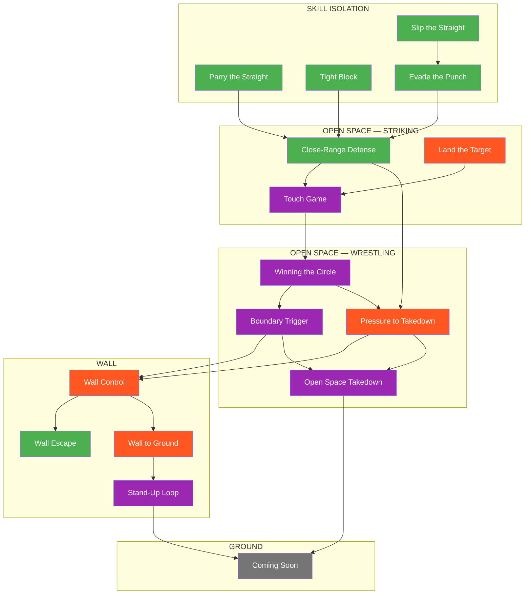

# Games Library

The complete catalog of training games in the Ecological MMA System.

---

## Quick Reference

!!! tip "15 Games Across 4 Environments"

    | Environment | Games | Focus |
    |-------------|-------|-------|
    | Skill Isolation | 4 | Single-skill development |
    | Open Space | 7 | Standing engagement |
    | Wall | 4 | Vertical constraint |
    | Ground | Coming Soon | Horizontal constraint |

---

## System Map



**Legend:** Green = Defensive | Orange = Offensive | Purple = Combined | Gray = Coming Soon

---

## Games by Environment

### Skill Isolation

Constrained games that develop single defensive skills in isolation.

| Game | Focus | Difficulty | Core Problem |
|------|-------|------------|--------------|
| [Parry the Straight](parry-the-straight.md) | Defensive | Beginner | Deflect straight punches with hands |
| [Tight Block](tight-block.md) | Defensive | Beginner | Absorb strikes using tight guard |
| [Slip the Straight](slip-the-straight.md) | Defensive | Beginner | Evade straight punches with head movement |
| [Evade the Punch](evade-the-punch.md) | Defensive | Intermediate | Match evasion type to punch type |

### Open Space — Striking

Standing games focused on striking offense and defense.

| Game | Focus | Difficulty | Core Problem |
|------|-------|------------|--------------|
| [Close-Range Defense](close-range-defense.md) | Defensive | Intermediate | Layer multiple defensive solutions |
| [Land the Target](land-the-target.md) | Offensive | Intermediate | Read defense, setup, land predetermined target |
| [Touch and Don't Get Touched](touch-game.md) | Combined | Beginner | Range awareness and timing literacy |

### Open Space — Wrestling

Standing games focused on space control and takedowns.

| Game | Focus | Difficulty | Core Problem |
|------|-------|------------|--------------|
| [Winning the Circle](winning-circle.md) | Combined | Beginner | Space domination through pressure |
| [Boundary Trigger](boundary-trigger.md) | Combined | Intermediate | Recognize clinch opportunity at boundary |
| [Pressure to Takedown](pressure-to-takedown.md) | Offensive | Advanced | Chain strikes to clinch to takedown |
| [Open Space Takedown](open-space-takedown.md) | Combined | Intermediate | Execute takedowns without wall assistance |

### Wall

Games where the wall is the dominant constraint.

| Game | Focus | Difficulty | Core Problem |
|------|-------|------------|--------------|
| [Wall Control](wall-control.md) | Offensive | Intermediate | Establish and maintain vertical pin |
| [Wall Escape](wall-escape.md) | Defensive | Intermediate | Break pin and create space |
| [Wall Pin to Ground](wall-to-ground.md) | Offensive | Intermediate | Transition from wall to ground control |
| [Stand-Up Loop](standup-loop.md) | Combined | Advanced | Manage cyclical stand-up and re-pin dynamics |

### Ground

*Coming Soon* — Ground-only games are in development.

---

## Games by Focus

=== "Defensive"
    Games where the defender is the primary learner:

    | Game | Environment | What You Learn |
    |------|-------------|----------------|
    | [Parry the Straight](parry-the-straight.md) | Skill Isolation | Parrying mechanics and timing |
    | [Tight Block](tight-block.md) | Skill Isolation | Absorbing strikes on guard |
    | [Slip the Straight](slip-the-straight.md) | Skill Isolation | Head movement for straights |
    | [Evade the Punch](evade-the-punch.md) | Skill Isolation | Punch recognition and evasion selection |
    | [Close-Range Defense](close-range-defense.md) | Open Space | Layering defensive solutions |
    | [Wall Escape](wall-escape.md) | Wall | Breaking pins and creating space |

=== "Offensive"
    Games where the attacker is the primary learner:

    | Game | Environment | What You Learn |
    |------|-------------|----------------|
    | [Land the Target](land-the-target.md) | Open Space | Reading defense, setup, target selection |
    | [Pressure to Takedown](pressure-to-takedown.md) | Open Space | Chaining strikes to takedowns |
    | [Wall Control](wall-control.md) | Wall | Establishing and maintaining pins |
    | [Wall Pin to Ground](wall-to-ground.md) | Wall | Controlled transitions to ground |

=== "Combined"
    Games where both sides have active learning objectives:

    | Game | Environment | What You Learn |
    |------|-------------|----------------|
    | [Touch and Don't Get Touched](touch-game.md) | Open Space | Engagement literacy, counter-touching |
    | [Winning the Circle](winning-circle.md) | Open Space | Pressure vs. evasion |
    | [Boundary Trigger](boundary-trigger.md) | Transition | Recognizing domain change moments |
    | [Open Space Takedown](open-space-takedown.md) | Open Space | Takedowns and scrambles |
    | [Stand-Up Loop](standup-loop.md) | Wall | Positional cycling near the wall |

---

## Games by Decision State

=== "Access"
    Games focused on connection and engagement:

    - All Skill Isolation games
    - [Touch and Don't Get Touched](touch-game.md)
    - [Winning the Circle](winning-circle.md)
    - [Boundary Trigger](boundary-trigger.md)

=== "Stabilize"
    Games focused on control establishment:

    - [Wall Control](wall-control.md)
    - [Wall Pin to Ground](wall-to-ground.md)
    - [Open Space Takedown](open-space-takedown.md)

=== "Exploit"
    Games that progress to damage or advancement:

    - Wall Pin to Ground (Level 3+)
    - Stand-Up Loop (TKO Pin access)
    - Open Space Takedown (Level 3+)

=== "Counter"
    Games focused on defensive response:

    - [Close-Range Defense](close-range-defense.md) (Levels 4-6)
    - [Wall Escape](wall-escape.md)
    - [Stand-Up Loop](standup-loop.md)

---

## Full MMA Expression

Every game has a highest level called **Full MMA Expression** where cross-domain threats are added:

| Game Type | MMA Complication Added |
|-----------|----------------------|
| Striking games | Grappling threats (shoot, clinch) |
| Wrestling games | Striking threats |

This ensures skills are tested under realistic MMA pressure. See [Full MMA Expression](../concepts/full-mma-expression.md) for details.

---

## Progression Pathways

### Striking Track
```
Skill Isolation → Close-Range Defense → Land the Target → Touch Game
```

### Space Control Track
```
Touch Game → Winning the Circle → Boundary Trigger → Wall/Takedown games
```

### Wall Track
```
Boundary Trigger → Wall Control → Wall Escape
                              → Wall to Ground → Stand-Up Loop
```

### Integration Track
```
Close-Range Defense + Winning the Circle → Pressure to Takedown
```

---

## Development Roadmap

| Area | Status | Priority |
|------|--------|----------|
| Offensive Skill Isolation | Planned | Medium |
| Defensive Wrestling (Open Space) | Planned | Medium |
| Ground - Offensive | Planned | High |
| Ground - Defensive | Planned | High |
| Ground - Combined | Planned | High |

---

!!! abstract "System Evolution Notice"
    This library will expand as new games are developed and tested.
