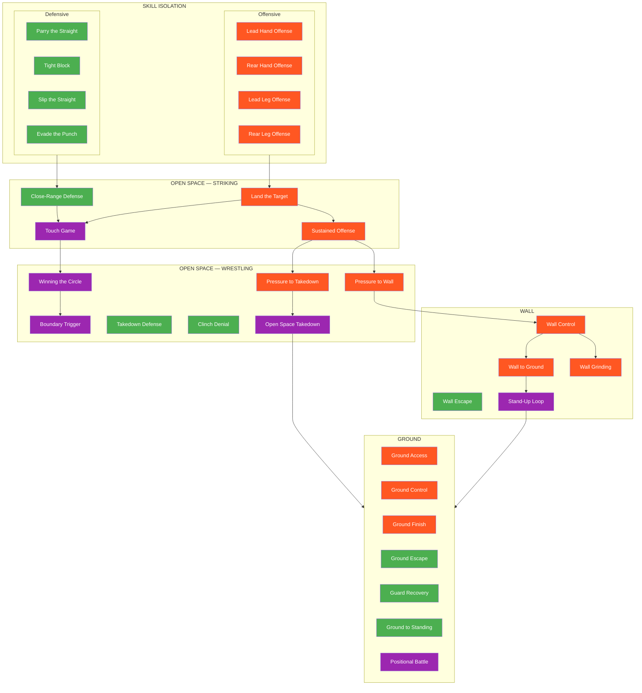

# Games Library

The complete catalog of training games in the Ecological MMA System.

---

## Quick Reference

!!! tip "31 Games Across 4 Environments"

    | Environment | Games | Focus |
    |-------------|-------|-------|
    | Skill Isolation | 8 | Single-skill development |
    | Open Space | 11 | Standing engagement |
    | Wall | 5 | Vertical constraint |
    | Ground | 7 | Horizontal constraint |

---

## System Map



**Legend:** Green = Defensive | Orange = Offensive | Purple = Combined

---

## Games by Environment

### Skill Isolation

Constrained games that develop single skills in isolation.

#### Defensive

| Game | Difficulty | Core Problem |
|------|------------|--------------|
| [Parry the Straight](parry-the-straight.md) | Beginner | Deflect straight punches with hands |
| [Tight Block](tight-block.md) | Beginner | Absorb strikes using tight guard |
| [Slip the Straight](slip-the-straight.md) | Beginner | Evade straight punches with head movement |
| [Evade the Punch](evade-the-punch.md) | Intermediate | Match evasion type to punch type |

#### Offensive (Weapon Isolation)

| Game | Difficulty | Core Problem |
|------|------------|--------------|
| [Lead Hand Offense](lead-hand-offense.md) | Beginner | Land strikes using only lead hand |
| [Rear Hand Offense](rear-hand-offense.md) | Beginner | Land strikes using only rear hand |
| [Lead Leg Offense](lead-leg-offense.md) | Intermediate | Land kicks using only lead leg |
| [Rear Leg Offense](rear-leg-offense.md) | Intermediate | Land kicks using only rear leg |

### Open Space — Striking

Standing games focused on striking offense and defense.

| Game | Focus | Difficulty | Core Problem |
|------|-------|------------|--------------|
| [Close-Range Defense](close-range-defense.md) | Defensive | Intermediate | Layer multiple defensive solutions |
| [Land the Target](land-the-target.md) | Offensive | Intermediate | Read defense, setup, land predetermined target |
| [Sustained Offense](sustained-offense.md) | Offensive | Intermediate | Maintain rhythm through defensive attempts |
| [Touch and Don't Get Touched](touch-game.md) | Combined | Beginner | Range awareness and timing literacy |

### Open Space — Wrestling

Standing games focused on space control and takedowns.

| Game | Focus | Difficulty | Core Problem |
|------|-------|------------|--------------|
| [Winning the Circle](winning-circle.md) | Combined | Beginner | Space domination through pressure |
| [Boundary Trigger](boundary-trigger.md) | Combined | Intermediate | Recognize clinch opportunity at boundary |
| [Pressure to Takedown](pressure-to-takedown.md) | Offensive | Advanced | Chain strikes to clinch to takedown |
| [Pressure to Wall](pressure-to-wall.md) | Offensive | Advanced | Chain strikes to wall control for grinding |
| [Takedown Defense](takedown-defense.md) | Defensive | Intermediate | Sprawl and recover from shot attempts |
| [Clinch Denial](clinch-denial.md) | Defensive | Intermediate | Prevent clinch establishment |
| [Open Space Takedown](open-space-takedown.md) | Combined | Intermediate | Execute takedowns without wall assistance |

### Wall

Games where the wall is the dominant constraint.

| Game | Focus | Difficulty | Core Problem |
|------|-------|------------|--------------|
| [Wall Control](wall-control.md) | Offensive | Intermediate | Establish and maintain vertical pin |
| [Wall Escape](wall-escape.md) | Defensive | Intermediate | Break pin and create space |
| [Wall Pin to Ground](wall-to-ground.md) | Offensive | Intermediate | Transition from wall to ground control |
| [Wall Grinding](wall-grinding.md) | Offensive | Intermediate | Deal damage from wall position |
| [Stand-Up Loop](standup-loop.md) | Combined | Advanced | Manage cyclical stand-up and re-pin dynamics |

### Ground

Games focused on horizontal grappling positions.

| Game | Focus | Difficulty | Core Problem |
|------|-------|------------|--------------|
| [Ground Access](ground-access.md) | Offensive | Intermediate | Pass guard and advance position |
| [Ground Control](ground-control.md) | Offensive | Intermediate | Maintain position through escape attempts |
| [Ground Finish](ground-finish.md) | Offensive | Advanced | Finish via strikes or submission |
| [Ground Escape](ground-escape.md) | Defensive | Intermediate | Escape from under dominant position |
| [Guard Recovery](guard-recovery.md) | Defensive | Intermediate | Recover guard when being passed |
| [Ground to Standing](ground-to-standing.md) | Defensive | Intermediate | Get back to feet from ground |
| [Positional Battle](positional-battle.md) | Combined | Intermediate | Win positional exchanges |

---

## Games by Focus

=== "Defensive"
    Games where the defender is the primary learner:

    **Skill Isolation:**

    | Game | What You Learn |
    |------|----------------|
    | [Parry the Straight](parry-the-straight.md) | Parrying mechanics and timing |
    | [Tight Block](tight-block.md) | Absorbing strikes on guard |
    | [Slip the Straight](slip-the-straight.md) | Head movement for straights |
    | [Evade the Punch](evade-the-punch.md) | Punch recognition and evasion selection |

    **Open Space:**

    | Game | What You Learn |
    |------|----------------|
    | [Close-Range Defense](close-range-defense.md) | Layering defensive solutions |
    | [Takedown Defense](takedown-defense.md) | Sprawl, whizzer, recovery |
    | [Clinch Denial](clinch-denial.md) | Frames, hand fighting, space |

    **Wall:**

    | Game | What You Learn |
    |------|----------------|
    | [Wall Escape](wall-escape.md) | Breaking pins and creating space |

    **Ground:**

    | Game | What You Learn |
    |------|----------------|
    | [Ground Escape](ground-escape.md) | Escaping dominant positions |
    | [Guard Recovery](guard-recovery.md) | Retaining and recovering guard |
    | [Ground to Standing](ground-to-standing.md) | Wrestling up from bottom |

=== "Offensive"
    Games where the attacker is the primary learner:

    **Skill Isolation (Weapon Isolation):**

    | Game | What You Learn |
    |------|----------------|
    | [Lead Hand Offense](lead-hand-offense.md) | Jab, lead hook, lead uppercut |
    | [Rear Hand Offense](rear-hand-offense.md) | Cross, rear hook, rear uppercut |
    | [Lead Leg Offense](lead-leg-offense.md) | Lead kicks (teep, roundhouse, etc.) |
    | [Rear Leg Offense](rear-leg-offense.md) | Power kicks (roundhouse, body, head) |

    **Open Space:**

    | Game | What You Learn |
    |------|----------------|
    | [Land the Target](land-the-target.md) | Reading defense, setup, target selection |
    | [Sustained Offense](sustained-offense.md) | Maintaining rhythm through resistance |
    | [Pressure to Takedown](pressure-to-takedown.md) | Chaining strikes to takedowns |
    | [Pressure to Wall](pressure-to-wall.md) | Driving to wall for damage |

    **Wall:**

    | Game | What You Learn |
    |------|----------------|
    | [Wall Control](wall-control.md) | Establishing and maintaining pins |
    | [Wall Pin to Ground](wall-to-ground.md) | Controlled transitions to ground |
    | [Wall Grinding](wall-grinding.md) | Damage from wall position |

    **Ground:**

    | Game | What You Learn |
    |------|----------------|
    | [Ground Access](ground-access.md) | Passing guard, advancing position |
    | [Ground Control](ground-control.md) | Maintaining dominant position |
    | [Ground Finish](ground-finish.md) | GnP and submissions from top |

=== "Combined"
    Games where both sides have active learning objectives:

    **Open Space:**

    | Game | What You Learn |
    |------|----------------|
    | [Touch and Don't Get Touched](touch-game.md) | Engagement literacy, counter-touching |
    | [Winning the Circle](winning-circle.md) | Pressure vs. evasion |
    | [Boundary Trigger](boundary-trigger.md) | Recognizing domain change moments |
    | [Open Space Takedown](open-space-takedown.md) | Takedowns and scrambles |

    **Wall:**

    | Game | What You Learn |
    |------|----------------|
    | [Stand-Up Loop](standup-loop.md) | Positional cycling near the wall |

    **Ground:**

    | Game | What You Learn |
    |------|----------------|
    | [Positional Battle](positional-battle.md) | Winning positional exchanges |

---

## Games by Decision State

=== "Access"
    Games focused on connection and engagement:

    - All Skill Isolation games
    - [Touch and Don't Get Touched](touch-game.md)
    - [Winning the Circle](winning-circle.md)
    - [Boundary Trigger](boundary-trigger.md)
    - [Ground Access](ground-access.md)

=== "Stabilize"
    Games focused on control establishment:

    - [Wall Control](wall-control.md)
    - [Wall Pin to Ground](wall-to-ground.md)
    - [Open Space Takedown](open-space-takedown.md)
    - [Ground Control](ground-control.md)

=== "Exploit"
    Games that progress to damage or advancement:

    - [Wall Grinding](wall-grinding.md)
    - [Ground Finish](ground-finish.md)
    - [Sustained Offense](sustained-offense.md)
    - Stand-Up Loop (TKO Pin access)

=== "Counter"
    Games focused on defensive response:

    - [Close-Range Defense](close-range-defense.md)
    - [Takedown Defense](takedown-defense.md)
    - [Clinch Denial](clinch-denial.md)
    - [Wall Escape](wall-escape.md)
    - [Ground Escape](ground-escape.md)
    - [Guard Recovery](guard-recovery.md)
    - [Ground to Standing](ground-to-standing.md)

---

## Full MMA Expression

Every game has a highest level called **Full MMA Expression** where cross-domain threats are added:

| Game Type | MMA Complication Added |
|-----------|----------------------|
| Striking games | Grappling threats (shoot, clinch) |
| Wrestling games | Striking threats |
| Ground games | Strikes from position |

This ensures skills are tested under realistic MMA pressure. See [Full MMA Expression](../concepts/full-mma-expression.md) for details.

---

## Progression Pathways

### Striking Track
```
Defensive Skill Isolation → Close-Range Defense → Touch Game
Offensive Skill Isolation → Land the Target → Sustained Offense
```

### Space Control Track
```
Touch Game → Winning the Circle → Boundary Trigger → Wall/Takedown games
```

### Wall Track
```
Pressure to Wall → Wall Control → Wall Grinding (damage path)
                               → Wall to Ground → Stand-Up Loop (ground path)
```

### Ground Track
```
Offensive: Ground Access → Ground Control → Ground Finish
Defensive: Ground Escape → Guard Recovery / Ground to Standing
Combined:  Positional Battle
```

---

!!! abstract "System Evolution Notice"
    This library will expand as new games are developed and tested.
