# Games Library

This is the complete catalog of training games in the Ecological MMA System.

---

## System Map

```mermaid
flowchart TD
    subgraph SKILL_ISOLATION["🎯 SKILL ISOLATION"]
        P[Parry the Straight<br/>Stage: Access]
        TB[Tight Block<br/>Stage: Access]
        SS[Slip the Straight<br/>Stage: Access]
        EP[Evade the Punch<br/>Stage: Access]
    end

    subgraph STRIKING["🥊 OPEN SPACE — STRIKING"]
        CRD[Close-Range Defense<br/>Stage: Access / Counter]
        A[Touch and Don't Get Touched<br/>Stage: Access]
        B[Winning the Circle<br/>Stage: Access]
        PTT[Pressure to Takedown<br/>Stage: Access → Exploit]
    end

    subgraph TRANSITION["🔄 TRANSITION"]
        C[Boundary Trigger<br/>Stage: Access → Transition]
    end

    subgraph WALL["🧱 WALL ENVIRONMENT"]
        D[Wall Control — Establish Pin<br/>Stage: Stabilize]
        E[Wall Escape — Anti-Pin<br/>Stage: Counter]
        F[Wall Pin → Ground<br/>Stage: Stabilize → Exploit]
        G[Stand-Up & Re-Pin Loop<br/>Stage: Counter ↔ Stabilize]
    end

    subgraph OPEN_GRAPPLING["🤼 OPEN SPACE — GRAPPLING"]
        H[Open Space Takedown<br/>Stage: Stabilize → Exploit]
    end

    P --> CRD
    TB --> CRD
    SS --> EP
    EP --> CRD
    CRD --> A
    CRD --> PTT
    A --> B
    B --> C
    C --> D
    C --> H
    PTT --> D
    PTT --> H
    D --> E
    D --> F
    F --> G

    style P fill:#8BC34A,color:#fff
    style TB fill:#8BC34A,color:#fff
    style SS fill:#8BC34A,color:#fff
    style EP fill:#8BC34A,color:#fff
    style CRD fill:#4CAF50,color:#fff
    style A fill:#4CAF50,color:#fff
    style B fill:#4CAF50,color:#fff
    style PTT fill:#9C27B0,color:#fff
    style C fill:#FF9800,color:#fff
    style D fill:#2196F3,color:#fff
    style E fill:#2196F3,color:#fff
    style F fill:#2196F3,color:#fff
    style G fill:#2196F3,color:#fff
    style H fill:#9C27B0,color:#fff
```



---

## Games by Environment

### Skill Isolation

| Game | Stage | Core Problem |
|------|-------|--------------|
| [Parry the Straight](parry-the-straight.md) | Access | Learning to parry straight punches |
| [Tight Block](tight-block.md) | Access | Learning to absorb strikes using tight guard |
| [Slip the Straight](slip-the-straight.md) | Access | Learning to evade straight punches with head movement |
| [Evade the Punch](evade-the-punch.md) | Access | Learning to match evasion type to punch type |

### Open Space (Striking)

| Game | Stage | Core Problem |
|------|-------|--------------|
| [Close-Range Defense](close-range-defense.md) | Access / Counter | Defending strikes at close range using multiple defensive solutions |
| [Touch and Don't Get Touched](touch-game.md) | Access | Engagement literacy and range awareness |
| [Winning the Circle](winning-circle.md) | Access | Space domination and pressure |
| [Pressure to Takedown](pressure-to-takedown.md) | Access → Stabilize → Exploit | Closing distance with strikes to establish control and execute takedown |

### Transition

| Game | Stage | Core Problem |
|------|-------|--------------|
| [Boundary Trigger](boundary-trigger.md) | Access → Transition | Clinch permission recognition |

### Wall

| Game | Stage | Core Problem |
|------|-------|--------------|
| [Wall Control — Establish Pin](wall-control.md) | Stabilize | Vertical immobilization |
| [Wall Escape — Anti-Pin](wall-escape.md) | Counter | Breaking wall control |
| [Wall Pin → Ground](wall-to-ground.md) | Stabilize → Exploit | Vertical to horizontal transition |
| [Stand-Up & Re-Pin Loop](standup-loop.md) | Counter ↔ Stabilize | Cyclical control/escape |

### Open Space (Grappling)

| Game | Stage | Core Problem |
|------|-------|--------------|
| [Open Space Takedown](open-space-takedown.md) | Stabilize → Exploit | Takedown from clinch without wall |

---

## Games by Decision State

=== "Access"

    - [Parry the Straight](parry-the-straight.md)
    - [Tight Block](tight-block.md)
    - [Slip the Straight](slip-the-straight.md)
    - [Evade the Punch](evade-the-punch.md)
    - [Close-Range Defense](close-range-defense.md)
    - [Touch and Don't Get Touched](touch-game.md)
    - [Winning the Circle](winning-circle.md)
    - [Boundary Trigger](boundary-trigger.md)
    - [Pressure to Takedown](pressure-to-takedown.md)

=== "Stabilize"

    - [Wall Control — Establish Pin](wall-control.md)
    - [Wall Pin → Ground](wall-to-ground.md)
    - [Open Space Takedown](open-space-takedown.md)

=== "Exploit"

    - [Wall Pin → Ground](wall-to-ground.md) (Level 3)
    - [Stand-Up & Re-Pin Loop](standup-loop.md) (TKO Pin)
    - [Open Space Takedown](open-space-takedown.md) (Level 3)

=== "Counter"

    - [Close-Range Defense](close-range-defense.md) (Level 4-5)
    - [Wall Escape — Anti-Pin](wall-escape.md)
    - [Stand-Up & Re-Pin Loop](standup-loop.md)

---

## Progression Pathways

### Path 1: Wall Pathway
```
Touch Game → Circle → Boundary Trigger → Wall Control → Wall Escape
                                              ↓
                                        Wall → Ground → Stand-Up Loop
```

### Path 2: Open Space Pathway
```
Touch Game → Circle → Boundary Trigger → Open Space Takedown → (Ground games pending)
```

---

## Coming Soon

!!! warning "Gaps in Current System"

    | Gap | Description |
    |-----|-------------|
    | Ground-only games | No games currently start on ground |
    | Ground Escape | Defensive counter to ground control |
    | TKO Pin game | Dedicated exploitation game |
    | Submission games | Submission-focused layer |
