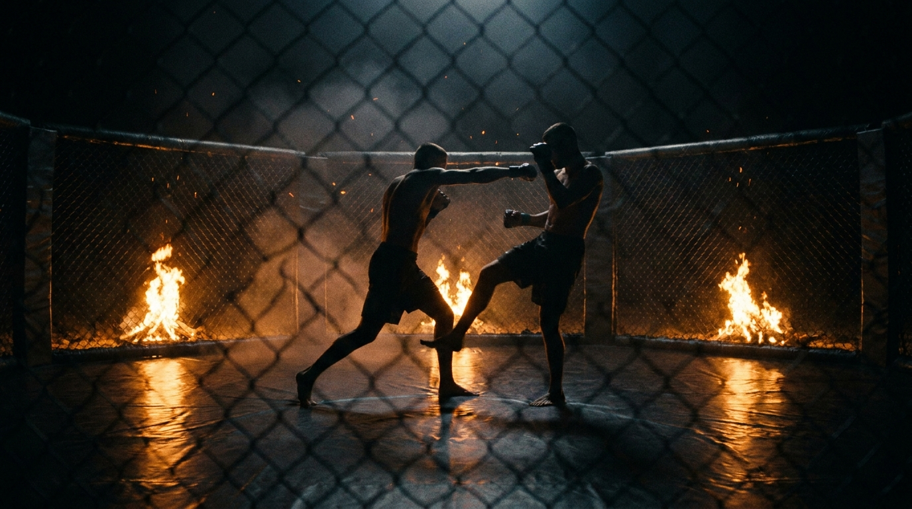

  
  
Skill Isolation · StrikingKick the Puncher

!!! warning "Provisional (WIP): derived from class recording 2026-08-14"
    Run live as the closing game of a leg-kick session, explicitly as the inversion of [Check and Return](../check-and-return/).
    **Pending review on the platform.** Name and structure may change.

Skill IsolationStrikingCombinedIntermediateInversion

The mirror image. Here the hands are the thing being defended and the leg kick is the counter, so the fighter with no punches is the dangerous one, and the check belongs to the boxer.

  
Start<b>Two fighters at striking range inside a marked perimeter; one has hands only, one has leg kicks only.</b>

  
→

  
The Goal<b>The puncher lands a single jab or cross without getting kicked; the kicker lands one leg kick, any leg.</b>

  
→

  
Finish<b>Kick lands → switch, the kicker takes over the hands · Puncher checks it → continue · High volume, keep it moving.</b>

  
Every punch has to be paid for.  The bill arrives at the leg.

  
A committed hand plants the feet for an instant. <b>That instant is the whole game.</b>

What to Read

<b>The kicker attunes to</b> <i>commitment</i>, the moment the shoulder turns over and the weight moves forward onto a fixed base. A punch in flight is a leg that cannot be lifted, so the kick is thrown into the punch, not after it. Read the <i>rhythm</i> too: a puncher with only two tools builds a pattern quickly, and the pattern tells you when the hand is coming. <b>The puncher attunes to</b> <i>τ</i> on the rising shin, the same read as any check, plus their own <i>base</i>, since their punch is what fixes the leg the kick is aimed at.

The Starting Position

  
PlayersTwo, one puncher (offense), one kicker (defense).

  
RangePunching range, both on their feet.

  
BoundaryA marked perimeter, both stay inside.

  
RolesPuncher: one jab or one cross, head or body. Kicker: leg kicks only, either leg.

  
Start &amp; reset"Go". A landed kick switches the roles. A checked kick leaves the puncher on offense. Designed for high repetition, keep the reps rolling.

The Matchup

  

    
🥊

    
Puncher (Offense)

    
Trying to land one jab or one cross, head or body, without buying a leg kick for it.

    One punch at a time, no hooks, no uppercuts. Feints are free and they are your best tool, because a feint costs you nothing and a committed punch costs you a base. Checking the kick is now your job too, and a check keeps you on offense.
  

  
VS

  

    
🦵

    
Kicker (Defense)

    
Trying to land any clean leg kick, lead or rear leg, and take over the hands.

    You have no strikes with your hands, but your hands are not idle: grips, frames and hand controls are all live. Throw the kick into their punch, not after it. Either leg is legal here, which is the freedom this game gives you.
  

The Rules

  🥊 Puncher: one jab or one crossHead or body, one at a time. No hooks, no uppercuts, no overhands. Feinting is unrestricted.
  🦵 Kicker: leg kicks only, either legLead leg or rear leg, both legal, which is the one place this game is more permissive than Check and Return. Above the knee, below the hip, shin contact only.
  ✋ No hand strikes does not mean no handsThe kicker may grip, frame, post and hand-fight freely. Only striking with the hands is off.
  🛡️ The check belongs to the puncher nowThe inversion that defines the game. A checked kick is not a neutral event: it means the puncher was not stopped, so the puncher stays on offense and keeps hunting the hand.
  🦴 Shin, never instepToes or the top of the foot does not count, and a kick that lands on a knee or an elbow with the instep is how feet get broken. Call your own bad kicks.
  ⚡ High repetitionThis is built to be fast and busy, not a patient stalking game. Short exchanges, quick switches, keep the volume up.
  ⬛ Stay inside the perimeterPlay happens inside a marked perimeter. Leaving it loses the exchange.

How to Win

  
Kicker Land any clean leg kick → win the exchange and take the hands.Lead or rear leg, above the knee, landed with the shin. One clean kick ends it, and the roles switch.

  
Puncher Land the jab or the cross → win the exchange and stay on offense.One clean punch, head or body. Your reward for winning is that nothing changes, you keep the hands and keep working.

  
Puncher Check the incoming kick → continue.Stopping the kick means their only weapon failed, so you keep the offense. This is the exact reversal of Check and Return, where the check took the offense away from the kicker.

  
Loss Buy a kick with your punch, or leave the perimeter.A punch that plants your base and gets you kicked hands the offense over. Crossing the perimeter loses the exchange outright.

The Levels

  
1<b>Jab only</b>The most predictable hand.Puncher restricted to the lead hand. The kicker gets a clean, repeating commitment to time, which is where the read is built.

  
2<b>Jab or cross</b>Two commitments, two different bases.The rear hand plants far more of the puncher's weight than the jab does, so the window it opens is bigger and later. The kicker has to tell them apart.

  
3<b>Feints open</b>The punch you read may not exist.The puncher leans on feints, including level feints, to draw the kick and check it. The kicker can no longer kick at the sight of a shoulder, only at a real commitment.

  
4<b>The shot returns (optional dial)</b>Coach's call, not the base game.The puncher may also win by connecting on the legs, which puts the full standing landscape back and forces the kicker to separate a punch commitment from a level change. Treat as a dial-up, the same way Check and Return adds the shot at its top rung.

Recall Check

  
Test yourself before moving on. Answer out loud, then reveal what good looks like.

  

    
Q When exactly do you throw the kick?

    
<b>Into the punch, not after it.</b> A committed hand fixes the base for an instant, and a fixed base cannot lift a leg to check. Wait until the punch is finished and the base is free again, and you are kicking into a check.

  

  

    
Q The puncher checks your kick. What did they win?

    
They kept the offense. The check is <b>their</b> tool in this game, which is the whole inversion: in <a href="../check-and-return/">Check and Return</a> a check takes the offense from the kicker, here it defends the offense they already have.

  

  

    
Q You have no hand strikes. Are your hands out of the game?

    
No. <b>Grips, frames and hand-fighting stay live</b>, only striking is off. Controlling a hand or breaking their posture is a legitimate way to manufacture the commitment you want to kick into.

  

Go Deeper

??? note "Task focus &amp; coaching cues"

    
Each role's job

    

      

🥊

Puncher

Land one clean hand without paying for it. Feint constantly, since feints are free and punches are not, and stay ready to check the answer.

      

🦵

Kicker

Hunt the commitment. Use hand controls to shape it, kick into the punch with the shin, and take the hands when you land.

    

    
Coaching cues

    

      

⏱️

Kick into the punch

The single cue that makes the game work. A student who waits politely for the punch to finish is kicking at a fighter who is free to check again.

      

🎭

Feints are free, punches are not

For the puncher this is the whole strategy: draw the kick with something that costs no base, then check it and keep the offense. Two tools make you readable fast, so the feint is what buys the pattern back.

      

🔄

Run it straight after Check and Return

The value is in the contrast. The same players who just spent an hour with the check as their win condition now have to defend against the kick they were rewarded for, and the reversal exposes anyone who learned a rule instead of a read.

    

??? abstract "Constraints-Led analysis"

    
Constraints → Affordances

    

      
Puncher capped at one jab or one cross→Every offensive act is a discrete, readable commitment with a cost attached

      
Kicker has legs only→Removes the trade-a-punch answer, so the only solution is timing the base

      
Check belongs to the puncher→Reverses the meaning of a skill the same players just trained, testing read over rule

      
Either leg legal for the kicker→Opens the fast lead-leg answer that the rear-leg-only games exclude

      
Hands live for grips, not strikes→Keeps hand-fighting in the problem without letting it become a striking exchange

    

    
A deliberate <b>role inversion</b> rather than a progression. The pair is the point: run immediately after <a href="../check-and-return/">Check and Return</a>, it takes the win condition the group has just been rewarded for and puts it on the other side of the fight. A student who has attuned to the information transfers straight across; a student who memorised "checking wins" is exposed in the first minute.

    
What athletes read

    

      

👁️

Visual: commitment

Shoulder turn and weight moving forward onto a fixed base → the punch is real and the leg is momentarily unliftable.

      

🎵

Visual: rhythm

The pattern a two-tool puncher falls into → when the next commitment is due.

      

🧭

Proprioceptive

The puncher's own base during and after the punch → whether they can still pick a leg up, or have just bought a kick.

    

    
What we measure (order parameter)

    
Whether the kick is <b>timed to a commitment</b> or thrown on a guess. Track kicks landed during a punch against kicks thrown into a free base and checked. When the kicker stops kicking at rhythm and starts kicking at commitment, the read has formed. On the other side, track how often the puncher lands without buying a kick.

    
Representativeness

    
<b>Models:</b> the standing problem of a boxer against a kicker, and the specific fight moment where a hand commits and the base underneath it becomes available. Both roles are ones a fighter has to hold in a real fight.

    
Hands vs legsone punch at a timekick into the commitment

    
The inversion of <a href="../check-and-return/">Check and Return</a>, and best run right after it. Feeds <a href="../counter-striking/">Counter-Striking</a> once both roles are comfortable.

    
First-run observations (2026-08-14)

    <ul class="emma-checklist">
      <li>Named by a student as "the polar opposite of what we were doing", which is exactly the intended effect</li>
      <li>Ran as the closing game of the session and immediately produced more volume than the games before it</li>
      <li>The role reversal needed re-stating once mid-game, since players kept switching on a check out of habit from the earlier games</li>
      <li>Run without a marked perimeter live, the perimeter is our addition for consistency with the rest of the library</li>
    </ul>

    
Readiness to progress

    <ul class="emma-checklist">
      <li>Kicks land during commitments rather than into a free base</li>
      <li>Puncher uses feints to draw the kick instead of only throwing real punches</li>
      <li>Both players hold the reversed win conditions without being reminded</li>
      <li>Shin contact holds up at high volume</li>
    </ul>

    
Warning signs

    

      Kicks on rhythm and gets checked every time
      Waits for the punch to finish before starting the kick
      Puncher throws only real punches, so the kicker never has to read anything
      Players switch roles on a check, importing the previous game's rule
    

??? note "Safety &amp; related games"

    

      🦵 Shin guards on, thigh only, nothing to the knee joint
      🥊 Gloves on, single controlled shots, head or body
      🦴 Shin contact only, high volume makes instep errors more likely, not less
      🛑 Foot or knee pain stops the game
    

    
Where it sits

    

      
Prerequisite→<a href="../check-and-return/">Check and Return</a>

      
Follow-on→<a href="../counter-striking/">Counter-Striking</a>

      
Related→<a href="../kick-defense/">Kick Defense Isolation</a> · <a href="../rear-hand-offense/">Rear Hand Offense</a>

    

