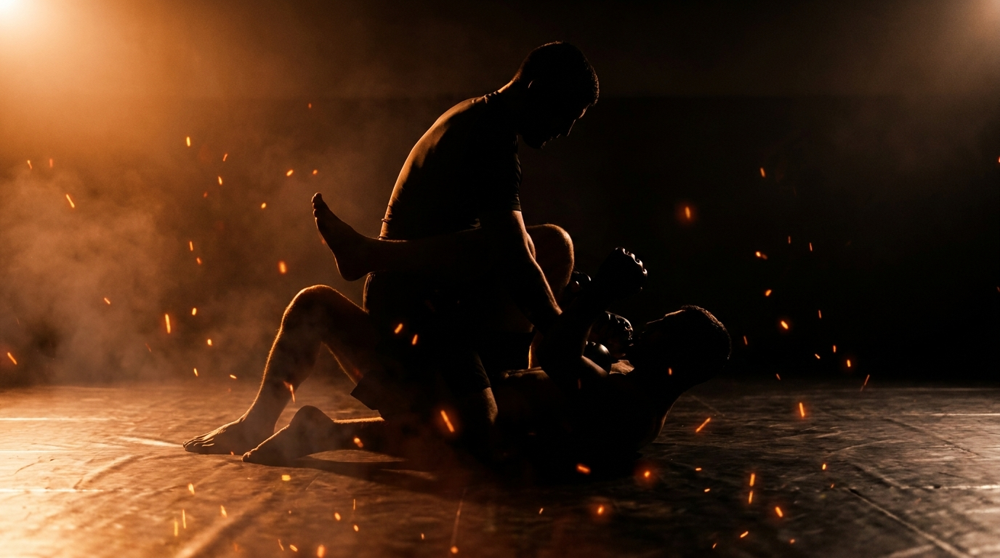

  
  
Ground · GrapplingKnee-on-Belly Control

!!! warning "Provisional (WIP): built from the ground-wave spec, pending coach review"

    Fills the empty knee-on-belly bucket in the top-control grid. Sourced from the Slime Mold Grappling Club catalog (Greg Souders / Standard Jiu-Jitsu), re-expressed with our threshold rules. Passed the build rubric on paper; awaits validation against a live grappling class.

GroundGrapplingOffensiveIntermediateControl → Finish

Keep the knee-on-belly alive through the frames, then attack an arm or step to mount.

  
Start<b>Top in knee-on-belly, posted, opposite leg out; bottom flat, framing the knee, inside a marked perimeter.</b>

  
→

  
The Goal<b>Top stays light and balanced, switches sides on the frame, and starts an arm attack; bottom clears the knee and recovers.</b>

  
→

  
Finish<b>Arm attack started, held 3s, or step to mount → top · Clear the knee and recover, or reverse → bottom · Out of bounds → loss.</b>

  
Knee-on-belly is balance,  not weight.

  
Ride light and tall, switch with the frame, attack the arm it leaves. <b>Settle your weight and you'll get bumped off.</b>

What to Read

<b>Attune to</b> the <i>bottom's framing hands and hip turn</i>, the moment they push the knee to make space or turn to recover. That shift specifies <i>when to switch sides</i> and <i>which arm extends into an attack</i>, not a memorized pin. When they push the knee hard, the other side and their pushing arm both open.

The Starting Position

  
PlayersTwo, one top (attacker, knee-on-belly), one bottom (defender).

  
PositionTop with one knee on the belly, posted on the far foot, hips tall; bottom flat, framing the knee and the hip.

  
BoundaryA marked perimeter, both stay inside.

  
RolesTop keeps knee-on-belly alive and attacks; bottom clears the knee and recovers.

  
Start &amp; resetBegin from settled knee-on-belly; reset on an arm attack, an advance, an escape, or the count.

The Matchup

  

    
🥋

    
Top (Attacker)

    
Trying to keep knee-on-belly live (switching sides as needed) and start an arm attack, or step to mount.

    Ride light and tall, balance over the knee, don't dump your weight. When the bottom frames hard, switch to the far side or step to mount. Trap the arm they push with. Control is proven by an attack or an advance, not by perching.
  

  
VS

  

    
🤸

    
Bottom (Defender)

    
Trying to clear the knee, recover a guard, or reverse.

    Frame the knee and the hip, turn to your side, and pull the knee across to recover. Don't push with a straight arm, that's the arm the top traps.
  

The Rules

  🎯 Top wins by an attack or an advanceThe top proves control by starting an isolated-arm attack and holding it 3 seconds, or by stepping to mount. Keeping knee-on-belly without a threat is a stall, not a win. Switching sides to stay on top is allowed and encouraged.
  🤜 Bottom wins by clearing the kneeThe bottom wins by clearing the knee and recovering a guard (half guard or better), or reversing. A clean, observable bottom goal.
  ⏱️ Hold the count or finishIf the top keeps knee-on-belly for the set count (start at 20 seconds) without an attack or an advance, the round resets. If the bottom clears the knee first, the bottom wins. A clock, never "as long as possible".
  🚫 No striking until the top levelLevels 1 to 4 are control only, so both players read balance and frames before strikes are added. Strikes enter at the full-expression level.
  🎚️ GnP dial-up, by permissionOnce strikes are on, the coach explicitly grants a meaner dial on ground-and-pound. Knee-on-belly is a classic strike-and-advance perch; strikes are the disincentivization tool that punishes a passive bottom. Ground games train smashing, not grappling for its own sake.
  ⬛ Stay inside the perimeterPlay happens inside a marked perimeter, any shape. If a player rolls fully out of it, that player loses the round.

How to Win

  
Win Top starts an arm attack (3s) or steps to mount → top wins.An isolated-arm attack begun and controlled three seconds, or a clean step over to mount. Either is the observable proof that knee-on-belly is doing work, not just perching.

  
Switch Bottom clears the knee and recovers, or reverses → bottom wins, switch roles.Clearing the knee and getting a knee back in (half guard or better), or reversing, is the escape. See <a href="../../concepts/guard-recovery/">Guard Recovery</a>.

  
Reset Top holds knee-on-belly the full count, no threat → reset, same roles.The top perched but never attacked or advanced before the count expired. Resets from settled knee-on-belly.

  
Loss Roll fully out of the perimeter → that player loses.Crossing the marked perimeter loses the round instantly, regardless of position.

The Levels

  
1<b>No-hands balance</b>Ride light and tall.Top keeps knee-on-belly with no hands, balancing over the knee while the bottom bumps and frames. Builds the light, balanced ride that resists the bump.

  
2<b>Hands connected, maintain</b>Add the grips.Top adds collar-and-hip or near-arm grips and maintains through the frames. Reading the bottom's hip turn becomes the task.

  
3<b>Switch sides, re-pin</b>Follow the escape.When the bottom frames the knee hard, the top switches to the far side or re-pins, staying on top through the turn. Mobility, not weight, keeps the position.

  
4<b>Attack the arm, step to mount</b>Convert the perch.Top traps the pushing arm for an isolated-arm attack, or steps over to mount as the bottom turns. The conversion from perch to finish becomes the focus.

  
5<b>Full expression</b>Continuous, strikes on.Continuous from settled knee-on-belly, strikes live, until the top attacks or advances, or the bottom clears the knee. The strike threat makes the perch genuinely costly to escape.

Recall Check

  
Test yourself before moving on. Answer out loud, then reveal what good looks like.

  

    
Q Why is knee-on-belly balance, not weight?

    
Dumping weight onto the knee makes you <b>top-heavy and easy to bump off</b>. Riding light and tall keeps your base mobile, so you can switch sides instead of getting tipped.

  

  

    
Q What do you do when the bottom frames the knee hard?

    
<b>Switch to the far side or re-pin</b>, and trap the pushing arm. A hard frame both opens the other side and exposes the arm.

  

  

    
Q How does the top prove control here?

    
By <b>starting an arm attack (3s) or stepping to mount</b>, not by perching. The perch is the means; the attack or advance is the win.

  

Go Deeper

??? note "Task focus &amp; coaching cues"

    
Each role's job

    

      

🥋

Top (Attacker)

Ride light and tall, balance over the knee, switch sides on a hard frame, trap the pushing arm, step to mount when the bottom turns.

      

🤸

Bottom (Defender)

Frame the knee and hip, turn to your side, pull the knee across, avoid pushing with a straight arm.

    

    
Coaching cues

    

      

🪶

Light or heavy?

Ask the top: "Were you balancing or dumping weight?" A heavy knee gets bumped; a light ride switches and survives.

      

🔗

Attack or perch?

Ask the top: "Did you start an attack or just sit up there?" Keeps the position converting to a finish.

    

??? abstract "Constraints-Led analysis"

    
Constraints → Affordances

    

      
Top wins by an attack or an advance→Forces a finish, no perching

      
No-hands level→Isolates the balance the position lives on

      
Switching sides allowed→Rewards mobility over dead weight

      
Hold the count or finish→Urgency for the top, a real window for the bottom

    

    
Implements <b>Task Simplification</b> (Renshaw et al., 2019): the no-hands level isolates the balance the whole position depends on, then grips, mobility, and attacks are layered on against a live, framing opponent. The attack-or-advance win keeps the representativeness, knee-on-belly is a strike-and-pass perch, not a hold.

    
What the top reads

    

      

✋

Haptic

The bottom's frame pressure → when to switch sides and which arm is exposed.

      

🧭

Proprioceptive

Own balance over the knee → whether you're light enough to ride or about to be bumped.

      

👁️

Visual

The bottom's hip turn → the step-to-mount window and the arm to attack.

    

    
What we measure (order parameter)

    
Whether the top <b>starts an attack or advances faster than the bottom clears the knee</b>. Track attacks and advances vs. knee-clears, and whether the top rides light and switches rather than getting bumped. The attack-or-advance versus clear-the-knee race is the order parameter.

    
Representativeness

    
<b>Models:</b> the knee-on-belly perch in MMA, ride for strikes, switch with the frame, and step to mount or attack an arm before the bottom recovers.

    
Simplified: balance firstno strikes L1-4reset on the count

    
Deepens the top side of <a href="../ground-control/">Ground Control</a>; the step-over feeds <a href="../mount-maintenance/">Mount Maintenance</a>; the arm trap feeds <a href="../side-control-ride/">Side-Control Ride</a>.

    
Readiness to progress

    <ul class="emma-checklist">
      <li>Rides light and tall, balanced over the knee</li>
      <li>Switches sides on a hard frame instead of getting bumped</li>
      <li>Traps the arm the bottom pushes with</li>
      <li>Steps to mount when the bottom turns</li>
    </ul>

    
Warning signs

    

      Dumps weight and gets tipped off
      Perches without attacking
      Never switches sides on the frame
      Reaches and loses the balance
    

??? note "Safety &amp; related games"

    

      🤝 Controlled grappling, GnP by coach permission
      🛑 Arm attacks slow, tap early, no cranks
      🔁 Reset if the position stalls completely
    

    
Where it sits

    

      
Prerequisite→<a href="../ground-control/">Ground Control</a>

      
Follow-on→<a href="../mount-maintenance/">Mount Maintenance</a> · <a href="../side-control-ride/">Side-Control Ride</a>

      
Related→<a href="../../concepts/tko-pin/">TKO Pin</a> · <a href="../../concepts/decision-states/">Decision States</a>

    

