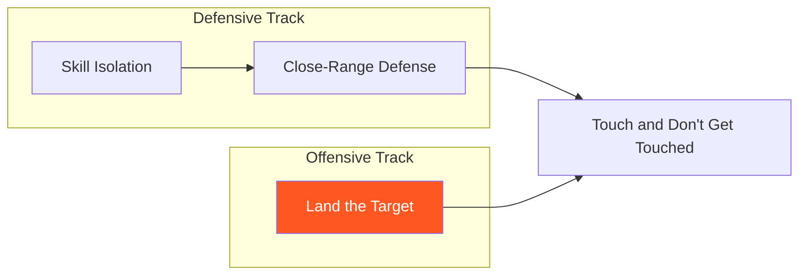

# Land the Target

!!! info "Game Identity"
    - **Problem:** Learning to identify openings, construct combinations, and land predetermined targets
    - **Environment:** Open Space
    - **Stage:** Access (Offensive Skill Development)

This is an **offensive development game** that teaches the attacker to read defensive patterns, use the Three Zones principle, and land specific targets through setup and misdirection. The defender provides real resistance without counter-threat.

---

## Goal

**Game Type:** Asymmetric

**A Side (Attacker)**
- Objective: Land a predetermined target shot by reading defense and creating openings

**B Side (Defender)**
- Objective: Defend effectively against all three zones (head, body, legs)
- Constraint: Cannot counter — defense only

---

## Entry Condition

- Both players start in neutral standing at striking range
- Attacker has a target in mind (private at Level 1, announced at Level 2)
- Defender assumes defensive stance, ready to defend all zones
- Reset and switch roles when attacker lands their target

---

## Invariants

1. Defender **cannot counter** — this removes pressure so attacker can focus on reading and setup
2. Defender must defend **all three zones** naturally — no artificial bias toward one zone
3. Attacker must have a **specific target** in mind before engaging (not just throwing volume)
4. Probes and setup strikes are allowed but are not the goal — landing the target is the goal

---

## Task Focus

### A Side (Attacker)

**Primary task:** Land your predetermined target shot

- **Probe** — Use jabs, feints, and low-commitment strikes to read defensive patterns
- **Identify** — Which zone are they protecting? What opens after certain attacks?
- **Setup** — Construct combinations that shape their defense to expose your target zone
- **Commit** — When confident, execute the combination and land the target

You can attack other zones as part of your setup. Landing shots to other zones is fine — but it doesn't win the game. You win when you land your declared target.

!!! question "Key Internal Questions — Attacker"
    - "What zone are they prioritizing?"
    - "What happens when I attack their head? Their body?"
    - "How do I create the opening for my target?"
    - "Am I probing or am I committing?"

### B Side (Defender)

**Primary task:** Defend all three zones effectively

- Defend naturally — don't artificially favor one zone
- Use all defensive solutions (block, parry, slip, move)
- Make the attacker work for the opening
- Cannot counter — focus entirely on defense

!!! question "Key Internal Questions — Defender"
    - "Am I defending all zones or showing a pattern?"
    - "Am I making them work or giving away openings?"

---

## Legal Actions

- **Strikes:** Attacker — all strikes to all zones. Defender — none (defense only)
- **Submissions:** None
- **Wrestling:** None

---

## Key Logic

### The Target Concept

The attacker doesn't just try to "land punches." They have a **specific target** in mind:

- "I want to land a left hook to the body"
- "I want to land a cross to the head"
- "I want to land a low kick to the lead leg"

Everything they do is in service of landing THAT target. Probes gather information. Setups create the opening. The target shot is the goal.

### What "Landing Clean" Means

A strike lands clean when:
- It reaches the target zone with solid contact
- Enough energy transfers that you know impact occurred
- Had it been thrown with full intention, it would have caused significant damage

A strike does NOT count if:
- It whiffs or barely brushes the target
- It's fully blocked or deflected
- Only grazing contact occurs

### Probes vs. Target Shots

| Type | Purpose | Examples |
|------|---------|----------|
| **Probe** | Gather information, test reactions | Jab, feint, single light strikes |
| **Setup** | Shape defensive response, create opening | Combinations to one zone to open another |
| **Target** | The predetermined shot you planned to land | The specific strike you set out to hit |

A jab can be a target if that's what you set out to land. The distinction is intent, not the technique.

### Applying the Three Zones

Use the Misdirection Principle:

1. Threaten Zone A → Defender protects Zone A → Zone B opens
2. Execute combination ending with target in Zone B

**Example:** Target is left hook to body
- Probe: Jab to test reaction
- Read: They bring hands up high when I jab
- Setup: Jab → Cross (both to head, makes them guard high)
- Target: Left hook to body (guard is high, body is open)

### At Level 2 (Announced Target)

When you announce your target, the defender knows what you want and will focus on defending it. This is HARDER, not easier.

You must:
- Use other zones to pull their defense away from your target
- Be more creative with setup and timing
- Still land your announced target despite their focus

This mirrors real MMA: if you keep kicking someone's legs, they figure it out and start defending it. Can you still land it? That's the skill.

---

## Win Conditions

**A Side (Attacker) wins by:** Landing their predetermined target shot cleanly

**B Side (Defender):** No win condition — success is measured by making the attacker work and maintaining solid defense

**On attacker win:** Roles switch — attacker becomes defender

**Honor System:** The attacker claims the win when they land their target. Be honest. This is an academic exercise — claiming false wins only cheats yourself.

---

## Levels

=== "Level 1 — Private Target"
    - Attacker has target in mind but doesn't announce
    - Defender defends all zones naturally
    - Attacker claims win (honor system) when target lands
    - Focus: Read → Setup → Land
    - This is the standard mode

=== "Level 2 — Announced Target"
    - Attacker announces target before the round ("I'm going for left hook to body")
    - Defender knows what's coming and will focus defense there
    - Attacker must work around the over-defense to still land the target
    - Focus: Creating openings despite defender knowing your intention
    - This is the advanced challenge

---

## Coach Notes

!!! tip "Time-Based vs. Condition-Based"
    **Time-based:** Set rounds (e.g., 4 minutes) then switch roles. Good for beginners to get reps on both sides.

    **Condition-based:** Switch when attacker lands their target. Better for focused skill development.

    Choose based on athlete level and training goals.

!!! tip "Time Limits"
    Because there's no counter-threat, the attacker should eventually figure it out. If switches aren't happening, consider:

    - Adjusting defender intensity
    - Providing attacker coaching cues
    - Optional time limit if needed

    The game is working well if roles are switching regularly.

---

## Safety

- **Contact limits:** Light to moderate — target shots should land clean but controlled
- **Stop conditions:** Excessive force, loss of composure
- **Coach intervention:** Reset if attacker is just throwing volume without purpose, or if defender starts countering

---

## System Position

**Prerequisite concepts:** Three Zones of Attack (required), Confidence Rating (recommended)

**Recommended experience:** Defensive skill isolation games (helps when playing defender role)

**Follow-on games:** Touch and Don't Get Touched (adds counter-threat, combines offensive and defensive skills)

**Related concepts:** Three Zones, Confidence Rating, Misdirection Principle

---

!!! abstract "System Evolution Notice"
    This game may be refined as offensive development patterns emerge.
