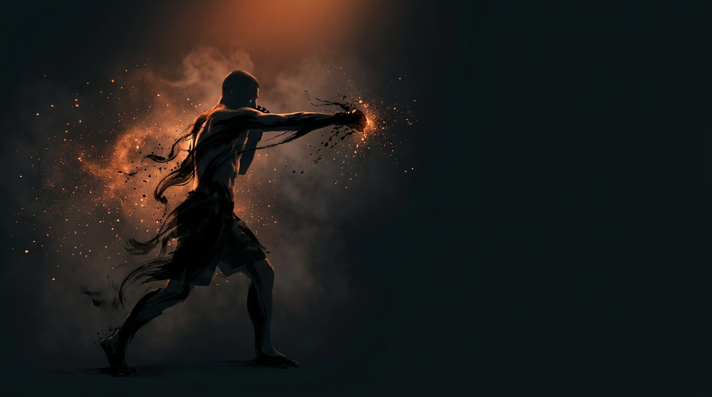

  
  
Open Space · StrikingLand the Target

Open SpaceStrikingOffensiveIntermediateAccess

Land one declared target by reading the defense and opening it with setup and misdirection, while the defender resists without countering.

  
Start<b>Two fighters at striking range inside a marked perimeter; attacker has one target in mind.</b>

  
→

  
The Goal<b>Attacker opens the defense to land the declared target; defender protects all three zones.</b>

  
→

  
Finish<b>Land the target → switch · Whiffed or blocked → reset · Defender has no win condition (diagnostic only).</b>

  
Pick the shot first,  then make the defense open it.

  
A declared target turns offense into a read-and-setup problem, not volume. <b>You only win when your one chosen shot lands clean.</b>

What to Read

<b>Attune to</b> the defender's <i>guard reactions to your probes</i>, how their shell shifts when you threaten a zone, together with the <i>rate of expansion</i> (τ) of your own committing shot toward the opening at <b>center mass</b>. The opening you read isn't where the guard <i>is</i>; it's where it <i>goes</i> when you make it move.

The Starting Position

  
PlayersTwo, squared off in a neutral fighting stance.

  
RangeStriking range, with room to create angles.

  
BoundaryA marked perimeter. Both stay inside it.

  
RolesOne attacker, one defender, switch when the target lands.

  
Start &amp; resetAttacker picks a target and initiates; reset to neutral after each exchange.

The Matchup

  

    
🥊

    
Attacker

    
Trying to land a predetermined target shot by reading the defense and creating openings.

    Probe, identify, set up, then commit. You may attack other zones as setup, but you only win when you land your <em>declared</em> target.
  

  
VS

  

    
🛡️

    
Defender

    
Trying to defend all three zones, head, body, legs, effectively. No countering.

    Defend naturally with the full toolkit (block, parry, slip, move). You have no win condition, your success is making the attacker work for every opening.
  

The Rules

  🚫 Defender cannot counterThe defender plays pure defense. Removing the counter-threat lets the attacker focus entirely on reading patterns and building setups.
  🎯 Attacker has a specific targetBefore engaging, the attacker picks one predetermined target shot, not just throwing volume. Everything serves landing <strong>that</strong> shot.
  🛡️ Defend all three zonesThe defender must protect head, body, and legs naturally, no artificial bias toward one zone, so the attacker has to earn the opening with misdirection.
  🔍 Probes &amp; setups allowedJabs, feints, and setup combinations are encouraged to shape the defense, but they aren't the goal. Landing the declared target is.

How to Win

  
Switch Land the declared target clean → switch roles.A clean landing means solid contact reaching the target zone with real energy transfer, not a whiff, graze, or blocked shot. Land it and you become the defender.

  
Reset Whiffed, grazed, or blocked → reset, read again.A failed attempt isn't a loss; it's information, same roles. Reset to a neutral stance and re-enter the probe → read → setup → commit cycle.

  
No score Defender denies every opening → diagnostic success.The defender has no win condition. Success is measured by maintaining solid defense across all zones and forcing the attacker to read, set up, and commit. The attacker calls their own clean landing on the honor system, this is an academic exercise.

The Levels

  
1<b>Private target</b>Target in mind, not announced.The standard mode. Read → setup → land, then claim the win on the honor system. The defender defends all zones naturally.

  
2<b>Announced target</b>Declare it first, harder, not easier.You announce the target ("left hook to body") so the defender focuses there. You must pull their defense away and still land it.

  
3<b>Defender counters</b>Counter strikes after good defense.The defender can fire counters once they defend successfully. You pursue the target while respecting the counter risk.

  
4<b>Full MMA expression</b>Counters plus clinch denial.The defender adds clinch to deny your offense. Land the target under realistic MMA pressure, counters and clinch both live.

Go Deeper

??? note "Task focus &amp; coaching cues"

    
Each role's job

    

      

🥊

Attacker

Probe to read, identify the protected zone, set up combinations to expose the target, then commit and land it.

      

🛡️

Defender

Defend all zones naturally; use every defensive solution; make the attacker work; never counter.

    

    
Coaching cues

    

      

👁️

Probe → read → setup → commit

"What happens to their guard when you go to the body? What opens?" Build the cycle instead of mindless combinations.

      

🎯

Intent, not technique

A jab can be the target if that's what you set out to land. The distinction is intent, probes gather info, the target is the goal.

    

??? abstract "Constraints-Led analysis"

    
Constraints → Affordances

    

      
Predetermined target→Develops intentional, strategic offense, not volume

      
Defender can't counter (L1–2)→Explore setup patterns without counter-threat distraction

      
Must land a specific shot to win→Forces reading defense and creating openings

      
Defender protects all three zones→Requires misdirection, not just power

      
Open space, striking range→Full movement and angle creation available

    

    
Implements the <b>Co-Adaptation Principle</b> (Renshaw et al., 2019), constraining the defender shapes what affordances the attacker perceives and explores.

    
What the attacker reads

    

      

👁️

Visual

Guard position, reactions to probes, weight distribution, eye focus → which zones are protected and what opens.

      

✋

Haptic

Contact on setup strikes → confirms defensive commitment.

      

🧭

Proprioceptive

Own distance and angle → when in range for the target shot.

    

    
What we measure (order parameter)

    
Whether the <b>committing shot lands on the opening the probe created</b>, track target-landed vs. attempts, and whether each landing followed a genuine setup (read → open → commit) rather than a repeated guess. That coupling of opening-read to committed strike is the order parameter; when it stabilizes, intentional offense has formed.

    
Representativeness

    
<b>Models:</b> sustained offensive striking with a target in mind, setting up the finish, attacking the body to slow them, chopping the lead leg.

    
Simplified: no counter-threat (L1–2)single targetrole switch on success

    
Pattern recognition and misdirection transfer directly into <a href="../touch-game/">Touch and Don't Get Touched</a> and live sparring.

    
Readiness to progress

    <ul class="emma-checklist">
      <li>Lands varied targets vs. varied defenders</li>
      <li>Uses setups, not just the target shot repeatedly</li>
      <li>Can explain "I went to X to open Y"</li>
      <li>Shows probe → read → setup → commit</li>
      <li>Success not dependent on one defender</li>
    </ul>

    
Warning signs

    

      Just throws the target shot repeatedly
      Can't verbalize the setup logic
      Only succeeds vs. one defender
      Frustrated when it doesn't land fast
    

??? note "Safety &amp; related games"

    

      🤝 Light-to-moderate, controlled contact
      🛑 Stop on excessive force or lost composure
      🔁 Reset if attacker throws volume or defender counters
    

    
Where it sits

    

      
Prerequisite→<a href="../../concepts/three-zones/">Three Zones</a> · <a href="../../concepts/confidence-rating/">Confidence Rating</a>

      
Follow-on→<a href="../touch-game/">Touch and Don't Get Touched</a>

      
Related→<a href="../../concepts/three-zones/">Misdirection Principle</a> · <a href="../../concepts/full-mma-expression/">Full MMA Expression</a>

    

