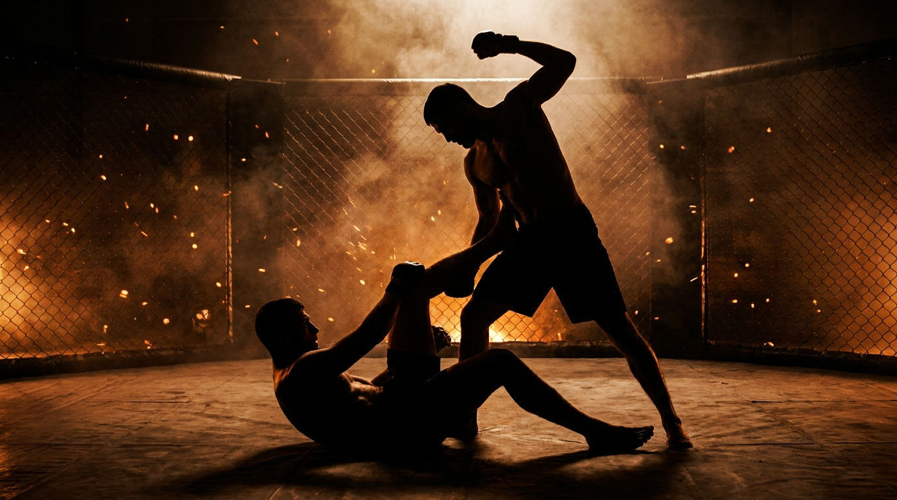

  
  
Ground · MMALeg Entanglement Escape

!!! warning "Provisional (WIP): derived from class recording 2026-07-05"
    Invented live in class and **pending review on the platform**.
    Name and structure may change. Remove the WIP status once confirmed.

GroundMMADefensiveIntermediateLeg Lock

Jiu-jitsu players who cross over into MMA often reach for a leg entanglement without registering what it costs: a standing opponent who can't be swept off is a standing opponent who can still hit you. This game builds that respect into both roles. Bottom is entangled and grounded, working to reverse the position or separate. Top has **no win condition at all**, their whole job is to stay on their feet and make the entanglement expensive.

  
Start<b>Standing leg entanglement. Bottom has any control on the top's lower leg or hip (over, under, or scooped), however it feels natural.</b>

  
→

  
The Goal<b>Bottom gets top's hips to the ground and comes up on top, or separates enough to stand and disengage. Top strips the entanglement and lands ground-and-pound while staying on their feet.</b>

  
→

  
Finish<b>Bottom reverses or separates → bottom wins · Advanced only: bottom finishes a leg submission → bottom wins · Top has no win, they just make the position cost something.</b>

  
You're going to get smashed,  that's the whole lesson.

  
A leg entanglement that doesn't end the fight leaves you grounded under a standing striker. <b>Know when to hold it, know when to let it go.</b>

What to Read

<b>Attune to</b> the <i>felt load through the entangled leg and the posting hand</i>, the inertial array. Bottom reads which way the top's weight is committed, through the standing leg's pressure and through where the top's hands land when they post, to know which direction the off-balance is already working and where the next pendulum push should go. Top reads bottom's grip pressure and the position of bottom's free leg to know which side is trying to collect the other leg or set up the reversal.

The Starting Position

  
PlayersTwo, one on the ground entangling a leg, one standing.

  
BottomAny control on the top's lower leg and hip, over-under or scooped, whatever's comfortable. Standard mechanic: one foot to the top's hip, the other controlling their ankle, a lever from the top of the leg to the bottom.

  
TopStanding, entangled at the leg, hands free to post and control.

  
TriggerCoach or bottom player calls go.

  
Start &amp; resetIf the entanglement fully breaks apart with no result, re-entangle and start again. Switch roles on a bottom win.

The Matchup

  

    
🦵

    
Bottom

    
Trying to get the top's hips to the ground and come up on top, or create enough separation to stand and disengage entirely. Advanced players may also finish a leg submission.

    Sweep, come up, off-balance the standing player, pendulum their weight one way then the other until they can't recover. Collect their posting leg, the one they're using to stay upright, as a second target alongside getting their hands down. Deal with the strikes, they're live and they're real.
  

  
VS

  

    
🥊

    
Top

    
No win condition. Strip the entanglement and land realistic ground-and-pound for every second the position lasts, while staying on your feet.

    Stay standing, don't put your weight down through your legs, don't pass guard, don't consolidate into a normal ground position, stay in the scramble and make it cost something. Use your hands to post and off-balance, not to bear weight. If the entanglement breaks, re-entangle rather than closing the gap.
  

The Rules

  🚫 No win condition for topBy design. Top cannot win this game, their job is entirely to make the position expensive for bottom every second it lasts, staying standing and striking.
  🧍 Top must stay standingNo weight down through the legs, no passing guard, no consolidating into a normal top ground position. If the entanglement disentangles, re-entangle and restart rather than closing the gap or sitting into it.
  ✋ Hands post and control, they don't bear weightTop can use their hands to off-balance or maintain control, but putting real weight down through the hands onto bottom is not allowed, they have to stay upright.
  🥊 Strikes are live, realisticallyTop lands real ground-and-pound, not pitter-patter taps, so bottom gets an honest read of the cost. If a partner isn't respecting the realism, it's fair to make the next one count so they get it.
  🤲 Hands to the mat isn't a win, but it mattersGetting top's hands down to the mat doesn't score by itself, but a top player with weight-loaded hands physically can't strike. It's a real damage-mitigation tool for bottom, not a win condition.
  🦵 Submissions live for advanced players onlyNewer players play position only, reversal or separation. Advanced players may also finish a leg submission from bottom. Coach's call on who's ready.

How to Win

  
Bottom wins Top's hips get to the ground, bottom comes up on top, in any way, including a scramble reversal.Any route to top counts, a clean reversal, a scramble that ends with bottom on top, all of it.

  
Bottom wins Bottom creates enough separation to stand up and disengage.If top isn't respecting distance management and gives too much space, bottom can simply stand up and win. Top giving up ground is a real cost, not a neutral outcome.

  
Advanced only Bottom finishes a leg submission.Reserved for players ready for it. Newer players play position only, no finishes.

  
No score Top has nothing to win, only time and damage to accumulate.The coach reads whether top stayed disciplined (standing, striking, not consolidating) and whether bottom is managing the damage or panicking.

The Levels

  
1<b>Base game</b>Position only, strikes live.Standing entanglement, bottom reverses or separates to win, top strips and strikes with no win condition, no submissions live. Builds the felt sense of both roles first.

  
2<b>Submissions live (advanced)</b>Bottom may finish a leg lock.Same game, advanced players only. Bottom's win conditions expand to include a finished leg submission. Coach's call on readiness, not automatic.

Recall Check

  
Test yourself before moving on. Answer out loud, then reveal what good looks like.

  

    
Q What is top's win condition?

    
There isn't one. <b>Top cannot win this game.</b> Their job is only to stay standing and make the position cost bottom as much as possible.

  

  

    
Q Does getting top's hands to the mat win the round for bottom?

    
<b>No, but it matters.</b> A top player with weight-loaded hands physically can't strike, so it's real damage mitigation, just not a win condition by itself.

  

  

    
Q Why is this game built the way it is?

    
Jiu-jitsu players crossing into MMA often think they'll leg-lock people and don't realize <b>they'll get smashed</b> trying. This game teaches both roles what that trade actually feels like, so they know when to commit and when to let go.

  

Go Deeper

??? note "Task focus &amp; coaching cues"

    
Each role's job

    

      

🦵

Bottom

Sweep and come up; pendulum off-balance the standing player; collect their posting leg as a second target; get their hands to the mat to shut off the strikes; know when to finish or let go.

      

🥊

Top

Stay on your feet, no weight through the legs, no passing guard; peel the entanglement; post and off-balance with the hands, don't lean on them; keep landing realistic strikes the whole time.

    

    
Coaching cues

    

      

🎯

The standard mechanic

One foot to the opponent's hip, the other controlling their ankle, a lever from the top of the leg to the bottom. This is the default entry most students pick up fast because it's the same base other classes at the gym teach.

      

⚖️

Pendulum off-balancing

Push their weight one way, they compensate, drag it back the other way, repeat. Don't fight strength with strength, fight it with rhythm.

      

🤚

Collect the other leg too

Bottom should be hunting the top's posting leg, the one keeping them upright, not just their own entangled leg. Two legs down beats one.

    

??? abstract "Constraints-Led analysis"

    
Constraints → Affordances

    

      
Top has no win condition→Forces top to internalize that time and position, not a finish, are the real reward, and forces bottom to feel real consequence-bearing pressure

      
Top must stay standing, can't pass guard→Keeps the problem specifically about the entanglement, not a generic ground-and-pound-defense problem

      
Hands post, don't bear weight→Trains realistic off-balancing and control instead of a body-lock shortcut

      
Submissions reserved for advanced players→Lets newer players build the position sense first, without the added risk of live leg locks before they're ready

    

    
Develops <b>respect for the real trade-off</b> in an MMA leg entanglement, jiu-jitsu players learn what it costs to stay down while a striker stands over them; strikers learn what it takes to actually shut the position down rather than just surviving it. Anchored in the <b>inertial array</b> through the entangled leg and posting hands (Blau &amp; Wagman, 2022).

    
What the players read

    

      

✋

Haptic

Load through the entangled leg and the posting hand → which way weight is committed, where the next off-balance should go.

      

👁️

Visual

Top's posting leg position, bottom's free leg and grip pressure → where the reversal or the second leg-collect is open.

      

🧭

Proprioceptive

Own base (top) and own hip freedom (bottom) → whether the standing posture is actually holding, whether the sweep is really on.

    

    
What we measure (order parameter)

    
Whether bottom's off-balancing attempts <b>convert into a real hip-down reversal or a clean separation</b>, rather than stalling in the entanglement eating strikes. Track reversal rate, separation rate, and whether bottom manages the damage (stop-the-bleeding) when a route isn't there yet. When bottom reliably converts pressure into one of the two wins, or correctly chooses to hold and wait rather than force a bad exchange, the skill has formed.

    
Representativeness

    
<b>Models:</b> the real MMA leg-entanglement problem, jiu-jitsu players reaching for a leg lock against a striker who never has to go down with them, one of the clearest gaps between pure grappling and MMA reality.

    
First-run observations (2026-07-05)

    <ul class="emma-checklist">
      <li>Students needed the pendulum off-balancing concept demonstrated live before it clicked, don't assume it's obvious from the rules alone</li>
      <li>A walk-in student with no MMA experience but jiu-jitsu experience picked up the standard entanglement mechanic quickly, described it as "new" but immediately useful for understanding the real cost of leg entanglements in MMA</li>
    </ul>

    
Readiness to progress

    <ul class="emma-checklist">
      <li>Bottom pendulum off-balances rather than out-muscling</li>
      <li>Bottom hunts the top's posting leg, not just the entangled one</li>
      <li>Top stays disciplined, standing, striking, never consolidating into a normal ground position</li>
      <li>Bottom can articulate when to commit to a finish vs. when to reverse or separate instead</li>
    </ul>

    
Warning signs

    

      Top sits down or passes guard, ending the real problem
      Bottom holds the entanglement passively and just absorbs strikes
      Top leans weight onto the hands instead of posting
      Submissions attempted before position sense is solid
    

??? note "Safety &amp; related games"

    

      🥊 Real strikes with real space behind them, not pitter-patter, but controlled
      🦵 Submissions live for advanced players only, coach's call
      🔁 Re-entangle on a full break rather than closing distance or sitting in
    

    
The advanced-only gate on finishes isn't caution for its own sake: competition data shows knee-injury incidence roughly <b>12 times higher</b> when heel hooks are legal (Piekarski et al., 2026, <i>Sports Health</i>; see <a href="../../reference/sources/">Sources</a>). Position sense first, finishes earned.

    
Where it sits

    

      
Prerequisite→<a href="../ground-to-standing/">Ground to Standing</a>

      
Related→<a href="../../concepts/hand-controls/">Hand Controls</a> · <a href="../ground-and-pound-defense/">Ground-and-Pound Defense</a>

    

