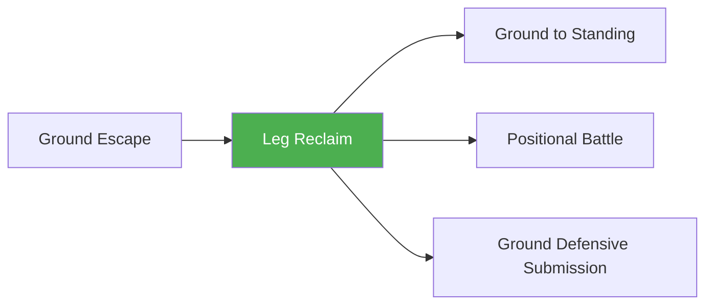

# Leg Reclaim

!!! info "Game Identity"
    - **Problem:** Getting legs/feet back between you and opponent
    - **Environment:** Ground
    - **Stage:** Counter (Defensive Grappling)

This is a **positional recovery game** — the defensive skill of getting your legs back between you and the opponent. From mounted to legs in, from side control to guard, from flattened to feet on hips. Each level represents reduced control by the top player.

---

## Goal

This is an **asymmetric game** with distinct roles.

| Role | Objective |
|------|-----------|
| **Bottom (Defender)** | Get legs between self and opponent |
| **Top (Controller)** | Maintain control, prevent leg recovery |

The objective is **incremental position recovery** — creating separation with legs.

---

## Entry Condition

- Bottom player is in compromised position (mounted, side control, etc.)
- Top player has control, legs are NOT between them
- Bottom works to reclaim leg position
- Reset when legs recovered OR top advances further

---

## Invariants

1. Bottom player **prioritizes leg recovery** — getting feet/knees between
2. Top player **actively controls** — not just sitting in position
3. Any leg recovery counts (half guard, full guard, feet on hips)
4. Focus is position, not escape or submission

---

## Task Focus

### Bottom (Defender)
- Create frames to make space
- Hip escape to recover leg
- Use knee-elbow connection
- Progress: mount → half → full → feet on hips → distance

### Top (Controller)
- Kill the hips
- Control legs/knees
- Prevent frames from being effective
- Advance if bottom creates opening

!!! question "Key Internal Questions — Bottom"
    - "Can I get my knee inside?"
    - "Is there space for my hip to escape?"
    - "What's the next level of separation I can achieve?"

---

## Key Logic: Levels of Leg Separation

!!! note "The Core Skill"
    Leg reclaim is progressive — each level reduces top control:

    | Position | Control Level | Goal |
    |----------|---------------|------|
    | **Mounted, legs trapped** | Maximum control | Get one leg free |
    | **Mounted, legs mobile** | High control | Get to half guard |
    | **Half guard** | Medium control | Get to full guard |
    | **Full guard (closed)** | Lower control | Get to open guard |
    | **Open guard (feet on hips)** | Minimal control | Create standing distance |
    | **Technical standup** | Escape | Return to feet |

    The progression:

    ```
    Trapped → Half → Full → Open → Distance → Standing
    ```

    The skill is recognizing opportunities to progress one level at a time.

---

## Win Conditions

| Role | Win Condition |
|------|---------------|
| **Bottom** | Achieve next level of leg separation (defined at start) |
| **Top** | Prevent leg recovery for set duration OR advance position |

**On bottom win:** Reset at new position, continue.
**On top win:** Same position, reset.

---

## Levels

=== "Level 1 — Mount to Half"
    - Start in mount
    - Bottom works to half guard
    - Focus: Basic hip escape, knee recovery

=== "Level 2 — Side to Guard"
    - Start in side control
    - Bottom works to any guard
    - Focus: Frame, hip escape, leg recovery

=== "Level 3 — Guard to Feet on Hips"
    - Start in closed guard
    - Bottom works to feet on hips (open)
    - Focus: Creating distance with legs

=== "Level 4 — Full MMA Expression"
    - Top can strike from position
    - Bottom must time recovery around GnP
    - Focus: Leg reclaim under MMA pressure
    - See: [Full MMA Expression](../concepts/full-mma-expression.md)

---

## Safety

- **Contact limits:** Controlled pressure, no striking (except Level 4)
- **Stop conditions:** Neck cranks, knee pressure
- **Coach intervention:** Reset if completely stalled

---

## Constraints Analysis

*How this game applies the [Constraints-Led Approach](../principles/cla/index.md)*

| Constraint Type | Constraint | Affordance Created |
|-----------------|------------|-------------------|
| **Task** | Goal is leg recovery (not full escape) | Develops incremental recovery |
| **Task** | Any leg recovery counts (half, full, feet on hips) | Multiple success paths |
| **Task** | Top actively controls | Creates realistic resistance |
| **Task** | Progressive starting positions (mount → side → guard) | Scaffolded recovery levels |
| **Individual** | Prerequisite: Ground Escape | Understands escape mechanics |
| **Environmental** | Various compromised positions | Full recovery vocabulary |

!!! info "Theoretical Foundation"
    This game develops **incremental recovery perception**—recognizing opportunities to progress one level at a time rather than seeking full escape immediately. The constraint focusing on leg position (not escape) develops the foundational skill of **creating separation with legs**. Athletes learn the **recovery hierarchy**: trapped → half → full → open → distance. Each level represents reduced opponent control (Renshaw et al., 2019).

---

## Information Structure

*What athletes must perceive to succeed (perception-action coupling)*

### Bottom (Reclaiming) Perceives

| Information Source | What to Read | Action It Supports |
|--------------------|--------------|-------------------|
| **Haptic** | Top's weight distribution | Hip escape direction |
| **Haptic** | Knee/leg control | Recovery opportunity |
| **Visual** | Space for knee insertion | Recovery timing |
| **Proprioceptive** | Own hip mobility | Escape method |
| **Proprioceptive** | Knee-elbow connection | Guard recovery |

### Top (Preventing) Perceives

| Information Source | What to Read | Action It Supports |
|--------------------|--------------|-------------------|
| **Haptic** | Hip escape attempts | Control adjustment |
| **Haptic** | Knee recovery attempts | Block timing |
| **Visual** | Bottom's frame creation | Prevention method |
| **Proprioceptive** | Own hip pressure | Control maintenance |

!!! tip "Coaching Cue"
    Ask bottom: "What's the next level of separation you can achieve?" This develops incremental thinking. Ask: "Can you get your knee inside?" Knee recovery is the key mechanic for leg reclaim.

---

## Representativeness

*How this game models real MMA situations*

### Real MMA Situation

Recovering guard from bad positions—the progressive skill of getting legs back between you and opponent.

### How This Game Represents It

| Element | Real MMA | This Game | Fidelity |
|---------|----------|-----------|----------|
| **Incremental recovery** | Mount → half → guard | Same progression | High |
| **Leg separation levels** | Key defensive skill | Same | High |
| **Active top resistance** | Opponent prevents recovery | Same | High |
| **Hip escape mechanics** | Foundation of recovery | Same | High |
| **Strikes** | Affect recovery urgency | Progressive by level | Scaffolded |

### Simplifications & Justification

| Simplification | Why Acceptable |
|----------------|----------------|
| Focus on leg recovery (not escape) | Isolates foundational skill |
| Clear level progression | Develops one level at a time |
| Win = next level achieved | Celebrates incremental progress |

!!! note "Transfer Expectation"
    Leg reclaim skill developed here transfers directly to MMA. The perception of recovery opportunities and the knee-elbow connection is identical in competition.

---

## Variability Guidelines

*Creating "repetition without repetition" (Bernstein, 1967)*

### Within-Level Variability

| Vary This | How | Maintains |
|-----------|-----|-----------|
| **Starting position** | Mount, side control, knee on belly | Multiple recovery problems |
| **Top control style** | Heavy, mobile, transitioning | Adaptability |
| **Top size** | Larger, smaller, equal | Recovery calibration |
| **Target level** | Half guard, full guard, feet on hips | Progressive goals |
| **Intensity** | Drilling pace, live pace | Pressure calibration |

### What NOT to Vary

| Keep Constant | Why |
|---------------|-----|
| Leg recovery focus | Core constraint |
| Incremental progression | Develops proper hierarchy |
| Active top control | Maintains realism |

### Progressing Through Levels

| Signal to Progress | Meaning |
|--------------------|---------|
| Recovers half guard from mount | Basic skill developing |
| Recovers full guard from side | Progression developing |
| Creates feet on hips from guard | Ready for standup |

---

## Readiness Indicators

*When is the athlete ready to advance?*

### Ready for Next Level When

- [ ] Achieves target recovery consistently
- [ ] Hip escapes are efficient
- [ ] Knee-elbow connection is automatic
- [ ] Frame creation is effective
- [ ] Can articulate: "I got my knee inside when..."

### Ready to Exit Game When

- [ ] Level 2+ competence (recovers from side control)
- [ ] Recovery progression is instinctive
- [ ] Can chain levels (mount → half → full)
- [ ] Leg reclaim appears in sparring

### Warning Signs (Not Ready to Progress)

| Sign | Meaning | Response |
|------|---------|----------|
| Can't hip escape | Mechanics lacking | Focus on shrimping |
| Gets flattened repeatedly | Frame creation poor | Work on frames |
| Only recovers from one position | Limited skill | Vary starting positions |
| Knee never gets inside | Key technique missing | Isolate knee recovery |

---

## System Position



- **Prerequisite games:** Ground Escape
- **Follow-on games:** Ground to Standing, Positional Battle, Ground Defensive Submission
- **Related concepts:** Decision States

---

!!! abstract "System Evolution Notice"
    This game may be refined as recovery patterns emerge.
