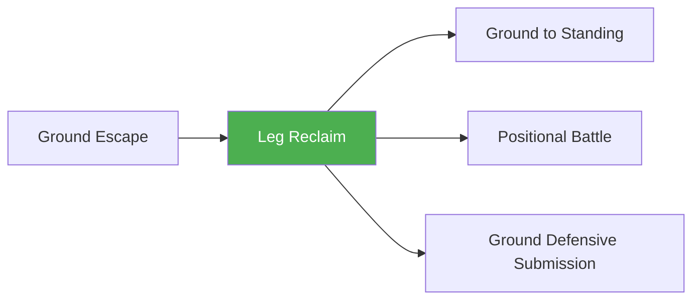

# Leg Reclaim

!!! info "Game Identity"
    - **Problem:** Getting legs/feet back between you and opponent
    - **Environment:** Ground
    - **Stage:** Counter (Defensive Grappling)

This is a **positional recovery game** — the defensive skill of getting your legs back between you and the opponent. From mounted to legs in, from side control to guard, from flattened to feet on hips. Each level represents reduced control by the top player.

---

## Goal

This is an **asymmetric game** with distinct roles.

| Role | Objective |
|------|-----------|
| **Bottom (Defender)** | Get legs between self and opponent |
| **Top (Controller)** | Maintain control, prevent leg recovery |

The objective is **incremental position recovery** — creating separation with legs.

---

## Entry Condition

- Bottom player is in compromised position (mounted, side control, etc.)
- Top player has control, legs are NOT between them
- Bottom works to reclaim leg position
- Reset when legs recovered OR top advances further

---

## Invariants

1. Bottom player **prioritizes leg recovery** — getting feet/knees between
2. Top player **actively controls** — not just sitting in position
3. Any leg recovery counts (half guard, full guard, feet on hips)
4. Focus is position, not escape or submission

---

## Task Focus

### Bottom (Defender)
- Create frames to make space
- Hip escape to recover leg
- Use knee-elbow connection
- Progress: mount → half → full → feet on hips → distance

### Top (Controller)
- Kill the hips
- Control legs/knees
- Prevent frames from being effective
- Advance if bottom creates opening

!!! question "Key Internal Questions — Bottom"
    - "Can I get my knee inside?"
    - "Is there space for my hip to escape?"
    - "What's the next level of separation I can achieve?"

---

## Key Logic: Levels of Leg Separation

!!! note "The Core Skill"
    Leg reclaim is progressive — each level reduces top control:

    | Position | Control Level | Goal |
    |----------|---------------|------|
    | **Mounted, legs trapped** | Maximum control | Get one leg free |
    | **Mounted, legs mobile** | High control | Get to half guard |
    | **Half guard** | Medium control | Get to full guard |
    | **Full guard (closed)** | Lower control | Get to open guard |
    | **Open guard (feet on hips)** | Minimal control | Create standing distance |
    | **Technical standup** | Escape | Return to feet |

    The progression:

    ```
    Trapped → Half → Full → Open → Distance → Standing
    ```

    The skill is recognizing opportunities to progress one level at a time.

---

## Win Conditions

| Role | Win Condition |
|------|---------------|
| **Bottom** | Achieve next level of leg separation (defined at start) |
| **Top** | Prevent leg recovery for set duration OR advance position |

**On bottom win:** Reset at new position, continue.
**On top win:** Same position, reset.

---

## Levels

=== "Level 1 — Mount to Half"
    - Start in mount
    - Bottom works to half guard
    - Focus: Basic hip escape, knee recovery

=== "Level 2 — Side to Guard"
    - Start in side control
    - Bottom works to any guard
    - Focus: Frame, hip escape, leg recovery

=== "Level 3 — Guard to Feet on Hips"
    - Start in closed guard
    - Bottom works to feet on hips (open)
    - Focus: Creating distance with legs

=== "Level 4 — Full MMA Expression"
    - Top can strike from position
    - Bottom must time recovery around GnP
    - Focus: Leg reclaim under MMA pressure
    - See: [Full MMA Expression](../concepts/full-mma-expression.md)

---

## Safety

- **Contact limits:** Controlled pressure, no striking (except Level 4)
- **Stop conditions:** Neck cranks, knee pressure
- **Coach intervention:** Reset if completely stalled

---

## System Position



- **Prerequisite games:** Ground Escape
- **Follow-on games:** Ground to Standing, Positional Battle, Ground Defensive Submission
- **Related concepts:** Decision States

---

!!! abstract "System Evolution Notice"
    This game may be refined as recovery patterns emerge.
