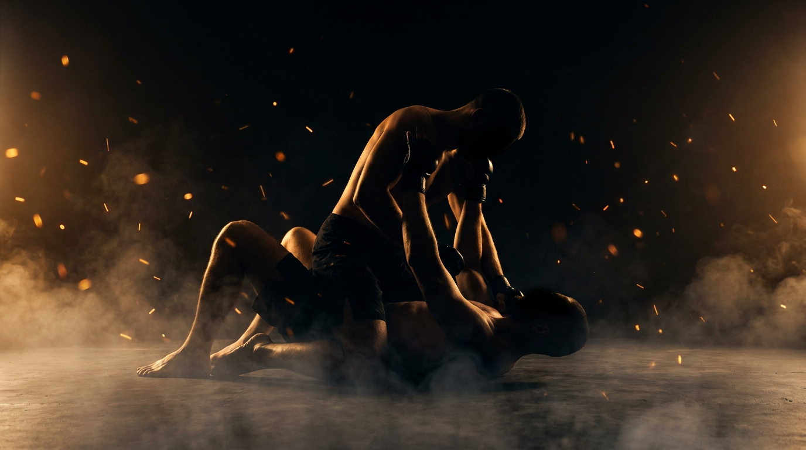

  
  
Ground · GrapplingMount Escape

GroundGrapplingDefensiveIntermediateCounter

Get out from under mount before the top isolates an arm.

  
Start<b>Bottom flat under mount, top settled, inside a marked perimeter.</b>

  
→

  
The Goal<b>Bottom frames, makes hip space, and recovers; top stays mounted and hunts an isolated arm.</b>

  
→

  
Finish<b>Knee back in (half guard) or better, reverse, or stand → bottom · Isolate an arm or hold mount the full count → top · Out of bounds → loss.</b>

  
You don't escape the weight,  you escape the space it leaves.

  
Frame to make room, bridge into the light side. <b>Every time the top reaches, the base lightens.</b>

What to Read

<b>Attune to</b> the <i>felt load through the top's hips and hands</i>, the moment the base lifts as they posture, climb, or reach for your arm. That weight shift specifies <i>which way to bridge</i> and <i>when the hip space opens</i>, not the top's eyes or a memorized sequence. When they grab high, the base goes light low.

The Starting Position

  
PlayersTwo, one bottom (defender), one top (mounted).

  
PositionBottom flat on the back, top in a settled mount, hips low.

  
BoundaryA marked perimeter, both stay inside.

  
RolesBottom frames and escapes; top maintains mount and hunts an isolated arm.

  
Start &amp; resetBegin from settled mount; reset on escape, arm isolation, or the count.

The Matchup

  

    
🤸

    
Bottom (Defender)

    
Trying to frame, make hip space, and recover a guard (half guard or better), a reversal, or standing.

    Keep elbows tight to deny the arm. Bridge into the side the top loads, then shrimp into the space. Protect the arms first, then escape, panic exposes the arm the top wants. Recovery is graded: the more leg you get back between you, the cleaner the escape.
  

  
VS

  

    
🥋

    
Top (Attacker)

    
Trying to keep mount and pull one of the bottom's arms away from the body.

    Ride the bridge, stay heavy on the hips, climb when threatened. Bait a frame, then attack the arm it leaves. Control is proven by isolating an arm, not just sitting on top.
  

The Rules

  🤜 Bottom frames and escapes, no subsThe bottom works frames, bridges, and hip escapes continuously. No submissions from the bottom, the task is the escape, not the counter-attack.
  🎯 Top wins by isolating an armThe top proves control by pulling one of the bottom's arms clear of the body (the entry every mounted submission shares), not by sitting still. This gives the top an active, observable target instead of a stall.
  ⏱️ Hold the count or escapeIf the top keeps mount for the set count (start at 20 seconds) without isolating an arm, the round resets. If the bottom recovers guard, reverses, or stands first, the bottom wins. A clock, never "as long as possible".
  🚫 No striking until the top levelLevels 1 to 4 are control only, so the bottom can read weight and build frames without defending strikes. Strikes enter at the full-expression level.
  ⬛ Stay inside the perimeterPlay happens inside a marked perimeter, any shape. If a player rolls fully out of it, that player loses the round, training mat-edge awareness.

How to Win

  
Switch Bottom gets a knee back between (half guard) or better, reverses, or stands → bottom wins, switch roles.Recovery is graded by how much leg you reinsert: one knee in (half guard) is the floor, then both knees, then both feet, then a closed loop (closed guard), each a cleaner escape. A reversal to top or standing up is a full escape. See <a href="../../concepts/guard-recovery/">Guard Recovery</a>.

  
Win Top isolates an arm clear of the body → top wins.One of the bottom's arms pulled away from the torso and controlled, the shared entry to armbar, arm-triangle, and back-take. The observable proof that mount control has beaten the frames.

  
Reset Top holds mount the full count, no arm → reset, same roles.The top kept the position but never isolated an arm before the count expired. The round resets from settled mount for another rep.

  
Loss Roll fully out of the perimeter → that player loses.Crossing the marked perimeter loses the round instantly, regardless of position, training the mat-edge awareness a fighter needs.

The Levels

  
1<b>Two hands, one hip</b>Both hands frame one hip.Bottom starts with both hands framing one of the top's hips and must hold that frame while the top works to pull an arm free. Isolates the single strongest frame and the elbow-tight habit that denies the arm.

  
2<b>One hand each hip</b>Split the frames.A hand on each of the top's hips. Now the bottom must keep both elbows tight at once and pick which side to bridge. Reading the loaded side becomes the task.

  
3<b>Frames of choice, hands to mat</b>Force the base down.Bottom uses any frames and adds a goal: force the top to put a hand on the mat to keep balance. A posted hand is a committed base, the first crack in the mount.

  
4<b>Attack the posts</b>Off-balance the committed base.Once the top posts, the bottom bridges hard into that post to break the base and start the recovery. The bridge-into-the-light-side mechanic is now the focus.

  
5<b>Full expression</b>Continuous, strikes on.Continuous from settled mount until the bottom gets a knee or hips between the players, with light strikes on. The top's strike threat makes hesitation costly, escape under real urgency.

Recall Check

  
Test yourself before moving on. Answer out loud, then reveal what good looks like.

  

    
Q What weight shift tells you the hip space has opened?

    
When the top <b>postures, climbs, or reaches high for your arm</b>, the base lifts and goes light low. <b>Grab high, base light low.</b> Bridge into the side they loaded.

  

  

    
Q Why does the top win by isolating an arm rather than just holding?

    
An isolated arm is the <b>shared entry to armbar, arm-triangle, and the back-take</b>, and it is observable. It gives the top an active target instead of a stall, and it keeps the bottom's elbows honest.

  

  

    
Q What is the bottom's first job, before escaping?

    
<b>Protect the arms, elbows tight.</b> Panic and flailing expose the exact arm the top is hunting. Frame first, make space, then move.

  

  

    
Q What does forcing the top to post a hand actually buy you?

    
A posted hand is a <b>committed base</b>. Bridge hard into that post and the top has no frame to catch the fall, the mount breaks and the recovery starts.

  

Go Deeper

??? note "Task focus &amp; coaching cues"

    
Each role's job

    

      

🤸

Bottom (Defender)

Keep elbows tight, frame the hips, read the loaded side, bridge into it, shrimp into the space, chain the next frame when one fails.

      

🥋

Top (Attacker)

Stay heavy on the hips, ride the bridge, climb when threatened, bait a frame and attack the arm it leaves.

    

    
Coaching cues

    

      

⚓

Where is the base?

Ask the bottom: "When did the base go light?" Direct attention to the load shift, not to a named technique.

      

🫷

Elbows or arm?

Ask the top: "Did you get the arm, or just sit?" Keeps the top hunting the isolated arm instead of stalling for the count.

    

??? abstract "Constraints-Led analysis"

    
Constraints → Affordances

    

      
Frame restricted per level (one hip → split → posts)→Isolates one frame and one read at a time

      
Top wins by isolating an arm→Keeps the bottom's elbows tight, gives the top an active target

      
Hold the count or escape→Urgency for the bottom, no stalling for the top

      
No strikes until the top level→Frees the bottom to read weight before adding strike defense

      
Live, resisting top→Keeps the weight-reading perception intact

    

    
Implements <b>Task Simplification</b> (Renshaw et al., 2019): the frame ladder isolates one escape variable per level while the bottom keeps reading load and timing from a real, resisting opponent. The top's arm-isolation win keeps the representativeness, this is the actual danger of mount.

    
What the bottom reads

    

      

✋

Haptic

Load through the top's hips and hands → which side is heavy, when the base lifts, which way to bridge.

      

🧭

Proprioceptive

Own elbow and hip position → whether the arm is safe and whether hip space exists yet.

      

👁️

Visual

Top posturing or reaching high → the timing window to bridge into the lightened base.

    

    
What we measure (order parameter)

    
Whether the bottom <b>re-frames and opens hip space faster than the top can isolate an arm or re-settle weight</b>. Track escapes recovered vs. arms isolated, and whether the elbows stay tight as the top climbs. The frame-and-bridge versus settle-and-isolate race is the order parameter; when the bottom consistently times the bridge to the lightened base, the skill has formed.

    
Representativeness

    
<b>Models:</b> being mounted and recovering before an arm is isolated or strikes accumulate, the exact problem under mount in competition and in MMA.

    
Simplified: frame ladderno strikes L1-4reset on the count

    
Deepens the mount level of <a href="../ground-escape/">Ground Escape</a>; the weight-reading transfers into <a href="../leg-reclaim/">Leg Reclaim</a> and <a href="../ground-to-standing/">Ground to Standing</a>.

    
Readiness to progress

    <ul class="emma-checklist">
      <li>Keeps both elbows tight under pressure</li>
      <li>Bridges into the loaded side, not away from it</li>
      <li>Forces the top to post, then attacks the post</li>
      <li>Chains a second frame when the first fails</li>
    </ul>

    
Warning signs

    

      Arms drift away from the body
      Bridges straight up, not to a side
      Waits and survives instead of framing
      Panics when the first escape fails
    

??? note "Safety &amp; related games"

    

      🤝 Controlled grappling
      🛑 Stop on submission attempts or neck cranks
      🔁 Reset if the position stalls completely
    

    
Where it sits

    

      
Prerequisite→<a href="../ground-escape/">Ground Escape</a>

      
Follow-on→<a href="../leg-reclaim/">Leg Reclaim</a> · <a href="../ground-to-standing/">Ground to Standing</a>

      
Related→<a href="../../concepts/decision-states/">Decision States</a> · <a href="../../concepts/guard-recovery/">Guard Recovery</a>

    

