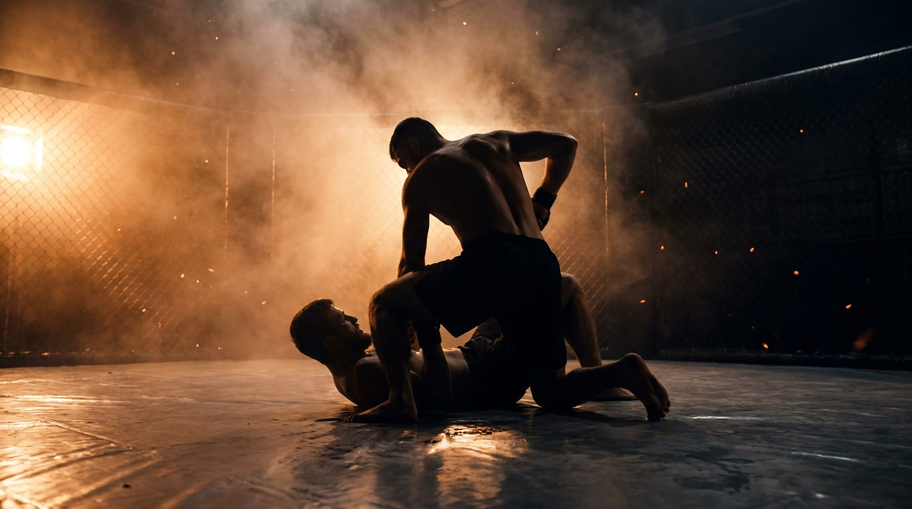

  
  
Ground · GrapplingMount Maintenance

!!! warning "Provisional (WIP): validated in class 2026-06-15, pending final coach sign-off"

    Taught and drilled live on 2026-06-15 as the top-side mirror of [Mount Escape](../mount-escape/). The win condition is the [TKO Pin](../../concepts/tko-pin/), control plus real strikes, not a grappling hold. Awaiting a final pass before the WIP tag comes off.

GroundGrapplingOffensiveIntermediateControl → Finish

Keep the mount and turn control into damage before the bottom gets an elbow back in.

  
Start<b>Top settled in mount, shins under the bottom's arms, inside a marked perimeter.</b>

  
→

  
The Goal<b>Top stays heavy, climbs, and frees a hand to strike; bottom fights both elbows back inside.</b>

  
→

  
Finish<b>TKO pin or an isolated arm → top · Both elbows back in (half guard) or reverse → bottom · Out of bounds → loss.</b>

  
Control isn't sitting on someone,  it's the strike they can't stop.

  
Hold three points, free the fourth to hit. <b>If you're only holding, you're not winning, you're waiting.</b>

What to Read

<b>Attune to</b> the <i>felt load through your own hips and the bottom's elbows</i>, the moment their frame opens or their base bumps to bridge. That shift specifies <i>when a hand is free to strike</i> and <i>which arm is exposed to isolate</i>, not a memorized mount sequence. Hold with three points, hit with the fourth, and re-settle the instant the bump comes.

The Starting Position

  
PlayersTwo, one top (attacker, mounted), one bottom (defender).

  
PositionTop settled in mount, hips low, shins under the bottom's arms so the elbows are accessible.

  
BoundaryA marked perimeter, both stay inside.

  
RolesTop maintains mount and works to a TKO pin or arm isolation; bottom fights both elbows back in or reverses.

  
Start &amp; resetBegin from settled mount; reset on a TKO pin, arm isolation, escape, or the count.

The Matchup

  

    
🥋

    
Top (Attacker)

    
Trying to keep mount, climb the hips, and free a hand to land real strikes (a TKO pin), or pull an arm clear to a submission entry.

    Stay heavy and proactive, a step ahead, don't wait for the bump. Control one side and pin the arms high so they can't post or bump. Trade one point of control for a strike, then re-settle. Climb to a higher mount as the base lightens.
  

  
VS

  

    
🤸

    
Bottom (Defender)

    
Trying to get both elbows back inside the knees (half guard or better), reverse, or stand.

    Wait for the top to lift weight to strike, then spend energy on the bump. Keep elbows tight to deny the isolate, frame and shrimp into the space the strike leaves.
  

The Rules

  🎯 Top wins by a TKO pin, not by sittingThe top proves control by immobilizing the bottom and landing real, unanswered strikes (the <a href="../../concepts/tko-pin/">TKO Pin</a>), or by pulling an arm clear to a submission entry. Holding mount without a finish threat is a stall, not a win.
  🤜 Bottom wins on both elbows back inThe bottom's task is to recover both elbows inside the knee line (the floor is half guard) or reverse. A clean, observable bottom goal that mirrors <a href="../mount-escape/">Mount Escape</a>.
  ⛰️ Stay topside, no dropping to the legsThe top may not bail back to the legs to stall. Maintain top control, mount or a topside advance, the whole round. This keeps the position honest as a dominant pin, not a scramble reset.
  ⏱️ Hold the count or finishIf the top keeps mount for the set count (start at 20 seconds) without a TKO pin or an isolated arm, the round resets. If the bottom recovers or reverses first, the bottom wins. A clock, never "as long as possible".
  🥊 GnP realism, not pitter-patterOnce strikes are on, throw realistic strikes with space behind them, not a flurry of light taps and not bashing. A real strike needs room, so it doubles as a negative stimulus that makes the bottom move, and it trains the actual control-to-strike oscillation.
  🎚️ GnP dial-up, by permissionThe coach explicitly grants a meaner dial on ground-and-pound: mid-grapple, strength is already compromised, so firmer strikes stay safe. Strikes are the disincentivization tool that punishes a lazy bottom structure. Ground games train smashing on the ground, not grappling for its own sake.
  ⬛ Stay inside the perimeterPlay happens inside a marked perimeter, any shape. If a player rolls fully out of it, that player loses the round, training mat-edge awareness.

How to Win

  
Win Top lands a TKO pin (control + real unanswered strikes), or isolates an arm → top wins.A TKO pin is control of the hips and shoulders with one hand free to land effective strikes, four or five unanswered. An isolated arm pulled clear of the body is the shared entry to armbar, arm-triangle, and the back-take. Either is the observable proof that mount control beat the frames. See <a href="../../concepts/tko-pin/">TKO Pin</a>.

  
Switch Bottom gets both elbows back inside (half guard) or reverses → bottom wins, switch roles.Both elbows recovered inside the knee line is the floor (half guard); a reversal to top or standing is a full escape. Mirrors the win in <a href="../mount-escape/">Mount Escape</a>.

  
Reset Top holds mount the full count, no TKO pin or arm → reset, same roles.The top kept the position but never freed a hand to strike or isolated an arm before the count expired. Resets from settled mount for another rep.

  
Loss Roll fully out of the perimeter → that player loses.Crossing the marked perimeter loses the round instantly, regardless of position.

The Levels

  
1<b>Settle and hold</b>Shins under the arms, deny the elbows.Top settles low in mount with shins under the bottom's arms and simply denies the elbows coming back inside. Control only, no strikes. Builds the heavy, balanced base that everything else rests on.

  
2<b>Win one side, arms high</b>Pin a wrist, get the arms up.Top controls one side and works the bottom's hands and elbows up toward the head, the higher the arms, the harder it is to bump. Reading which side is loaded becomes the task.

  
3<b>Arms overhead start</b>Both arms isolated above the head.Start with both of the bottom's arms already pinned above the head (the class progression). This is the armbar and arm-triangle entry, the top maintains the isolation while the bottom fights the hands back down. The compromised start makes the bottom's task explicit.

  
4<b>TKO pin windows</b>Free a hand, strike, re-settle.Top oscillates: hold with three points, free the fourth for one realistic strike, then re-settle before the bump. GnP realism, real strikes with space, not pitter-patter. The control-to-strike trade becomes the skill.

  
5<b>Full expression</b>Continuous, strikes on.Continuous from settled mount, strikes live, until the top lands a TKO pin or isolates an arm, or the bottom recovers. The bottom's bridges are now urgent, the top must stay proactive and a step ahead.

Recall Check

  
Test yourself before moving on. Answer out loud, then reveal what good looks like.

  

    
Q Why does the top win by a TKO pin instead of just holding mount?

    
Holding is a <b>stall</b>. A TKO pin is control <b>plus a hand free to land real strikes</b>, the observable proof that the position is doing work. It also keeps the top oscillating between control and damage instead of sitting.

  

  

    
Q Why pin the bottom's arms high toward the head?

    
The higher the arms, the <b>less leverage the bottom has to bump and bridge</b>, and the closer they are to an arm isolation. High arms = a quiet base and a live submission entry.

  

  

    
Q What is the cost of striking, and how do you manage it?

    
Every strike <b>frees a point of control</b>, giving the bottom something to bump. Hold three points, strike with the fourth, and <b>re-settle the instant the bump comes</b>. Don't trade all your control for one shot.

  

  

    
Q When is the bottom most dangerous, and what should the top do about it?

    
When the top <b>lifts weight to strike</b>. Be <b>proactive, a step ahead</b>, control the arms first so the strike doesn't hand the bottom a free bump.

  

Go Deeper

??? note "Task focus &amp; coaching cues"

    
Each role's job

    

      

🥋

Top (Attacker)

Stay heavy and low, pin the arms high, climb as the base lightens, free one hand to strike then re-settle, hunt the isolated arm when the frame opens.

      

🤸

Bottom (Defender)

Keep elbows tight, wait for the weight to lift, then bump with everything, frame and shrimp into the space the strike leaves.

    

    
Coaching cues

    

      

🏃

Proactive, not reactive

Ask the top: "Were you a step ahead, or waiting for the bump?" A reactive top gets tossed; a proactive top controls the arms before the escape starts.

      

⚖️

Holding or hitting?

Ask the top: "Did you free a hand, or just sit?" Keeps the top oscillating into the TKO pin instead of stalling for the count.

    

??? abstract "Constraints-Led analysis"

    
Constraints → Affordances

    

      
Top wins by a TKO pin (control + strikes)→Forces the control-to-strike oscillation, no stalling

      
Arms-high / arms-overhead levels→Isolates the bump-denial and the submission entry

      
Stay topside, no dropping to the legs→Keeps the position an honest dominant pin

      
Hold the count or finish→Urgency for the top, a real escape window for the bottom

      
GnP realism, strikes with space→A real negative stimulus that drives the bottom to move

    

    
Implements <b>Task Simplification</b> (Renshaw et al., 2019): the arms ladder isolates one control variable per level while the top keeps reading the bottom's load and frame from a live, resisting opponent. The TKO-pin win keeps the representativeness, mount only matters in MMA if it produces damage.

    
What the top reads

    

      

✋

Haptic

Load through your hips and the bottom's elbows → which side is heavy, when a hand is free, when the bump is coming.

      

🧭

Proprioceptive

Own base and weight → how much control you can trade for a strike without losing the mount.

      

👁️

Visual

An exposed elbow or an opening frame → the arm to isolate and the timing to climb.

    

    
What we measure (order parameter)

    
Whether the top <b>frees a hand to strike or isolates an arm faster than the bottom can recover an elbow or bridge out</b>. Track TKO pins and arm isolations vs. escapes, and whether the top re-settles after each strike instead of losing the mount. The strike-and-re-settle versus bump-and-recover race is the order parameter; when the top reliably converts control into damage without losing position, the skill has formed.

    
Representativeness

    
<b>Models:</b> holding mount and turning it into damage before the bottom recovers an elbow, the exact problem on top in MMA.

    
Simplified: arms ladderno strikes L1-3reset on the count

    
Mirror of <a href="../mount-escape/">Mount Escape</a>; deepens the top side of <a href="../ground-control/">Ground Control</a>; the TKO-pin oscillation transfers to <a href="../wall-grinding/">Wall Grinding</a>.

    
Readiness to progress

    <ul class="emma-checklist">
      <li>Stays heavy and proactive, a step ahead of the bump</li>
      <li>Pins the arms high to kill the bridge</li>
      <li>Frees a hand to strike, then re-settles without losing mount</li>
      <li>Climbs to a higher mount as the base lightens</li>
    </ul>

    
Warning signs

    

      Sits and holds instead of threatening a finish
      Trades all control for one strike, then loses mount
      Reacts to the bump instead of pre-empting it
      Bails to the legs when pressured
    

??? note "Safety &amp; related games"

    

      🤝 Controlled grappling, GnP by coach permission
      🛑 Stop on submission attempts or neck cranks
      🔁 Reset if the position stalls completely
    

    
Where it sits

    

      
Prerequisite→<a href="../ground-control/">Ground Control</a> · <a href="../mount-escape/">Mount Escape</a>

      
Follow-on→<a href="../ground-and-pound-defense/">Ground-and-Pound Defense</a>

      
Related→<a href="../../concepts/tko-pin/">TKO Pin</a> · <a href="../../concepts/decision-states/">Decision States</a>

    

