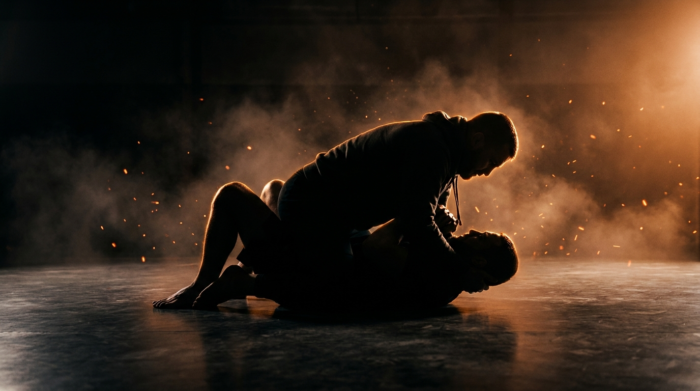

  
  
Ground · GrapplingNorth-South Control

!!! warning "Provisional (WIP): built from the ground-wave spec, pending coach review"

    Fills the empty north-south bucket in the top-control grid. Sourced from the Slime Mold Grappling Club catalog (Greg Souders / Standard Jiu-Jitsu), re-expressed with our threshold rules. Passed the build rubric on paper; awaits validation against a live grappling class.

GroundGrapplingOffensiveIntermediateControl → Finish

Pin from north-south, then transition to a side or trap an arm before the bottom brings the knees in.

  
Start<b>Top chest-to-chest north-south, elbows in the bottom's armpits, the bottom's head at the beltline, inside a marked perimeter.</b>

  
→

  
The Goal<b>Top flattens, kills the knees, then transitions to side control or traps a kimura; bottom brings the knees in and sits up.</b>

  
→

  
Finish<b>Transition and hold 3s, or a kimura trap → top · Knees in, sit up, or reverse → bottom · Out of bounds → loss.</b>

  
North-south is a doorway,  not a room.

  
Flatten the shoulders, then move to a side or trap the arm. <b>Sit in it too long and the knees come back in.</b>

What to Read

<b>Attune to</b> the <i>bottom's shoulders and the gap to their hips</i>, the moment a shoulder lifts to turn or an arm slides up to frame. That shift specifies <i>which way to transition</i> and <i>when a kimura is there to trap</i>, not a memorized pin. When they bridge to bring the knees in, a side opens.

The Starting Position

  
PlayersTwo, one top (attacker, north-south), one bottom (defender).

  
PositionTop chest-to-chest north-south, elbows in the bottom's armpits, the bottom's head near the top's beltline; bottom on the back.

  
BoundaryA marked perimeter, both stay inside.

  
RolesTop maintains the pin and transitions or traps an arm; bottom brings the knees in and recovers.

  
Start &amp; resetBegin from settled north-south; reset on a held transition, a kimura, an escape, or the count.

The Matchup

  

    
🥋

    
Top (Attacker)

    
Trying to flatten the bottom, then transition to side control (held 3s) or trap a kimura.

    Weight on the chest, elbows in the armpits to kill the frames, head light. When a shoulder lifts, switch to a side; when an arm slides up, trap the kimura. Control is proven by the transition or the trap, not by sitting north-south.
  

  
VS

  

    
🤸

    
Bottom (Defender)

    
Trying to bring the knees in, sit up, or reverse.

    Frame into the hips, bridge and bring a knee across, sit up as the top's weight shifts. Keep the elbows tight so an arm can't be slid up into a kimura.
  

The Rules

  🎯 Top wins by a transition or a kimuraThe top proves control by transitioning to in-line north-south or side control and holding 3 seconds, or by trapping a kimura (figure-four) on one arm. Sitting in north-south without a threat is a stall, not a win.
  🤜 Bottom wins by recoveringThe bottom wins by bringing the knees in to recover guard, sitting up to the front, or reversing. A clean, observable bottom goal.
  ⏱️ Hold the count or finishIf the top keeps north-south for the set count (start at 20 seconds) without a held transition or a kimura, the round resets. If the bottom recovers first, the bottom wins. A clock, never "as long as possible".
  🚫 No striking until the top levelLevels 1 to 4 are control only, so both players read weight and frames before strikes are added. Strikes enter at the full-expression level.
  🎚️ GnP dial-up, by permissionOnce strikes are on, the coach explicitly grants a meaner dial on ground-and-pound. Strikes are the disincentivization tool that punishes a passive bottom. Ground games train smashing, not grappling for its own sake.
  ⬛ Stay inside the perimeterPlay happens inside a marked perimeter, any shape. If a player rolls fully out of it, that player loses the round.

How to Win

  
Win Top transitions to a side (3s) or traps a kimura → top wins.A clean transition to in-line north-south or side control held three seconds, or a figure-four trapped on one arm. Either is the observable proof that the pin led somewhere. Finish the kimura slow, tap early.

  
Switch Bottom brings the knees in, sits up, or reverses → bottom wins, switch roles.Recovering the knees to guard, sitting up to the front, or reversing is the escape. See <a href="../../concepts/guard-recovery/">Guard Recovery</a>.

  
Reset Top holds north-south the full count, no threat → reset, same roles.The top kept the pin but never transitioned or trapped an arm before the count expired. Resets from settled north-south.

  
Loss Roll fully out of the perimeter → that player loses.Crossing the marked perimeter loses the round instantly, regardless of position.

The Levels

  
1<b>Flatten the pin</b>Kill the bridge.Top settles chest-to-chest north-south, weight on the sternum, and simply flattens the bottom so they can't bridge or turn. Builds the heavy pin everything rests on.

  
2<b>Arms-out pin</b>Bury the elbows.Top drives the elbows into the armpits and pins the arms out, killing the bottom's frames. Reading the bottom's shoulder lift becomes the task.

  
3<b>Transition to a side</b>Walk the pin around.Top moves from north-south to side control or in-line and holds 3 seconds. Maintaining contact through the walk-around is the focus.

  
4<b>Kimura trap</b>Trap the sliding arm.When the bottom slides an arm up to frame, the top traps it in a figure-four. The kimura entry that north-south sets up becomes the goal.

  
5<b>Full expression</b>Continuous, strikes on.Continuous from settled north-south, strikes live, until the top transitions or traps an arm, or the bottom recovers. The strike threat makes the pin costly to sit under.

Recall Check

  
Test yourself before moving on. Answer out loud, then reveal what good looks like.

  

    
Q Why is north-south a doorway, not a room?

    
Sit in it too long and the bottom <b>brings the knees back in</b>. It is a transition point, the win is moving to a side or trapping an arm, not holding the pin.

  

  

    
Q What opens the transition to a side?

    
A <b>lifted shoulder</b> or the bottom bridging to bring a knee in. When they commit to one direction, walk the pin to the open side.

  

  

    
Q What sets up the kimura from here?

    
An <b>arm sliding up to frame</b>. Bury the elbows so the only arm that moves is one you can trap in the figure-four.

  

Go Deeper

??? note "Task focus &amp; coaching cues"

    
Each role's job

    

      

🥋

Top (Attacker)

Weight on the chest, elbows in the armpits, head light, walk to a side when a shoulder lifts, trap the kimura when an arm slides up.

      

🤸

Bottom (Defender)

Frame into the hips, bridge and bring a knee across, sit up on the weight shift, keep the elbows tight.

    

    
Coaching cues

    

      

🚪

Move or sit?

Ask the top: "Did you transition or trap, or just lie there?" Keeps north-south a doorway to the next thing.

      

⬇️

Elbows buried?

Ask the top: "Are the elbows in the armpits?" Buried elbows kill the frames and feed the kimura.

    

??? abstract "Constraints-Led analysis"

    
Constraints → Affordances

    

      
Top wins by a transition or a kimura→Forces north-south to lead somewhere

      
Transition held 3s→A clean, observable proof the move stuck

      
Arms-out pin level→Isolates frame-killing and the kimura entry

      
Hold the count or finish→Urgency for the top, a real window for the bottom

    

    
Implements <b>Task Simplification</b> (Renshaw et al., 2019): each level adds one layer (flatten, bury the arms, transition, trap) while the top reads the bottom's shoulders and frames from a live opponent. The transition-or-kimura win keeps the representativeness, north-south is a passage, not a destination.

    
What the top reads

    

      

✋

Haptic

The bottom's bridge and frame pressure → which side opens and which arm is sliding up.

      

🧭

Proprioceptive

Own chest weight and head position → whether the pin is heavy enough to walk around.

      

👁️

Visual

A lifted shoulder, a sliding arm → the transition lane and the kimura trap.

    

    
What we measure (order parameter)

    
Whether the top <b>transitions or traps an arm faster than the bottom brings the knees in</b>. Track transitions and kimuras vs. recoveries, and whether the top keeps the elbows buried through the bottom's frames. The move-or-trap versus knees-in race is the order parameter.

    
Representativeness

    
<b>Models:</b> using north-south as a transition hub, moving to a side, attacking a kimura, or holding for strikes before the bottom recovers, the way the position is actually used in MMA and grappling.

    
Simplified: pin then moveno strikes L1-4reset on the count

    
Deepens the top side of <a href="../ground-control/">Ground Control</a>; the transition feeds <a href="../side-control-ride/">Side-Control Ride</a> and <a href="../mount-maintenance/">Mount Maintenance</a>.

    
Readiness to progress

    <ul class="emma-checklist">
      <li>Flattens the bottom and kills the bridge</li>
      <li>Buries the elbows to deny the frames</li>
      <li>Walks to a side on a lifted shoulder</li>
      <li>Traps the kimura when an arm slides up</li>
    </ul>

    
Warning signs

    

      Sits in north-south without moving
      Head heavy, gets bridged off
      Elbows out, the bottom frames in
      Lets the knees come back in
    

??? note "Safety &amp; related games"

    

      🤝 Controlled grappling, GnP by coach permission
      🛑 Kimura slow, tap early, no cranks
      🔁 Reset if the position stalls completely
    

    
Where it sits

    

      
Prerequisite→<a href="../ground-control/">Ground Control</a>

      
Follow-on→<a href="../side-control-ride/">Side-Control Ride</a> · <a href="../mount-maintenance/">Mount Maintenance</a>

      
Related→<a href="../../concepts/tko-pin/">TKO Pin</a> · <a href="../../concepts/decision-states/">Decision States</a>

    

