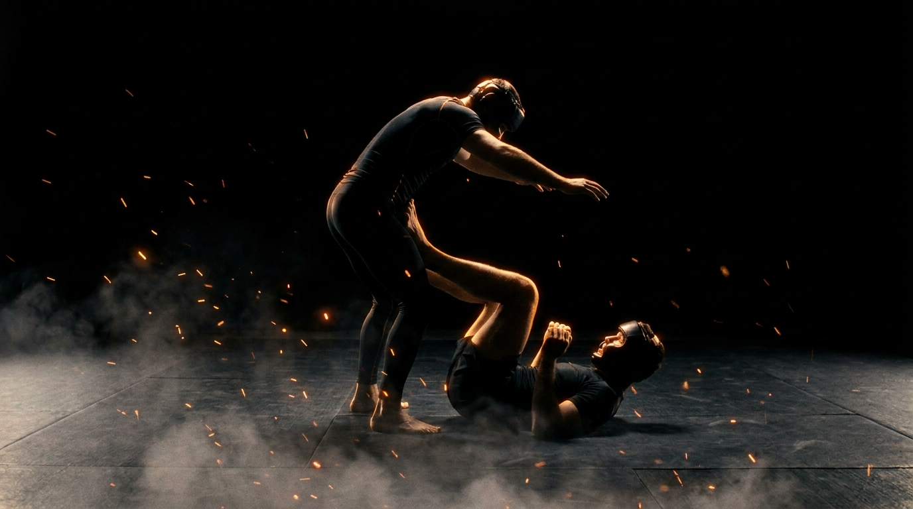

  
  
Ground · GrapplingOpen Guard Pass

!!! warning "Provisional (WIP): built from the ground-wave spec, pending coach review"

    Sourced from the Slime Mold Grappling Club catalog (Greg Souders / Standard Jiu-Jitsu; shin-surf leg ride after Craig Jones), re-expressed with our threshold rules. Passed the build rubric on paper; awaits validation against a live grappling class. Details may change.

GroundGrapplingOffensiveIntermediatePassing

Clear the feet, beat the knee line, get chest-to-chest.

  
Start<b>Top standing or kneeling at the bottom's feet; bottom on the back, knees retracted, framing inside the legs.</b>

  
→

  
The Goal<b>Top clears the feet and passes the knee line; bottom off-balances and recovers.</b>

  
→

  
Finish<b>Chest-to-chest past the knee line, held 3s → top · Top dumped to hands or seat → bottom · Out of bounds → loss.</b>

  
The guard is two lines,  the feet and the knees.

  
Beat them in order. <b>A pass that skips a line gets pulled back through it.</b>

What to Read

<b>Attune to</b> the <i>contact of the bottom's feet and shins on your legs and hips</i>. Every connection the bottom makes is a steering wheel; every connection broken is a lane opening. The pass lives where their feet are not, when both feet chase one side, the other side <i>is</i> the pass.

The Starting Position

  
PlayersTwo, one top (passer), one bottom (open guard).

  
PositionTop standing or kneeling at the feet; bottom supine, knees retracted, feet and frames inside.

  
BoundaryA marked perimeter, both stay inside.

  
RolesTop breaks connections and passes; bottom steers, off-balances, and recovers.

  
Start &amp; resetBegin at the feet; reset on a pass, a dump, or the round cap.

The Matchup

  

    
🥋

    
Top (Passer)

    
Trying to clear the feet, beat the knee line, and land chest-to-chest past the legs.

    Strip a connection, then move before the bottom replaces it. Pass on the side the feet abandoned. Heavy hips, low hands: posts get punished.
  

  
VS

  

    
🤸

    
Bottom (Guard)

    
Trying to keep feet and frames connected, off-balance the top to hands or seat, and recover line by line.

    Feet on hips and biceps steer the top. When their weight commits forward, lift and turn it. Retreat is graded: lose the foot line, rebuild at the knee line, never give both at once.
  

The Rules

  🦶 Lines fall in orderThe pass works feet line first, then knee line, then chest. Jumping the lines into a scramble doesn't count, the held finish does. Order is the pedagogy.
  🎯 Pass proven by the holdA pass counts when the top is chest-to-chest past the knee line, held 3 seconds. The hold is the observable proof, not a moment of daylight.
  ⚖️ Bottom wins by the dumpOff-balancing the top to hands or seat is the bottom's win, fully observable, no judgment call. Sweep mechanics without needing to come up.
  ⏱️ Round cap, no stallingRun a set round cap (start at 60 seconds). If neither side wins by the cap, reset and switch roles. A clock, never "as long as possible".
  🚫 No striking until the top levelLevels 1 to 4 are grappling only, so both sides read connections without defending strikes. Strikes enter at the full-expression level.
  🎚️ GnP dial-up, by permissionOnce strikes are on, the coach explicitly grants a meaner dial on ground-and-pound: mid-grapple, strength is already compromised, so firmer strikes stay safe. Striking is the cost that punishes lazy frames and dead feet. Ground games train smashing on the ground, not grappling for its own sake.
  ⬛ Stay inside the perimeterPlay happens inside a marked perimeter, any shape. If a player rolls fully out of it, that player loses the round, training mat-edge awareness.

How to Win

  
Win Top reaches chest-to-chest past the knee line, held 3s → top wins.Both lines beaten and the connection held. The 3-second hold separates a pass from a fly-by.

  
Switch Bottom dumps the top to hands or seat, or recovers a closed loop → bottom wins.The top touching hands or seat to the mat is the observable off-balance win. Recovering closed guard around a passer who over-committed counts the same.

  
Reset Round cap expires with the guard alive → reset, switch roles.Neither the pass nor the dump landed before the clock. Switch roles so both sides get the passing problem.

  
Loss Roll fully out of the perimeter → that player loses.Crossing the marked perimeter loses the round instantly, regardless of position, training the mat-edge awareness a fighter needs.

The Levels

  
1<b>Clear the feet</b>Win the first line only.The round is only about the feet: top works to clear them off hips and biceps, bottom works to keep them connected. Whoever owns the foot line at the bell owns the round. The steering battle, isolated.

  
2<b>Beat the knee line</b>Inside or outside.Feet cleared, the top now passes the knees, inside lane or around the outside. Bottom retreats line by line and rebuilds. The decision of which lane comes from where the bottom's knees point.

  
3<b>Shin surf</b>Ride the legs down.Top adds the leg ride: shin across the bottom's thigh, weight settling, surfing the legs flat before advancing. Teaches passing as pressure over time, not a sprint. (After Craig Jones.)

  
4<b>To the chest</b>The full pass, held.The complete task, grappling only: feet, knees, chest-to-chest held 3 seconds, against a bottom winning by the dump. Both reads at full speed.

  
5<b>Full expression</b>Continuous, strikes on.Light strikes on. The bottom's feet now also manage strike range, and the top pays for floating hands. Pass under fire.

Recall Check

  
Test yourself before moving on. Answer out loud, then reveal what good looks like.

  

    
Q What are the two lines, and why does order matter?

    
<b>The feet line, then the knee line.</b> A pass that skips a line gets pulled back through it, the bottom's abandoned connections re-attach behind you.

  

  

    
Q Where does the pass lane open?

    
<b>Where the feet are not.</b> When both of the bottom's feet chase one side, the opposite side is the pass. Connections broken are lanes opened.

  

  

    
Q What is the bottom's observable win?

    
<b>Dumping the top to hands or seat.</b> The sweep mechanic without needing to follow up, the moment the top's weight commits past their base, lift and turn it.

  

  

    
Q What does the shin surf teach that a speed pass doesn't?

    
<b>Passing as pressure over time.</b> The leg ride settles weight through the bottom's thighs until the recovery dies, instead of racing the recovery and losing.

  

Go Deeper

??? note "Task focus &amp; coaching cues"

    
Each role's job

    

      

🥋

Top (Passer)

Strip connections, pass on the abandoned side, beat the lines in order, settle chest-to-chest and hold.

      

🤸

Bottom (Guard)

Keep feet and frames attached, steer the top's weight, dump the over-commit, retreat one line at a time.

    

    
Coaching cues

    

      

🦶

Whose feet won?

Ask both: "Where were the bottom's feet when the pass happened?" Directs attention to the connection battle that decides everything upstream.

      

⚖️

Felt the commit?

Ask the bottom: "When did their weight pass their base?" The dump window is felt through the frames, not seen.

    

??? abstract "Constraints-Led analysis"

    
Constraints → Affordances

    

      
One line per early level→Isolates the steering battle, then the lane decision

      
Pass proven by a 3s hold→Rewards pressure over scramble-luck

      
Dump-to-hands/seat win for the bottom→Observable sweep mechanics, keeps the top's base honest

      
Round cap→Urgency both ways, no guard-camping

      
Live, resisting guard→Keeps the connection-reading perception intact

    

    
Implements <b>Task Simplification</b> (Renshaw et al., 2019): the line structure (feet → knees → chest) decomposes passing into perceptual stages without ever removing the live opponent, so each stage's read stays attached to real consequences.

    
What the top reads

    

      

✋

Haptic

Foot and shin contact on legs and hips → which connections are live, which side was abandoned.

      

🧭

Proprioceptive

Own weight over the base → whether the next step is a pass or a dump waiting to happen.

      

👁️

Visual

The bottom's knee direction → inside or outside lane.

    

    
What we measure (order parameter)

    
Whether the top <b>breaks connections faster than the bottom rebuilds them</b>. Track passes held vs. dumps conceded, and which line each pass died at. When the top consistently passes on the abandoned side instead of fighting live feet, the skill has formed.

    
Representativeness

    
<b>Models:</b> standing over an active open guard, the most common passing problem after any takedown that lands clean in MMA and grappling alike.

    
Simplified: line ladderno strikes L1-4round cap

    
Deepens the passing side of <a href="../ground-access/">Ground Access</a>; mirrors <a href="../seated-guard-retention/">Seated Guard Retention</a>.

    
Readiness to progress

    <ul class="emma-checklist">
      <li>Clears the foot line before attacking the knees</li>
      <li>Passes on the abandoned side, not into live feet</li>
      <li>Holds chest-to-chest 3s instead of racing past</li>
      <li>Keeps the base under the weight, survives the dump attempts</li>
    </ul>

    
Warning signs

    

      Dives past both lines into a scramble
      Hands post on the mat inside the guard
      Fights the same connection over and over
      Bottom holds instead of steering, feet go dead
    

??? note "Safety &amp; related games"

    

      🤝 Controlled grappling
      🦵 No reaping or heel exposure in the leg ride
      🔁 Reset if the position stalls completely
    

    
Where it sits

    

      
Prerequisite→<a href="../ground-access/">Ground Access</a>

      
Follow-on→<a href="../half-guard-pass/">Half-Guard Pass</a>

      
Mirror→<a href="../seated-guard-retention/">Seated Guard Retention</a>

      
Related→<a href="../../concepts/decision-states/">Decision States</a>

    

