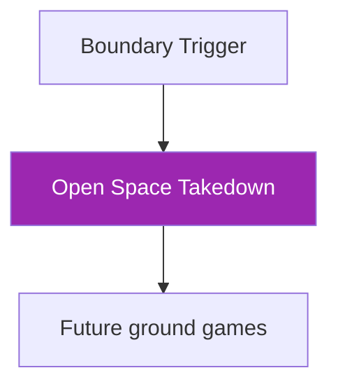

# Open Space Control → Takedown

!!! info "Game Identity"
    - **Problem:** Creating takedown opportunities through clinch control in open space
    - **Environment:** Open Space
    - **Stage:** Stabilize → Exploit

This game teaches **takedowns from connected position without wall assistance**. The defender has more escape routes, and DNS threats are at their most dangerous.

---

## Goal

This is an **asymmetric game** focused on open space wrestling.

| Role | Objective |
|------|-----------|
| **Attacker** | Compromise defender's base and bring them to ground with control |
| **Defender** | Maintain balance, scramble, disengage, or exploit poor entries |

The objective is **controlled takedown**, not merely achieving ground position.

---

## Entry Condition

- Start from clinched position (50/50, single leg, body lock, or similar)
- Hands already connected — no shooting from distance
- Open space environment (no wall involvement)
- Reset if clinch breaks cleanly or defender fully disengages

---

## Invariants

1. Hands already connected — this is not a shot entry game
2. No immediate dumping — base must be compromised before descent
3. DNS allowed defensively — primary defensive weapon

---

## Key Logic: Control Before Gravity

!!! danger "Fundamental Principle"
    **Base must be compromised before descent.**

**Signs of proper setup:**

- [x] Defender's weight is displaced
- [x] Defender's hips are controlled or off-line
- [x] Defender cannot easily step out
- [x] Attacker has balance and posture

**Signs of forcing:**

- [ ] Attacker uses strength over technique
- [ ] Defender still has stable base
- [ ] Attacker's head drops into danger
- [ ] Transition becomes a scramble rather than control

### DNS as Primary Defensive Weapon

!!! warning "Highest DNS Risk in the System"
    In open space, Defensive Neck Submissions are maximally dangerous:

    - No wall to brace against
    - Attacker must manage head position alone
    - Over-commitment creates guillotine opportunities
    - Front headlock can sprawl and snap

**Defenders should actively hunt for DNS opportunities** when attacker's posture breaks.

**Attackers must respect DNS constantly** — this is not optional.

### Scramble Dynamics

Open space scrambles favor the athlete with better:

- Hip mobility
- Base recovery
- Awareness of position

Unlike wall scrambles, there is no structural assistance. Pure body mechanics determine outcomes.

---

## Win Conditions

| Role | Win Conditions |
|------|----------------|
| **Attacker** | Controlled takedown with hips and shoulders controlled on ground |
| **Defender** | Scramble (return to standing), disengage (break clinch), reversal, or DNS (submission or positional advantage) |

!!! note "DNS as Win Condition"
    DNS being a win condition reflects its importance in this context.

---

## Levels

=== "Level 1 — Base Break"
    - Focus on compromising defender's balance from clinch
    - No strikes
    - Success = clear weight displacement and controlled descent initiation

=== "Level 2 — Deny Scramble"
    - Defender actively scrambles during descent
    - Attacker must follow and establish control
    - Success = ground control despite resistance

=== "Level 3 — Follow-Through Control"
    - After takedown, attacker must establish stable control
    - Defender continues resistance on ground
    - Success = sustained hip/shoulder control (3+ seconds)
    - TKO pin threat becomes available

---

## Advanced Expressions (Coach Context)

**For attackers:**

- Setup becomes subtle — small weight shifts create opportunities
- Head position becomes automatic — DNS danger is always respected
- Takedown and control merge — no gap between descent and establishment
- Variety increases — multiple takedown options from same clinch

**For defenders:**

- Base becomes active, not static — constantly adjusting
- DNS threats become tactical — creating dilemmas, not just reactions
- Scramble timing becomes precise — act at the moment of transition
- Counter-wrestling emerges — reversals from takedown attempts

---

## Safety

!!! danger "Critical Safety Note"
    **DNS submissions should be recognized and stopped before completion.** The threat is the training tool, not the finish.

- **Contact limits:** Light strikes; controlled takedowns only
- **Stop conditions:** Any slam, uncontrolled descent, or neck crank
- **Coach intervention:** Reset if DNS becomes actual submission threat or if takedown attempts become reckless

---

## System Position

This is the **open space wrestling game**. It parallels the wall pathway but without environmental assistance.

---

!!! abstract "System Evolution Notice"
    Takedown criteria may evolve with competition insight.
