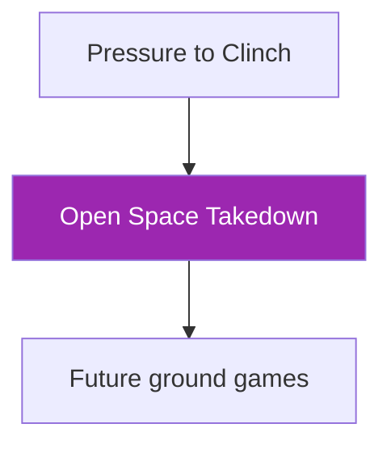

# Open Space Control → Takedown

!!! info "Game Identity"
    - **Problem:** Creating takedown opportunities through clinch control in open space
    - **Environment:** Open Space
    - **Stage:** Stabilize → Exploit

This game teaches **takedowns from connected position without wall assistance**. The defender has more escape routes, and DNS threats are at their most dangerous.

---

## Goal

This is an **asymmetric game** focused on open space wrestling.

| Role | Objective |
|------|-----------|
| **Attacker** | Compromise defender's base and bring them to ground with control |
| **Defender** | Maintain balance, scramble, disengage, or exploit poor entries |

The objective is **controlled takedown**, not merely achieving ground position.

---

## Entry Condition

- Start from clinched position (50/50, single leg, body lock, or similar)
- Hands already connected — no shooting from distance
- Open space environment (no wall involvement)
- Reset if clinch breaks cleanly or defender fully disengages

---

## Invariants

1. Hands already connected — this is not a shot entry game
2. No immediate dumping — base must be compromised before descent
3. DNS allowed defensively — primary defensive weapon

---

## Key Logic: Control Before Gravity

!!! danger "Fundamental Principle"
    **Base must be compromised before descent.**

**Signs of proper setup:**

- [x] Defender's weight is displaced
- [x] Defender's hips are controlled or off-line
- [x] Defender cannot easily step out
- [x] Attacker has balance and posture

**Signs of forcing:**

- [ ] Attacker uses strength over technique
- [ ] Defender still has stable base
- [ ] Attacker's head drops into danger
- [ ] Transition becomes a scramble rather than control

### DNS as Primary Defensive Weapon

!!! warning "Highest DNS Risk in the System"
    In open space, Defensive Neck Submissions are maximally dangerous:

    - No wall to brace against
    - Attacker must manage head position alone
    - Over-commitment creates guillotine opportunities
    - Front headlock can sprawl and snap

**Defenders should actively hunt for DNS opportunities** when attacker's posture breaks.

**Attackers must respect DNS constantly** — this is not optional.

### Scramble Dynamics

Open space scrambles favor the athlete with better:

- Hip mobility
- Base recovery
- Awareness of position

Unlike wall scrambles, there is no structural assistance. Pure body mechanics determine outcomes.

---

## Win Conditions

| Role | Win Conditions |
|------|----------------|
| **Attacker** | Controlled takedown with hips and shoulders controlled on ground |
| **Defender** | Scramble (return to standing), disengage (break clinch), reversal, or DNS (submission or positional advantage) |

!!! note "DNS as Win Condition"
    DNS being a win condition reflects its importance in this context.

---

## Levels

=== "Level 1 — Base Break"
    - Focus on compromising defender's balance from clinch
    - No strikes
    - Success = clear weight displacement and controlled descent initiation

=== "Level 2 — Deny Scramble"
    - Defender actively scrambles during descent
    - Attacker must follow and establish control
    - Success = ground control despite resistance

=== "Level 3 — Follow-Through Control"
    - After takedown, attacker must establish stable control
    - Defender continues resistance on ground
    - Success = sustained hip/shoulder control (3+ seconds)
    - TKO pin threat becomes available

=== "Level 4 — Full MMA Expression"
    - Light strikes permitted during clinch and ground phases
    - Attacker can use strikes to set up takedowns
    - Defender can use strikes to create scramble opportunities
    - Focus: Takedowns and control under realistic striking threat
    - See: [Full MMA Expression](../concepts/full-mma-expression.md)

---

## Constraints Analysis

*How this game applies the [Constraints-Led Approach](../principles/cla/index.md)*

| Constraint Type | Constraint | Affordance Created |
|-----------------|------------|-------------------|
| **Task** | Start from clinch (hands already connected) | Isolates takedown from entry |
| **Task** | Base must be compromised before descent | Prevents forcing/muscling takedowns |
| **Task** | DNS allowed as primary defensive weapon | Punishes poor head position |
| **Task** | Controlled takedown required (not just ground position) | Develops follow-through control |
| **Individual** | Prerequisite: Pressure to Clinch | Understands clinch dynamics |
| **Environmental** | Open space (no wall assistance) | Pure body mechanics, maximum DNS risk |

!!! info "Theoretical Foundation"
    This game develops **takedown affordance perception** from connected position. The constraint requiring base compromise before descent prevents strength-based solutions and develops perceptual skill—reading weight distribution, hip position, and balance. The DNS constraint creates a "respectful attacker" who maintains head position, developing **safe aggression** (Renshaw et al., 2019).

---

## Information Structure

*What athletes must perceive to succeed (perception-action coupling)*

### Attacker Perceives

| Information Source | What to Read | Action It Supports |
|--------------------|--------------|-------------------|
| **Haptic** | Defender's weight distribution | Takedown direction |
| **Haptic** | Defender's grip tension and position | Control quality |
| **Visual** | Defender's hip position and angle | Takedown availability |
| **Visual** | Defender's head and neck position | DNS risk (avoid) |
| **Proprioceptive** | Own balance and posture | Safe execution position |

### Defender Perceives

| Information Source | What to Read | Action It Supports |
|--------------------|--------------|-------------------|
| **Haptic** | Attacker's weight shift | Scramble direction |
| **Haptic** | Attacker's grip changes | Takedown type coming |
| **Visual** | Attacker's head position | DNS opportunity |
| **Visual** | Attacker's posture break | Counter moment |
| **Proprioceptive** | Own balance and base | Recovery options |

!!! tip "Coaching Cue"
    Ask attackers: "Was their base compromised before you went?" This develops the key perception—recognizing when takedown is available vs. when it must be forced. Ask defenders: "Did you see the DNS opportunity?" to develop counter-offense awareness.

---

## Representativeness

*How this game models real MMA situations*

### Real MMA Situation

Completing takedowns from clinch in open space—the highest-risk wrestling environment due to DNS threats and lack of wall assistance.

### How This Game Represents It

| Element | Real MMA | This Game | Fidelity |
|---------|----------|-----------|----------|
| **Starting position** | Clinch in open space | Same | High |
| **DNS threat** | Maximum (no wall to brace) | Same | High |
| **Takedown execution** | Must control to ground | Same | High |
| **Scramble dynamics** | Pure body mechanics | Same | High |
| **Striking context** | Always present | Added at Level 4 | Progressive |

### Simplifications & Justification

| Simplification | Why Acceptable |
|----------------|----------------|
| Start from clinch (not entry) | Isolates takedown completion; entry is different game |
| No strikes at Level 1-3 | Focuses on wrestling; strikes added at Level 4 |
| DNS as recognition (not finish) | Safety; threat is training tool |

!!! note "Transfer Expectation"
    Open space takedown mechanics transfer directly to MMA. The perceptual skill—reading when base is compromised—is identical in competition. DNS awareness becomes automatic.

---

## Variability Guidelines

*Creating "repetition without repetition" (Bernstein, 1967)*

### Within-Level Variability

| Vary This | How | Maintains |
|-----------|-----|-----------|
| **Clinch type** | 50/50, single leg, body lock, collar tie | Multiple takedown solutions |
| **Defender resistance** | Passive, active scrambling | Completion skill development |
| **Defender size** | Larger, smaller, equal | Adaptability |
| **Intensity** | Drilling pace, live pace | Pressure calibration |
| **DNS threat level** | Low awareness, high awareness | Head position discipline |

### What NOT to Vary

| Keep Constant | Why |
|---------------|-----|
| Start from clinch | Core constraint isolating takedown |
| Base compromise before descent | Key principle of safe takedowns |
| Controlled landings | Safety |

### Progressing Through Levels

| Signal to Progress | Meaning |
|--------------------|---------|
| Base compromised before descent consistently | Core principle understood |
| Head position maintained | DNS awareness developed |
| Scrambles controlled | Ready for ground follow-through |

---

## Readiness Indicators

*When is the athlete ready to advance?*

### Ready for Next Level When

- [ ] Takedowns emerge from base compromise (not forcing)
- [ ] Head position is maintained (DNS-aware)
- [ ] Scrambles end in control (not chaos)
- [ ] Can articulate: "I felt their weight shift so I..."
- [ ] Multiple takedown types available

### Ready to Exit Game When

- [ ] Level 3+ competence (sustained control after takedown)
- [ ] Takedown timing is instinctive
- [ ] DNS threats are automatically avoided/defended
- [ ] Takedowns appear in sparring with appropriate timing

### Warning Signs (Not Ready to Progress)

| Sign | Meaning | Response |
|------|---------|----------|
| Forces takedowns through strength | Not reading base compromise | Slow down, emphasize perception |
| Gets guillotined frequently | Head position neglected | Reinforce DNS awareness, stay at current level |
| Loses position in scramble | Follow-through lacking | Focus on Level 2 scramble denial |
| Only one takedown works | Limited solution set | Vary clinch types, force different takedowns |

---

## Advanced Expressions (Coach Context)

**For attackers:**

- Setup becomes subtle — small weight shifts create opportunities
- Head position becomes automatic — DNS danger is always respected
- Takedown and control merge — no gap between descent and establishment
- Variety increases — multiple takedown options from same clinch

**For defenders:**

- Base becomes active, not static — constantly adjusting
- DNS threats become tactical — creating dilemmas, not just reactions
- Scramble timing becomes precise — act at the moment of transition
- Counter-wrestling emerges — reversals from takedown attempts

---

## Safety

!!! danger "Critical Safety Note"
    **DNS submissions should be recognized and stopped before completion.** The threat is the training tool, not the finish.

- **Contact limits:** Light strikes; controlled takedowns only
- **Stop conditions:** Any slam, uncontrolled descent, or neck crank
- **Coach intervention:** Reset if DNS becomes actual submission threat or if takedown attempts become reckless

---

## System Position

This is the **open space wrestling game**. It parallels the wall pathway but without environmental assistance.

---

!!! abstract "System Evolution Notice"
    Takedown criteria may evolve with competition insight.
