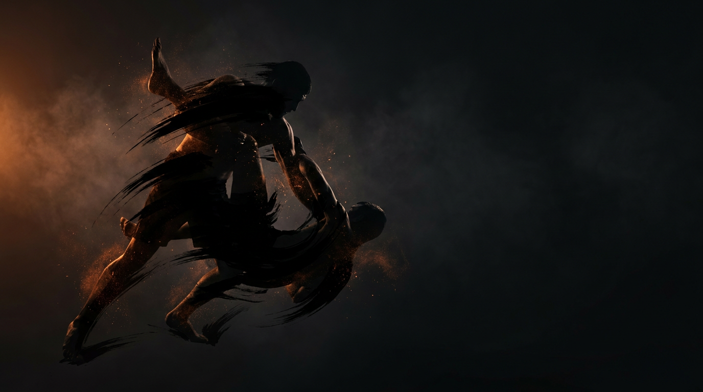

  
  
Open Space · WrestlingOpen Space Control → Takedown

Open SpaceWrestlingCombinedIntermediateClinch → Takedown

Takedowns from a connected position with no wall, more escape routes, and DNS threats at their most dangerous in the system.

  
Start<b>Two fighters clinched in open space, hands already connected, no wall.</b>

  
→

  
The Goal<b>Attacker compromises the base and finishes; defender scrambles, reverses, or hits a DNS.</b>

  
→

  
Finish<b>Controlled takedown → switch · Scramble up, disengage, reverse, or DNS → reset.</b>

  
No wall to brace,  the neck is always live.

  
The base must be compromised before descent; force it and you over-commit. <b>In open space, DNS threats are at their most dangerous in the system.</b>

What to Read

<b>Attune to</b> the <i>defender's preferred distance and base</i> within the clinch, near and off-balance affords your finish, recovered base affords their escape. Read their weight displacement and hip position by feel, plus the attacker's head/neck position (DNS risk), <b>not</b> the eyes. That information specifies <i>whether the base is compromised before descent</i> and <i>whether the open space is still closing</i>.

The Starting Position

  
PlayersTwo, already clinched.

  
RangeClinch range, hands connected, no shooting from distance.

  
BoundaryA marked perimeter in open space, no wall.

  
RolesOne attacker, one defender.

  
Start &amp; resetBegin connected; reset if the clinch breaks cleanly or the defender disengages.

The Matchup

  

    
🤼

    
Attacker

    
Trying to compromise the defender's base and bring them to ground with hip and shoulder control, no immediate dumping.

    Base must be compromised before descent, displace weight, control the hips, take the line out. Keep your own balance and head position; over-commitment invites a guillotine.
  

  
VS

  

    
🐍

    
Defender

    
Trying to maintain balance, then scramble, disengage, reverse, or exploit poor entries with a DNS.

    Keep an active base. When the attacker's posture breaks, actively hunt the DNS, front headlock, guillotine. In open space there's no wall to brace, so DNS threats are at their most dangerous.
  

The Rules

  🤝 Hands already connectedPlay starts from the clinch, this is not a shot-entry game. The takedown is isolated from the entry, which is a different game.
  ⚖️ No immediate dumpingThe base must be compromised before the descent, weight displaced, hips controlled, no easy step-out. Forcing it with strength is not the solution.
  🐍 DNS allowed defensivelyDefensive neck submissions are the defender's primary weapon and a win condition. They punish poor head position and over-commitment.
  🎯 Controlled takedown requiredThe attacker must control to the ground, hips and shoulders controlled, not merely reach a ground position. Develops follow-through control.
  ⬛ Open space, no wallInside a marked perimeter with no wall to brace against. Pure body mechanics determine scrambles, and DNS risk is maximal.

How to Win

  
Switch Controlled takedown → switch roles.When the attacker lands a controlled takedown with hips and shoulders controlled on the ground, the players switch roles. The space closed cleanly: base compromised, descent controlled, top control established. The attacker earns the defending role.

  
Reset Scramble up, disengage, reverse, or DNS → reset.When the defender scrambles to standing, disengages, reverses, or hits a DNS, the position re-opens, reset. The defender re-opened the space, recovered base, broke the clinch, turned the position, or caught the neck. Begin again from the clinch.

  
Diagnostic Was the base compromised, or was the takedown forced?Watch whether the base was truly compromised before the descent, or whether the takedown was forced through strength. DNS is a win condition here, reflecting its importance. Beyond the outcome, the coach reads base-compromise timing and head-position discipline.

The Levels

  
1<b>Base break</b>Compromise balance; no strikes.Compromise the defender's balance from the clinch, no strikes. Success = clear weight displacement and controlled descent initiation.

  
2<b>Deny scramble</b>Follow the resistance.The defender actively scrambles during descent; the attacker must follow and establish control. Success = ground control despite resistance.

  
3<b>Follow-through control</b>Sustain 3+ seconds.After the takedown, establish stable control while the defender resists on the ground. Success = sustained hip/shoulder control (3+ seconds); TKO pin threat available.

  
4<b>Full MMA expression</b>Light strikes permitted.Light strikes during clinch and ground phases; the attacker can use strikes to set up takedowns, the defender to create scrambles. Control under realistic striking threat.

Recall Check

  
Test yourself before moving on. Answer out loud, then reveal what good looks like.

  

    
Q What must be true before you descend, and what are you reading to know it?

    
The defender's <b>base must be compromised before descent</b>. Read their <b>weight displacement and hip position by feel</b>, near and off-balance affords your finish, recovered base affords their escape. Not the eyes.

  

  

    
Q Why are DNS threats at their most dangerous in this game?

    
There is <b>no wall to brace against</b>, so the neck is always live. Over-commitment or poor head position lets the defender hunt a <b>front headlock or guillotine</b>, which is a win condition here.

  

  

    
Q What separates a clean takedown from a forced one?

    
A clean finish flows from a <b>compromised base</b>: weight displaced, hips controlled, descent controlled to <b>top control</b>. A forced takedown is muscled through strength, and it over-commits and invites the guillotine.

  

  

    
Q As the defender, when do you hunt the DNS?

    
The moment the <b>attacker's posture breaks</b>: actively go for the front headlock or guillotine off poor head position and over-commitment, rather than only defending the base.

  

Go Deeper

??? note "Task focus &amp; coaching cues"

    
Each role's job

    

      

🤼

Attacker

Compromise base before descent; control hips and shoulders to the ground; keep head position to avoid the DNS.

      

🐍

Defender

Keep an active base; scramble, disengage, or reverse; hunt the DNS the moment the attacker's posture breaks.

    

    
Coaching cues

    

      

⚖️

Was the base gone?

Ask attackers: "Was their base compromised before you went?" This develops the key perception, takedown available vs. forced.

      

🐍

See the neck?

Ask defenders: "Did you see the DNS opportunity?" to develop counter-offense awareness from broken posture.

    

??? abstract "Constraints-Led analysis"

    
Constraints → Affordances

    

      
Start from clinch (hands connected)→Isolates the takedown from the entry

      
Base compromised before descent→Prevents forcing/muscling takedowns

      
DNS allowed as primary weapon→Punishes poor head position

      
Controlled takedown required→Develops follow-through control

      
Open space, no wall→Pure body mechanics, maximum DNS risk

    

    
Develops <b>takedown affordance perception</b> from connected position, base-compromise reading prevents strength-based solutions, and the DNS constraint builds a "respectful attacker" with safe aggression (Renshaw et al., 2019).

    
What the players read

    

      

✋

Haptic

Weight distribution, grip tension, weight shift → takedown direction and control quality; scramble direction.

      

👁️

Visual

Hip position and angle; head/neck position → takedown availability and DNS risk or opportunity.

      

🧭

Proprioceptive

Own balance, posture, and base → safe execution position and recovery options.

    

    
What we measure (order parameter)

    
Whether the <b>space closes onto a controlled finish over time</b>, is the defender's base eroding toward the ground, or recovering and re-opening into a scramble? Track base-compromise-before-descent, head-position discipline (DNS avoidance), and whether scrambles end in control. When base compromise reliably precedes the descent, the skill has formed.

    
Representativeness

    
<b>Models:</b> completing takedowns from clinch in open space, the highest-risk wrestling environment due to DNS threats and no wall to brace.

    
Start from clinchno strikes L1–3DNS recognized, not finished

    
The open-space wrestling game, parallels the wall pathway without environmental assistance. Built on <a href="../pressure-to-clinch/">Pressure to Clinch</a>.

    
Readiness to progress

    <ul class="emma-checklist">
      <li>Takedowns emerge from base compromise, not forcing</li>
      <li>Head position is maintained, DNS-aware</li>
      <li>Scrambles end in control, not chaos</li>
      <li>Multiple takedown types available</li>
      <li>Can articulate: "I felt their weight shift, so I…"</li>
    </ul>

    
Warning signs

    

      Forces takedowns through strength
      Gets guillotined frequently
      Loses position in scrambles
      Only one takedown works
    

??? note "Safety &amp; related games"

    

      🤝 Light strikes; controlled takedowns only
      🛑 DNS recognized and stopped before completion, the threat is the tool, not the finish
      🔁 Reset on any slam, uncontrolled descent, or neck crank
    

    
Where it sits

    

      
Prerequisite→<a href="../pressure-to-clinch/">Pressure to Clinch</a>

      
Follow-on→<a href="../ground-control/">Ground Control</a>

      
Related→<a href="../../concepts/tko-pin/">TKO Pin</a>

    

