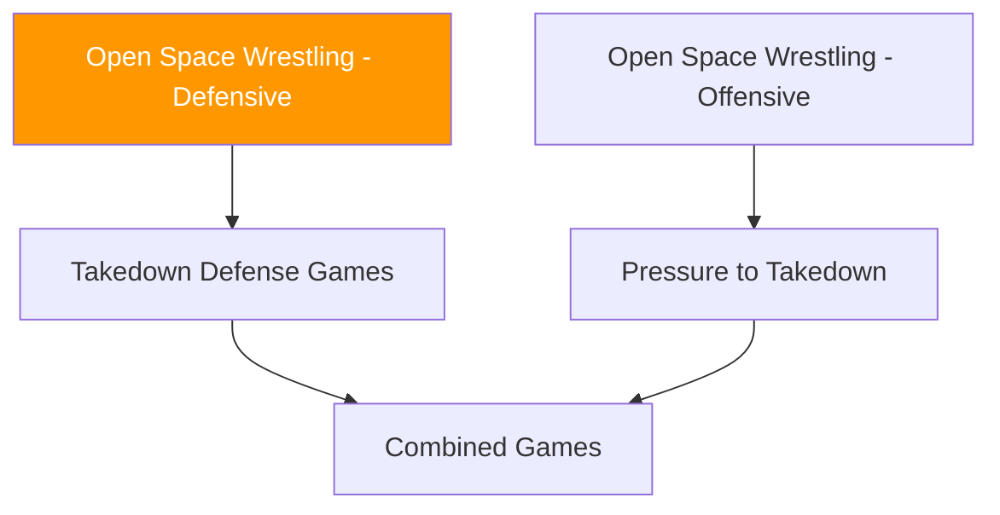

# Open Space Wrestling — Defensive Games

!!! info "Coming Soon"
    This section will contain **defensive wrestling games** in open space — games focused on takedown defense, scrambles, and disengagement.

---

## Planned Development

Defensive wrestling games will focus on:

- **Sprawl and recovery drills** (defending shot entries)
- **Takedown defense sequences** (from various clinch positions)
- **Disengagement games** (breaking clinch and resetting to striking range)
- **Counter-wrestling** (reversals and back-takes from defensive positions)

---

## Conceptual Framework

| Threat | Defensive Solution |
|--------|-------------------|
| Shot from distance | Sprawl, crossface, snap-down |
| Clinch entry | Frames, underhook battles, pummel |
| Body lock | Hip positioning, hand fighting |
| Single leg | Whizzer, limp leg, hop-out |
| Double leg | Sprawl, front headlock |

---

## System Position

---

!!! abstract "Development Notice"
    Games in this category are under development. Check back for updates.
