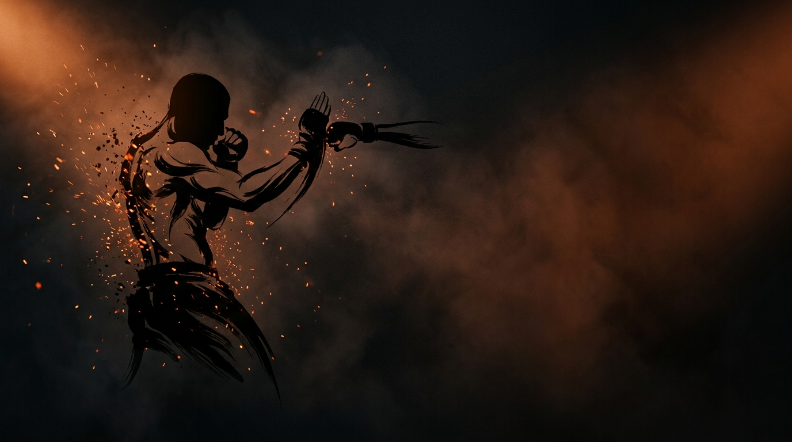

  
  
Skill Isolation · StrikingParry the Straight

Skill IsolationStrikingDefensiveBeginnerOpen Space

Deflect straight punches with the hands. The defender may *only* parry, no blocking, no head movement, no backing up, which forces the parry to develop on its own.

  
Start<b>Two fighters at close range, inside a marked perimeter.</b>

  
→

  
The Goal<b>The attacker is trying to land a clean straight; the defender is trying to deflect it off the centerline.</b>

  
→

  
Finish<b>Clean parry → switch · Land clean → reset · Leave the perimeter → loss.</b>

  
No block, no slip, no retreat,  only the parry.

  
Stripping away every other defense forces the deflection to develop on its own. <b>Stay in the pocket and solve the straight with your hands.</b>

What to Read

<b>Attune to</b> the <i>rate of expansion</i> (τ) of the incoming straight, how fast the glove grows as it travels down the centerline, read via shoulder–hip motion at <b>center mass</b>, not the opponent's eyes or their absolute distance. That information specifies <i>when</i> the punch arrives and <i>which way</i> to deflect it.

The Starting Position

  
PlayersTwo, squared off in a neutral fighting stance.

  
RangeInside punching distance.

  
BoundaryA marked perimeter. Both stay inside it.

  
RolesOne attacker, one defender, switch on a clean parry.

  
Start &amp; resetAttacker initiates; reset to neutral after each exchange.

The Matchup

  

    
🥊

    
Attacker

    
Trying to land a clean straight punch, jab or cross, to the head or belly.

    Straights only, no hooks, uppercuts, or loops. You set the problem: vary targets and rhythm, add feints at higher levels, and ramp up only as the defender succeeds.
  

  
VS

  

    
🖐️

    
Defender

    
Trying to deflect each straight off the centerline with a clean parry.

    No blocking, no head movement, no backing up, pure parrying. You don't have to parry every punch; absorb while you read the pattern, then commit when confident.
  

The Rules

  🥊 Straights onlyThe attacker throws only straight punches, jab or cross, to head or belly, no hooks, uppercuts, or looping strikes. Parrying only works on straight lines, so this keeps the defender's problem matched to the technique.
  🖐️ Parry only, no block, no dodgeThe defender may <strong>only</strong> deflect with hands or forearms. Blocking, slipping, head movement, and backing up are off-limits, so the parrying solution is forced to develop.
  🚫 No continuous backing upThe defender can't keep retreating out of range to avoid exchanges, they must stay and solve the problem in the pocket.
  ⬛ Stay inside the perimeterPlay happens inside a marked perimeter, any shape (square, circle, taped lines). If both feet leave it, you lose instantly.
  ⏱️ Reset between strikesAt early levels the attacker pauses between strikes so the defender can recalibrate. Pressure becomes continuous as the levels rise.

How to Win

  
Switch Clean parry → switch roles.A full deflection off the centerline, not a graze and not an absorbed shot. The defender earns the attacking role.

  
Reset Land clean to head or body → reset.A clean, significant straight that got through, same roles. Begin again from a neutral stance.

  
Loss Both feet leave the perimeter → loss.Crossing the marked perimeter loses the game instantly, regardless of the exchange, training the cage-edge awareness a fighter needs.

The Levels

  
1<b>Single punch, fixed tempo</b>One straight at a time, reset between.Pure timing practice, one straight punch, fully reset between reps, no feints. Build the parry with zero time pressure.

  
2<b>Variable tempo</b>Single punches, no fixed reset.The attacker varies timing with no guaranteed reset, the defender has to read rhythm and stay switched on.

  
3<b>Add feints</b>Real vs. fake.The attacker can feint before throwing. Parrying a feint is wasted movement, the defender must distinguish real from fake.

  
4<b>Two-punch combinations</b>Jab-cross, jab-body.Two-punch combos, still straights only, chain parries together while holding structure.

  
5<b>Counter after parry</b>One counter allowed.After a successful parry the defender may throw one counter, teaching the parry as a setup, not just survival.

  
6<b>Full MMA</b>Add shot / clinch threat.The attacker can now shoot or clinch too, parry while denying the grappling entry, staying aware of all threats.

Go Deeper

??? note "Task focus &amp; coaching cues"

    
Each role's job

    

      

🥊

Attacker

Land clean straights; vary targets (head vs. belly) and which hand; scale difficulty to the partner.

      

🖐️

Defender

Keep hands close to the face; tap the punch left or right to redirect it; read early and reset after each parry.

    

    
Coaching cues

    

      

👁️

See center mass

Don't track the gloves or the eyes. Center mass keeps shoulder &amp; hip motion in view, "the little X", and shows the straight before it fires. The eyes lie.

      

🎯

Read before redirect

You don't need to parry everything. Recognize the pattern first, then commit, one good parry beats ten bad ones. Timing over volume.

    

??? abstract "Constraints-Led analysis"

    
Constraints → Affordances

    

      
Straights only→Defender perceives parry-able attacks

      
Parry-only→Forces exploration of deflection solutions

      
Reset between exchanges→Time to process and recalibrate

      
Role switch on success→Rewards effective parrying

      
Close range→Parrying is viable and necessary

    

    
Implements <b>Constrain to Afford</b> (Renshaw et al., 2019), different fighters develop different parry solutions based on reach, hand speed, and reaction time.

    
What the defender reads

    

      

👁️

Visual

Shoulder rotation &amp; straight-line trajectory → which way to deflect.

      

✋

Haptic

Contact pressure on the parrying hand → confirms the deflection held.

      

🧭

Proprioceptive

Hand position relative to centerline → readiness to parry.

    

    
What we measure (order parameter)

    
Whether the defender's <b>parry lands in time with the punch</b>, track clean deflections vs. shots eaten, and whether the hands re-set to centerline between strikes. That timing relationship is the order parameter; when it stabilizes, the skill has formed.

    
Representativeness

    
<b>Models:</b> deflecting straight punches off the centerline in open-space exchanges.

    
Simplified: straights onlyparry onlyresets between

    
Isolates the solution before integration, transfers into <a href="../close-range-defense/">Close-Range Defense</a>.

    
Readiness to progress

    <ul class="emma-checklist">
      <li>Clean parries ~70%+ against varied attackers</li>
      <li>Parries both jab and cross</li>
      <li>Recovers to centerline after each parry</li>
      <li>Can describe what they read ("I saw the shoulder move")</li>
    </ul>

    
Warning signs

    

      Only parries jab OR cross
      Reports "guessing" not "seeing"
      Only effective vs one partner
    

??? note "Safety &amp; related games"

    

      🤝 Light-to-moderate contact
      🛑 Stop on loss of composure or excessive force
      🔁 Reset if the defender starts blocking or dodging
    

    
Where it sits

    

      
Prerequisite→None, this is foundational

      
Follow-on→<a href="../close-range-defense/">Close-Range Defense</a> · <a href="../touch-game/">Touch and Don't Get Touched</a>

      
Related→<a href="../../concepts/defensive-solutions/">Defensive Solutions</a>

    

