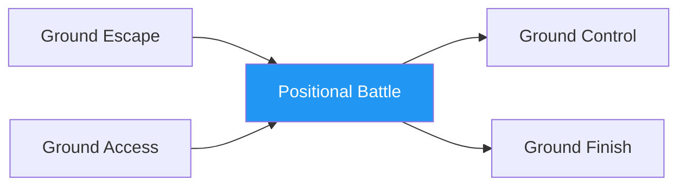

# Positional Battle

!!! info "Game Identity"
    - **Problem:** Winning positional exchanges on the ground
    - **Environment:** Ground
    - **Stage:** Combined (Offensive + Defensive Grappling)

This is a **combined ground game** where both players fight for positional advantage. Unlike asymmetric games, both players have the same goal: achieve and maintain dominant position.

---

## Goal

This is a **symmetric game** with identical objectives.

| Both Players | Objective |
|--------------|-----------|
| **Goal** | Achieve and maintain dominant position |

Dominant position hierarchy: Back > Mount > Side Control > Top Half > Guard > Bottom

---

## Entry Condition

- Start from neutral ground position (both in guard, or scramble position)
- Both players work to achieve dominant position
- Continue until one player establishes clear dominance
- Reset after position is held for set duration

---

## Invariants

1. Both players **actively pursue position** — no stalling
2. Submissions are not the focus — pure positional work
3. Position must be **established** to count (momentary doesn't count)
4. Scrambles continue until clear position emerges

---

## Task Focus

### Both Players
- Pursue positional advancement
- Deny opponent's advancement
- Capitalize on scrambles
- Consolidate when achieving position

!!! question "Key Internal Questions"
    - "What position am I fighting toward?"
    - "Can I advance or do I need to defend first?"
    - "Who's winning this scramble?"

---

## Key Logic: Positional Hierarchy

!!! note "The Core Skill"
    Ground positions have clear value:

    | Position | Control Level |
    |----------|--------------|
    | Back mount (hooks + seatbelt) | Highest |
    | Mount | Very high |
    | Back (no hooks) | High |
    | Side control | High |
    | Knee on belly | Medium-high |
    | Top half guard | Medium |
    | Closed guard (bottom) | Medium (defensive) |
    | Open guard (bottom) | Low-medium |
    | Turtle | Dangerous |
    | Under side control | Low |
    | Under mount | Very low |

    The skill: Understanding positional value and fighting toward better positions.

---

## Win Conditions

| Outcome | Condition |
|---------|-----------|
| **Win** | Establish dominant position (side control, mount, or back) for set duration |
| **Reset** | If neither establishes dominance within time limit |

Roles don't switch — both players always competing for position.

---

## Levels

=== "Level 1 — From Guard"
    - Start with one player in other's guard
    - Top passes or bottom sweeps
    - Focus: Guard vs. pass dynamic

=== "Level 2 — From Neutral"
    - Start both seated, facing each other
    - True scramble to position
    - Focus: Winning neutral exchanges

=== "Level 3 — From Scramble"
    - Start mid-scramble (e.g., after failed takedown)
    - Chaotic positional fight
    - Focus: Scramble awareness

=== "Level 4 — Full MMA Expression"
    - Strikes allowed from any position
    - Positional value affected by strike threat
    - Focus: Positional fighting under MMA pressure
    - See: [Full MMA Expression](../concepts/full-mma-expression.md)

---

## Safety

- **Contact limits:** Controlled grappling, no submissions
- **Stop conditions:** Neck cranks, slam attempts
- **Coach intervention:** Reset if both players stall

---

## System Position

- **Prerequisite games:** Ground Escape, Ground Access
- **Follow-on games:** Ground Control, Ground Finish
- **Related concepts:** Decision States

---

!!! abstract "System Evolution Notice"
    This game may be refined as positional battle patterns emerge.
