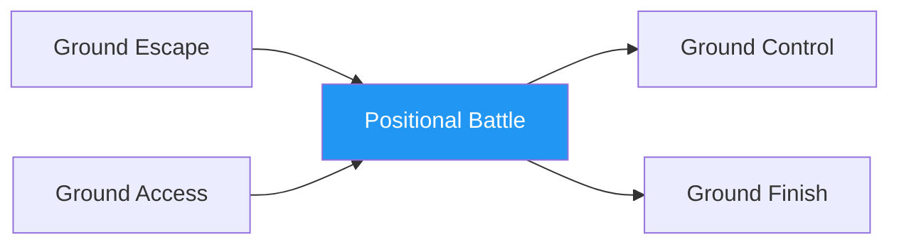

# Positional Battle

!!! info "Game Identity"
    - **Problem:** Winning positional exchanges on the ground
    - **Environment:** Ground
    - **Stage:** Combined (Offensive + Defensive Grappling)

This is a **combined ground game** where both players fight for positional advantage. Unlike asymmetric games, both players have the same goal: achieve and maintain dominant position.

---

## Goal

This is a **symmetric game** with identical objectives.

| Both Players | Objective |
|--------------|-----------|
| **Goal** | Achieve and maintain dominant position |

Dominant position hierarchy: Back > Mount > Side Control > Top Half > Guard > Bottom

---

## Entry Condition

- Start from neutral ground position (both in guard, or scramble position)
- Both players work to achieve dominant position
- Continue until one player establishes clear dominance
- Reset after position is held for set duration

---

## Invariants

1. Both players **actively pursue position** — no stalling
2. Submissions are not the focus — pure positional work
3. Position must be **established** to count (momentary doesn't count)
4. Scrambles continue until clear position emerges

---

## Task Focus

### Both Players
- Pursue positional advancement
- Deny opponent's advancement
- Capitalize on scrambles
- Consolidate when achieving position

!!! question "Key Internal Questions"
    - "What position am I fighting toward?"
    - "Can I advance or do I need to defend first?"
    - "Who's winning this scramble?"

---

## Key Logic: Positional Hierarchy

!!! note "The Core Skill"
    Ground positions have clear value:

    | Position | Control Level |
    |----------|--------------|
    | Back mount (hooks + seatbelt) | Highest |
    | Mount | Very high |
    | Back (no hooks) | High |
    | Side control | High |
    | Knee on belly | Medium-high |
    | Top half guard | Medium |
    | Closed guard (bottom) | Medium (defensive) |
    | Open guard (bottom) | Low-medium |
    | Turtle | Dangerous |
    | Under side control | Low |
    | Under mount | Very low |

    The skill: Understanding positional value and fighting toward better positions.

---

## Win Conditions

| Outcome | Condition |
|---------|-----------|
| **Win** | Establish dominant position (side control, mount, or back) for set duration |
| **Reset** | If neither establishes dominance within time limit |

Roles don't switch — both players always competing for position.

---

## Levels

=== "Level 1 — From Guard"
    - Start with one player in other's guard
    - Top passes or bottom sweeps
    - Focus: Guard vs. pass dynamic

=== "Level 2 — From Neutral"
    - Start both seated, facing each other
    - True scramble to position
    - Focus: Winning neutral exchanges

=== "Level 3 — From Scramble"
    - Start mid-scramble (e.g., after failed takedown)
    - Chaotic positional fight
    - Focus: Scramble awareness

=== "Level 4 — Full MMA Expression"
    - Strikes allowed from any position
    - Positional value affected by strike threat
    - Focus: Positional fighting under MMA pressure
    - See: [Full MMA Expression](../concepts/full-mma-expression.md)

---

## Safety

- **Contact limits:** Controlled grappling, no submissions
- **Stop conditions:** Neck cranks, slam attempts
- **Coach intervention:** Reset if both players stall

---

## Constraints Analysis

*How this game applies the [Constraints-Led Approach](../principles/cla/index.md)*

| Constraint Type | Constraint | Affordance Created |
|-----------------|------------|-------------------|
| **Task** | Symmetric goal (both pursue position) | Creates true competitive dynamic |
| **Task** | No submissions focus | Isolates positional skill |
| **Task** | Position must be established (not momentary) | Develops stable positions |
| **Task** | Progressive starting points (guard → neutral → scramble) | Scaffolded chaos |
| **Individual** | Prerequisites: Ground Escape + Ground Access | Understands both offense and defense |
| **Environmental** | Full ground environment | All positions available |

!!! info "Theoretical Foundation"
    This game develops **positional value perception**—understanding which positions are better and fighting toward them. The symmetric constraint (both players pursuing position) creates genuine competition where both athletes explore solutions simultaneously. **Scramble perception** emerges as athletes learn to read positional advantage mid-transition. This is the **dyadic system** at work—both athletes co-adapting in real-time (Renshaw et al., 2019).

---

## Information Structure

*What athletes must perceive to succeed (perception-action coupling)*

### Both Players Perceive

| Information Source | What to Read | Action It Supports |
|--------------------|--------------|-------------------|
| **Haptic** | Opponent's balance and base | Sweep/advancement opportunity |
| **Haptic** | Control point strength | Where to attack |
| **Visual** | Opponent's position hierarchy | Strategic goal |
| **Visual** | Scramble direction | Positional advantage |
| **Proprioceptive** | Own base stability | Attack vs. defend decision |
| **Proprioceptive** | Own position in hierarchy | What to pursue |

!!! tip "Coaching Cue"
    Ask athletes: "Who was winning that scramble?" This develops real-time positional awareness. Ask: "What position were you fighting toward?" This develops strategic thinking during chaos.

---

## Representativeness

*How this game models real MMA situations*

### Real MMA Situation

Scrambles and positional battles on the ground—both athletes fighting for dominant position.

### How This Game Represents It

| Element | Real MMA | This Game | Fidelity |
|---------|----------|-----------|----------|
| **Positional competition** | Core of ground fighting | Same | High |
| **Scramble dynamics** | Common in transitions | Same | High |
| **Position hierarchy** | Clear value system | Same | High |
| **Symmetric goals** | Both want top/back | Same | High |
| **Strikes** | Affect positional value | Progressive by level | Scaffolded |

### Simplifications & Justification

| Simplification | Why Acceptable |
|----------------|----------------|
| No submission focus | Isolates positional skill |
| Clear position hierarchy | Establishes value system |
| Progressive starting chaos | Develops scramble skill gradually |

!!! note "Transfer Expectation"
    Positional battle skill developed here transfers directly to MMA. The perception of positional value and scramble dynamics is identical in competition.

---

## Variability Guidelines

*Creating "repetition without repetition" (Bernstein, 1967)*

### Within-Level Variability

| Vary This | How | Maintains |
|-----------|-----|-----------|
| **Starting position** | Guard, neutral, mid-scramble | Multiple positional problems |
| **Opponent style** | Aggressive, defensive, scrambler | Adaptability |
| **Opponent size** | Larger, smaller, equal | Position calibration |
| **Time pressure** | Short rounds, long rounds | Urgency calibration |
| **Intensity** | Drilling pace, live pace | Pressure development |

### What NOT to Vary

| Keep Constant | Why |
|---------------|-----|
| Symmetric goals | Maintains competitive dynamic |
| Position establishment required | Prevents momentary positions counting |
| No submission focus | Maintains positional emphasis |

### Progressing Through Levels

| Signal to Progress | Meaning |
|--------------------|---------|
| Wins from guard position | Basic skill developing |
| Wins neutral scrambles | Scramble perception developing |
| Wins chaotic scrambles | Ready for full expression |

---

## Readiness Indicators

*When is the athlete ready to advance?*

### Ready for Next Level When

- [ ] Wins positional exchanges from current level
- [ ] Understands position hierarchy
- [ ] Recognizes scramble advantage
- [ ] Consolidates positions when achieved
- [ ] Can articulate: "I was winning because I had..."

### Ready to Exit Game When

- [ ] Level 2+ competence (wins from neutral)
- [ ] Position hierarchy is instinctive
- [ ] Scramble awareness is automatic
- [ ] Positional battle appears in sparring

### Warning Signs (Not Ready to Progress)

| Sign | Meaning | Response |
|------|---------|----------|
| Doesn't know who's winning | Position awareness lacking | Teach hierarchy explicitly |
| Can't consolidate positions | Establishment skill lacking | Focus on stabilization |
| Avoids scrambles | Scramble fear | More controlled scramble reps |
| Only one position works | Limited vocabulary | Vary starting positions |

---

## System Position

- **Prerequisite games:** Ground Escape, Ground Access
- **Follow-on games:** Ground Control, Ground Finish
- **Related concepts:** Decision States

---

!!! abstract "System Evolution Notice"
    This game may be refined as positional battle patterns emerge.
