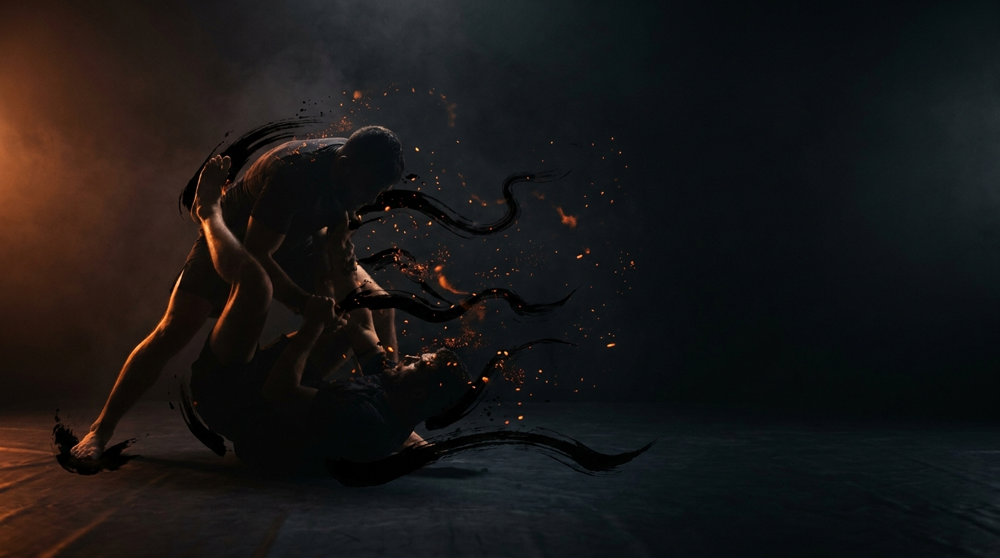

  
  
Ground · GrapplingPositional Battle

GroundGrapplingCombinedIntermediateScramble

Both players fight for the same prize: a dominant ground position.

  
Start<b>Two in a neutral ground position — guard or scramble — inside a marked perimeter.</b>

  
→

  
The Goal<b>Both achieve and hold a dominant position while denying the opponent's.</b>

  
→

  
Finish<b>Establish dominance for the duration → win · Neither dominates in time → reset · Leave the perimeter → loss.</b>

  
Momentary position doesn't count — establish it and hold it.

  
A symmetric race up the hierarchy, no submission focus. <b>Win the scramble, then consolidate.</b>

What to Read

<b>Attune to</b> the <i>felt weight distribution &amp; base through contact</i> — the opponent's balance loading and going light, your own base over or under theirs, the control points that strengthen or break — plus the opponent's <b>hip and frame motion</b> mid-scramble. That inertial information specifies the positional advantage <i>before</i> the scramble resolves, not the opponent's limbs in isolation.

The Starting Position

  
PlayersTwo, on the mat — symmetric roles.

  
PositionNeutral ground — both in guard, or a scramble, set by the level.

  
BoundaryA marked perimeter — both stay inside.

  
RolesSymmetric — roles don't switch.

  
Start &amp; resetBegin neutral; reset there after a position is held or time runs out.

The Matchup

  

    
🥋

    
Player A

    
Trying to achieve and hold a dominant position while denying the opponent's advancement.

    Pursue positional advancement, capitalize on scrambles, and consolidate when you achieve a position. Hierarchy: Back &gt; Mount &gt; Side Control &gt; Top Half &gt; Guard &gt; Bottom.
  

  
VS

  

    
🥋

    
Player B

    
Trying to achieve and hold a dominant position while denying the opponent's advancement.

    Same goal — this is a symmetric battle. Read the scramble, fight toward the better position, and deny theirs. No submission focus.
  

The Rules

  ⚔️ Both actively pursue positionBoth players actively pursue position — no stalling. The symmetric goal creates a true competitive dynamic where both explore solutions at once.
  🚫 Submissions are not the focusThis is pure positional work — submissions are not the focus. Isolating position keeps the skill clean.
  📌 Position must be establishedA position only counts when established and held — momentary doesn't count. This develops stable, consolidated positions.
  🌀 Scrambles continue until clearScrambles continue until a clear position emerges — neither player gets credit for a fleeting advantage.
  ⬛ Stay inside the perimeterPlay happens inside a marked perimeter — any shape (square, circle, taped lines). If a player rolls fully out of it, that player loses instantly — training mat-edge awareness.

How to Win

  
Win Establish a dominant position &amp; hold for the duration → win.A stabilized dominant position — side control, mount, or back — held for the set duration wins the exchange. Roles don't switch; reset and battle again.

  
Reset Neither dominates in time → reset from neutral.If the battle stalls with no clear dominant position, reset from the neutral starting position and run it again.

  
Loss Roll fully out of the perimeter → loss.Crossing the marked perimeter loses the exchange instantly, regardless of position — training the mat-edge awareness a fighter needs.

The Levels

  
1<b>From Guard</b>Start with one player in the other's guard.Begin with one player in the other's guard. Top passes or bottom sweeps — focus on the guard vs. pass dynamic.

  
2<b>From Neutral</b>Start both seated, facing each other.Begin both seated, facing each other — a true scramble to position. Focus on winning neutral exchanges.

  
3<b>From Scramble</b>Start mid-scramble (e.g., after a failed takedown).Begin mid-scramble — a chaotic positional fight. Focus on scramble awareness.

  
4<b>Full MMA Expression</b>Strikes allowed from any position.Strikes allowed from any position; positional value shifts with strike threat. Positional fighting under MMA pressure.

Go Deeper

??? note "Task focus &amp; coaching cues"

    
Each player's job

    

      

⚔️

Both Players

Pursue positional advancement; deny the opponent's advancement; capitalize on scrambles; consolidate when achieving position.

      

🪜

The hierarchy

Back &gt; Mount &gt; Side Control &gt; Top Half &gt; Guard &gt; Bottom. Knowing the value system tells you which way to fight.

    

    
Coaching cues

    

      

🏆

Who's winning?

Ask: "Who was winning that scramble?" This develops real-time positional awareness during chaos.

      

🎯

Fighting toward what?

Ask: "What position were you fighting toward?" This develops strategic thinking mid-transition.

    

??? abstract "Constraints-Led analysis"

    
Constraints → Affordances

    

      
Symmetric goal (both pursue position)→Creates a true competitive dynamic

      
No submissions focus→Isolates positional skill

      
Position must be established→Develops stable positions

      
Progressive starting points→Scaffolded chaos (guard → neutral → scramble)

      
Full ground environment→All positions available

    

    
Develops <b>positional value perception</b> — understanding which positions are better and fighting toward them (Renshaw et al., 2019). The symmetric constraint creates genuine competition; this is the <b>dyadic system</b> at work — both athletes co-adapting in real time.

    
What both players read

    

      

✋

Haptic

Opponent's balance, base, and control-point strength → sweep/advancement opportunity and where to attack.

      

👁️

Visual

Opponent's position in the hierarchy &amp; scramble direction → strategic goal and positional advantage.

      

🧭

Proprioceptive

Own base stability &amp; position in the hierarchy → attack vs. defend decision.

    

    
What we measure (order parameter)

    
Whether a player <b>stays connected to the opponent's hips and base through each scramble</b> — track positions established and held vs. lost, and whether weight re-loads to consolidate before the opponent reverses. That control-connection relationship is the order parameter; when it stabilizes, the skill has formed.

    
Representativeness

    
<b>Models:</b> scrambles and positional battles on the ground — both athletes fighting for dominant position.

    
Simplified: no submission focusclear position hierarchyprogressive starting chaos

    
Positional-value and scramble perception are identical to competition — leads into <a href="../ground-control/">Ground Control</a> and the finish path.

    
Readiness to progress

    <ul class="emma-checklist">
      <li>Wins positional exchanges from the current level</li>
      <li>Understands the position hierarchy</li>
      <li>Recognizes scramble advantage</li>
      <li>Consolidates positions when achieved</li>
    </ul>

    
Warning signs

    

      Doesn't know who's winning
      Can't consolidate positions
      Avoids scrambles
      Only one position works
    

??? note "Safety &amp; related games"

    

      🤝 Controlled grappling, no submissions
      🛑 Stop on neck cranks or slam attempts
      🔁 Reset if both players stall
    

    
Where it sits

    

      
Prerequisite→<a href="../ground-escape/">Ground Escape</a> · <a href="../ground-access/">Ground Access</a>

      
Follow-on→<a href="../ground-control/">Ground Control</a>

      
Related→<a href="../../concepts/decision-states/">Decision States</a>

    

