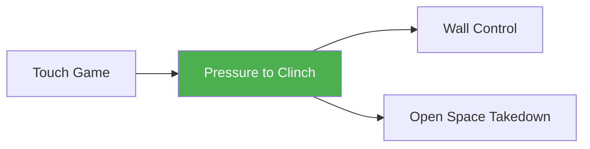

# Pressure to Clinch

!!! info "Game Identity"
    - **Problem:** Controlling space and converting pressure into clinch
    - **Environment:** Open Space with Boundary
    - **Stage:** Access → Transition

This is the **primary space-control game** in the system. It teaches athletes to manage distance through movement and pressure, with the clinch as the natural completion of successful pressure. This game develops the full sequence: pressure → boundary → clinch → wall pin.

---

## Goal

This is an **asymmetric game** with distinct roles.

| Role | Objective |
|------|-----------|
| **Outside Player (Attacker)** | Apply pressure to control space, close distance, and establish clinch |
| **Inside Player (Defender)** | Maintain access to open space, escape pressure, prevent clinch |

The objective is **winning the circle** — the ongoing battle for spatial control.

---

## Entry Condition

- Both players start in open space
- A visible or imagined circular boundary exists (training ring, tape, cones, or wall)
- Roles are assigned and switch between rounds
- Reset to neutral distance after each resolved exchange

---

## Invariants

1. No takedowns until Level 5
2. Movement is continuous — static exchanges reset
3. Clinch must be established from controlling position (attacker on outside)
4. If attacker gets reversed to wall side during clinch entry, defender wins the exchange

---

## Task Focus

### Outside Player (Attacker)

- Apply intelligent forward pressure
- Use footwork, feints, and strikes to corral opponent toward boundary
- Cut off lateral escape routes
- Recognize when clinch entry is available
- Convert pressure to clinch, clinch to wall pin

### Inside Player (Defender)

- Maintain space through movement
- Avoid being crowded or flattened against boundary
- Recognize when space is shrinking
- Escape or reverse if clinch is initiated

!!! question "Key Internal Questions"
    - "Am I controlling the center or being pushed to the edge?"
    - "Can I escape laterally, or are my routes being cut?"
    - "Is my pressure creating clinch opportunities, or am I just chasing?"

---

## Legal Actions

| Level | Strikes | Clinch | Wall Pin |
|-------|---------|--------|----------|
| Level 1 | Touch/tag only | No | No |
| Level 2+ | Light to moderate strikes | Yes | Per level |

No flurries (max 2-3 strike sequences). Strikes are tools — they create reactions and measure distance.

---

## Key Logic: Pressure → Clinch → Pin

!!! warning "Critical Progression"

    This game teaches a complete sequence, not isolated skills:

    1. **Pressure** limits escape options
    2. **Boundary contact** creates clinch opportunity
    3. **Clinch** closes the distance
    4. **Wall pin** completes space domination

### Pressure vs. Chasing

| Pressure (Correct) | Chasing (Incorrect) |
|-------------------|---------------------|
| Opponent's movement becomes predictable | Lunging forward without cutting angles |
| Escape routes visibly shrink | Reacting to movement instead of anticipating |
| Attacker maintains composure and structure | Losing balance or posture during pursuit |

### What Is a Wall Pin?

A wall pin is the **complete isolation of movement** between the opponent's hips and shoulders using your hips and shoulders. Their back is against the wall, posture is broken, and they cannot simply push off or maintain distance.

---

## Win Conditions

| Level | Attacker Wins By | Defender Wins By |
|-------|------------------|------------------|
| **Level 1** | Time-based, no winner | Time-based, no winner |
| **Level 2** | Establish clinch (controlling position) | Escape OR reverse attacker to wall side |
| **Level 3** | Establish wall pin | Escape clinch OR prevent pin |
| **Level 4** | Wall pin + maintain 3-5 seconds | Escape the pin |
| **Level 5** | Wall pin OR takedown | Escape, reverse, or counter-strike to reset |

Typical round length: 60–90 seconds.

---

## Levels

=== "Level 1 — Touch-Based, Pattern Recognition"
    - Touch/tag contact only (no striking)
    - Defender can parry/block tags
    - Time-based rounds, no winner
    - Focus: Experience pressure/escape patterns
    - Both players learn spatial dynamics before adding contact

=== "Level 2 — Striking + Clinch Entry"
    - Light strikes permitted
    - Attacker wins by establishing clinch in controlling position
    - Defender wins by escaping OR reversing attacker to wall side
    - Focus: Pressure creates clinch opportunity

=== "Level 3 — Clinch to Wall Pin"
    - Moderate strikes permitted
    - Attacker must achieve wall pin (not just clinch)
    - Defender can accept clinch but fight the pin
    - Focus: Completing the full pressure sequence

=== "Level 4 — Pin Maintenance"
    - Same as Level 3, but attacker must maintain pin for 3-5 seconds
    - Defender actively works to escape the pin
    - Focus: Controlling position, not just achieving it

=== "Level 5 — Full MMA Expression"
    - Full striking contact permitted
    - Takedowns allowed from clinch
    - Attacker wins by: wall pin OR takedown
    - Defender can counter-strike to create escape opportunities
    - Focus: Complete transition sequence under MMA reality
    - See: [Full MMA Expression](../concepts/full-mma-expression.md)

---

## Constraints Analysis

*How this game applies the [Constraints-Led Approach](../principles/cla/index.md)*

| Constraint Type | Constraint | Affordance Created |
|-----------------|------------|-------------------|
| **Task** | Visible boundary | Creates spatial awareness and urgency |
| **Task** | Asymmetric roles | Defines distinct movement solutions |
| **Task** | Clinch as win condition | Gives purpose to pressure (not just pushing) |
| **Task** | Wall pin as complete success | Teaches full sequence completion |
| **Task** | Reversal = defender win | Prevents reckless clinch entries |
| **Individual** | Skill level matching | Appropriate challenge zone |
| **Environmental** | Defined space with boundary | Spatial pressure becomes perceivable |

!!! info "Theoretical Foundation"
    This game implements **Representative Learning Design** (Renshaw et al., 2019). The full sequence (pressure → clinch → pin) represents how space control works in MMA. The levels scaffold complexity while keeping the complete perception-action coupling intact.

---

## Information Structure

*What athletes must perceive to succeed (perception-action coupling)*

### Outside Player (Attacker) Perceives

| Information Source | What to Read | Action It Supports |
|--------------------|--------------|-------------------|
| **Visual** | Defender's position relative to boundary | Pressure direction |
| **Visual** | Defender's escape routes | Which angle to cut |
| **Visual** | Defender's weight distribution | When to initiate clinch |
| **Visual** | Defender's posture during clinch | When to drive to wall pin |
| **Proprioceptive** | Own balance and positioning | Composure during pressure |

### Inside Player (Defender) Perceives

| Information Source | What to Read | Action It Supports |
|--------------------|--------------|-------------------|
| **Visual** | Available space (distance to boundary) | Urgency of escape |
| **Visual** | Attacker's cutting angles | Which routes remain open |
| **Visual** | Attacker's clinch entry timing | When to frame or reverse |
| **Proprioceptive** | Position relative to center | Spatial awareness |
| **Proprioceptive** | Balance during clinch | Reversal opportunity |

!!! tip "Coaching Cue"
    Ask attackers: "Were you cutting angles or chasing?" Ask defenders: "Did you feel space shrinking before it happened?" This develops anticipatory perception.

---

## Representativeness

*How this game models real MMA situations*

### Real MMA Situation

Cage/ring dynamics where one fighter applies pressure to trap the other against the boundary, converts to clinch, and achieves wall control.

### How This Game Represents It

| Element | Real MMA | This Game | Fidelity |
|---------|----------|-----------|----------|
| **Boundary** | Cage/ring | Training circle or wall | Full |
| **Pressure** | All tools | Scaled by level | Progressive |
| **Clinch entry** | Full options | From pressure only | Representative |
| **Wall pin** | Full control | Same definition | Full |
| **Consequence** | Damage, control | Round win | Reduced |

### Simplifications & Justification

| Simplification | Why Acceptable |
|----------------|----------------|
| Touch-only at Level 1 | Allows pattern learning without fear |
| No takedowns until Level 5 | Keeps focus on clinch completion |
| Time-limited rounds | Clear structure for practice |

!!! note "Transfer Expectation"
    Athletes who develop this full sequence transfer directly to wall work and cage wrestling. The pressure-to-clinch-to-pin pattern is foundational for MMA grappling.

---

## Variability Guidelines

*Creating "repetition without repetition" (Bernstein, 1967)*

### Within-Level Variability

| Vary This | How | Maintains |
|-----------|-----|-----------|
| **Partner** | Rotate training partners | Different pressure/escape styles |
| **Circle size** | Smaller (more pressure), larger (more space) | Urgency calibration |
| **Role emphasis** | Attacker-focused rounds, defender-focused rounds | Complete skill development |
| **Starting position** | Center start, boundary start | Situational variety |
| **Environment** | Open circle vs. actual wall | Transfer preparation |

### What NOT to Vary

| Keep Constant | Why |
|---------------|-----|
| Visible boundary | Core constraint creating spatial awareness |
| Clinch must be from controlling position | Prevents reckless entries |
| Wall pin definition | Consistent success criteria |

### Progressing Through Levels

| Signal to Progress | Meaning |
|--------------------|---------|
| Pressure creates predictable movement | Angle-cutting developing |
| Clinch entries are clean (not scrambles) | Timing developing |
| Wall pins are achieved, not fought to | Full sequence emerging |

---

## Readiness Indicators

*When is the athlete ready to advance?*

### Ready for Next Level When

- [ ] Attacker cuts angles rather than chases
- [ ] Defender anticipates pressure before space closes
- [ ] Movement is efficient and controlled
- [ ] Clinch entries are timed, not forced
- [ ] Composure maintained throughout rounds

### Ready to Exit Game (Move to Wall Control) When

- [ ] Level 4+ competence (maintains wall pin)
- [ ] Full pressure-to-pin sequence is fluid
- [ ] Can articulate spatial decisions
- [ ] Expresses desire to add wall work options
- [ ] Quality maintains across varied partners

### Warning Signs (Not Ready to Progress)

| Sign | Meaning | Response |
|------|---------|----------|
| Attacker chases instead of cutting | Pressure pattern underdeveloped | More Level 1 time, emphasize angles |
| Clinch entries get reversed | Timing or positioning off | Slow down, read defender posture |
| Can't maintain wall pin | Pin mechanics incomplete | Isolate wall pin practice |
| Defender panics near boundary | Composure lacking | Larger circle, slower tempo |

---

## Advanced Expressions (Coach Context)

As athletes develop, the game reveals deeper layers:

**For attackers:**

- Pressure becomes rhythmic rather than constant
- Feints create backward movement without real strikes
- Clinch entry flows directly from pressure recognition
- Wall pin becomes the expected outcome, not a struggle

**For defenders:**

- Movement becomes smaller and earlier
- Reversal opportunities are recognized instantly
- Defensive clinch acceptance becomes a viable strategy
- Counter-striking creates escape windows

!!! tip "Advanced Insight"
    At advanced levels, the boundary becomes less relevant — the athlete has internalized spatial awareness. The game can then transition to open sparring with positional goals.

---

## Safety

- **Contact limits:** Touch at Level 1; light to moderate strikes at higher levels
- **Stop conditions:** Loss of control, chasing collisions, excessive force in clinch
- **Coach intervention:** Reset if exchanges become static or if pressure degrades into aggression

---

## System Position

- **Prerequisite:** Touch and Don't Get Touched
- **Leads to:** Wall Control, Open Space Takedown
- **Related concepts:** Winning the Circle, Wall Pin

---

!!! abstract "System Evolution Notice"
    This game reflects the current best understanding of space control dynamics. It may be revised as new insights emerge.
