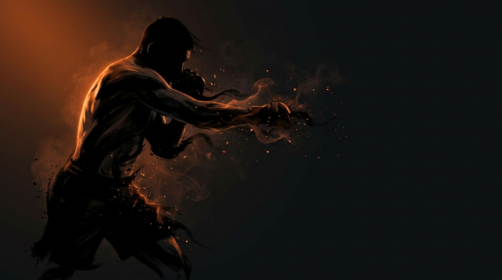

  
  
Open Space · StrikingPressure to Clinch

Open SpaceStrikingCombinedBeginnerAccess → Transition

Manage distance through movement and pressure, then convert pressure into the clinch and wall pin.

  
Start<b>Two fighters in open space at neutral distance, inside a marked perimeter.</b>

  
→

  
The Goal<b>The outside player is trying to pressure &amp; clinch; the inside player is trying to keep space &amp; escape.</b>

  
→

  
Finish<b>Clinch / wall pin → attacker scores · Escape or reverse → defender scores · Leave the perimeter → loss.</b>

  
Pressure isn't pushing — it's collapsing their space.

  
Cut angles to shrink open space, then convert pressure into clinch and clinch into the wall pin. <b>Corral, don't chase.</b>

Key Positions

  ⚖️ 50/50 clinchEach fighter has one overhook and one underhook (mirror grips, one per side), starting chest to chest — symmetric and neutral. Whoever first wins inside control or the angle gains the advantage.
  🧱 Wall pinAt least two points of pinning control — the hips and upper body held immobile and flat to the wall. If the shoulders can still rotate, it's pressure, not a pin.

What to Read

<b>Attune to</b> the <i>global optic flow of closing pressure</i> — how fast the gap is shrinking and which way space is collapsing — plus the <i>rate of closure</i> (τ) on clinch entries. <b>Near</b> distance affords the clinch and offense; <b>far</b> affords escape and defense. Read the <i>shrinking of open space</i>, not the opponent's hands or feet — that information specifies <i>when</i> the pin is on and <i>where</i> the escape lane still lives.

The Starting Position

  
PlayersTwo at neutral distance — one outside, one inside.

  
RangeStriking distance with room to move.

  
BoundaryA marked perimeter. Both stay inside it.

  
RolesOne outside (attacker), one inside (defender) — switch between rounds.

  
Start &amp; resetBoth begin at neutral distance; reset after each exchange or score.

The Matchup

  

    
🥊

    
Outside Player (Attacker)

    
Trying to apply pressure to control space, close distance, and establish the clinch.

    Corral the opponent toward the boundary, cut off lateral escapes, and convert pressure to clinch and clinch to wall pin. Cut angles — don't chase.
  

  
VS

  

    
🦶

    
Inside Player (Defender)

    
Trying to maintain access to open space, escape pressure, and prevent the clinch.

    Keep space through movement, avoid being flattened against the boundary, and escape or reverse if the clinch is initiated.
  

The Rules

  ⭕ Stay inside the perimeterPlay happens inside a marked perimeter — any shape (circle, square, taped lines, cones, or wall). The boundary creates spatial awareness and urgency; if both feet leave it, you lose instantly.
  🚫 No takedowns until Level 5Takedowns are off-limits until the final level, keeping the focus on completing the clinch and wall-pin sequence.
  🔄 Movement is continuousStatic exchanges reset — both players must keep moving so the spatial battle stays live.
  🤼 Clinch from controlling positionThe clinch must be established from a controlling position with the attacker on the outside. If the attacker gets reversed to the wall side, the defender wins the exchange.
  👊 No flurriesStrikes are limited to 2–3 strike sequences. They are tools — they create reactions and measure distance, not damage.

How to Win

  
Attacker Establish the clinch / wall pin per level → attacker scores.Level 2: establish clinch in a controlling position. Level 3: achieve a wall pin. Level 4: hold the pin 3–5 seconds. Level 5: wall pin or takedown.

  
Defender Escape, reverse to the wall side, or prevent the pin → defender scores.Escape the pressure or clinch, reverse the attacker to the wall side, or prevent the pin — scaled by level. At Level 5 a counter-strike to reset also counts.

  
Level 1 Time-based → no winner.The opening level is time-based with no winner. Both players experience pressure and escape patterns before contact is added. Rounds run 60–90 seconds.

The Levels

  
1<b>Touch-based, pattern recognition</b>Touch/tag only, time-based, no winner.Touch/tag contact only — no striking; the defender can parry or block tags. Both players learn spatial dynamics before adding contact.

  
2<b>Striking + clinch entry</b>Light strikes; attacker establishes clinch.Light strikes permitted. Attacker wins by establishing the clinch in a controlling position; defender wins by escaping or reversing to the wall side. Pressure creates clinch opportunity.

  
3<b>Clinch to wall pin</b>Moderate strikes; achieve the wall pin.Moderate strikes permitted. The attacker must achieve a wall pin, not just a clinch; the defender can accept the clinch but fight the pin. Completing the full sequence.

  
4<b>Pin maintenance</b>Hold the pin for 3–5 seconds.Same as Level 3, but the attacker must maintain the pin for 3–5 seconds while the defender actively works to escape. Controlling position, not just achieving it.

  
5<b>Full MMA expression</b>Full contact; takedowns allowed.Full striking contact and takedowns from the clinch. Attacker wins by wall pin or takedown; defender can counter-strike to create escape windows. The complete transition under MMA reality.

Go Deeper

??? note "Task focus &amp; coaching cues"

    
Each role's job

    

      

🥊

Outside Player (Attacker)

Apply intelligent forward pressure; use footwork, feints, and strikes to corral toward the boundary; cut off lateral escapes; convert pressure to clinch, clinch to wall pin.

      

🦶

Inside Player (Defender)

Maintain space through movement; avoid being crowded or flattened against the boundary; recognize shrinking space; escape or reverse if the clinch is initiated.

    

    
Coaching cues

    

      

✂️

Cut, don't chase

Ask attackers: "Were you cutting angles or chasing?" Pressure makes movement predictable and shrinks escape routes — chasing just reacts to movement.

      

👁️

Feel space early

Ask defenders: "Did you feel space shrinking before it happened?" This develops anticipatory perception of pressure.

    

??? abstract "Constraints-Led analysis"

    
Constraints → Affordances

    

      
Marked perimeter→Creates spatial awareness and urgency

      
Asymmetric roles→Defines distinct movement solutions

      
Clinch as win condition→Gives purpose to pressure (not just pushing)

      
Wall pin as complete success→Teaches full sequence completion

      
Reversal = defender win→Prevents reckless clinch entries

    

    
Implements <b>Representative Learning Design</b> (Renshaw et al., 2019) — the full pressure → clinch → pin sequence represents how space control works in MMA.

    
What athletes read

    

      

👁️

Visual (Attacker)

Defender's position to the boundary, escape routes, weight distribution, and clinch posture → pressure direction, angle to cut, and when to drive the pin.

      

👁️

Visual (Defender)

Available space, the attacker's cutting angles, and clinch-entry timing → urgency of escape and when to frame or reverse.

      

🧭

Proprioceptive

Own balance, position relative to center, and balance during clinch → composure under pressure, spatial awareness, and reversal opportunity.

    

    
What we measure (order parameter)

    
Whether <b>open space is opening or closing over time</b> — track the distance the inside player keeps and the rate the gap shrinks under pressure, then whether the sequence reaches clinch and pin. That distance-closure relationship is the order parameter; when the attacker reliably collapses space and the defender reliably preserves escape lanes, the skill has formed.

    
Representativeness

    
<b>Models:</b> cage/ring dynamics where one fighter pressures the other against the boundary, converts to clinch, and achieves wall control.

    
Touch-only at Level 1no takedowns until Level 5time-limited rounds

    
Athletes who develop the full sequence transfer directly to <a href="../wall-control/">Wall Control</a> and cage wrestling.

    
Readiness to progress

    <ul class="emma-checklist">
      <li>Attacker cuts angles rather than chases</li>
      <li>Defender anticipates pressure before space closes</li>
      <li>Clinch entries are timed, not forced</li>
      <li>Composure maintained throughout rounds</li>
    </ul>

    
Warning signs

    

      Attacker chases instead of cutting
      Clinch entries get reversed
      Can't maintain the wall pin
      Defender panics near boundary
    

??? note "Safety &amp; related games"

    

      🤝 Touch at Level 1; light-to-moderate strikes higher
      🛑 Stop on loss of control or excessive clinch force
      🔁 Reset if exchanges go static or pressure turns to aggression
    

    
Where it sits

    

      
Prerequisite→<a href="../touch-game/">Touch and Don't Get Touched</a>

      
Follow-on→<a href="../wall-control/">Wall Control</a> · <a href="../open-space-takedown/">Open Space Takedown</a>

      
Related→<a href="../../concepts/winning-the-circle/">Winning the Circle</a> · <a href="../../concepts/full-mma-expression/">Full MMA Expression</a>

    

