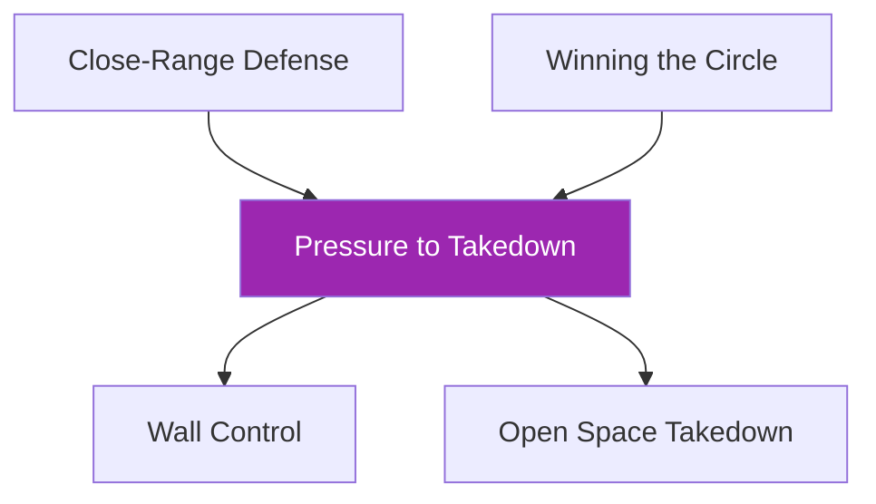

# Pressure to Takedown

!!! info "Game Identity"
    - **Problem:** Closing distance with strikes to establish control and execute takedown
    - **Environment:** Open Space (can use wall)
    - **Stage:** Access → Stabilize → Exploit

This is a **full-sequence offensive game** that teaches the attacker to chain strikes, distance closure, and takedowns. The defender learns to manage all three threats simultaneously.

---

## Goal

This is an **asymmetric game** with distinct roles.

### Attacker (Offense)
- Compromise defender's openings and land strikes
- Close the distance and establish meaningful control
- Take defender down to ground and establish meaningful top control

### Defender
- Defend strikes effectively (tight blocking, parrying, dodging)
- Avoid closing the distance at all costs with footwork and controls
- Break meaningful control and escape/reverse
- Defend the takedown and scramble back to standing if taken down

---

## Entry Condition

- Both players start in neutral standing at close quarters
- Attacker in "winning position" (initiative)
- Defender in "losing position" (must manage pressure)
- Reset if defender escapes cleanly OR attacker establishes top control

---

## Invariants

1. Attacker must use **strikes to close distance** (not just shoot from outside)
2. More aggressive forward motion = more compromised for counter attack
3. Feints and fakes make it harder for defender to identify intention

---

## Task Focus

### Attacker
- Start with only head strikes or only straight punches
- Use strikes to create openings for distance closure
- Chain: Strikes → Clinch entry → Takedown → Top control
- Understand: aggressive forward motion increases counter vulnerability

### Defender
- Focus on defense first and distance management
- Use footwork and hand controls to prevent closure
- If clinched: break control and escape/reverse
- If taken down: scramble back to standing

!!! warning "Defensive Trade-offs"
    - **Hands closer to face** = easier to defend strikes, harder to counter or defend closure
    - **Hands further out** = compromised to strikes, but can disrupt attacker or defend takedowns
    - **When dodging**, offline head = compromised for significant strikes

---

## Key Logic: The Closing Sequence

Attacker must follow a logical chain:

Jumping steps or rushing creates counter opportunities.

### Defender's Layered Defense

| Threat | Defensive Solution |
|--------|-------------------|
| Strikes | Block, parry, dodge |
| Distance closure | Footwork, hand controls, frames |
| Clinch | Break grips, underhook battles, escape |
| Takedown | Sprawl, whizzer, scramble |
| Ground | Scramble to standing |

---

## Win Conditions

| Role | Win Condition |
|------|---------------|
| **Attacker** | Execute takedown AND establish meaningful top pinning control |
| **Defender** | No win condition — success measured by strikes defended, closure prevented, takedowns defended |

---

## Levels

=== "Level 1 — Strikes and Closure Only"
    - Attacker: Strikes and clinch entry only (no takedowns yet)
    - Defender: Defend strikes and prevent clinch
    - Focus: Managing the first two layers

=== "Level 2 — Add Takedown Threat"
    - Attacker can now attempt takedowns from clinch
    - Defender must defend clinch AND takedown
    - Focus: Full standing defense

=== "Level 3 — Add Scramble Continuation"
    - If taken down, play continues
    - Defender scrambles to return to standing
    - Focus: Recovery and continuation

=== "Level 4 — Add Defender Counter Strikes"
    - Defender can throw counter strikes
    - Attacker must respect counter threat
    - Focus: Two-way striking with takedown threat

=== "Level 5 — Full Expression"
    - Both players can strike freely
    - Attacker chains strikes to takedowns
    - Defender can counter or disengage
    - DNS allowed defensively

---

## Advanced Expressions (Coach Context)

**For attackers:**
- Striking becomes purposeful (setting up closure)
- Distance closure timing becomes precise
- Takedown entries emerge from natural openings

**For defenders:**
- Defensive layers become integrated
- Counter timing improves
- Scrambles become automatic

---

## Safety

- **Contact limits:** Light to moderate strikes; controlled takedowns
- **Stop conditions:** Uncontrolled takedowns, excessive force, slam attempts
- **Coach intervention:** Reset if attacker is just shooting without strikes

!!! danger "Control Precedes Gravity"
    Takedowns must be earned, not forced.

---

## System Position

- **Prerequisite games:** Close-Range Defense, Winning the Circle
- **Follow-on games:** Wall Control, Open Space Takedown
- **Related concepts:** Defensive Solutions, Hand Controls, TKO Pin

---

!!! abstract "System Evolution Notice"
    This game may be refined as striking-to-grappling integration patterns emerge.
