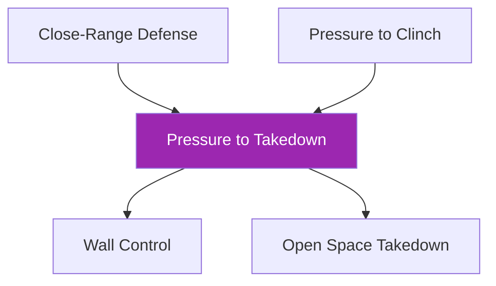

# Pressure to Takedown

!!! info "Game Identity"
    - **Problem:** Closing distance with strikes to establish control and execute takedown
    - **Environment:** Open Space (can use wall)
    - **Stage:** Access → Stabilize → Exploit

This is a **full-sequence offensive game** that teaches the attacker to chain strikes, distance closure, and takedowns. The defender learns to manage all three threats simultaneously.

---

## Goal

This is an **asymmetric game** with distinct roles.

### Attacker (Offense)
- Compromise defender's openings and land strikes
- Close the distance and establish meaningful control
- Take defender down to ground and establish meaningful top control

### Defender
- Defend strikes effectively (tight blocking, parrying, dodging)
- Avoid closing the distance at all costs with footwork and controls
- Break meaningful control and escape/reverse
- Defend the takedown and scramble back to standing if taken down

---

## Entry Condition

- Both players start in neutral standing at close quarters
- Attacker in "winning position" (initiative)
- Defender in "losing position" (must manage pressure)
- Reset if defender escapes cleanly OR attacker establishes top control

---

## Invariants

1. Attacker must use **strikes to close distance** (not just shoot from outside)
2. More aggressive forward motion = more compromised for counter attack
3. Feints and fakes make it harder for defender to identify intention

---

## Task Focus

### Attacker
- Start with only head strikes or only straight punches
- Use strikes to create openings for distance closure
- Chain: Strikes → Clinch entry → Takedown → Top control
- Understand: aggressive forward motion increases counter vulnerability

### Defender
- Focus on defense first and distance management
- Use footwork and hand controls to prevent closure
- If clinched: break control and escape/reverse
- If taken down: scramble back to standing

!!! warning "Defensive Trade-offs"
    - **Hands closer to face** = easier to defend strikes, harder to counter or defend closure
    - **Hands further out** = compromised to strikes, but can disrupt attacker or defend takedowns
    - **When dodging**, offline head = compromised for significant strikes

---

## Key Logic: The Closing Sequence

Attacker must follow a logical chain:

Jumping steps or rushing creates counter opportunities.

### Defender's Layered Defense

| Threat | Defensive Solution |
|--------|-------------------|
| Strikes | Block, parry, dodge |
| Distance closure | Footwork, hand controls, frames |
| Clinch | Break grips, underhook battles, escape |
| Takedown | Sprawl, whizzer, scramble |
| Ground | Scramble to standing |

---

## Win Conditions

| Role | Win Condition |
|------|---------------|
| **Attacker** | Execute takedown AND establish meaningful top pinning control |
| **Defender** | No win condition — success measured by strikes defended, closure prevented, takedowns defended |

---

## Levels

=== "Level 1 — Strikes and Closure Only"
    - Attacker: Strikes and clinch entry only (no takedowns yet)
    - Defender: Defend strikes and prevent clinch
    - Focus: Managing the first two layers

=== "Level 2 — Add Takedown Threat"
    - Attacker can now attempt takedowns from clinch
    - Defender must defend clinch AND takedown
    - Focus: Full standing defense

=== "Level 3 — Add Scramble Continuation"
    - If taken down, play continues
    - Defender scrambles to return to standing
    - Focus: Recovery and continuation

=== "Level 4 — Add Defender Counter Strikes"
    - Defender can throw counter strikes
    - Attacker must respect counter threat
    - Focus: Two-way striking with takedown threat

=== "Level 5 — Full Expression"
    - Both players can strike freely
    - Attacker chains strikes to takedowns
    - Defender can counter or disengage
    - DNS allowed defensively

---

## Constraints Analysis

*How this game applies the [Constraints-Led Approach](../principles/cla/index.md)*

| Constraint Type | Constraint | Affordance Created |
|-----------------|------------|-------------------|
| **Task** | Attacker must use strikes to close (can't just shoot) | Develops integrated striking-to-grappling |
| **Task** | Multi-layer sequence (strikes → closure → control → takedown) | Full MMA offensive chain |
| **Task** | Defender manages all threats simultaneously | Develops layered defensive awareness |
| **Task** | Progressive layers added (closure → takedown → scramble → counters) | Scaffolded complexity |
| **Individual** | Prerequisites: Close-Range Defense, Pressure to Clinch | Has defensive and clinch skills |
| **Environmental** | Open space with optional wall | Multiple pathways available |

!!! info "Theoretical Foundation"
    This game develops **offensive sequencing**—the perception-action coupling across multiple domains. The constraint requiring strikes before shooting prevents wrestlers from ignoring striking and forces true MMA integration. The defender develops **layered defensive perception**, reading which threat is current and selecting appropriate responses (Renshaw et al., 2019).

---

## Information Structure

*What athletes must perceive to succeed (perception-action coupling)*

### Attacker Perceives

| Information Source | What to Read | Action It Supports |
|--------------------|--------------|-------------------|
| **Visual** | Defender's guard position | Where to strike |
| **Visual** | Defender's distance/footwork | When to close |
| **Visual** | Defender's underhook position | Takedown angle |
| **Visual** | Defender's counter setup | When to be cautious |
| **Haptic** | Clinch control quality | When to attempt takedown |
| **Proprioceptive** | Own balance and position | Sequence timing |

### Defender Perceives

| Information Source | What to Read | Action It Supports |
|--------------------|--------------|-------------------|
| **Visual** | Attacker's striking pattern | Defense selection |
| **Visual** | Attacker's level change setup | Sprawl preparation |
| **Visual** | Attacker's distance closure | When to frame or move |
| **Haptic** | Clinch pressure | Escape or reversal timing |
| **Proprioceptive** | Own position if taken down | Scramble direction |

!!! tip "Coaching Cue"
    Ask attackers: "Did your strikes create the takedown opportunity?" The takedown should emerge from striking pressure, not be forced independently. Ask defenders: "What layer were you defending?" to develop threat awareness.

---

## Representativeness

*How this game models real MMA situations*

### Real MMA Situation

A wrestler or pressure fighter using striking to set up takedowns—the classic "punch to shoot" MMA strategy.

### How This Game Represents It

| Element | Real MMA | This Game | Fidelity |
|---------|----------|-----------|----------|
| **Offensive sequence** | Strikes → Clinch → Takedown → Control | Same | High |
| **Multi-domain integration** | Full MMA offensive toolkit | Same | High |
| **Defensive layers** | Must defend all threats | Progressive by level | Scaffolded |
| **Consequence** | Fight goes to ground | Game ends on control | Analogous |

### Simplifications & Justification

| Simplification | Why Acceptable |
|----------------|----------------|
| Progressive defender options | Allows focus on each defensive layer |
| Controlled contact | Safety during learning |
| Clear win conditions | Structure for evaluation |

!!! note "Transfer Expectation"
    The offensive sequence developed here transfers directly to MMA competition. Fighters who can chain strikes to takedowns become effective pressure grapplers. The perceptual skill—reading when closure is available—is identical in competition.

---

## Variability Guidelines

*Creating "repetition without repetition" (Bernstein, 1967)*

### Within-Level Variability

| Vary This | How | Maintains |
|-----------|-----|-----------|
| **Defender style** | Strikers, grapplers, movers | Multiple closing solutions |
| **Defender size** | Larger, smaller, equal | Adaptability |
| **Takedown emphasis** | Clinch takedowns, shot takedowns | Full wrestling vocabulary |
| **Wall availability** | Open space only, cage available | Environmental flexibility |
| **Intensity** | Controlled pace, live pace | Pressure calibration |

### What NOT to Vary

| Keep Constant | Why |
|---------------|-----|
| Strikes must precede shooting | Core constraint developing integration |
| Sequence logic (strikes → closure → takedown) | Maintains MMA-specific learning |
| Controlled takedowns | Safety |

### Progressing Through Levels

| Signal to Progress | Meaning |
|--------------------|---------|
| Strikes create closure opportunities | Integration developing |
| Takedowns emerge from clinch control | Sequence logic understood |
| Defender manages current level's threats | Ready for more complexity |

---

## Readiness Indicators

*When is the athlete ready to advance?*

### Ready for Next Level When

- [ ] Strikes clearly set up distance closure
- [ ] Takedowns emerge from clinch control (not forced)
- [ ] Defender successfully manages current level's threats
- [ ] Can articulate: "I threw the cross then shot because..."
- [ ] Sequence feels integrated, not choppy

### Ready to Exit Game When

- [ ] Level 4+ competence (handles defender counters)
- [ ] Striking-to-grappling is seamless
- [ ] Multiple pathway options (wall vs. open space takedown)
- [ ] Sequence appears naturally in sparring

### Warning Signs (Not Ready to Progress)

| Sign | Meaning | Response |
|------|---------|----------|
| Shoots without strikes | Not integrating domains | Reinforce constraint, more striking emphasis |
| Gets countered during closure | Timing off | Slow down, work on reading counter threat |
| Sequence feels forced | Not flowing | More reps at current level |
| Defender overwhelmed | Progressed too fast | Return to previous level |

---

## Advanced Expressions (Coach Context)

**For attackers:**
- Striking becomes purposeful (setting up closure)
- Distance closure timing becomes precise
- Takedown entries emerge from natural openings

**For defenders:**
- Defensive layers become integrated
- Counter timing improves
- Scrambles become automatic

---

## Safety

- **Contact limits:** Light to moderate strikes; controlled takedowns
- **Stop conditions:** Uncontrolled takedowns, excessive force, slam attempts
- **Coach intervention:** Reset if attacker is just shooting without strikes

!!! danger "Control Precedes Gravity"
    Takedowns must be earned, not forced.

---

## System Position

- **Prerequisite games:** Close-Range Defense, Pressure to Clinch
- **Follow-on games:** Wall Control, Open Space Takedown
- **Related concepts:** Defensive Solutions, Hand Controls, TKO Pin

---

!!! abstract "System Evolution Notice"
    This game may be refined as striking-to-grappling integration patterns emerge.
