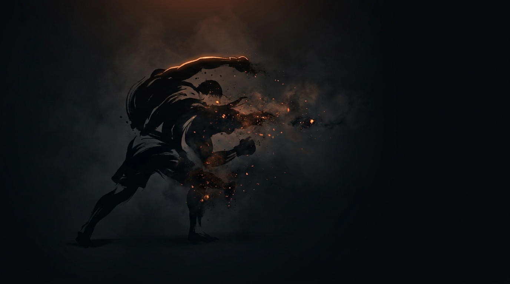

  
  
Open Space · WrestlingPressure to Takedown

Open SpaceWrestlingOffensiveAdvancedStriking → Grappling

A full-sequence offensive game: chain strikes, distance closure, and takedowns into one flow while the defender manages all three threats at once.

  
Start<b>Two fighters in neutral standing at close quarters, attacker has initiative.</b>

  
→

  
The Goal<b>Attacker chains strikes to a takedown; defender defends all three layers.</b>

  
→

  
Finish<b>Takedown + meaningful top control → reset · Defender survives strikes, closure &amp; takedown → success (no win state).</b>

  
The takedown isn't the entry,  it's the end of the chain.

  
Strikes open the closure; closure becomes the shot. <b>The takedown emerges from pressure, never forced.</b>

What to Read

<b>Attune to</b> the <i>rate the distance closes</i> as strikes land (global optic flow) and the <i>defender's preferred distance</i>, near affords your clinch and shot, far affords their escape. Read their guard position and weight, plus the level-change opening (with <b>τ</b> on the shot entry), <b>not</b> their eyes. That information specifies <i>when closure is available</i> and <i>when the takedown is there to take</i>.

The Starting Position

  
PlayersTwo, one attacker, one defender.

  
RangeNeutral standing at close quarters.

  
BoundaryA marked perimeter, open space, optional wall as a pathway.

  
RolesOne attacker, one defender, defender has no win state.

  
Start &amp; resetAttacker initiates with strikes; reset if the defender escapes cleanly or the attacker establishes top control.

The Matchup

  

    
🤼

    
Attacker

    
Trying to compromise openings with strikes, close distance, and take the defender down to meaningful top control.

    Chain it: strikes → clinch entry → takedown → top control. Strikes must create the closure, aggressive forward motion increases counter vulnerability, so the takedown should emerge from pressure, not be forced.
  

  
VS

  

    
🛡️

    
Defender

    
Trying to defend strikes, prevent closure, break control, defend the takedown, and scramble back to standing.

    Manage every layer in turn: block/parry/dodge strikes, use footwork and hand controls to deny closure, break grips if clinched, sprawl/whizzer the shot, and scramble up if taken down.
  

The Rules

  🥊 Strikes must precede the shotThe attacker must use strikes to close distance, not just shoot from outside. This prevents wrestlers from ignoring striking and forces true MMA integration.
  ⚠️ Forward motion = more open to countersThe more aggressive the forward motion, the more compromised the attacker is for the defender's counter. Closure must be paid for.
  🎭 Feints disguise intentionFeints and fakes make it harder for the defender to identify whether a strike, a closure, or a shot is coming.
  📈 Layers added progressivelyClosure → takedown → scramble → counters → full expression. Each layer is added in turn so the sequence is built before the defender can fight back fully.
  ⬛ Open space, optional wallPlay happens inside a marked perimeter in open space, with a wall available as an optional pathway, multiple routes to the takedown.

How to Win

  
Attacker scores Takedown + meaningful top control → reset.When the attacker executes a takedown AND establishes meaningful top pinning control, the sequence is won, reset. The space fully closed and the chain completed: strikes set up closure, closure became a takedown, and the takedown became control. Then reset.

  
Defender (no win state) Success = threats defended, not a win.The defender has no win condition, success is measured by strikes defended, closure prevented, and takedowns defended. This is an offensive-development game. The defender wins nothing outright; the coach reads how well each layer was defended.

  
Reset Defender escapes or scrambles up → reset to neutral.When the defender escapes cleanly or scrambles back to standing, the space re-opens, reset to neutral. The defender broke the chain, denied closure, defended the shot, or scrambled up. Begin again at close quarters.

The Levels

  
1<b>Strikes and closure only</b>No takedowns yet.Attacker: strikes and clinch entry only. Defender: defend strikes and prevent the clinch. Managing the first two layers.

  
2<b>Add takedown threat</b>Takedowns from clinch.The attacker can attempt takedowns from the clinch; the defender must defend clinch AND takedown. Full standing defense.

  
3<b>Add scramble continuation</b>Play continues on the ground.If taken down, play continues; the defender scrambles to return to standing. Recovery and continuation.

  
4<b>Add defender counter strikes</b>Two-way striking.The defender can throw counter strikes; the attacker must respect the counter threat. Two-way striking with a takedown threat.

  
5<b>Full expression</b>Both strike freely; DNS allowed.Both players strike freely; the attacker chains strikes to takedowns, the defender can counter or disengage. DNS allowed defensively.

Recall Check

  
Test yourself before moving on. Answer out loud, then reveal what good looks like.

  

    
Q Where does the takedown sit in the sequence, and what makes it appear?

    
It is the <b>end of the chain</b>, never the entry: strikes open the closure, closure becomes the shot. The takedown <b>emerges from pressure</b>, it is never forced.

  

  

    
Q What are you reading to know when closure and the shot are available?

    
The <b>rate the distance closes</b> as strikes land (global optic flow) and the defender's <b>preferred distance</b>, near affords your clinch and shot, far affords their escape. Plus the level-change opening, with <b>τ</b> on the shot entry. Not the eyes.

  

  

    
Q What is the cost of aggressive forward motion?

    
The more aggressive the forward motion, the more <b>open you are to the defender's counter</b>. Closure must be paid for, so it has to be set up with strikes and feints, not bulled through.

  

  

    
Q As the defender with no win state, what does success look like, and how do hand position trade-offs work?

    
Success is <b>each layer defended in turn</b>: strikes, closure, clinch, takedown, scramble. <b>Hands closer</b> defend strikes better but make closure harder to stop; <b>hands further out</b> disrupt closure and takedowns but leave you open to strikes.

  

Go Deeper

??? note "Task focus &amp; coaching cues"

    
Each role's job

    

      

🤼

Attacker

Start with only head strikes or only straight punches; use strikes to open closure; chain strikes → clinch → takedown → top control.

      

🛡️

Defender

Defense and distance first; footwork and hand controls to deny closure; break control if clinched; scramble up if taken down.

    

    
Coaching cues

    

      

🔗

Did strikes make it?

Ask attackers: "Did your strikes create the takedown opportunity?" The takedown should emerge from striking pressure, not be forced.

      

🧱

Which layer?

Ask defenders: "What layer were you defending?" to develop threat awareness across strikes, closure, clinch, takedown, and ground.

    

    
Defensive trade-offs

    

      

✋

Hands closer

Easier to defend strikes, but harder to counter or defend closure.

      

🫳

Hands further out

Compromised to strikes, but can disrupt the attacker or defend takedowns. Offline head when dodging is open to significant strikes.

    

??? abstract "Constraints-Led analysis"

    
Constraints → Affordances

    

      
Strikes must close (can't just shoot)→Develops integrated striking-to-grappling

      
Multi-layer sequence→Full MMA offensive chain

      
Defender manages all threats→Develops layered defensive awareness

      
Progressive layers→Scaffolded complexity

      
Open space with optional wall→Multiple pathways available

    

    
Develops <b>offensive sequencing</b>, perception-action coupling across multiple domains; requiring strikes before shooting forces true MMA integration (Renshaw et al., 2019).

    
What the players read

    

      

👁️

Visual

Guard position, footwork/distance, level-change setup, counter setup → where to strike, when to close, sprawl prep.

      

✋

Haptic

Clinch control quality and pressure → when to attempt the takedown; escape or reversal timing.

      

🧭

Proprioceptive

Own balance and position → sequence timing; scramble direction if taken down.

    

    
What we measure (order parameter)

    
Whether the <b>distance closes over time</b> and the chain completes, is the gap-closure rate trending toward the clinch, and does the sequence reach a controlled takedown? Track whether strikes create closure, whether takedowns emerge from clinch control (not forced), and which layer the defender holds. When the chain flows without jumping steps, the skill has formed.

    
Representativeness

    
<b>Models:</b> the classic "punch to shoot", a wrestler or pressure fighter using striking to set up takedowns.

    
Progressive defender optionscontrolled contactcontrolled takedowns

    
The offensive sequence transfers directly to competition, branches into <a href="../wall-control/">Wall Control</a> and <a href="../open-space-takedown/">Open Space Takedown</a>.

    
Readiness to progress

    <ul class="emma-checklist">
      <li>Strikes clearly set up the distance closure</li>
      <li>Takedowns emerge from clinch control, not forced</li>
      <li>Defender manages the current level's threats</li>
      <li>The sequence feels integrated, not choppy</li>
      <li>Can articulate: "I threw the cross then shot because…"</li>
    </ul>

    
Warning signs

    

      Shoots without strikes
      Gets countered during closure
      Sequence feels forced
      Defender overwhelmed
    

??? note "Safety &amp; related games"

    

      🤝 Light-to-moderate strikes; controlled takedowns
      🛑 Stop on uncontrolled takedowns, excessive force, or slams
      🔁 Reset if the attacker is just shooting without strikes
    

    
Where it sits

    

      
Prerequisite→<a href="../close-range-defense/">Close-Range Defense</a> · <a href="../pressure-to-clinch/">Pressure to Clinch</a>

      
Follow-on→<a href="../wall-control/">Wall Control</a> · <a href="../open-space-takedown/">Open Space Takedown</a>

      
Related→<a href="../../concepts/defensive-solutions/">Defensive Solutions</a> · <a href="../../concepts/hand-controls/">Hand Controls</a> · <a href="../../concepts/tko-pin/">TKO Pin</a>

    

