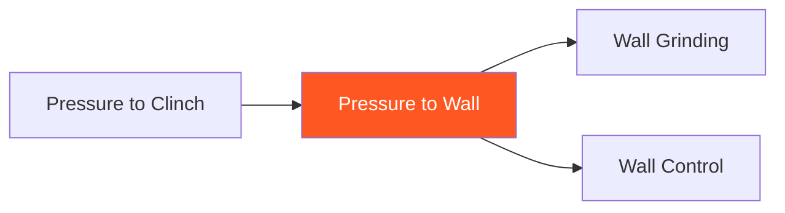

# Pressure to Wall

!!! info "Game Identity"
    - **Problem:** Using strikes and pressure to establish wall position for grinding
    - **Environment:** Open Space → Wall
    - **Stage:** Access → Stabilize (Wall Dominance)

This is an **offensive game** that chains strikes to wall control. Unlike Pressure to Takedown, the goal is wall position for damage (dirty boxing, grinding), not transitioning to ground.

---

## Goal

This is an **asymmetric game** with distinct roles.

| Role | Objective |
|------|-----------|
| **Attacker** | Drive opponent to wall and establish control for damage |
| **Defender** | Avoid wall, escape pressure, or reverse position |

The objective is **wall dominance**, not takedown.

---

## Entry Condition

- Both players start in open space at striking range
- Wall/cage is available
- Attacker uses strikes and pressure to drive to wall
- Reset when wall control is established OR defender escapes cleanly

---

## Invariants

1. Attacker must use **strikes to create pressure** — not just pushing
2. Goal is **wall control**, not takedown
3. Once on wall, attacker works damage/grinding, not ground transition
4. Defender cannot simply back up infinitely — wall exists

---

## Task Focus

### Attacker
- Use strikes to back opponent toward wall
- Close distance and establish clinch at wall
- Once on wall: dirty boxing, knees, grinding
- Maintain wall position, deny escape

### Defender
- Avoid being backed to wall
- Circle and create angles
- If on wall: escape or reverse
- Counter to discourage pressure

!!! question "Key Internal Questions — Attacker"
    - "Am I using strikes to move them or just throwing?"
    - "Can I cut off their angle?"
    - "Once on wall, am I damaging or just holding?"

---

## Key Logic: Wall as Destination

!!! note "The Core Skill"
    This game treats the wall as the END STATE, not a waypoint:

    | Pressure to Takedown | Pressure to Wall |
    |---------------------|------------------|
    | Strikes → Clinch → Takedown → Ground | Strikes → Clinch → Wall → Damage |
    | Ground control is goal | Wall control is goal |
    | Transitions through wall | Stays on wall |

    Choose this pathway when ground isn't advantageous or dirty boxing is the game plan.

---

## Win Conditions

| Role | Win Condition |
|------|---------------|
| **Attacker** | Establish wall control AND land damage (knees, dirty boxing) |
| **Defender** | Escape wall cleanly OR reverse position |

**On attacker win:** Roles switch.
**On defender win:** Reset to open space, same roles.

---

## Levels

=== "Level 1 — Pressure to Wall Only"
    - Focus on driving to wall with strikes
    - Once on wall, establish control (no extended damage)
    - Focus: Closing and pinning

=== "Level 2 — Add Wall Damage"
    - Once wall control established, work damage
    - Dirty boxing, knees, grinding
    - Focus: Damage from wall position

=== "Level 3 — Defender Counters"
    - Defender can counter-strike during pressure phase
    - Attacker must close through counters
    - Focus: Pressure under threat

=== "Level 4 — Full MMA Expression"
    - Defender can counter, clinch, OR shoot
    - Attacker must achieve wall while managing all threats
    - Focus: Wall pressure under MMA reality
    - See: [Full MMA Expression](../concepts/full-mma-expression.md)

---

## Constraints Analysis

*How this game applies the [Constraints-Led Approach](../principles/cla/index.md)*

| Constraint Type | Constraint | Affordance Created |
|-----------------|------------|-------------------|
| **Task** | Attacker must use strikes to create pressure (not just pushing) | Develops striking-based herding |
| **Task** | Goal is wall control + damage (not takedown) | Distinct from Pressure to Takedown pathway |
| **Task** | Defender cannot back up infinitely (wall exists) | Creates decision points for defender |
| **Task** | Progressive options (pressure → damage → counters → full MMA) | Scaffolded learning |
| **Individual** | Prerequisite: Pressure to Clinch | Understands clinch and pressure dynamics |
| **Environmental** | Wall/cage is available and is the destination | Environmental constraint shapes entire game |

!!! info "Theoretical Foundation"
    This game develops **cage-cutting affordance perception**—the ability to read angles and herd opponents to the wall. The wall constraint creates natural decision points; the defender must escape early or face the wall. The attacker learns to use strikes purposefully (for movement, not just damage), developing **fight IQ** about spatial control (Renshaw et al., 2019).

---

## Information Structure

*What athletes must perceive to succeed (perception-action coupling)*

### Attacker Perceives

| Information Source | What to Read | Action It Supports |
|--------------------|--------------|-------------------|
| **Visual** | Defender's distance from wall | Pressure intensity |
| **Visual** | Defender's escape angle attempts | Cutting direction |
| **Visual** | Defender's weight distribution | Which strike will move them |
| **Visual** | Wall contact (defender's back to cage) | When to establish clinch |
| **Proprioceptive** | Own pressure angle | Cutting efficiency |

### Defender Perceives

| Information Source | What to Read | Action It Supports |
|--------------------|--------------|-------------------|
| **Visual** | Attacker's cutting angle | Escape direction |
| **Visual** | Distance to wall behind | Urgency of escape |
| **Visual** | Attacker's striking patterns | Counter opportunity |
| **Haptic** | Wall contact | Escape vs. clinch defense mode |
| **Proprioceptive** | Own positioning relative to wall | Available options |

!!! tip "Coaching Cue"
    Ask attackers: "Are your strikes moving them or just hitting them?" The goal is purposeful striking that herds to the wall. Ask defenders: "Did you know how close the wall was?" to develop spatial awareness.

---

## Representativeness

*How this game models real MMA situations*

### Real MMA Situation

Cage-cutting and dirty boxing against the fence—a dominant strategy in MMA for pressure fighters and wrestlers who prefer wall work over ground work.

### How This Game Represents It

| Element | Real MMA | This Game | Fidelity |
|---------|----------|-----------|----------|
| **Herding with strikes** | Cage cutting common | Same | High |
| **Wall as destination** | Dirty boxing, clinch grinding | Same | High |
| **Wall damage** | Knees, dirty boxing, grinding | Progressive by level | Scaffolded |
| **Consequence** | Damage accumulation at wall | Win on control + damage | Analogous |

### Simplifications & Justification

| Simplification | Why Acceptable |
|----------------|----------------|
| Progressive damage addition | Allows focus on pressure first, then damage |
| Defender counters added later | Develops herding before managing counter threat |
| Clear wall pin win condition | Structure for evaluation |

!!! note "Transfer Expectation"
    Cage-cutting developed here transfers directly to MMA competition. Fighters who can herd opponents to the wall control where the fight happens. The spatial perception—knowing when wall contact is imminent—is identical in competition.

---

## Variability Guidelines

*Creating "repetition without repetition" (Bernstein, 1967)*

### Within-Level Variability

| Vary This | How | Maintains |
|-----------|-----|-----------|
| **Defender style** | Active movers, counter strikers, clinch-seekers | Multiple herding solutions |
| **Starting position** | Center, near wall, various angles | Different herding problems |
| **Wall shape** | Flat wall, curved cage | Environmental adaptability |
| **Intensity** | Light pressure, heavy pressure | Intensity calibration |
| **Damage emphasis** | Dirty boxing focus, knee focus | Full wall damage vocabulary |

### What NOT to Vary

| Keep Constant | Why |
|---------------|-----|
| Strikes must create pressure (not just pushing) | Core constraint developing purposeful striking |
| Wall is destination (not ground) | Distinguishes from Pressure to Takedown |
| Wall exists | Essential environmental constraint |

### Progressing Through Levels

| Signal to Progress | Meaning |
|--------------------|---------|
| Consistent wall pins achieved | Herding skill developing |
| Strikes purposefully move defender | Understanding pressure striking |
| Damage flows from wall position | Ready for defender resistance |

---

## Readiness Indicators

*When is the athlete ready to advance?*

### Ready for Next Level When

- [ ] Consistently herds defender to wall
- [ ] Strikes move defender (purposeful, not just volume)
- [ ] Wall control established without excessive effort
- [ ] Can articulate: "I cut their angle by..."
- [ ] Damage flows naturally from wall position

### Ready to Exit Game When

- [ ] Level 3+ competence (closes through counters)
- [ ] Cage-cutting is instinctive
- [ ] Wall work integrates with Wall Control/Wall Grinding games
- [ ] Herding appears naturally in sparring

### Warning Signs (Not Ready to Progress)

| Sign | Meaning | Response |
|------|---------|----------|
| Chases instead of cuts | Not reading angles | Slow down, emphasize cutting |
| Pushes instead of strikes | Not integrating striking | Reinforce constraint |
| Defender escapes repeatedly | Herding not effective | Work on angle control |
| Wall position doesn't lead to damage | Not exploiting position | Focus on Level 2 damage work |

---

## Safety

- **Contact limits:** Light to moderate
- **Stop conditions:** Excessive force, uncontrolled pressure
- **Coach intervention:** Reset if wall work becomes grinding without purpose

---

## System Position

- **Prerequisite games:** Pressure to Clinch
- **Follow-on games:** Wall Grinding, Wall Control
- **Related concepts:** Hand Controls

---

!!! abstract "System Evolution Notice"
    This game may be refined as wall pressure patterns emerge.
