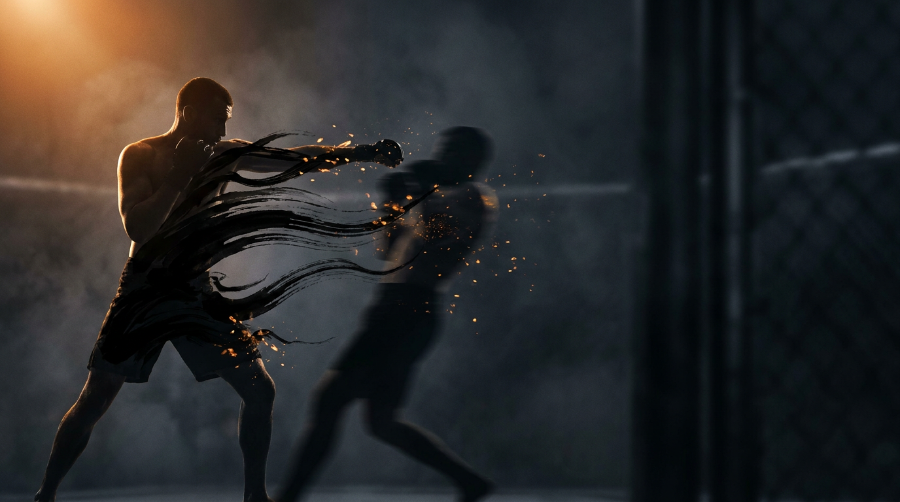

  
  
Open Space → Wall · WrestlingPressure to Wall

Open Space → WallWrestlingOffensiveAdvancedWall Dominance

Chain strikes to wall control, the destination is the wall itself, for dirty boxing and grinding, not the ground.

  
Start<b>Open space, striking range, wall available.</b>

  
→

  
The Goal<b>Attacker herds to the wall &amp; damages; defender escapes or reverses.</b>

  
→

  
Finish<b>Wall control + damage → switch · Escape or reverse → reset.</b>

  
Don't just hit them,  move them to the wall.

  
The wall is the destination, not a takedown. <b>Strikes that herd, then grind.</b>

Key Positions

  🧱 Wall pinAt least two points of pinning control, the hips and upper body held immobile and flat to the wall. If the shoulders can still rotate, it's pressure, not a pin.

What to Read

<b>Attune to</b> the <i>rate the open space closes</i> as you cut angles (global optic flow) and the <i>defender's preferred distance</i>, near affords your clinch and grinding, far affords their escape. Read their escape-angle attempts and weight distribution, plus the gap to the wall behind them (with <b>τ</b> on the clinch entry), <b>not</b> their eyes. That information specifies <i>which strike moves them</i> and <i>when wall contact is imminent</i>.

The Starting Position

  
PlayersTwo, one attacker, one defender.

  
RangeStriking range, open space.

  
BoundaryMarked perimeter with a wall/cage as the destination.

  
RolesAttacker vs. defender, switch on wall control + damage.

  
Start &amp; resetAttacker initiates; reset to open space on wall control or clean escape.

The Matchup

  

    
🧱

    
Attacker

    
Trying to drive the opponent to the wall with strikes and establish control for damage, not a takedown.

    Use strikes to back them up, purposeful, not just volume. Cut angles, close distance, establish the clinch at the wall, then work dirty boxing, knees, and grinding while denying escape.
  

  
VS

  

    
🛡️

    
Defender

    
Trying to avoid the wall, escape the pressure, or reverse position, can't back up infinitely.

    Circle and create angles before you're trapped. If you reach the wall, escape or reverse. Counter to discourage the pressure, the wall is behind you, so back-up alone won't save you.
  

The Rules

  🥊 Strikes create pressure, not pushingThe attacker must use strikes to create the pressure that moves the defender, not just shove them. This develops striking-based herding.
  🧱 Wall is the destination, not the groundThe goal is wall control and damage, not a takedown. Once on the wall, the attacker works grinding and dirty boxing, not a ground transition. This distinguishes it from Pressure to Takedown.
  🚫 No infinite back-upThe defender cannot simply retreat forever, the wall exists. This forces real decision points: escape early or face the wall.
  📈 Progressive options by levelPressure → wall damage → defender counters → full MMA. Scaffolded so herding is built before counter threats are added.
  ⬛ Wall / marked perimeter in playA wall or cage is available as the destination, inside a marked perimeter. The environmental constraint shapes the entire game.

How to Win

  
Switch Wall control + damage → switch roles.When the attacker establishes wall control AND lands damage (knees, dirty boxing), the space fully closed onto the wall and the attacker exploited the position, and earns the defending role.

  
Reset Clean escape or reverse → reset, same roles.The defender re-opened the space, circled out clean or turned the attacker onto the wall. Begin again in open space.

  
Diagnostic Do the strikes move them, or just hit them?Beyond the win, the coach reads whether striking is purposefully herding the defender, not just volume, and whether damage flows from the wall position.

The Levels

  
1<b>Pressure to wall only</b>Drive and pin.Drive to the wall with strikes; establish control once there, no extended damage. Closing and pinning.

  
2<b>Add wall damage</b>Dirty boxing, knees.Once wall control is established, work damage, dirty boxing, knees, grinding. Damage from wall position.

  
3<b>Defender counters</b>Counter during pressure.The defender can counter-strike during the pressure phase; the attacker must close through counters. Pressure under threat.

  
4<b>Full MMA expression</b>Counter, clinch, or shoot.The defender can counter, clinch, or shoot; the attacker must reach the wall while managing all threats. Wall pressure under MMA reality.

Variant: Stalk and Corral (WIP)

!!! warning "Provisional (WIP): derived from class recording 2026-06-06"
    Captured live from class and **pending review on the platform**. Same destination as the base game, the wall, but with asymmetric weapons and a touch win instead of a pin.

Both players get a restricted toolset. <b>Attacker: lead hand + rear leg.</b> The lead hand probes and herds, the rear leg makes the pressure respected. <b>Defender: rear hand + footwork</b> (lead-leg teep at Dial 2), looking to win the circle on the outside. The attacker wins when the defender's <b>hip or back touches the wall</b>, a touch, not a pin. The defender wins by a meaningful <b>level-change connection</b>, on one leg or two, under both arms, collected <b>above the knee</b> (a dive below the knee is not a connection).

  
1<b>Base dial</b>Touch win vs connect win.Attacker: lead hand + rear leg, win on hip/back touching the wall. Defender: rear hand + footwork, win on a level-change connection. First runs feel crashy, that's the point: no lead-hand probes for defense.

  
2<b>Defender gains the teep</b>Lead leg unlocked.The defender adds the lead-leg teep to hold range. Restores defensive capability while keeping the rear-hand-only puzzle alive.

  
3<b>Connect and destabilize</b>The threshold rule.The defender's connection only wins if it moves the attacker's feet from their spot, some destabilization of the current feet pattern. Connection alone is contact; connection that moves them is a takedown forming.

  🌀 No moral winsCircling out is survival, not victory: the defender is still in the cage. Defense only escapes the nightmare by connecting. Attacker resets and stays on offense after an exit.
  👀 Beware shark eyesThe recurring failure: players hear the win condition, then revert to hunting strikes. If a free push wins the game, take it. The skill being built is getting somebody pressed to the wall, not landing shots.
  🔄 Fresh-partner roundOptional: re-run the same dial with switched partners. First-run observation: feint usage jumps against an unfamiliar opponent.

Recall Check

  
Test yourself before moving on. Answer out loud, then reveal what good looks like.

  

    
Q What is the destination of this game, and why does that matter?

    
The <b>wall itself</b>, not the ground. You herd them there for <b>dirty boxing and grinding</b>, not a takedown. This is what separates it from Pressure to Takedown.

  

  

    
Q What are you reading to know which strike moves them and when wall contact is imminent?

    
The <b>rate the open space closes</b> as you cut angles (global optic flow), the defender's <b>preferred distance</b>, their escape-angle attempts and weight, plus the <b>gap to the wall behind them</b> (with τ on the clinch entry). Not the eyes.

  

  

    
Q What is the difference between strikes that move them and strikes that just hit them?

    
Purposeful strikes <b>herd the defender toward the wall</b>, cutting angles to close space. Just hitting is volume that does not change position. The diagnostic is whether the strikes move them.

  

  

    
Q Why can't the defender simply keep backing up, and what should they do instead?

    
The <b>wall exists</b>: back-up alone runs them into it. They must <b>circle and create angles before being trapped</b>, and if they reach the wall, escape or reverse, plus counter to discourage the pressure.

  

Go Deeper

??? note "Task focus &amp; coaching cues"

    
Each role's job

    

      

🧱

Attacker

Strike to back them toward the wall; cut angles; establish clinch at the wall; dirty box, knee, grind; deny escape.

      

🛡️

Defender

Avoid being backed up; circle and create angles; if on the wall, escape or reverse; counter to discourage pressure.

    

    
Coaching cues

    

      

➡️

Moving or hitting?

Ask attackers: "Are your strikes moving them or just hitting them?" The goal is purposeful striking that herds to the wall.

      

🧭

Know the wall

Ask defenders: "Did you know how close the wall was?" to develop spatial awareness before being trapped.

    

??? abstract "Constraints-Led analysis"

    
Constraints → Affordances

    

      
Strikes must create pressure→Develops striking-based herding

      
Wall control + damage (not takedown)→Distinct from the Pressure to Takedown pathway

      
No infinite back-up→Creates decision points for the defender

      
Progressive options→Scaffolded learning

      
Wall is the destination→Environmental constraint shapes the whole game

    

    
Develops <b>cage-cutting affordance perception</b>, reading angles to herd opponents to the wall and striking purposefully for movement, not just damage (Renshaw et al., 2019).

    
What the players read

    

      

👁️

Visual

Distance from the wall, escape-angle attempts, weight distribution → cutting direction and which strike moves them.

      

✋

Haptic

Wall contact (back to the cage) → escape vs. clinch-defense mode; when to establish the clinch.

      

🧭

Proprioceptive

Own pressure angle and positioning relative to the wall → cutting efficiency and available options.

    

    
What we measure (order parameter)

    
Whether the <b>open space closes onto the wall over time</b>, is the gap-closure rate trending the defender toward the cage, and does the sequence reach wall control with damage? Track wall pins achieved, whether strikes purposefully move the defender, and clean escapes. When herding reliably closes the space, the skill has formed.

    
Representativeness

    
<b>Models:</b> cage-cutting and dirty boxing against the fence, a dominant pressure-fighter and wrestler strategy.

    
Progressive: damage addedcounters added laterclear wall-pin win

    
Cage-cutting transfers directly to competition, leads into <a href="../wall-grinding/">Wall Grinding</a> and <a href="../wall-control/">Wall Control</a>.

    
Readiness to progress

    <ul class="emma-checklist">
      <li>Consistently herds the defender to the wall</li>
      <li>Strikes move the defender, purposeful, not just volume</li>
      <li>Wall control established without excessive effort</li>
      <li>Damage flows naturally from the wall position</li>
      <li>Can articulate: "I cut their angle by…"</li>
    </ul>

    
Warning signs

    

      Chases instead of cuts
      Pushes instead of strikes
      Defender escapes repeatedly
      Wall position doesn't lead to damage
    

??? note "Safety &amp; related games"

    

      🤝 Light-to-moderate contact
      🛑 Stop on excessive force or uncontrolled pressure
      🔁 Reset if wall work becomes grinding without purpose
    

    
Where it sits

    

      
Prerequisite→<a href="../pressure-to-clinch/">Pressure to Clinch</a>

      
Follow-on→<a href="../wall-grinding/">Wall Grinding</a> · <a href="../wall-control/">Wall Control</a>

      
Related→<a href="../../concepts/hand-controls/">Hand Controls</a>

    

