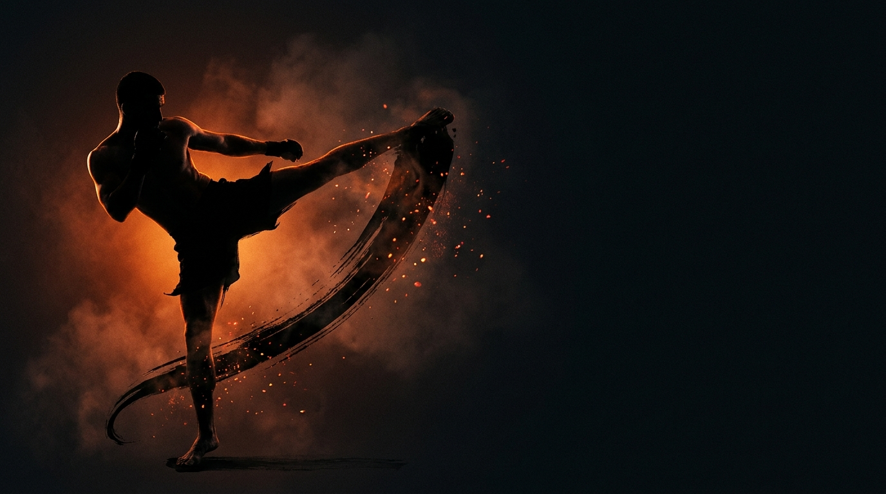

  
  
Skill Isolation · StrikingRear Leg Offense

Skill IsolationStrikingOffensiveBeginnerAccess

Land the rear leg alone, round kick, teep, side kick, forcing you to build your own setups.

  
Start<b>Two fighters at kicking range inside a marked perimeter; attacker restricted to the rear leg.</b>

  
→

  
The Goal<b>Attacker lands a clean rear leg by opening the defense; defender survives without countering.</b>

  
→

  
Finish<b>Land clean → switch · Whiffed or blocked → reset · Defender has no win condition (diagnostic only).</b>

  
The hardest weapon you own,  and the one that needs the most setup.

  
Take away the hands and the lead leg and the fighter must earn every power kick. <b>Feint, manage distance, and commit only when the opening appears.</b>

What to Read

<b>Attune to</b> the defender's <i>guard &amp; stance reactions to your feints &amp; distance changes</i>, how their shell and weight shift when you threaten a level, together with the <i>rate of expansion</i> (τ) of your committing rear round kick toward the opening at <b>center mass</b>. The opening you read isn't where the guard <i>is</i>; it's where it <i>goes</i> when you make it move.

The Starting Position

  
PlayersTwo, squared off in a neutral fighting stance.

  
RangeKicking range.

  
BoundaryA marked perimeter, both stay inside.

  
RolesOne attacker, one defender, switch on a clean rear leg.

  
Start &amp; resetThe attacker initiates; reset to neutral after each exchange.

The Matchup

  

    
🦵

    
Attacker

    
Trying to land a clean rear leg strike, rear round kick, rear teep, or rear side kick, by reading the defense and creating openings.

    Rear leg only. With no faster tools to hide behind, you must build entries: feint to draw a reaction, control distance, commit to the power kick when the opening appears.
  

  
VS

  

    
🛡️

    
Defender

    
Trying to defend all rear leg attacks effectively. No countering.

    Defend naturally with the full toolkit (check, catch, evade, move). You have no win condition, your success is making the attacker work for every opening.
  

The Rules

  🦵 Rear leg onlyThe attacker uses <strong>only</strong> the rear leg, rear round kick, rear teep, rear side kick. No hands, no lead leg. With faster weapons removed, entries and setups must be discovered.
  🚫 Defender cannot counterAt Level 1 the defender plays pure defense. Removing the counter-threat lets the attacker focus entirely on commitment and setup.
  🎯 All targets allowedHead, body, and legs are all fair game. Multiple target levels invite level variation within the rear-leg constraint.
  📏 Maintain kicking rangeBoth players hold kicking range so rear leg power is viable with a proper setup, no drifting out to where the kick can't land.
  ⏱️ Reset after each attackReset to a neutral stance after a clean strike lands or after a set time, so each rep begins from the same problem.

How to Win

  
Switch Land clean → switch roles.When the attacker lands a clean rear leg strike, the players switch roles. A clean landing means solid contact reaching the target with real energy transfer, not a whiff, graze, or checked kick.

  
Reset Whiffed or defended → reset, read again.When the kick is whiffed, grazed, or defended, reset to neutral, same roles. A failed attempt isn't a loss; it's information. Re-enter the probe → read → setup → commit cycle.

  
No score Defender denies every opening → diagnostic success.The defender has no win condition. Their success is measured by quality of defense, not points, forcing the attacker to set up and commit is the goal.

The Levels

  
1<b>Defense only</b>Defender can't counter.Pure offensive development, rear leg only against a defender who can't counter. Build timing and entries with zero counter-threat.

  
2<b>Add counter threat</b>Counters after good defense.The defender can fire counters once they defend successfully. You land the power kick while managing the counter risk.

  
3<b>Full MMA expression</b>Counters plus shot / clinch.The defender can counter-strike, shoot, or clinch. Land the rear leg under realistic MMA pressure with all threats live. See <a href="../../concepts/full-mma-expression/">Full MMA Expression</a>.

Recall Check

  
Test yourself before moving on. Answer out loud, then reveal what good looks like.

  

    
Q What are you reading to set up the rear leg, and where is the real opening?

    
The defender's <b>guard and stance reactions to your feints and distance changes</b>, plus the <b>rate of expansion (τ)</b> of your committing round kick at <b>center mass</b>. The opening is where the guard <b>goes</b> when you make it move, not where it sits.

  

  

    
Q Why does the rear leg need more setup than other weapons?

    
It's the <b>power weapon but the slowest</b>: with the hands and lead leg stripped away, you must feint, manage distance, and commit only when the opening appears. You earn every power kick.

  

  

    
Q A kick gets checked or whiffs. What does that mean for the rep?

    
It's <b>information, not a loss</b>. Reset to neutral, same roles, and re-enter the probe, read, setup, commit cycle. A telegraphed swing teaches you to disguise the next one.

  

  

    
Q The defender has no win condition. What is their job?

    
Defend naturally with the <b>full toolkit (check, catch, evade, move)</b> and provide realistic resistance. Their success is <b>denying every opening</b> so the attacker has to genuinely set up and commit.

  

Go Deeper

??? note "Task focus &amp; coaching cues"

    
Each role's job

    

      

🦵

Attacker

Find openings for power kicks; vary targets head/body/legs; develop entries and setups for the rear leg; manage distance for power generation.

      

🛡️

Defender

Defend all rear leg attacks with appropriate solutions (check, catch, evade); provide realistic resistance; never counter at Level 1.

    

    
Coaching cues

    

      

👁️

"How did you set that kick up?"

Ask after each rep. This develops understanding of entry-to-finish sequencing for power kicks.

      

🎯

Land fight-changing kicks

Rear round kick to leg/body/head, rear teep, rear side kick, feints to draw reactions. The rear leg is the power weapon but requires more setup.

    

??? abstract "Constraints-Led analysis"

    
Constraints → Affordances

    

      
Rear leg only→Forces development of power kick entries and setups

      
Defender can't counter (L1)→Focus on setup and commitment

      
No lead leg or hands→Must create openings without faster tools

      
All rear-leg kicks available→Invites discovery of round kick, teep, side kick options

      
Kicking range maintained→Rear leg power is viable with proper setup

    

    
Implements <b>Constrain to Afford</b> (Renshaw et al., 2019), removing the lead leg and hands forces discovery of power-kick entries that would normally hide behind faster weapons.

    
What the attacker reads

    

      

👁️

Visual

Distance, stance and weight distribution, defensive posture, reaction to feints → range for power, target selection, where openings exist.

      

✋

Haptic

Contact quality → whether the power kick landed clean.

      

🧭

Proprioceptive

Hip rotation and balance, range to target → power generation, kick selection and commitment.

    

    
What we measure (order parameter)

    
Whether the <b>committing rear-leg kick lands on the opening a feint or distance change created</b>, track target-landed vs. attempts, and whether each landing followed a genuine read → open → commit cycle rather than a telegraphed swing. That coupling of opening-read to committed kick is the order parameter; when it stabilizes, disguised power kicking has formed.

    
Representativeness

    
<b>Models:</b> landing power kicks, leg kicks, body kicks, head kicks, in striking exchanges, the high-damage tools that require setup and timing.

    
Simplified: rear leg onlyno counter (L1)role switch on success

    
Setup and timing transfer directly into <a href="../land-the-target/">Land the Target</a>, where all weapons integrate.

    
Readiness to progress

    <ul class="emma-checklist">
      <li>Lands rear leg without obvious telegraph</li>
      <li>Uses feints and distance control to open</li>
      <li>Varies targets leg/body/head</li>
      <li>Maintains balance through power kicks</li>
      <li>Composed under counter threat (L2)</li>
    </ul>

    
Warning signs

    

      Telegraphs kicks obviously
      Only throws leg kicks
      Rushes to close distance
      Power without control
    

??? note "Safety &amp; related games"

    

      🤝 Light-to-moderate, power kicks especially controlled
      🛑 Stop on excessive force or lost composure
      🔁 Reset if attacker uses non-rear-leg weapons
    

    
Where it sits

    

      
Prerequisite→None, this is foundational

      
Follow-on→<a href="../land-the-target/">Land the Target</a> (integrates all weapons)

      
Related→<a href="../../concepts/three-zones/">Three Zones of Attack</a>

    

