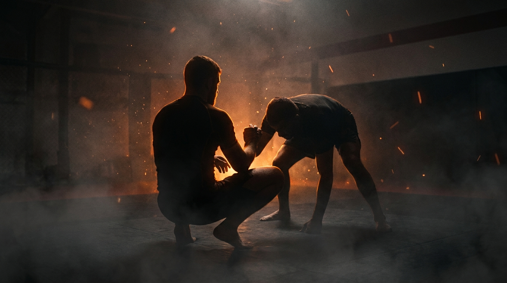

  
  
Ground · GrapplingSeated Guard Retention

!!! warning "Provisional (WIP): built from the ground-wave spec, pending coach review"

    Sourced from the Slime Mold Grappling Club catalog (Greg Souders / Standard Jiu-Jitsu; seated-vs-standing structure after Justin Mark / Impact Jiu-Jitsu), re-expressed with our threshold rules. Passed the build rubric on paper; awaits validation against a live grappling class. Details may change.

GroundGrapplingDefensiveIntermediateRetention

Keep your structure, make them post, punish the post.

  
Start<b>Bottom seated, feet inside the top's knees; top working to flatten or pass, inside a marked perimeter.</b>

  
→

  
The Goal<b>Bottom keeps structure, causes posts, and punishes them; top flattens or passes.</b>

  
→

  
Finish<b>Top dumped to hands or seat, or shoulders connected for the back entry, held 3s → bottom · Bottom flattened to the back or passed → top · Out of bounds → loss.</b>

  
A seated guard isn't lying down,  it's a fighting stance on the floor.

  
Structure first, then offense. <b>Every post they make is a handle you can punish.</b>

What to Read

<b>Attune to</b> the <i>moment the top's weight leaves their feet</i>, the hand that touches the mat, the knee that drops, the lean past the toes. A post is committed weight, and committed weight can't defend itself. Your feet and frames exist to <i>cause</i> those posts; your offense lives in the second after one lands.

The Starting Position

  
PlayersTwo, one bottom (seated guard), one top (passer).

  
PositionBottom seated, feet between the top's knees, hands ready; top kneeling or crouched, working forward.

  
BoundaryA marked perimeter, both stay inside.

  
RolesBottom retains, causes posts, and punishes them; top flattens the bottom or passes.

  
Start &amp; resetBegin seated and connected; reset on a dump, a back entry, a flatten, a pass, or the round cap.

The Matchup

  

    
🤸

    
Bottom (Seated Guard)

    
Trying to keep the seated structure, off-balance the top onto hands or seat, or connect to the shoulders for the back entry.

    Sit tall, feet live, hands fighting. Don't fall to the back, the seated posture IS the guard. Push and pull until a hand hits the mat, then attack the arm that posted before it recovers.
  

  
VS

  

    
🥋

    
Top (Passer)

    
Trying to flatten the bottom to the back or pass around the feet to a held pin.

    Drive through the center or beat the feet around the side, but keep the weight over your own base. Every reach is a post the bottom is waiting for, advance with your legs, not your hands.
  

The Rules

  🪑 Stay seated, that's the guardThe bottom plays from the seated posture. Falling flat to the back concedes the round's central resource. Getting put flat is how the top wins, don't volunteer it.
  ⚖️ Bottom wins by the dump or the shouldersTwo observable wins: off-balance the top to hands or seat, or connect both hands at the top's shoulder line (the back-take entry) held 3 seconds. Both are concrete events, no judgment call.
  🎯 Top wins by flatten or passPress the bottom's shoulders flat to the mat, or pass the legs to a chest-to-chest pin held 3 seconds. Hovering over the feet wins nothing.
  ⏱️ Round cap, no stallingRun a set round cap (start at 60 seconds). If neither side wins by the cap, reset and switch roles. A clock, never "as long as possible".
  🚫 No striking until the top levelLevels 1 to 4 are grappling only, so the bottom can learn the post-punish rhythm without defending strikes. Strikes enter at the full-expression level.
  🎚️ GnP dial-up, by permissionOnce strikes are on, the coach explicitly grants a meaner dial on ground-and-pound: mid-grapple, strength is already compromised, so firmer strikes stay safe. The top's strikes punish a dead seated guard, the bottom's structure must handle punches, not just grips. Ground games train smashing on the ground, not grappling for its own sake.
  ⬛ Stay inside the perimeterPlay happens inside a marked perimeter, any shape. If a player rolls fully out of it, that player loses the round, training mat-edge awareness.

How to Win

  
Win Bottom dumps the top to hands or seat → bottom wins.The top's hands or seat touching the mat is the observable off-balance. The sweep mechanic, proven without needing to follow up.

  
Win Bottom connects both hands at the shoulder line, held 3s → bottom wins.Hands connected at the top's shoulders with the hips outside the arms, the doorway to the back. Held 3 seconds, it proves the entry was real.

  
Switch Top flattens the bottom or passes to a held pin → top wins.Shoulders pressed flat, or chest-to-chest past the legs held 3 seconds. Either ends the seated guard's round.

  
Loss Roll fully out of the perimeter → that player loses.Crossing the marked perimeter loses the round instantly, regardless of position, training the mat-edge awareness a fighter needs.

The Levels

  
1<b>Hold the structure</b>Feet in, posture tall.The round is only retention: bottom keeps the seated posture with feet inside, top works to flatten or clear the feet. Whoever owns the structure at the bell owns the round. No offense yet, learn what a strong seat feels like.

  
2<b>Cause posts</b>Make a hand touch the mat.Bottom adds the goal: push-pull until the top posts a hand or drops a knee wide. The round ends on the post. Teaches that posts are created, not waited for.

  
3<b>Punish posts</b>Own the arm that landed.Now the post is the beginning: bottom must capture and hold the posted arm (2-on-1 or wrist-and-elbow) before it recovers. The one-second window after a post becomes the whole game.

  
4<b>To the shoulders</b>Climb the captured arm.From the captured post, the bottom climbs the connection to the shoulder line (the back entry) or converts to the dump. The full retention-to-offense chain, grappling only.

  
5<b>Full expression</b>Continuous, strikes on.Light strikes on. The top's punches test the structure, the bottom's feet now manage range and base at once. The seated guard as MMA actually demands it.

Recall Check

  
Test yourself before moving on. Answer out loud, then reveal what good looks like.

  

    
Q Why is falling to your back a concession?

    
Because <b>the seated posture is the guard</b>. Flat on the back, your feet lose their steering, your hands lose their fight, and the top's flatten-win is half done.

  

  

    
Q What is a post, and why is it your window?

    
A post is <b>committed weight</b>, a hand on the mat, a knee dropped wide. Committed weight can't defend itself. The arm that posted is yours for about a second, take it before it recovers.

  

  

    
Q What are the bottom's two observable wins?

    
<b>The dump</b> (top's hands or seat touch the mat) and <b>the shoulder connection</b> (both hands at the shoulder line, 3 seconds, the back entry).

  

  

    
Q How should the top advance without feeding posts?

    
<b>With the legs, not the hands.</b> Weight stays over the base; every reach is a handle. Advance in angles the feet can't follow rather than leaning through them.

  

Go Deeper

??? note "Task focus &amp; coaching cues"

    
Each role's job

    

      

🤸

Bottom (Seated Guard)

Sit tall, keep the feet live and inside, hand-fight, cause the post, capture it, climb it to the shoulders or convert to the dump.

      

🥋

Top (Passer)

Advance with the base, deny handles, flatten through the center or beat the feet around the side into a held pin.

    

    
Coaching cues

    

      

🪑

Still seated?

Ask the bottom: "When did you end up flat, and who put you there?" Distinguishes being flattened from volunteering.

      

✋

Who made that post?

Ask both: "Did the post happen, or did the bottom cause it?" Directs attention to off-balancing as an action, not luck.

    

??? abstract "Constraints-Led analysis"

    
Constraints → Affordances

    

      
Retention-only opening level→Builds the structure before any offense exists

      
Cause-then-punish post ladder→Turns off-balancing into a created event with a follow-up window

      
Two observable bottom wins→The bottom is the protagonist, never a survivor

      
Round cap→The top must engage, no hovering at the feet

      
Live, resisting passer→Keeps the weight-commit read intact

    

    
Implements <b>Task Simplification</b> (Renshaw et al., 2019): the cause → capture → climb ladder decomposes guard offense into perceptual stages against a live passer. The post-punish window trains the timing attunement that makes seated guards dangerous rather than merely durable.

    
What the bottom reads

    

      

✋

Haptic

Pressure through the feet and grips → which way the top's weight is leaning, when it passes their toes.

      

🧭

Proprioceptive

Own seat and spine → whether the structure is tall or collapsing toward the back.

      

👁️

Visual

The top's hands → the post landing, the one-second window opening.

    

    
What we measure (order parameter)

    
Whether the bottom <b>creates and converts posts faster than the top can recover them</b>. Track dumps and shoulder connections vs. flattens and passes conceded, and whether posts get punished or just observed. When the bottom's offense reliably starts within a second of a caused post, the skill has formed.

    
Representativeness

    
<b>Models:</b> playing guard against a passer who can also strike, the seated structure is the only guard posture that manages both the pass and the punch, which is why MMA guards sit up.

    
Simplified: post ladderno strikes L1-4round cap

    
Deepens the retention side of <a href="../leg-reclaim/">Leg Reclaim</a>; mirrors <a href="../open-guard-pass/">Open Guard Pass</a>.

    
Readiness to progress

    <ul class="emma-checklist">
      <li>Holds the seated structure under real forward pressure</li>
      <li>Causes posts on purpose, not by accident</li>
      <li>Captures the posted arm inside the window</li>
      <li>Converts captures into the dump or the shoulder connection</li>
    </ul>

    
Warning signs

    

      Falls to the back at the first pressure
      Watches posts land without attacking them
      Feet go passive, stop steering
      Top hovers out of range to run the clock
    

??? note "Safety &amp; related games"

    

      🤝 Controlled grappling
      🛑 No jumping passes over the seated player
      🔁 Reset if the position stalls completely
    

    
Where it sits

    

      
Prerequisite→<a href="../leg-reclaim/">Leg Reclaim</a>

      
Follow-on→<a href="../closed-guard-bottom/">Closed Guard Bottom</a>

      
Mirror→<a href="../open-guard-pass/">Open Guard Pass</a>

      
Related→<a href="../../concepts/guard-recovery/">Guard Recovery</a> · <a href="../../concepts/decision-states/">Decision States</a>

    

