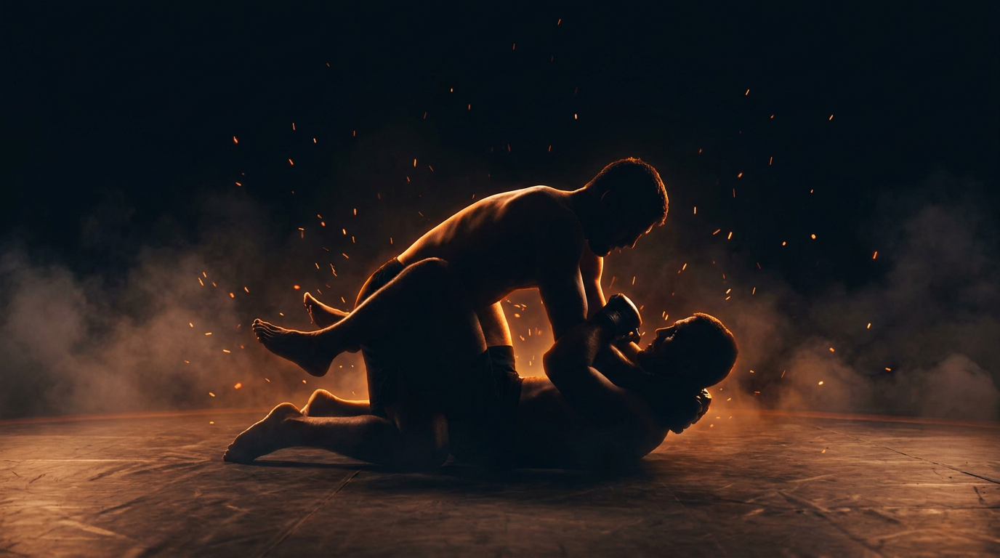

  
  
Ground · GrapplingSide-Control Escape

GroundGrapplingDefensiveIntermediateCounter

Recover a guard or get to your knees before side control advances.

  
Start<b>Bottom flat under side control, top chest-to-chest, inside a marked perimeter.</b>

  
→

  
The Goal<b>Bottom frames, gets a knee in or turns to the knees; top holds and works toward mount or the back.</b>

  
→

  
Finish<b>Knee back in (half guard) or better, turn up, or reverse → bottom · Advance to mount or back, or hold the full count → top · Out of bounds → loss.</b>

  
The pin loosens when they reach,  that's your frame and your knee.

  
Make a frame, find the space, drive the knee through it. <b>The moment they climb to advance, the chest goes light.</b>

What to Read

<b>Attune to</b> the <i>chest connection and the cross-face pressure</i>, where the top's weight loads and the instant it lightens as they reach for an underhook, the cross-face, or a climb to mount. That shift specifies <i>when the knee can come through</i> and <i>which way to turn</i>, not the top's hands in isolation. When they reach to advance, the pin opens.

The Starting Position

  
PlayersTwo, one bottom (defender), one top (side control).

  
PositionBottom flat on the back, top chest-to-chest and perpendicular, hips low.

  
BoundaryA marked perimeter, both stay inside.

  
RolesBottom frames and recovers; top maintains side control and works toward mount or the back.

  
Start &amp; resetBegin from settled side control; reset on escape, advance, or the count.

The Matchup

  

    
🤸

    
Bottom (Defender)

    
Trying to frame the cross-face, get a knee back in (half guard or better), turn to the knees, or reverse.

    Build the near elbow and forearm frames against the cross-face and hip. Use them to make space, then shrimp the knee through or turn in to the knees. Frames first, then move, never bridge with the arms flat.
  

  
VS

  

    
🥋

    
Top (Attacker)

    
Trying to hold side control and advance to mount or the back.

    Stay chest-to-chest and heavy, kill the near frames, switch hips to follow the escape. Control is proven by advancing to mount or taking the back, not by resting on top.
  

The Rules

  🤜 Bottom frames and escapes, no subsThe bottom works frames, hip escapes, and turns continuously. No submissions from the bottom, the task is recovery, not the counter-attack.
  🎯 Top wins by advancingThe top proves control by improving to mount or taking the back, not by sitting still. This gives the top an active, observable target instead of a stall, and keeps the pressure realistic.
  ⏱️ Hold the count or escapeIf the top keeps side control for the set count (start at 20 seconds) without advancing, the round resets. If the bottom recovers a guard, turns up, or reverses first, the bottom wins. A clock, never "as long as possible".
  🚫 No striking until the top levelLevels 1 to 3 are control only, so the bottom can read pressure and build frames without defending strikes. Strikes enter at the full-expression level.
  🎚️ GnP dial-up, by permissionOnce strikes are on, the coach explicitly grants a meaner dial on ground-and-pound: mid-grapple, strength is already compromised, so firmer strikes stay safe. Use striking as a disincentivization tool, the cost that punishes stalling and lazy structure. Ground games train smashing on the ground, not grappling for its own sake.
  ⬛ Stay inside the perimeterPlay happens inside a marked perimeter, any shape. If a player rolls fully out of it, that player loses the round, training mat-edge awareness.

How to Win

  
Switch Bottom gets a knee back between (half guard) or better, turns up to the knees, or reverses → bottom wins, switch roles.Recovery is graded: one knee in (half guard) is the floor, then both knees, both feet, then a closed loop. Turning up to the knees or a reversal is a full escape. See <a href="../../concepts/guard-recovery/">Guard Recovery</a>.

  
Win Top advances to mount or takes the back → top wins.Improving the position past side control is the observable proof that the pin has beaten the frames, and it is the real danger the bottom is racing.

  
Reset Top holds side control the full count, no advance → reset, same roles.The top kept the pin but never improved before the count expired. The round resets from settled side control for another rep.

  
Loss Roll fully out of the perimeter → that player loses.Crossing the marked perimeter loses the round instantly, regardless of position, training the mat-edge awareness a fighter needs.

The Levels

  
1<b>Chest control only</b>Hands and head, no grips.Top holds with hands and head on the chest, no underhook, no cross-face. The lightest pin, so the bottom can find the near elbow frame and the knee-in without fighting heavy grips first.

  
2<b>Add the far underhook</b>One arm threatens.Top adds a far-side underhook, threatening to climb and turn the corner. The bottom must keep the near frame while denying the underhook's lift. Reading the climb becomes the task.

  
3<b>Add the cross-face</b>Heaviest pin.Top adds the cross-face, turning the bottom's head away and killing the near frame. Now the bottom must rebuild the frame against the cross-face before any escape, the full-weight problem.

  
4<b>Full expression</b>Continuous, strikes on.Continuous from settled side control with light strikes on. The strike threat makes a slow frame costly, recover or turn up under real urgency.

Recall Check

  
Test yourself before moving on. Answer out loud, then reveal what good looks like.

  

    
Q When does the chest connection go light enough to bring the knee through?

    
When the top <b>reaches for the underhook, the cross-face, or climbs to advance</b>. Reaching to improve unloads the chest. <b>When they reach, the pin opens.</b>

  

  

    
Q Why does the top win by advancing rather than just holding?

    
Improving to <b>mount or the back</b> is observable and is the real danger of side control. It gives the top an active target instead of a stall and keeps the bottom's frames honest.

  

  

    
Q What has to happen before any escape, once the cross-face is in?

    
<b>Rebuild the near frame against the cross-face.</b> The cross-face turns your head and kills the frame, so the frame comes back first, then the space, then the knee.

  

  

    
Q What is the floor that counts as a recovered guard here?

    
<b>One knee back between (half guard).</b> More is cleaner (both knees, feet in, closed loop), and turning up to the knees or reversing is a full escape.

  

Go Deeper

??? note "Task focus &amp; coaching cues"

    
Each role's job

    

      

🤸

Bottom (Defender)

Build the near elbow and forearm frames, deny the cross-face and underhook, make space, shrimp the knee in or turn to the knees, chain the next frame when one fails.

      

🥋

Top (Attacker)

Stay chest-to-chest and heavy, kill the near frames, switch hips to follow the escape, climb toward mount or the back.

    

    
Coaching cues

    

      

🧱

Frame before move

Ask the bottom: "Did the frame come first?" Stops the flat-armed bridge that just feeds the cross-face.

      

🧗

Advance or rest?

Ask the top: "Did you improve, or just sit?" Keeps the top climbing to mount or the back instead of stalling for the count.

    

??? abstract "Constraints-Led analysis"

    
Constraints → Affordances

    

      
Top control stepped per level (chest → underhook → cross-face)→Isolates one piece of the pin at a time

      
Top wins by advancing→Keeps the pressure realistic, gives the top an active target

      
Hold the count or escape→Urgency for the bottom, no stalling for the top

      
No strikes until the top level→Frees the bottom to read pressure before adding strike defense

      
Live, resisting top→Keeps the pressure-reading perception intact

    

    
Implements <b>Task Simplification</b> (Renshaw et al., 2019): stepping the top's control isolates one frame problem per level while the bottom keeps reading pressure and timing from a real, resisting opponent. The top's advance condition keeps the representativeness, this is the actual danger of side control.

    
What the bottom reads

    

      

✋

Haptic

Chest load and cross-face pressure → when the pin lightens and which way to turn.

      

🧭

Proprioceptive

Own frame strength and hip position → whether space exists yet and which escape is open.

      

👁️

Visual

Top reaching or climbing to advance → the timing window to insert the knee or turn up.

    

    
What we measure (order parameter)

    
Whether the bottom <b>rebuilds a frame and recovers a knee faster than the top can advance or re-settle the cross-face</b>. Track recoveries and turn-ups vs. advances to mount or the back, and whether the near frame stays live as the top switches hips. The frame-and-recover versus settle-and-advance race is the order parameter; when the bottom consistently times the knee to the lightened pin, the skill has formed.

    
Representativeness

    
<b>Models:</b> being pinned in side control and recovering guard or turning up before the top improves to mount, the back, or starts striking, the exact problem under side control in competition and in MMA.

    
Simplified: stepped controlno strikes L1-3reset on the count

    
Deepens the side-control level of <a href="../ground-escape/">Ground Escape</a>; pairs with <a href="../mount-escape/">Mount Escape</a> and feeds <a href="../leg-reclaim/">Leg Reclaim</a> and <a href="../ground-to-standing/">Ground to Standing</a>.

    
Readiness to progress

    <ul class="emma-checklist">
      <li>Rebuilds the near frame even against the cross-face</li>
      <li>Times the knee to the top's reach, not randomly</li>
      <li>Picks knee-in vs. turn-up by where the space is</li>
      <li>Chains a second frame when the first fails</li>
    </ul>

    
Warning signs

    

      Bridges with flat arms, no frame
      Gives up the back turning away
      Waits and survives instead of framing
      Lets the cross-face flatten the head
    

??? note "Safety &amp; related games"

    

      🤝 Controlled grappling
      🛑 Stop on submission attempts or neck cranks
      🔁 Reset if the position stalls completely
    

    
Where it sits

    

      
Prerequisite→<a href="../ground-escape/">Ground Escape</a>

      
Follow-on→<a href="../mount-escape/">Mount Escape</a> · <a href="../leg-reclaim/">Leg Reclaim</a> · <a href="../ground-to-standing/">Ground to Standing</a>

      
Related→<a href="../../concepts/decision-states/">Decision States</a> · <a href="../../concepts/guard-recovery/">Guard Recovery</a>

    

