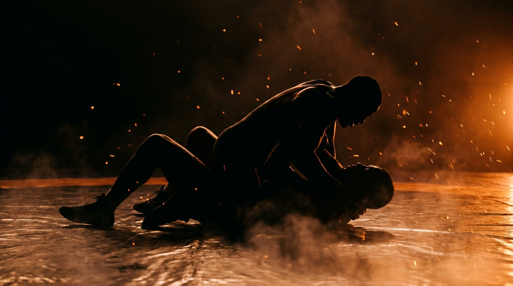

  
  
Ground · GrapplingSide-Control Ride

!!! warning "Provisional (WIP): built from the ground-wave spec, pending coach review"

    The top-side mirror of [Side-Control Escape](../side-control-escape/). Sourced from the Slime Mold Grappling Club catalog (Greg Souders / Standard Jiu-Jitsu), re-expressed with our threshold rules and GnP doctrine. Passed the build rubric on paper; awaits validation against a live grappling class.

GroundGrapplingOffensiveIntermediateControl → Finish

Hold side control and turn it into an arm or a better position before the bottom frames a knee back in.

  
Start<b>Top chest-to-chest in side control, near arm under the head, far under the armpit, inside a marked perimeter.</b>

  
→

  
The Goal<b>Top kills the frames and isolates a bent arm, or advances to mount; bottom frames and recovers.</b>

  
→

  
Finish<b>Bent-arm control 3s or advance to mount → top · Knee in, turn up, or reverse → bottom · Out of bounds → loss.</b>

  
A pin that goes nowhere  is just a rest.

  
Stay chest-to-chest, kill the near frames, then climb to the arm or to mount. <b>Prove control by advancing, not by sitting.</b>

What to Read

<b>Attune to</b> the <i>bottom's near elbow and the gap at the hip</i>, where their frames load and the instant one arm drifts off the body. That shift specifies <i>when a bent arm is there to trap</i> and <i>when the hips can switch to mount</i>, not a memorized pin. When they push to frame, the arm they push with is the arm to take.

The Starting Position

  
PlayersTwo, one top (attacker, side control), one bottom (defender).

  
PositionTop chest-to-chest and perpendicular, near arm under the head, far arm under the armpit, hands connected; bottom flat.

  
BoundaryA marked perimeter, both stay inside.

  
RolesTop maintains side control and works a bent-arm or an advance; bottom frames and recovers.

  
Start &amp; resetBegin from settled side control; reset on a bent-arm hold, an advance, an escape, or the count.

The Matchup

  

    
🥋

    
Top (Attacker)

    
Trying to hold side control and isolate a bent arm (kimura or americana), or advance to mount.

    Stay chest-to-chest and heavy, kill the near elbow and hip frames, switch your hips to follow the escape. When a frame extends an arm, trap it in a figure-four. Control is proven by the bent arm or the advance, not by resting.
  

  
VS

  

    
🤸

    
Bottom (Defender)

    
Trying to frame, get a knee back in, turn to the knees, or escape to seated or full guard.

    Keep the near elbow tight so it can't be isolated, frame the cross-face and hip, shrimp the knee through. Don't extend an arm into space, that's the arm they trap.
  

The Rules

  🎯 Top wins by a bent arm or an advanceThe top proves control by isolating one arm in a bent-arm figure-four (kimura / americana) held 3 seconds, or by improving to mount. Holding side control without a threat is a stall, not a win.
  🤜 Bottom wins by recoveringThe bottom wins by getting a knee back in (half guard or better), turning up to the knees, escaping to seated or full guard, or reversing. Mirrors <a href="../side-control-escape/">Side-Control Escape</a>.
  ⏱️ Hold the count or finishIf the top keeps side control for the set count (start at 20 seconds) without a bent arm or an advance, the round resets. If the bottom recovers first, the bottom wins. A clock, never "as long as possible".
  🚫 No striking until the top levelLevels 1 to 4 are control only, so both players read frames and weight before strikes are added. Strikes enter at the full-expression level.
  🎚️ GnP dial-up, by permissionOnce strikes are on, the coach explicitly grants a meaner dial on ground-and-pound: mid-grapple, strength is already compromised, so firmer strikes stay safe. Strikes are the disincentivization tool that punishes a lazy bottom structure. Ground games train smashing, not grappling for its own sake.
  ⬛ Stay inside the perimeterPlay happens inside a marked perimeter, any shape. If a player rolls fully out of it, that player loses the round, training mat-edge awareness.

How to Win

  
Win Top isolates a bent arm (3s) or advances to mount → top wins.A figure-four on one arm (kimura or americana) held three seconds is the shared entry to the side-control submission game; advancing to mount is the positional win. Either is the observable proof that the pin beat the frames. Finish slow, tap early.

  
Switch Bottom recovers a knee, turns up, or reverses → bottom wins, switch roles.Recovery is graded: a knee in (half guard) is the floor, then seated or full guard, then a reversal. See <a href="../../concepts/guard-recovery/">Guard Recovery</a>.

  
Reset Top holds side control the full count, no threat → reset, same roles.The top kept the pin but never isolated an arm or advanced before the count expired. Resets from settled side control.

  
Loss Roll fully out of the perimeter → that player loses.Crossing the marked perimeter loses the round instantly, regardless of position.

The Levels

  
1<b>Chest-to-chest pin</b>Deny the rotation.Top settles chest-to-chest and simply denies the bottom turning in or framing a knee through. Control only. Builds the heavy connection everything else rests on.

  
2<b>Isolate one arm</b>Trap the bent arm.Top reads an extended frame and traps that arm in a figure-four (kimura / americana), held 3 seconds. Reading which arm the bottom commits becomes the task.

  
3<b>Double-arm threat</b>Attack both sides.Top hunts the bent arm on either side, switching the attack as the bottom defends one. Keeps the bottom's elbows honest on both sides at once.

  
4<b>Open side to mount</b>Switch the hips and climb.Top loosens to a knee-on-belly or open side control and advances to mount as the base lightens. Adds the positional advance as a second win path.

  
5<b>Full expression</b>Continuous, strikes on.Continuous from settled side control, strikes live, until the top isolates an arm, advances, or the bottom recovers. The bottom's escapes are now urgent.

Recall Check

  
Test yourself before moving on. Answer out loud, then reveal what good looks like.

  

    
Q Why does the top win by a bent arm or an advance, not by holding?

    
Holding is a <b>stall</b>. A bent arm or a climb to mount is the <b>observable proof</b> the pin is doing work, and it keeps the top hunting instead of resting.

  

  

    
Q What hands the top the arm to trap?

    
An <b>extended frame</b>. When the bottom pushes with a straightening arm, that arm is exposed, trap it in the figure-four.

  

  

    
Q What does staying chest-to-chest buy the top?

    
It <b>kills the bottom's space to turn in</b> and keeps the weight connected, so every frame the bottom makes has to fight your chest first.

  

Go Deeper

??? note "Task focus &amp; coaching cues"

    
Each role's job

    

      

🥋

Top (Attacker)

Stay chest-to-chest and heavy, kill the near frames, switch hips to follow, trap the bent arm when a frame extends, climb to mount as the base lightens.

      

🤸

Bottom (Defender)

Keep the near elbow tight, frame the cross-face and hip, shrimp the knee through, never extend an arm into space.

    

    
Coaching cues

    

      

🔗

Arm or advance?

Ask the top: "Did you take the arm or improve, or just sit?" Keeps the ride hunting a finish instead of stalling for the count.

      

🧲

Stay connected

Ask the top: "Where did your chest go light?" Direct attention to the connection, the moment it lifts is the moment the bottom turns in.

    

??? abstract "Constraints-Led analysis"

    
Constraints → Affordances

    

      
Top wins by a bent arm or an advance→Forces an active finish, no stalling

      
Bent-arm hold, 3s→A clean, observable control proof short of a crank

      
Hold the count or finish→Urgency for the top, a real window for the bottom

      
Live, framing bottom→Keeps the frame-reading perception intact

    

    
Implements <b>Task Simplification</b> (Renshaw et al., 2019): each level isolates one control variable (deny rotation, isolate one arm, both arms, advance) while the top keeps reading frames from a live, resisting opponent. The arm-or-advance win keeps the representativeness, side control only matters if it leads somewhere.

    
What the top reads

    

      

✋

Haptic

The bottom's frames and the gap at the hip → which arm is exposed, when the hips can switch.

      

🧭

Proprioceptive

Own chest connection and base → whether the pin is still heavy, when a climb is safe.

      

👁️

Visual

An extended arm, a turning shoulder → the figure-four entry and the path to mount.

    

    
What we measure (order parameter)

    
Whether the top <b>isolates an arm or advances faster than the bottom recovers a knee or turns in</b>. Track arms and advances vs. escapes, and whether the top stays chest-to-chest through the bottom's frames. The trap-or-advance versus frame-and-recover race is the order parameter.

    
Representativeness

    
<b>Models:</b> holding side control and converting it to a submission or a better position before the bottom recovers, the exact problem on top in MMA and grappling.

    
Simplified: control ladderno strikes L1-4reset on the count

    
Mirror of <a href="../side-control-escape/">Side-Control Escape</a>; deepens the top side of <a href="../ground-control/">Ground Control</a>; the bent-arm transfers toward the side-control submission game.

    
Readiness to progress

    <ul class="emma-checklist">
      <li>Stays chest-to-chest through the bottom's frames</li>
      <li>Traps the arm a frame extends, not a forced crank</li>
      <li>Switches hips to follow the escape</li>
      <li>Climbs to mount when the base lightens</li>
    </ul>

    
Warning signs

    

      Sits and holds instead of threatening
      Chest lifts and the bottom turns in
      Cranks the arm instead of isolating it
      Never switches hips to follow
    

??? note "Safety &amp; related games"

    

      🤝 Controlled grappling, GnP by coach permission
      🛑 Bent-arm locks slow, tap early, no cranks
      🔁 Reset if the position stalls completely
    

    
Where it sits

    

      
Prerequisite→<a href="../ground-control/">Ground Control</a> · <a href="../side-control-escape/">Side-Control Escape</a>

      
Follow-on→<a href="../mount-maintenance/">Mount Maintenance</a>

      
Related→<a href="../../concepts/tko-pin/">TKO Pin</a> · <a href="../../concepts/decision-states/">Decision States</a>

    

