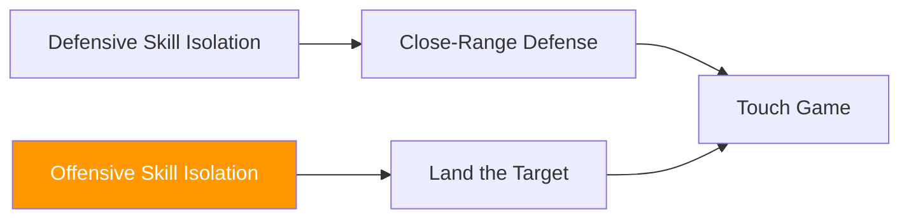

# Offensive Skill Isolation Games

!!! info "Coming Soon"
    This section will contain **offensive skill isolation games** — constrained drills that develop specific attacking skills.

---

## Planned Development

Offensive skill isolation games will focus on:

- **Single-skill offensive drills** (isolated attacks against controlled defense)
- **Timing and distance development** for specific strikes
- **Setup and feint isolation** (learning to create openings)

---

## How Offensive Isolation Differs from Defensive

| Aspect | Defensive Isolation | Offensive Isolation |
|--------|---------------------|---------------------|
| **Focus** | Defender learns specific solution | Attacker learns specific setup/attack |
| **Constraint** | Defender limited to one tool | Attacker limited to one objective |
| **Feedback** | Success = punch missed/deflected | Success = target landed |
| **Examples** | Parry the Straight, Slip the Straight | (Coming soon) |

---

## System Position

Offensive isolation games feed into **Land the Target** and other offensive development games.

---

!!! abstract "Development Notice"
    Games in this category are under development. Check back for updates.
