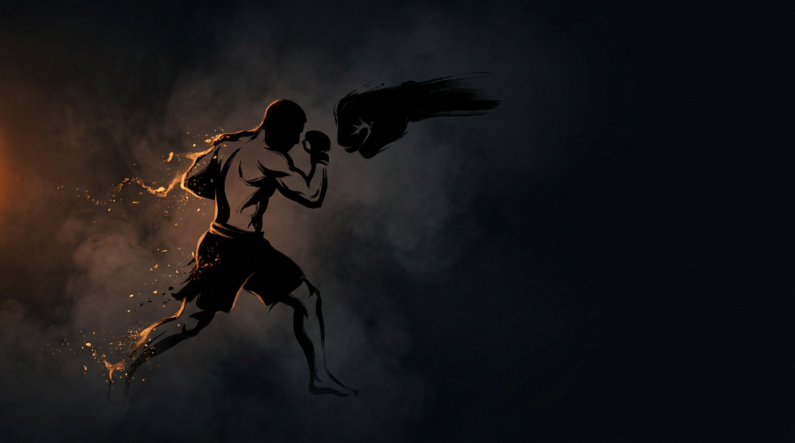

  
  
Skill Isolation · StrikingSlip the Straight

Skill IsolationStrikingDefensiveBeginnerOpen Space

Make straight punches miss with head movement, slip only, no block, no duck, no backing up.

  
Start<b>Two fighters at close range, inside a marked perimeter.</b>

  
→

  
The Goal<b>Attacker lands a clean straight to the head; defender moves the head offline so it misses.</b>

  
→

  
Finish<b>Clean slip → switch · Land clean → reset · Leave the perimeter → loss.</b>

  
Don't block it. Don't run from it,  move your head and make it miss.

  
Take away every defense but the slip and head movement is forced to develop on its own. <b>Read the rate the glove grows, not the eyes, and move offline in time.</b>

What to Read

<b>Attune to</b> the <i>rate of expansion</i> (τ) of the incoming straight, how fast the glove grows as it travels toward the head, read via shoulder–hip motion at <b>center mass</b>, not the opponent's eyes or their absolute distance. That information specifies <i>when</i> the punch arrives and <i>which way</i> to move the head offline.

The Starting Position

  
PlayersTwo, squared off in a neutral fighting stance.

  
RangeInside punching distance.

  
BoundaryA marked perimeter, both stay inside.

  
RolesOne attacker, one defender, switch on a clean slip.

  
Start &amp; resetThe attacker initiates; reset to center after each exchange.

The Matchup

  

    
🥊

    
Attacker

    
Trying to land a clean straight punch, jab or cross, to the defender's head.

    Straights to the head only, no hooks, uppercuts, or loops, no body shots. You set the problem: vary timing and which hand, add feints at higher levels, and ramp up only as the defender succeeds.
  

  
VS

  

    
🌀

    
Defender

    
Trying to move the head laterally offline so each straight passes by clean.

    No blocking, no ducking, no backing up, pure slipping. Small, efficient movements beat large dramatic ones; absorb while you read, then commit when confident.
  

The Rules

  🥊 Straights to the head onlyThe attacker throws only straight punches to the head, no hooks, uppercuts, or loops, and no body shots. Slipping works only on straight lines, and head targets keep the focus on head movement.
  🌀 Slip only, no block, no duckThe defender may <strong>only</strong> move the head laterally offline. Blocking, ducking, parrying, and backing up are off-limits, so the slipping solution is forced to develop.
  🚫 No continuous backing upThe defender can't keep retreating out of range to avoid exchanges, they must stay and solve the problem in the pocket.
  ⬛ Stay inside the perimeterPlay happens inside a marked perimeter, any shape (square, circle, taped lines). If both feet leave it, you lose instantly.
  ⏱️ Reset between strikesAt early levels the attacker pauses between strikes so the defender can recenter. Pressure becomes continuous as the levels rise.

How to Win

  
Switch Slip clean → switch roles.When the defender slips a punch cleanly, a full miss, not a graze, the players switch roles. The punch passed by the head without contact, and the defender earns the attacking role.

  
Reset Land clean → reset to center.When the attacker lands a clean punch to the head, reset to center, same roles. A clean, significant straight that got through. Begin again from a neutral stance, head on center.

  
Loss Leave the perimeter → loss.When both of a player's feet leave the perimeter, that player loses, whoever they are. Crossing the marked perimeter loses the game instantly, regardless of the exchange, training the cage-edge awareness a fighter needs.

The Levels

  
1<b>Single punch, fixed tempo</b>One straight at a time, reset between.Pure timing practice, one straight punch, fully reset between reps, no feints. Build the slip with zero time pressure.

  
2<b>Variable tempo</b>Single punches, no fixed reset.The attacker varies timing with no guaranteed reset, the defender has to read rhythm and stay switched on.

  
3<b>Add feints</b>Real vs. fake.The attacker can feint before throwing. Slipping a feint is wasted movement, the defender must distinguish real from fake.

  
4<b>Two-punch combinations</b>Jab-cross.Two-punch combos, still straights only, slip both punches and recover center between them.

  
5<b>Counter after slip</b>One counter allowed.After a successful slip the defender may throw one counter, teaching the slip as a setup for offense, not just survival.

  
6<b>Full MMA</b>Add shot / clinch threat.The attacker can now shoot or clinch too, slip while denying the grappling entry, staying aware of all threats.

Recall Check

  
Test yourself before moving on. Answer out loud, then reveal what good looks like.

  

    
Q What are you reading to time the slip, and what does it tell you?

    
The <b>rate of expansion (τ)</b> of the straight (how fast the glove grows) read via shoulder and hip motion at <b>center mass</b>, not the eyes or absolute distance. It specifies <b>when</b> the punch arrives and <b>which way</b> to move the head offline.

  

  

    
Q Don't block it, don't run from it: so what is the defender's only job?

    
<b>Move the head laterally offline</b> so the straight passes by clean. Stripping away block, duck, and retreat forces the slip to develop on its own.

  

  

    
Q What's the difference between a clean slip and a graze, and why does size of movement matter?

    
A clean slip is a <b>full miss</b>, the punch passes completely. A graze doesn't count. <b>Small, efficient slips beat big dramatic ones</b>, and recover to center faster.

  

  

    
Q Which way do you slip, and off what cue?

    
Slip to the <b>opposite side of the loading hand</b>: read the shoulder rotation and which hand loads at center mass to pick the direction.

  

Go Deeper

??? note "Task focus &amp; coaching cues"

    
Each role's job

    

      

🥊

Attacker

Land clean straights to the head; vary timing and which hand; scale difficulty to the partner.

      

🌀

Defender

Move the head left or right to make the punch miss; slip early; return to center after each slip.

    

    
Coaching cues

    

      

👁️

See center mass

Don't track the gloves or the eyes. Center mass keeps shoulder &amp; hip motion in view, "the little X", and shows which hand is loading. The eyes lie.

      

🎯

Miss, don't graze

The punch should pass by completely, not brush you. Small, efficient slips beat big dramatic ones, and one clean miss beats ten late ones.

    

??? abstract "Constraints-Led analysis"

    
Constraints → Affordances

    

      
Straights only→Defender perceives slip-able attacks

      
Slip-only→Forces exploration of head-movement solutions

      
Head strikes only→Clear target zone for both roles

      
Reset between exchanges→Time to recenter and process

      
Close range→Slipping is necessary and viable

    

    
Implements <b>Constrain to Afford</b> (Renshaw et al., 2019), different fighters develop different slip patterns based on height, reaction time, and stance.

    
What the defender reads

    

      

👁️

Visual

Shoulder rotation &amp; which hand loads → direction to slip (opposite side).

      

🧭

Proprioceptive

Head position relative to centerline → confirming the evasion.

      

⚖️

Balance

Balance during and after the slip → recovery to neutral.

    

    
What we measure (order parameter)

    
Whether the defender's <b>slip lands in time with the punch</b>, track clean misses vs. shots eaten, and whether the head re-sets to center between strikes. That timing relationship is the order parameter; when it stabilizes, the skill has formed.

    
Representativeness

    
<b>Models:</b> making straight punches miss with head movement in open-space exchanges.

    
Simplified: straights onlyhead onlyslip only

    
Isolates the solution before integration, transfers into <a href="../evade-the-punch/">Evade the Punch</a>.

    
Readiness to progress

    <ul class="emma-checklist">
      <li>Clean misses ~70%+ (not grazes)</li>
      <li>Slips both jab and cross</li>
      <li>Returns to center without being reminded</li>
      <li>Can describe what they read ("I see the shoulder")</li>
    </ul>

    
Warning signs

    

      Slips too late and gets grazed
      Only slips one direction
      Slips drift into blocking
    

??? note "Safety &amp; related games"

    

      🤝 Light-to-moderate contact
      🛑 Stop on freezing, lost composure, or excessive force
      🔁 Reset if the defender starts blocking instead of slipping
    

    
Where it sits

    

      
Prerequisite→None, this is foundational

      
Follow-on→<a href="../evade-the-punch/">Evade the Punch</a> · <a href="../close-range-defense/">Close-Range Defense</a>

      
Related→<a href="../../concepts/defensive-solutions/">Defensive Solutions</a>

    

