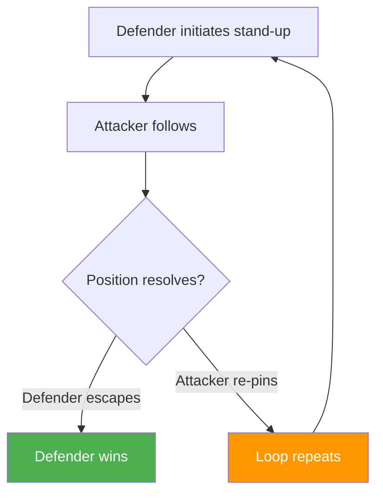
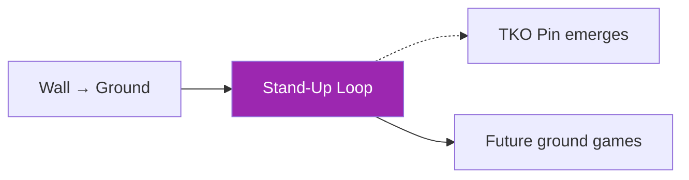

# Wall Stand-Up & Re-Pin Loop

!!! info "Game Identity"
    - **Problem:** Repeated stand-up and control cycles near the wall
    - **Environment:** Wall / Ground (hybrid)
    - **Stage:** Counter ↔ Stabilize

This game teaches the **cyclical nature of wall fighting**. Positions near the wall rarely resolve in a single action — athletes cycle between ground control, stand-up attempts, and re-pinning.

---

## Goal

This is an **asymmetric game** with cyclical dynamics.

| Role | Objective |
|------|-----------|
| **Defender** | Stand using the wall, turn to face, and disengage or reverse |
| **Attacker** | Prevent disengagement, re-pin, or flatten to re-establish control |

The objective is **loop management** — understanding how positions cycle.

---

## Entry Condition

- Defender starts in a compromised ground position near wall (seated, turtle, or elbow-post)
- Attacker has partial control but not full pin
- Wall is accessible to defender
- Reset if defender fully disengages or attacker establishes TKO pin

---

## Invariants

1. Wall access is always available to defender
2. Disengagement ends the exchange — defender wins
3. Control must be re-earned after each stand-up attempt

---

## Key Logic: The Stand-Up Cycle

### Wall as Double-Edged Constraint

The wall helps **both** athletes:

| Athlete | How Wall Helps |
|---------|----------------|
| **Defender** | Provides structure to build base and stand |
| **Attacker** | Limits escape routes and provides pinning surface |

The athlete who uses the wall more intelligently gains advantage.

### Turning Before Disengaging

!!! danger "Critical Defensive Principle"
    **Turn to face before attempting to disengage.**

| Approach | Result |
|----------|--------|
| Disengage while facing away | Back exposed, re-clinch easy, striker access dangerous |
| Turn first, then disengage | Defensive posture established, disengage viable, counter available |

---

## Win Conditions

| Role | Win Conditions |
|------|----------------|
| **Defender** | Standing + disengaging (creating space while facing attacker) OR reversing (achieving dominant position) |
| **Attacker** | Re-pin (re-establishing wall control) OR flattening (returning to ground control) OR TKO pin |

Multiple win conditions reflect the cyclical nature of the position.

---

## Levels

=== "Level 1 — Stand-Up"
    - Focus on rising from compromised position using wall
    - No strikes
    - Success = standing with wall behind

=== "Level 2 — Stand-Up + Disengage"
    - Must turn to face and create space
    - Attacker follows aggressively
    - Success = facing attacker with space to reset

=== "Level 3 — Stand-Up + Reversal"
    - Defender attempts to achieve dominant position
    - Reversal = defender now has attacker pinned
    - Highest difficulty — requires reading attacker's balance

---

## Advanced Expressions (Coach Context)

**For defenders:**

- Stand-up timing becomes precise — act during attacker adjustment
- Wall usage becomes efficient — minimal effort, maximum effect
- Turn-and-face becomes automatic
- Reversal opportunities emerge from attacker over-commitment

**For attackers:**

- Following becomes controlled, not desperate
- Re-pinning becomes smooth — continuous control through transitions
- Flattening becomes available when stand-up is anticipated
- TKO pin access emerges from successful re-pins

!!! tip "Advanced Insight"
    At advanced levels, athletes recognize **which part of the loop favors them** and work to stay there.

---

## System Position

This game teaches that **positions are not static** — they cycle.

---

!!! abstract "System Evolution Notice"
    Loop dynamics may evolve as patterns are observed.
