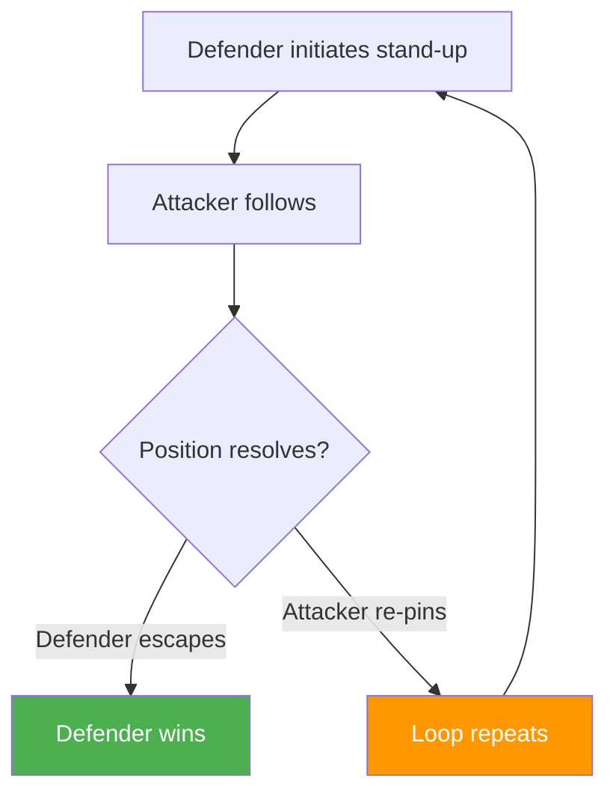
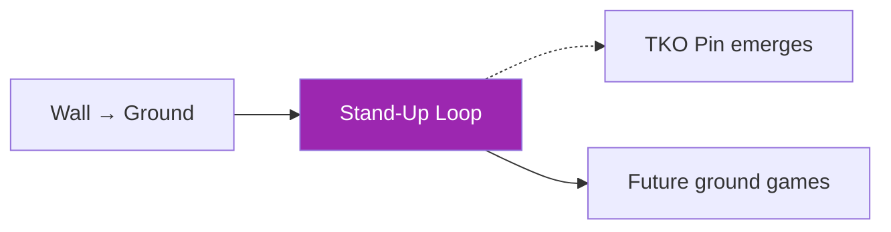

# Wall Stand-Up & Re-Pin Loop

!!! info "Game Identity"
    - **Problem:** Repeated stand-up and control cycles near the wall
    - **Environment:** Wall / Ground (hybrid)
    - **Stage:** Counter ↔ Stabilize

This game teaches the **cyclical nature of wall fighting**. Positions near the wall rarely resolve in a single action — athletes cycle between ground control, stand-up attempts, and re-pinning.

---

## Goal

This is an **asymmetric game** with cyclical dynamics.

| Role | Objective |
|------|-----------|
| **Defender** | Stand using the wall, turn to face, and disengage or reverse |
| **Attacker** | Prevent disengagement, re-pin, or flatten to re-establish control |

The objective is **loop management** — understanding how positions cycle.

---

## Entry Condition

- Defender starts in a compromised ground position near wall (seated, turtle, or elbow-post)
- Attacker has partial control but not full pin
- Wall is accessible to defender
- Reset if defender fully disengages or attacker establishes TKO pin

---

## Invariants

1. Wall access is always available to defender
2. Disengagement ends the exchange — defender wins
3. Control must be re-earned after each stand-up attempt

---

## Key Logic: The Stand-Up Cycle

### Wall as Double-Edged Constraint

The wall helps **both** athletes:

| Athlete | How Wall Helps |
|---------|----------------|
| **Defender** | Provides structure to build base and stand |
| **Attacker** | Limits escape routes and provides pinning surface |

The athlete who uses the wall more intelligently gains advantage.

### Turning Before Disengaging

!!! danger "Critical Defensive Principle"
    **Turn to face before attempting to disengage.**

| Approach | Result |
|----------|--------|
| Disengage while facing away | Back exposed, re-clinch easy, striker access dangerous |
| Turn first, then disengage | Defensive posture established, disengage viable, counter available |

---

## Win Conditions

| Role | Win Conditions |
|------|----------------|
| **Defender** | Standing + disengaging (creating space while facing attacker) OR reversing (achieving dominant position) |
| **Attacker** | Re-pin (re-establishing wall control) OR flattening (returning to ground control) OR TKO pin |

Multiple win conditions reflect the cyclical nature of the position.

---

## Levels

=== "Level 1 — Stand-Up"
    - Focus on rising from compromised position using wall
    - No strikes
    - Success = standing with wall behind

=== "Level 2 — Stand-Up + Disengage"
    - Must turn to face and create space
    - Attacker follows aggressively
    - Success = facing attacker with space to reset

=== "Level 3 — Stand-Up + Reversal"
    - Defender attempts to achieve dominant position
    - Reversal = defender now has attacker pinned
    - Highest difficulty — requires reading attacker's balance

=== "Level 4 — Full MMA Expression"
    - Light strikes permitted for both players
    - Attacker uses strikes to discourage stand-up and re-establish control
    - Defender uses strikes to create stand-up opportunities
    - Ground-and-pound threat makes positional cycling more urgent
    - Focus: Wall stand-up dynamics under realistic striking pressure
    - See: [Full MMA Expression](../concepts/full-mma-expression.md)

---

## Constraints Analysis

*How this game applies the [Constraints-Led Approach](../principles/cla/index.md)*

| Constraint Type | Constraint | Affordance Created |
|-----------------|------------|-------------------|
| **Task** | Start from compromised ground position near wall | Realistic disadvantaged starting point |
| **Task** | Wall access always available | Stand-up option always exists |
| **Task** | Disengagement ends exchange (defender win) | Clear success criteria |
| **Task** | Control must be re-earned after each stand-up | Creates cyclical dynamics |
| **Individual** | Prerequisite: Wall to Ground | Understands ground-to-standing transitions |
| **Environmental** | Wall/ground hybrid | Both environmental constraints active |

!!! info "Theoretical Foundation"
    This game develops **loop perception**—understanding that positions cycle rather than resolve cleanly. Both athletes learn to recognize **which part of the loop favors them** and work to stay there. The wall constraint helps both (defender for stand-up, attacker for pinning surface), creating rich tactical dynamics where the same environment affords different solutions (Renshaw et al., 2019).

---

## Information Structure

*What athletes must perceive to succeed (perception-action coupling)*

### Defender Perceives

| Information Source | What to Read | Action It Supports |
|--------------------|--------------|-------------------|
| **Visual** | Wall position | Stand-up direction |
| **Haptic** | Attacker's adjustment moments | Stand-up timing |
| **Haptic** | Control looseness | When to initiate |
| **Proprioceptive** | Own base position | Stand-up method |
| **Proprioceptive** | Facing direction | Turn-before-disengage readiness |

### Attacker Perceives

| Information Source | What to Read | Action It Supports |
|--------------------|--------------|-------------------|
| **Haptic** | Defender's stand-up initiation | Follow/re-pin timing |
| **Visual** | Defender's base building | Anticipate stand-up direction |
| **Visual** | Defender's facing direction | Re-pin or flatten decision |
| **Proprioceptive** | Own position relative to wall | Re-pinning path |

!!! tip "Coaching Cue"
    Ask defenders: "Did you turn before disengaging?" Turning to face before attempting to disengage is critical—disengaging while facing away exposes the back. Ask attackers: "Did you re-pin or flatten?" to develop decision-making.

---

## Representativeness

*How this game models real MMA situations*

### Real MMA Situation

The grinding stand-up battle near the cage—positions cycling between ground control, stand-up attempts, and re-clinching.

### How This Game Represents It

| Element | Real MMA | This Game | Fidelity |
|---------|----------|-----------|----------|
| **Cyclical dynamics** | Common near cage | Same | High |
| **Wall as double-edged constraint** | Helps both | Same | High |
| **Turn-before-disengage** | Critical principle | Same | High |
| **Re-pinning dynamics** | Common pattern | Same | High |
| **Strikes** | Available throughout | Progressive by level | Scaffolded |

### Simplifications & Justification

| Simplification | Why Acceptable |
|----------------|----------------|
| Start from compromised position | Isolates stand-up skill |
| Clear win conditions | Structure for evaluation |
| Progressive striking | Develops mechanics first |

!!! note "Transfer Expectation"
    Stand-up loop dynamics developed here transfer directly to MMA cage fighting. The perception of loop timing—when to stand, when to flatten, when to re-pin—is identical in competition.

---

## Variability Guidelines

*Creating "repetition without repetition" (Bernstein, 1967)*

### Within-Level Variability

| Vary This | How | Maintains |
|-----------|-----|-----------|
| **Starting position** | Turtle, seated, elbow post | Multiple stand-up problems |
| **Attacker style** | Aggressive followers, patient re-pinners | Multiple solutions |
| **Attacker size** | Larger, smaller, equal | Adaptability |
| **Loop length** | Encourage quick cycles, allow extended exchanges | Timing development |
| **Intensity** | Drilling pace, live pace | Pressure calibration |

### What NOT to Vary

| Keep Constant | Why |
|---------------|-----|
| Wall access available | Core environmental constraint |
| Disengagement ends exchange | Maintains clear success criteria |
| Control must be re-earned | Creates realistic cycling |

### Progressing Through Levels

| Signal to Progress | Meaning |
|--------------------|---------|
| Stands consistently | Basic skill developing |
| Disengages after standing | Complete sequence |
| Reversals emerge | Ready for advanced level |

---

## Readiness Indicators

*When is the athlete ready to advance?*

### Ready for Next Level When

- [ ] Stands using wall efficiently
- [ ] Turns to face before disengaging
- [ ] Manages re-pin attempts
- [ ] Can articulate: "I stood when they adjusted..."
- [ ] Understands loop dynamics

### Ready to Exit Game When

- [ ] Level 2+ competence (disengages after standing)
- [ ] Loop timing is instinctive
- [ ] Reversals available from attacker over-commitment
- [ ] Stand-up loop appears in sparring

### Warning Signs (Not Ready to Progress)

| Sign | Meaning | Response |
|------|---------|----------|
| Can't stand at all | Mechanics lacking | Focus on stand-up fundamentals |
| Gets re-pinned immediately | Timing/technique issue | Slow down, work timing |
| Disengages facing away | Missing critical principle | Emphasize turn-before-disengage |
| Always gets flattened | Reading attacker poorly | Work on attacker anticipation |

---

## Advanced Expressions (Coach Context)

**For defenders:**

- Stand-up timing becomes precise — act during attacker adjustment
- Wall usage becomes efficient — minimal effort, maximum effect
- Turn-and-face becomes automatic
- Reversal opportunities emerge from attacker over-commitment

**For attackers:**

- Following becomes controlled, not desperate
- Re-pinning becomes smooth — continuous control through transitions
- Flattening becomes available when stand-up is anticipated
- TKO pin access emerges from successful re-pins

!!! tip "Advanced Insight"
    At advanced levels, athletes recognize **which part of the loop favors them** and work to stay there.

---

## System Position

This game teaches that **positions are not static** — they cycle.

---

!!! abstract "System Evolution Notice"
    Loop dynamics may evolve as patterns are observed.
