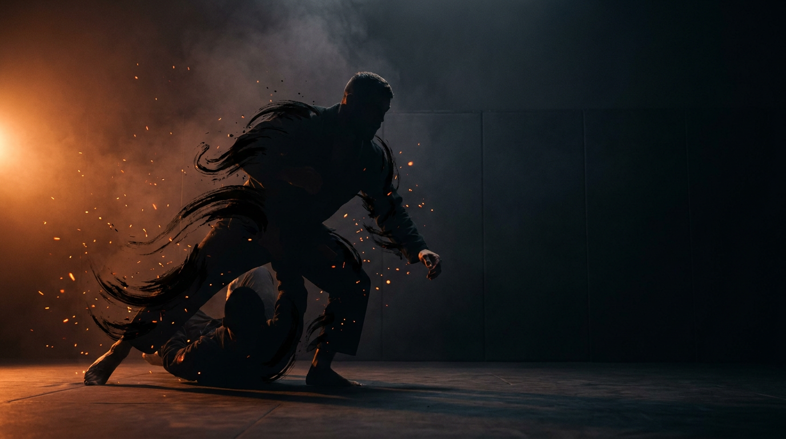

  
  
Wall / Ground · WrestlingWall Stand-Up &amp; Re-Pin Loop

Wall / GroundWrestlingCombinedAdvancedCounter ↔ Stabilize

Wall positions cycle rather than resolve — the defender stands and disengages while the attacker re-pins or flattens, and the skill is staying in the part of the loop that favors you.

  
Start<b>Defender compromised on the ground near the wall; attacker has partial control.</b>

  
→

  
The Goal<b>Defender stands, faces, disengages or reverses; attacker re-pins, flattens, or pins for TKO.</b>

  
→

  
Finish<b>Stand &amp; disengage or reverse → defender · Re-pin, flatten, or TKO pin → attacker.</b>

  
The position doesn't end — it loops.

  
Each stand-up forces control to be re-earned. <b>Win by living where the cycle favors you.</b>

Key Positions

  🧱 Wall pinAt least two points of pinning control — the hips and upper body held immobile and flat to the wall. If the shoulders can still rotate, it's pressure, not a pin.

What to Read

<b>Attune to</b> the <i>felt resistance to rotation through the attacker's grips and the looseness in their control</i> — the moments the load eases as they adjust their grip or shift weight. That changing resistance specifies <i>when</i> to initiate the stand-up and <i>which way</i> to turn — not the attacker's eyes or a fixed count.

The Starting Position

  
PlayersTwo — one defender standing up, one attacker preventing it.

  
PositionDefender compromised — seated, turtle, or elbow-post — near the wall; attacker has partial control.

  
BoundaryWall or cage within a marked perimeter, on mats.

  
RolesDefender stands, faces, disengages or reverses; attacker re-pins, flattens, or pins for TKO.

  
Start &amp; resetBegin compromised; reset on full disengage or TKO pin.

The Matchup

  

    
🛡️

    
Defender

    
Trying to stand using the wall, turn to face, and disengage or reverse.

    Use the wall to build base and rise. Turn to face <em>before</em> disengaging — disengaging while facing away exposes the back. Time the stand-up to the attacker's adjustment moments.
  

  
VS

  

    
🧱

    
Attacker

    
Trying to prevent disengagement — re-pin, flatten, or reach a TKO pin.

    Follow the stand-up under control, not desperately. Decide between re-pinning to the wall or flattening back to the ground based on the defender's facing direction. Control is re-earned every cycle.
  

The Rules

  🧱 Wall access always availableThe wall is always reachable for the defender — the stand-up option always exists. It is the core environmental constraint of the game.
  🚪 Disengagement ends the exchangeWhen the defender disengages, the exchange is over and the defender wins. This keeps the success criteria clear.
  🔁 Control is re-earned each cycleAfter every stand-up attempt the attacker must re-earn control — this is what creates the cyclical, looping dynamic.
  ↪️ Turn to face before disengagingTurn to face before attempting to disengage — disengaging while facing away exposes the back to re-clinch and striker access.
  ⬛ Stay inside the perimeterPlay happens against a wall or cage within a marked perimeter — any shape. Both players stay inside it.

How to Win

  
Defender Stand &amp; disengage facing, or reverse → defender wins.Standing and facing the attacker with space to reset, or a clean reversal that puts the attacker on the defensive.

  
Attacker Re-pin, flatten, or TKO pin → attacker wins.When the attacker re-pins to the wall, flattens back to ground control, or reaches a TKO pin. Multiple win conditions reflect the cyclical nature of the position — the attacker can win at any point in the loop.

The Levels

  
1<b>Stand-up</b>Rise using the wall.No strikes. Success is standing with the wall behind you — the rising-from-compromised mechanic itself.

  
2<b>Stand-up + disengage</b>Turn, face, create space.Must turn to face and create space; attacker follows aggressively. Success is facing the attacker with space to reset.

  
3<b>Stand-up + reversal</b>Take the dominant position.Defender attempts to pin the attacker. Highest difficulty — requires reading the attacker's balance.

  
4<b>Full MMA</b>Strikes both ways.Light strikes — attacker discourages stand-up and re-establishes control, defender creates stand-up openings. Ground-and-pound threat makes cycling urgent.

Go Deeper

??? note "Task focus &amp; coaching cues"

    
Each role's job

    

      

🛡️

Defender

Build base and stand using the wall, time the rise to the attacker's adjustment, turn to face before disengaging, look for the reversal.

      

🧱

Attacker

Follow under control, choose re-pin vs. flatten by the defender's facing direction, re-earn control each cycle, work toward a TKO pin.

    

    
Coaching cues

    

      

↪️

Turn before disengaging

Ask defenders: "Did you turn before disengaging?" Disengaging while facing away exposes the back — turn to face first.

      

🔀

Re-pin or flatten?

Ask attackers: "Did you re-pin or flatten?" to develop the decision between returning to the wall and returning to the ground.

    

??? abstract "Constraints-Led analysis"

    
Constraints → Affordances

    

      
Start from compromised ground position→Realistic disadvantaged starting point

      
Wall access always available→The stand-up option always exists

      
Disengagement ends the exchange→Clear success criteria

      
Control re-earned each cycle→Creates the cyclical loop dynamic

      
Wall / ground hybrid→Both environmental constraints active at once

    

    
Implements <b>Constrain to Afford</b> (Renshaw et al., 2019) — develops loop perception: positions cycle rather than resolve cleanly, and the wall affords different solutions to each player.

    
What the players read

    

      

✋

Haptic

Defender: attacker's adjustment moments and control looseness → stand-up timing. Attacker: stand-up initiation → follow/re-pin timing.

      

👁️

Visual

Defender: wall position → stand-up direction. Attacker: defender's base building and facing direction → re-pin or flatten decision.

      

🧭

Proprioceptive

Defender: own base and facing direction → stand-up method and turn-before-disengage readiness.

    

    
What we measure (order parameter)

    
Whether the attacker keeps the defender's <b>shoulders and hips pinned flat vs. free to rotate up and away</b> across each cycle — track control time held through the loop and whether the defender turns to face before disengaging. The press→pin-or-stand phase transition is the order parameter, repeating each cycle; the skill has formed when the defender consistently times the rise to the moments control loosens.

    
Representativeness

    
<b>Models:</b> the grinding stand-up battle near the cage — positions cycling between ground control, stand-up attempts, and re-clinching, identical to competition.

    
Simplified: start compromisedclear win conditionsprogressive striking

    
Builds on <a href="../wall-to-ground/">Wall to Ground</a>; feeds future ground games as TKO Pin access emerges.

    
Readiness to progress

    <ul class="emma-checklist">
      <li>Stands using the wall efficiently</li>
      <li>Turns to face before disengaging</li>
      <li>Manages re-pin attempts</li>
      <li>Understands loop dynamics</li>
      <li>Can describe: "I stood when they adjusted…"</li>
    </ul>

    
Warning signs

    

      Can't stand at all
      Gets re-pinned immediately
      Disengages facing away
      Always gets flattened
    

??? note "Safety &amp; related games"

    

      🤝 Light-to-moderate contact
      🛑 Stop on lost composure or unsafe scramble
      🔁 Reset if cycling stalls without progress
    

    
Where it sits

    

      
Prerequisite→<a href="../wall-to-ground/">Wall to Ground</a>

      
Follow-on→Future ground games · TKO Pin emerges

      
Related→<a href="../../concepts/tko-pin/">TKO Pin</a> · <a href="../../concepts/full-mma-expression/">Full MMA Expression</a>

    

