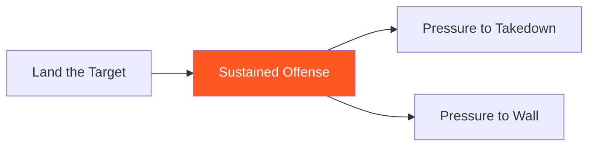

# Sustained Offense

!!! info "Game Identity"
    - **Problem:** Maintaining offensive rhythm through opponent's defensive attempts
    - **Environment:** Open Space
    - **Stage:** Access → Stabilize (Offensive Dominance)

This is an **intermediate offensive game** that teaches maintaining attack through resistance. The attacker learns to continue striking when the opponent attempts to counter, escape, or nullify — without losing rhythm or resetting.

---

## Goal

This is an **asymmetric game** with distinct roles.

| Role | Objective |
|------|-----------|
| **Attacker** | Maintain continuous striking offense through defensive attempts |
| **Defender** | Interrupt attacker's rhythm through counters, movement, or clinch |

The objective is **sustained pressure**, not single-shot landing.

---

## Entry Condition

- Attacker starts with initiative (slight forward pressure)
- Defender in defensive posture
- Attacker attempts to maintain continuous offense
- Reset when attacker's rhythm is fully broken or defender escapes

---

## Invariants

1. Attacker must **continue offense** — single shots followed by reset don't count
2. Defender actively tries to **interrupt** — not passive defense
3. Brief defensive moments by attacker are allowed if rhythm continues
4. Full reset by attacker = defender succeeds

---

## Task Focus

### Attacker
- Chain strikes into combinations
- When defender counters, evade/absorb seamlessly and continue
- When defender moves, follow and continue
- When defender clinches, disengage and continue

### Defender
- Counter after defensive moments
- Move to create space
- Clinch to break rhythm
- Shoot to threaten takedown

!!! question "Key Internal Questions — Attacker"
    - "Can I continue after this defensive moment?"
    - "Am I following their movement or chasing?"
    - "Is my rhythm broken or just paused?"

---

## Key Logic: Seamless Defense Within Offense

!!! note "The Core Skill"
    The attacker's defensive awareness doesn't interrupt their offense:

    | Defender Attempts | Attacker Response |
    |-------------------|-------------------|
    | Counter strike | Slip/absorb, continue |
    | Move away | Follow, continue |
    | Clinch | Disengage, continue |
    | Shoot | Sprawl, continue |

    The key: **continue without full reset**.

This is different from basic offense (landing targets) — it's about maintaining pressure through resistance.

---

## Win Conditions

| Role | Win Condition |
|------|---------------|
| **Attacker** | Sustained offensive sequence (e.g., 10+ seconds of continuous pressure) |
| **Defender** | Force attacker to fully reset and re-engage |

**On attacker win:** Roles switch.
**On defender win:** Reset, same roles, defender continues trying to break rhythm.

---

## Levels

=== "Level 1 — Counter Strikes Only"
    - Defender can only counter-strike
    - Attacker maintains rhythm through counters
    - Focus: Seamless defense within offense

=== "Level 2 — Add Movement"
    - Defender can counter AND move to escape
    - Attacker must follow while maintaining rhythm
    - Focus: Pressure without chasing

=== "Level 3 — Add Clinch"
    - Defender can counter, move, AND clinch
    - Attacker must disengage and continue
    - Focus: Managing clinch attempts

=== "Level 4 — Full MMA Expression"
    - Defender can counter, move, clinch, OR shoot
    - Attacker must maintain rhythm through all threats
    - Focus: Sustained offense under MMA reality
    - See: [Full MMA Expression](../concepts/full-mma-expression.md)

---

## Constraints Analysis

*How this game applies the [Constraints-Led Approach](../principles/cla/index.md)*

| Constraint Type | Constraint | Affordance Created |
|-----------------|------------|-------------------|
| **Task** | Attacker must continue (no full reset) | Develops seamless defense-within-offense |
| **Task** | Defender actively interrupts (not passive) | Creates realistic resistance to maintain rhythm against |
| **Task** | Progressive defender tools (counter → move → clinch → shoot) | Scaffolded learning of pressure maintenance |
| **Task** | Duration-based win (sustained sequence) | Rewards continuous pressure, not single moments |
| **Individual** | Prerequisite: Land the Target | Foundation of hitting targets exists |
| **Environmental** | Open space with movement | Attacker must follow, not just stand and throw |

!!! info "Theoretical Foundation"
    This game develops **attacking degeneracy**—multiple ways to maintain offensive rhythm. The constraints force the attacker to integrate defensive awareness without breaking flow, developing what Renshaw et al. (2019) call "adaptability under pressure." The attacker isn't learning a fixed combination; they're learning to solve the continuous problem of maintaining offense.

---

## Information Structure

*What athletes must perceive to succeed (perception-action coupling)*

### Attacker Perceives

| Information Source | What to Read | Action It Supports |
|--------------------|--------------|-------------------|
| **Visual** | Defender's counter initiation | Slip/absorb while continuing |
| **Visual** | Defender's movement direction | Follow without overchasing |
| **Visual** | Defender's clinch attempt setup | Disengage or frame and continue |
| **Visual** | Defender's level change | Sprawl preparation while striking |
| **Haptic** | Contact on blocks/parries | Adjust targets without stopping |
| **Proprioceptive** | Own rhythm and balance | Maintain flow through defensive moments |

### Defender Perceives

| Information Source | What to Read | Action It Supports |
|--------------------|--------------|-------------------|
| **Visual** | Attacker's pattern and gaps | When to counter |
| **Visual** | Attacker's forward pressure | When to move, clinch, or shoot |
| **Haptic** | Attacker's weight and rhythm | Best interruption method |

!!! tip "Coaching Cue"
    Ask attackers: "What happened? Did you continue or reset?" This develops awareness of rhythm breaks. The goal is continuity, not perfection—brief defensive moments within offense are expected and desired.

---

## Representativeness

*How this game models real MMA situations*

### Real MMA Situation

Pressing an opponent with sustained combinations while they try to escape, counter, clinch, or shoot—the pressure fighting phase of MMA.

### How This Game Represents It

| Element | Real MMA | This Game | Fidelity |
|---------|----------|-----------|----------|
| **Offensive rhythm** | Sustained combinations | Same | High |
| **Defensive resistance** | Counters, movement, clinch, takedown | Progressive by level | Scaffolded |
| **Pressure intensity** | Full power possible | Controlled contact | Reduced |
| **Consequence** | Damage, finish | Role switch | Reduced |
| **Wrestling threat** | Always present | Added at Level 4 | Progressive |

### Simplifications & Justification

| Simplification | Why Acceptable |
|----------------|----------------|
| Progressive defender tools | Allows focused development of each rhythm-maintenance skill |
| Controlled contact | Safety while learning flow |
| Clear duration win | Provides structure for evaluation |

!!! note "Transfer Expectation"
    The rhythm-maintenance skill transfers directly to live sparring and competition. Athletes who can continue offense through resistance become effective pressure fighters. The perception of "my rhythm" vs. "broken rhythm" is identical in competition.

---

## Variability Guidelines

*Creating "repetition without repetition" (Bernstein, 1967)*

### Within-Level Variability

| Vary This | How | Maintains |
|-----------|-----|-----------|
| **Defender style** | Some counter heavily, some move, some clinch | Multiple rhythm solutions |
| **Defender activity level** | Passive resistance, active resistance | Intensity calibration |
| **Duration requirement** | 10-second sequences, 20-second sequences | Endurance development |
| **Partner size/speed** | Faster defenders, larger defenders | Adaptability |
| **Offensive tools** | Hands-only rounds, add kicks | Weapon variety in rhythm |

### What NOT to Vary

| Keep Constant | Why |
|---------------|-----|
| Attacker must continue (no full reset) | Core constraint defining the game |
| Defender actively interrupts | Maintains representative resistance |
| Sequence-based win | Maintains rhythm focus |

### Progressing Through Levels

| Signal to Progress | Meaning |
|--------------------|---------|
| Maintains rhythm through current defender tools | Ready for more interruption methods |
| Seamless defense within offense | Integration occurring |
| Follows movement without breaking rhythm | Pressure quality developing |

---

## Readiness Indicators

*When is the athlete ready to advance?*

### Ready for Next Level When

- [ ] Maintains rhythm through current level's defender tools
- [ ] Defensive moments (slipping counters, etc.) don't break flow
- [ ] Follows movement without resetting
- [ ] Can articulate: "I slipped and continued" vs. "I got hit and reset"
- [ ] Rhythm quality consistent across different defenders

### Ready to Exit Game When

- [ ] Level 3+ competence (handles clinch attempts)
- [ ] Sustained pressure feels natural, not forced
- [ ] Ready to add pressure objectives (wall, takedown)
- [ ] Rhythm maintenance appears in live sparring

### Warning Signs (Not Ready to Progress)

| Sign | Meaning | Response |
|------|---------|----------|
| Full resets after every exchange | Rhythm not developed | Slower tempo, less defender activity |
| Chasing defender frantically | Following without purpose | Emphasize measured pursuit |
| Gets hit cleanly and stops | Counter management lacking | Return to previous level |
| Ignores counters (just throws through them) | Not integrating defense | Emphasize "continue, don't ignore" |

---

## Safety

- **Contact limits:** Light to moderate
- **Stop conditions:** Attacker chasing recklessly, excessive force
- **Coach intervention:** Reset if exchanges become chaotic

---

## System Position

- **Prerequisite games:** Land the Target
- **Follow-on games:** Pressure to Takedown, Pressure to Wall
- **Related concepts:** Three Zones, Confidence Rating

---

!!! abstract "System Evolution Notice"
    This game may be refined as sustained offense patterns emerge.
