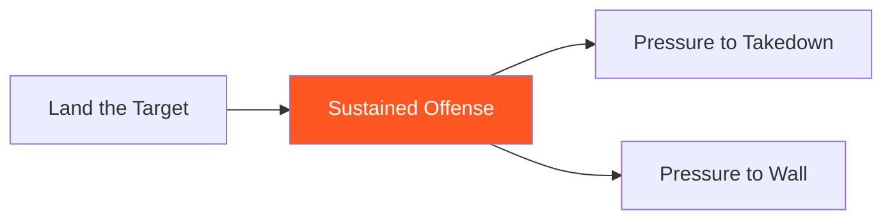

# Sustained Offense

!!! info "Game Identity"
    - **Problem:** Maintaining offensive rhythm through opponent's defensive attempts
    - **Environment:** Open Space
    - **Stage:** Access → Stabilize (Offensive Dominance)

This is an **intermediate offensive game** that teaches maintaining attack through resistance. The attacker learns to continue striking when the opponent attempts to counter, escape, or nullify — without losing rhythm or resetting.

---

## Goal

This is an **asymmetric game** with distinct roles.

| Role | Objective |
|------|-----------|
| **Attacker** | Maintain continuous striking offense through defensive attempts |
| **Defender** | Interrupt attacker's rhythm through counters, movement, or clinch |

The objective is **sustained pressure**, not single-shot landing.

---

## Entry Condition

- Attacker starts with initiative (slight forward pressure)
- Defender in defensive posture
- Attacker attempts to maintain continuous offense
- Reset when attacker's rhythm is fully broken or defender escapes

---

## Invariants

1. Attacker must **continue offense** — single shots followed by reset don't count
2. Defender actively tries to **interrupt** — not passive defense
3. Brief defensive moments by attacker are allowed if rhythm continues
4. Full reset by attacker = defender succeeds

---

## Task Focus

### Attacker
- Chain strikes into combinations
- When defender counters, evade/absorb seamlessly and continue
- When defender moves, follow and continue
- When defender clinches, disengage and continue

### Defender
- Counter after defensive moments
- Move to create space
- Clinch to break rhythm
- Shoot to threaten takedown

!!! question "Key Internal Questions — Attacker"
    - "Can I continue after this defensive moment?"
    - "Am I following their movement or chasing?"
    - "Is my rhythm broken or just paused?"

---

## Key Logic: Seamless Defense Within Offense

!!! note "The Core Skill"
    The attacker's defensive awareness doesn't interrupt their offense:

    | Defender Attempts | Attacker Response |
    |-------------------|-------------------|
    | Counter strike | Slip/absorb, continue |
    | Move away | Follow, continue |
    | Clinch | Disengage, continue |
    | Shoot | Sprawl, continue |

    The key: **continue without full reset**.

This is different from basic offense (landing targets) — it's about maintaining pressure through resistance.

---

## Win Conditions

| Role | Win Condition |
|------|---------------|
| **Attacker** | Sustained offensive sequence (e.g., 10+ seconds of continuous pressure) |
| **Defender** | Force attacker to fully reset and re-engage |

**On attacker win:** Roles switch.
**On defender win:** Reset, same roles, defender continues trying to break rhythm.

---

## Levels

=== "Level 1 — Counter Strikes Only"
    - Defender can only counter-strike
    - Attacker maintains rhythm through counters
    - Focus: Seamless defense within offense

=== "Level 2 — Add Movement"
    - Defender can counter AND move to escape
    - Attacker must follow while maintaining rhythm
    - Focus: Pressure without chasing

=== "Level 3 — Add Clinch"
    - Defender can counter, move, AND clinch
    - Attacker must disengage and continue
    - Focus: Managing clinch attempts

=== "Level 4 — Full MMA Expression"
    - Defender can counter, move, clinch, OR shoot
    - Attacker must maintain rhythm through all threats
    - Focus: Sustained offense under MMA reality
    - See: [Full MMA Expression](../concepts/full-mma-expression.md)

---

## Safety

- **Contact limits:** Light to moderate
- **Stop conditions:** Attacker chasing recklessly, excessive force
- **Coach intervention:** Reset if exchanges become chaotic

---

## System Position

- **Prerequisite games:** Land the Target
- **Follow-on games:** Pressure to Takedown, Pressure to Wall
- **Related concepts:** Three Zones, Confidence Rating

---

!!! abstract "System Evolution Notice"
    This game may be refined as sustained offense patterns emerge.
