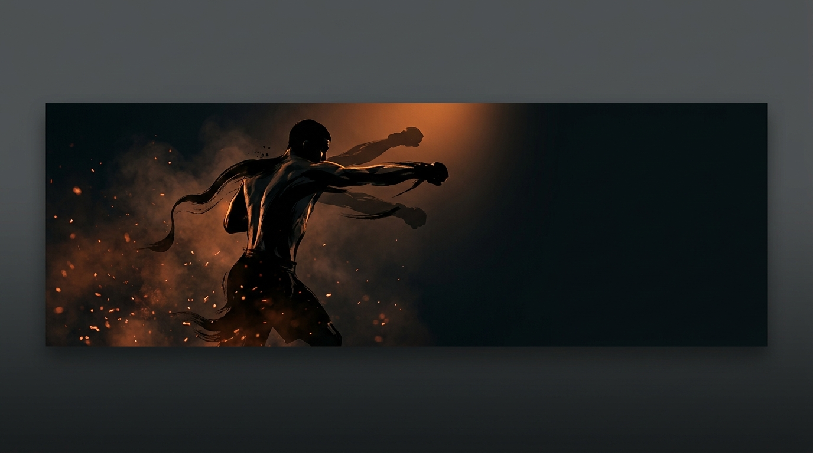

  
  
Open Space · StrikingSustained Offense

Open SpaceStrikingOffensiveIntermediateAccess → Stabilize

Keep striking through the defender's counters, escapes, and clinches — continue, never reset to one-and-done.

  
Start<b>Attacker presses forward inside a marked perimeter; defender sits in a defensive posture.</b>

  
→

  
The Goal<b>Attacker sustains offense through resistance; defender breaks the rhythm to force a reset.</b>

  
→

  
Finish<b>Sustain the sequence → switch · Rhythm fully broken → reset, same roles · Single shots that reset don't count.</b>

  
One shot and stop loses — don't break the rhythm.

  
Every defensive move the opponent makes is the next opening, not a reason to reset. <b>Slip, follow, shed the clinch — and keep striking through it.</b>

What to Read

<b>Attune to</b> the defender's <i>guard reactions to your pressure — their counter, movement, or clinch attempt</i> — how their shell shifts as you threaten, together with the <i>rate of expansion</i> (τ) of your <i>next</i> committing shot toward the opening at <b>center mass</b>. Each defensive move is itself a read that opens the next strike — the rhythm is a chain of openings, not a single one.

The Starting Position

  
PlayersTwo — attacker on the front foot, defender in a defensive posture.

  
RangeStriking range, open space.

  
BoundaryA marked perimeter — both stay inside.

  
RolesOne attacker, one defender — switch on a sustained sequence.

  
Start &amp; resetAttacker initiates; reset to neutral only when the rhythm is fully broken.

The Matchup

  

    
🥊

    
Attacker

    
Trying to maintain continuous striking offense through the defender's attempts to interrupt.

    Chain strikes into combinations. When they counter, slip/absorb and continue; when they move, follow; when they clinch, disengage and continue. The key: continue without a full reset.
  

  
VS

  

    
🛡️

    
Defender

    
Trying to interrupt the attacker's rhythm through counters, movement, or clinch.

    Active resistance, not passive defense. Counter after defensive moments, move to create space, clinch to break rhythm, shoot to threaten the takedown. You win by forcing a full reset.
  

The Rules

  🔁 Attacker must continueSingle shots followed by a full reset don't count. The attacker has to chain offense — brief defensive moments are allowed as long as the rhythm continues.
  ⚡ Defender actively interruptsThe defender is not a passive target — they actively try to break rhythm with counters, movement, or clinch. This creates the realistic resistance the attacker maintains against.
  🌊 Brief defensive moments allowedThe attacker can slip, absorb, or frame mid-flow — defensive awareness within offense is expected and desired, as long as it doesn't become a full reset.
  ⛔ Full reset = defender succeedsIf the attacker's rhythm is fully broken and they re-engage from scratch, the defender has won that exchange.
  ⬛ Stay inside the perimeterPlay happens inside a marked perimeter — any shape (square, circle, taped lines). The attacker follows movement without chasing out of bounds.

How to Win

  
Switch Sustain the sequence → switch roles.When the attacker sustains a continuous offensive sequence (e.g., 10+ seconds of unbroken pressure), the players switch roles. A sustained sequence means rhythm maintained through resistance — counters slipped, movement followed, clinches shed — without a full reset.

  
Reset Rhythm fully broken → reset, same roles.When the defender forces the attacker to fully reset and re-engage, reset to neutral — same roles — and the defender keeps trying to break rhythm. A broken rhythm isn't a loss of the game; it's information. Re-enter with pressure, reading where the next opening lives.

  
Diagnostic Continued vs. stopped is the read.Whether each defensive moment was absorbed-and-continued or turned into a stop — "I slipped and continued" vs. "I got hit and reset." The goal is continuity, not perfection. Brief defensive moments within offense are expected; the question is whether the attacker continued through them or broke off.

The Levels

  
1<b>Counter strikes only</b>Defender can only counter.The defender's only interruption is the counter-strike. The attacker learns seamless defense within offense — slip/absorb and continue.

  
2<b>Add movement</b>Counter AND move to escape.The defender can now move to create space. The attacker follows while maintaining rhythm — pressure without chasing.

  
3<b>Add clinch</b>Counter, move, AND clinch.The defender can clinch to break rhythm. The attacker must disengage and continue — managing the clinch attempt without resetting.

  
4<b>Full MMA expression</b>Counter, move, clinch, OR shoot.The defender adds the takedown threat. Sustain offense under MMA reality with all interruptions live. See <a href="../../concepts/full-mma-expression/">Full MMA Expression</a>.

Go Deeper

??? note "Task focus &amp; coaching cues"

    
Each role's job

    

      

🥊

Attacker

Chain strikes into combinations; when the defender counters, evade/absorb and continue; when they move, follow and continue; when they clinch, disengage and continue.

      

🛡️

Defender

Counter after defensive moments; move to create space; clinch to break rhythm; shoot to threaten the takedown. Active interruption, not passive defense.

    

    
Coaching cues

    

      

👁️

"Did you continue or reset?"

Ask after each exchange. This develops awareness of rhythm breaks — the goal is continuity, not perfection.

      

🌊

Seamless defense within offense

Slip a counter, follow movement, shed a clinch, sprawl on a shot — then keep striking. The defensive moment is part of the flow, not a stop.

    

??? abstract "Constraints-Led analysis"

    
Constraints → Affordances

    

      
Attacker must continue (no full reset)→Develops seamless defense-within-offense

      
Defender actively interrupts→Creates realistic resistance to maintain rhythm against

      
Progressive defender tools→Scaffolds learning of pressure maintenance

      
Duration-based win→Rewards continuous pressure, not single moments

      
Open space with movement→Attacker must follow, not just stand and throw

    

    
Develops <b>attacking degeneracy</b> — multiple ways to maintain offensive rhythm. The constraints force "adaptability under pressure" (Renshaw et al., 2019): solving the continuous problem of maintaining offense, not running a fixed combination.

    
What the attacker reads

    

      

👁️

Visual

Counter initiation, movement direction, clinch setup, level change → slip/absorb, follow, disengage, or sprawl while continuing.

      

✋

Haptic

Contact on blocks/parries → adjust targets without stopping.

      

🧭

Proprioceptive

Own rhythm and balance → maintain flow through defensive moments.

    

    
What we measure (order parameter)

    
Whether each <b>committing shot lands on the opening the defender's reaction created</b> — track sustained sequences vs. full resets, and whether each strike followed a genuine read → open → commit chain rather than chasing or throwing through resistance. That continuity of opening-read to committed strike across interruptions is the order parameter; when it stabilizes, sustained pressure has formed.

    
Representativeness

    
<b>Models:</b> pressing an opponent with sustained combinations while they try to escape, counter, clinch, or shoot — the pressure-fighting phase of MMA.

    
Progressive defender toolscontrolled contactclear duration win

    
Rhythm maintenance transfers directly into <a href="../pressure-to-takedown/">Pressure to Takedown</a> and <a href="../pressure-to-wall/">Pressure to Wall</a> and live sparring.

    
Readiness to progress

    <ul class="emma-checklist">
      <li>Maintains rhythm through current tools</li>
      <li>Defensive moments don't break flow</li>
      <li>Follows movement without resetting</li>
      <li>Articulates "slipped and continued" vs. "hit and reset"</li>
      <li>Rhythm consistent across defenders</li>
    </ul>

    
Warning signs

    

      Full resets after every exchange
      Chasing the defender frantically
      Gets hit cleanly and stops
      Ignores counters, throws through them
    

??? note "Safety &amp; related games"

    

      🤝 Light-to-moderate contact
      🛑 Stop on reckless chasing or excessive force
      🔁 Reset if exchanges become chaotic
    

    
Where it sits

    

      
Prerequisite→<a href="../land-the-target/">Land the Target</a>

      
Follow-on→<a href="../pressure-to-takedown/">Pressure to Takedown</a> · <a href="../pressure-to-wall/">Pressure to Wall</a>

      
Related→<a href="../../concepts/three-zones/">Three Zones</a> · <a href="../../concepts/confidence-rating/">Confidence Rating</a>

    

