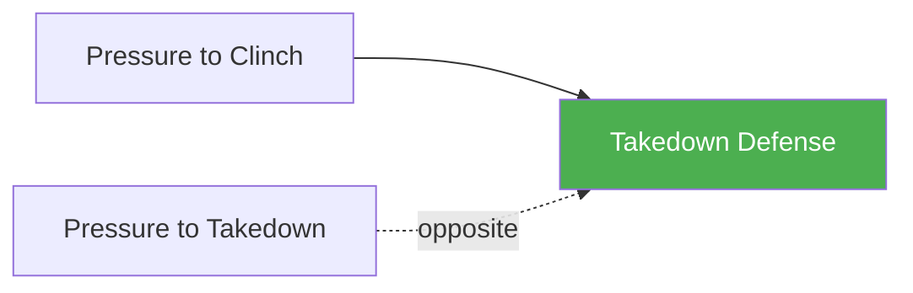

# Takedown Defense

!!! info "Game Identity"
    - **Problem:** Defending takedown attempts in open space
    - **Environment:** Open Space
    - **Stage:** Counter (Defensive Wrestling)

This is a **defensive wrestling game** focused on stopping takedown attempts. The defender learns to recognize shots, sprawl effectively, and recover position after defending.

---

## Goal

This is an **asymmetric game** with distinct roles.

| Role | Objective |
|------|-----------|
| **Attacker** | Complete a takedown to ground control |
| **Defender** | Deny the takedown and return to standing neutral |

The objective is **takedown denial**, not escape from ground.

---

## Entry Condition

- Both players start standing at clinch range
- Attacker attempts takedowns (shots, trips, throws)
- Defender uses defensive wrestling
- Reset when takedown is completed OR defender fully disengages

---

## Invariants

1. Attacker **initiates takedowns** — no waiting for defender to attack
2. Defender **cannot strike** at Level 1 — wrestling defense only
3. If taken down, game ends — this is not a ground escape game
4. DNS is allowed for defender as defensive tool

---

## Task Focus

### Attacker
- Shoot single legs, double legs
- Set up takedowns with level changes
- Chain attempts when first is defended
- Follow through on successful entries

### Defender
- Recognize shot initiation early
- Sprawl effectively
- Use whizzer, crossface, and frames
- Disengage cleanly after defending

!!! question "Key Internal Questions — Defender"
    - "Am I reading the level change early enough?"
    - "Is my sprawl stopping their drive?"
    - "Can I disengage or do I need to fight the position?"

---

## Key Logic: Sprawl and Recover

!!! note "The Core Skill"
    Takedown defense follows a pattern:

    1. **Read** — Recognize the level change or shot
    2. **Sprawl** — Hips back, weight down on attacker
    3. **Fight** — Whizzer, crossface, deny completion
    4. **Recover** — Disengage to neutral standing

    The goal is not to win position — it's to deny the takedown and reset.

---

## Win Conditions

| Role | Win Condition |
|------|---------------|
| **Attacker** | Complete takedown with control on ground |
| **Defender** | Deny takedown and disengage to standing |

**On defender win:** Roles switch — defender becomes attacker.
**On attacker win:** Reset, same roles.

---

## Levels

=== "Level 1 — No Strikes"
    - Pure wrestling defense
    - No strikes from either player
    - Focus: Sprawl mechanics and recovery

=== "Level 2 — Attacker Sets Up"
    - Attacker can use feints and level changes to set up shots
    - Defender must read real vs. fake
    - Focus: Shot recognition

=== "Level 3 — Add DNS"
    - Defender can threaten guillotine/front headlock
    - Punishes poor head position
    - Focus: DNS as defensive weapon

=== "Level 4 — Full MMA Expression"
    - Defender can strike AND sprawl
    - Attacker must shoot through strike threat
    - Focus: Takedown defense under MMA pressure
    - See: [Full MMA Expression](../concepts/full-mma-expression.md)

---

## Constraints Analysis

*How this game applies the [Constraints-Led Approach](../principles/cla/index.md)*

| Constraint Type | Constraint | Affordance Created |
|-----------------|------------|-------------------|
| **Task** | Attacker initiates takedowns (defender reacts) | Forces development of reactive defense |
| **Task** | Defender cannot strike (Level 1) | Isolates wrestling defense skill |
| **Task** | Game ends on takedown (not ground escape) | Focuses on denial, not recovery |
| **Task** | DNS allowed as defensive tool | Completes defensive arsenal |
| **Individual** | Prerequisite: Pressure to Clinch | Understands clinch dynamics |
| **Environmental** | Open space, wrestling distance | Shot recognition is critical |

!!! info "Theoretical Foundation"
    This game develops **shot recognition affordance perception**. The constraint forcing the defender to react (rather than preemptively sprawl) develops genuine perceptual skill. Multiple defensive solutions (sprawl, whizzer, crossface, DNS) emerge through self-organization as the defender explores what works against different shots (Renshaw et al., 2019).

---

## Information Structure

*What athletes must perceive to succeed (perception-action coupling)*

### Defender Perceives

| Information Source | What to Read | Action It Supports |
|--------------------|--------------|-------------------|
| **Visual** | Attacker's level change initiation | Sprawl timing |
| **Visual** | Shot angle (single vs. double, inside vs. outside) | Defense selection |
| **Visual** | Attacker's head position | DNS opportunity |
| **Visual** | Attacker's drive continuation | When to disengage vs. fight |
| **Haptic** | Attacker's grip and pressure | Which counter works |
| **Proprioceptive** | Own hip position and weight | Sprawl effectiveness |

### Attacker Perceives

| Information Source | What to Read | Action It Supports |
|--------------------|--------------|-------------------|
| **Visual** | Defender's stance and weight distribution | Shot selection and timing |
| **Visual** | Defender's sprawl timing | When to chain to different attack |
| **Haptic** | Defender's sprawl weight | Whether to continue or abort |

!!! tip "Coaching Cue"
    Ask defenders: "What did you see before they shot?" This develops early detection—the key to effective takedown defense. Late recognition means the sprawl is too late.

---

## Representativeness

*How this game models real MMA situations*

### Real MMA Situation

Defending takedown attempts in open space—a fundamental skill for any MMA fighter who wants to keep the fight standing.

### How This Game Represents It

| Element | Real MMA | This Game | Fidelity |
|---------|----------|-----------|----------|
| **Takedown attempts** | Full variety | Progressive by level | Scaffolded |
| **Defensive options** | Sprawl, whizzer, DNS, strikes | Progressive by level | Scaffolded |
| **Striking threat** | Always present | Added at Level 4 | Progressive |
| **Consequence** | Fight goes to ground | Game ends | Analogous |

### Simplifications & Justification

| Simplification | Why Acceptable |
|----------------|----------------|
| No strikes at Level 1-2 | Isolates wrestling defense; strikes added at Level 4 |
| Game ends on takedown | Focuses on denial skill; escape is a different game |
| Attacker initiates | Develops reactive defense, not preemptive sprawling |

!!! note "Transfer Expectation"
    Shot recognition developed here transfers directly to live MMA. The sprawl timing, whizzer instinct, and DNS awareness are identical in sparring and competition.

---

## Variability Guidelines

*Creating "repetition without repetition" (Bernstein, 1967)*

### Within-Level Variability

| Vary This | How | Maintains |
|-----------|-----|-----------|
| **Attacker style** | Single-leg specialists, double-leg specialists | Multiple defensive solutions |
| **Shot timing** | Quick shots, patient setup shots | Timing adaptability |
| **Shot angle** | Inside, outside, reactive | Direction adaptability |
| **Attacker size** | Larger attackers, faster attackers | Solution robustness |
| **Intensity** | Drilling pace, live pace | Pressure calibration |

### What NOT to Vary

| Keep Constant | Why |
|---------------|-----|
| Attacker initiates | Core constraint developing reactive skill |
| Game ends on takedown | Maintains denial focus |
| Controlled landings | Safety |

### Progressing Through Levels

| Signal to Progress | Meaning |
|--------------------|---------|
| Sprawl timing is consistent | Basic recognition developed |
| Multiple defenses used | Degeneracy developing |
| DNS threats effective | Full defensive toolkit available |

---

## Readiness Indicators

*When is the athlete ready to advance?*

### Ready for Next Level When

- [ ] Sprawls before being driven backward 70%+
- [ ] Uses multiple defensive tools (sprawl, whizzer, DNS)
- [ ] Disengages cleanly after defending
- [ ] Can articulate: "I saw them drop so I sprawled"
- [ ] Composure maintained under shot pressure

### Ready to Exit Game When

- [ ] Level 3+ competence (uses DNS effectively)
- [ ] Shot recognition is instinctive
- [ ] Defense integrates with striking (Level 4)
- [ ] Takedown defense appears in sparring

### Warning Signs (Not Ready to Progress)

| Sign | Meaning | Response |
|------|---------|----------|
| Always sprawls late (gets driven) | Recognition too slow | Slower shots, more reps |
| Only sprawls (no whizzer/DNS) | Limited solution set | Constrain sprawl, force other tools |
| Can't disengage after defense | Recovery incomplete | Focus on separation after sprawl |
| Gets taken down by feints | Overcommitting | Slow down, read real vs. fake |

---

## Safety

- **Contact limits:** Controlled shots, no slamming
- **Stop conditions:** Uncontrolled takedowns, neck cranks
- **Coach intervention:** Reset if positions stall

---

## System Position

- **Prerequisite games:** Pressure to Clinch (recommended)
- **Follow-on games:** Open Space Takedown (combined perspective)
- **Related concepts:** DNS

---

!!! abstract "System Evolution Notice"
    This game may be refined as defensive wrestling patterns emerge.
