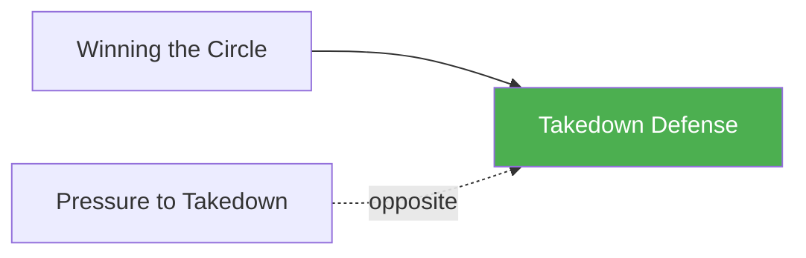

# Takedown Defense

!!! info "Game Identity"
    - **Problem:** Defending takedown attempts in open space
    - **Environment:** Open Space
    - **Stage:** Counter (Defensive Wrestling)

This is a **defensive wrestling game** focused on stopping takedown attempts. The defender learns to recognize shots, sprawl effectively, and recover position after defending.

---

## Goal

This is an **asymmetric game** with distinct roles.

| Role | Objective |
|------|-----------|
| **Attacker** | Complete a takedown to ground control |
| **Defender** | Deny the takedown and return to standing neutral |

The objective is **takedown denial**, not escape from ground.

---

## Entry Condition

- Both players start standing at clinch range
- Attacker attempts takedowns (shots, trips, throws)
- Defender uses defensive wrestling
- Reset when takedown is completed OR defender fully disengages

---

## Invariants

1. Attacker **initiates takedowns** — no waiting for defender to attack
2. Defender **cannot strike** at Level 1 — wrestling defense only
3. If taken down, game ends — this is not a ground escape game
4. DNS is allowed for defender as defensive tool

---

## Task Focus

### Attacker
- Shoot single legs, double legs
- Set up takedowns with level changes
- Chain attempts when first is defended
- Follow through on successful entries

### Defender
- Recognize shot initiation early
- Sprawl effectively
- Use whizzer, crossface, and frames
- Disengage cleanly after defending

!!! question "Key Internal Questions — Defender"
    - "Am I reading the level change early enough?"
    - "Is my sprawl stopping their drive?"
    - "Can I disengage or do I need to fight the position?"

---

## Key Logic: Sprawl and Recover

!!! note "The Core Skill"
    Takedown defense follows a pattern:

    1. **Read** — Recognize the level change or shot
    2. **Sprawl** — Hips back, weight down on attacker
    3. **Fight** — Whizzer, crossface, deny completion
    4. **Recover** — Disengage to neutral standing

    The goal is not to win position — it's to deny the takedown and reset.

---

## Win Conditions

| Role | Win Condition |
|------|---------------|
| **Attacker** | Complete takedown with control on ground |
| **Defender** | Deny takedown and disengage to standing |

**On defender win:** Roles switch — defender becomes attacker.
**On attacker win:** Reset, same roles.

---

## Levels

=== "Level 1 — No Strikes"
    - Pure wrestling defense
    - No strikes from either player
    - Focus: Sprawl mechanics and recovery

=== "Level 2 — Attacker Sets Up"
    - Attacker can use feints and level changes to set up shots
    - Defender must read real vs. fake
    - Focus: Shot recognition

=== "Level 3 — Add DNS"
    - Defender can threaten guillotine/front headlock
    - Punishes poor head position
    - Focus: DNS as defensive weapon

=== "Level 4 — Full MMA Expression"
    - Defender can strike AND sprawl
    - Attacker must shoot through strike threat
    - Focus: Takedown defense under MMA pressure
    - See: [Full MMA Expression](../concepts/full-mma-expression.md)

---

## Safety

- **Contact limits:** Controlled shots, no slamming
- **Stop conditions:** Uncontrolled takedowns, neck cranks
- **Coach intervention:** Reset if positions stall

---

## System Position

- **Prerequisite games:** Winning the Circle (recommended)
- **Follow-on games:** Open Space Takedown (combined perspective)
- **Related concepts:** DNS

---

!!! abstract "System Evolution Notice"
    This game may be refined as defensive wrestling patterns emerge.
