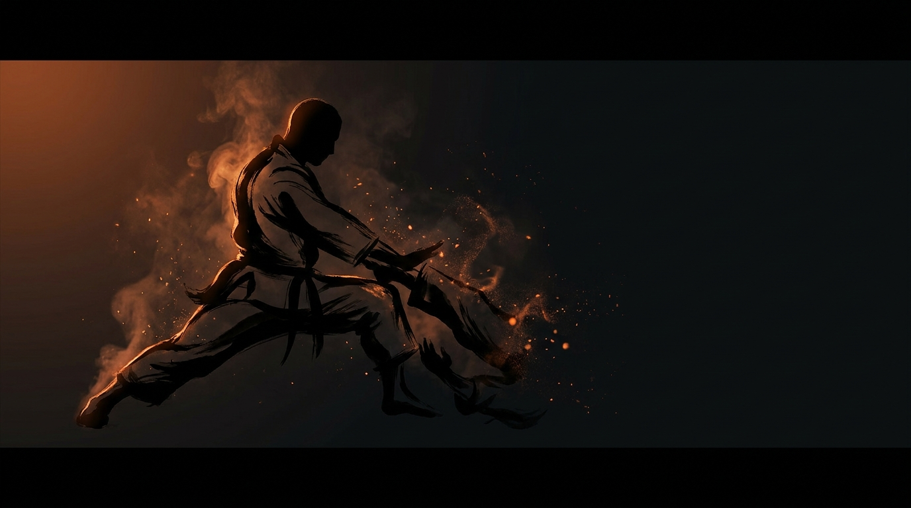

  
  
Open Space · WrestlingTakedown Defense

Open SpaceWrestlingDefensiveIntermediateMats

Stop the shot and get back to neutral, denial, not ground escape.

  
Start<b>Two fighters at clinch range, inside a marked perimeter.</b>

  
→

  
The Goal<b>Attacker completes a takedown; defender denies it &amp; returns to standing.</b>

  
→

  
Finish<b>Deny &amp; disengage → switch · Takedown completes → reset · Leave perimeter → loss.</b>

  
Don't escape the takedown,  deny it.

  
Once it completes, the game's over. <b>Read the shot, sprawl in time, get back to neutral.</b>

What to Read

<b>Attune to</b> the <i>rate of closure</i> (τ) of the <b>level change / shot</b>, the hip and level drop as the attacker commits, not their feet or their eyes. That information specifies <i>when</i> the shot arrives and <i>when</i> to sprawl.

The Starting Position

  
PlayersTwo, squared off at clinch range.

  
RangeClinch / wrestling distance.

  
BoundaryA marked perimeter, both stay inside.

  
RolesAttacker vs. defender, switch when the defender denies and disengages.

  
Start &amp; resetAttacker initiates; reset on takedown or full disengage.

The Matchup

  

    
🤼

    
Attacker

    
Trying to complete a takedown to ground control, shots, trips, throws.

    Shoot singles and doubles; set up with level changes; chain attempts when the first is defended; follow through on successful entries. Scale to the defender's success.
  

  
VS

  

    
🛡️

    
Defender

    
Trying to deny the takedown and return to standing neutral, not escape from the ground.

    Recognize the shot early, sprawl, use whizzer / crossface / frames, then disengage cleanly. No striking at Level 1, wrestling defense only. DNS allowed.
  

The Rules

  🤼 Attacker initiates takedownsThe attacker shoots, no waiting for the defender to attack. This keeps the defender's job reactive: read and defend the shot.
  🛡️ Wrestling defense only, no strikes (L1)At Level 1 the defender uses wrestling defense only, no strikes. This isolates sprawl mechanics and recovery before striking is integrated.
  🏁 Game ends on takedownIf the defender is taken down with control, play ends, this is not a ground escape game. The skill is denying the takedown, not recovering from it.
  🦈 DNS allowedThe defender may use the guillotine / front-headlock (DNS) as a defensive tool, punishing poor head position on the shot.
  ⬛ Stay inside the perimeterPlay happens inside a marked perimeter, any shape (square, circle, taped lines). If both feet leave it, you lose instantly.

How to Win

  
Switch Deny &amp; disengage to standing → switch roles.The defender stopped the shot and got back to neutral standing, and earns the attacking role.

  
Reset Takedown completes with control → reset, same roles.A takedown finished with control on the ground. Then begin again from standing at clinch range.

  
Loss Both feet leave the perimeter → loss.Crossing the marked perimeter loses the game instantly, regardless of the exchange, training the cage-edge awareness a fighter needs.

The Levels

  
1<b>No strikes</b>Pure wrestling defense.Pure wrestling defense, no strikes either side. Build sprawl mechanics and recovery with no other pressure.

  
2<b>Attacker sets up</b>Feints and level changes.The attacker adds feints and level changes to set up shots. The defender must read real vs. fake, shot recognition.

  
3<b>Add DNS</b>Guillotine / front headlock.The defender can threaten the guillotine / front headlock, punishing poor head position. DNS as a defensive weapon.

  
4<b>Full MMA</b>Strike and sprawl.The defender can strike and sprawl; the attacker must shoot through the strike threat. Takedown defense under <a href="../../concepts/full-mma-expression/">full MMA pressure</a>.

Go Deeper

??? note "Task focus &amp; coaching cues"

    
Each role's job

    

      

🤼

Attacker

Shoot singles and doubles; set up with level changes; chain when defended; follow through on entries.

      

🛡️

Defender

Recognize the shot early; sprawl effectively; use whizzer, crossface, frames; disengage cleanly.

    

    
Coaching cues

    

      

👁️

See it before it lands

"What did you see before they shot?" Read the level change early, late recognition means the sprawl is too late.

      

⚓

Hips back, weight down

The sprawl is hips back and weight on the attacker. Then choose: fight the position or disengage to neutral.

    

??? abstract "Constraints-Led analysis"

    
Constraints → Affordances

    

      
Attacker initiates takedowns→Forces development of reactive defense

      
Defender can't strike (L1)→Isolates wrestling defense skill

      
Game ends on takedown (not escape)→Focuses on denial, not ground recovery

      
DNS allowed as defensive tool→Completes the defensive arsenal

      
Open space, wrestling distance→Shot recognition is critical

    

    
Develops <b>shot-recognition affordance perception</b>. Forcing the defender to react (not preemptively sprawl) builds genuine perceptual skill, multiple solutions (sprawl, whizzer, crossface, DNS) emerge through self-organization (Renshaw et al., 2019).

    
What the defender reads

    

      

👁️

Visual

Level-change initiation, shot angle, head position, drive continuation → sprawl timing &amp; defense selection.

      

✋

Haptic

Grip and pressure of the shot → which counter works.

      

🧭

Proprioceptive

Own hip position &amp; weight → sprawl effectiveness.

    

    
What we measure (order parameter)

    
Whether the defender <b>meets the shot in time</b>, sprawl and frame arriving with the level change, so they stay standing rather than getting taken down. Track sprawls landed before being driven back vs. takedowns conceded. That timing relationship is the order parameter; when it stabilizes, the skill has formed.

    
Representativeness

    
<b>Models:</b> defending takedowns in open space to keep the fight standing.

    
Simplified: no strikes (L1–2)ends on takedowndenial not escape

    
Sprawl timing, whizzer instinct, and DNS awareness transfer directly to live MMA, feeds <a href="../open-space-takedown/">Open Space Takedown</a>.

    
Readiness to progress

    <ul class="emma-checklist">
      <li>Sprawls before being driven back ~70%+</li>
      <li>Uses multiple tools (sprawl, whizzer, DNS)</li>
      <li>Disengages cleanly after defending</li>
      <li>Can describe: "I saw them drop so I sprawled"</li>
    </ul>

    
Warning signs

    

      Always sprawls late (gets driven)
      Only sprawls, no whizzer/DNS
      Can't disengage after defense
      Taken down by feints
    

??? note "Safety &amp; related games"

    

      🤝 Controlled shots, no slamming
      🛑 Stop on uncontrolled takedowns or neck cranks
      🔁 Reset if positions stall
    

    
Where it sits

    

      
Prerequisite→<a href="../pressure-to-clinch/">Pressure to Clinch</a> (recommended)

      
Follow-on→<a href="../open-space-takedown/">Open Space Takedown</a> (combined perspective)

      
Opposite→<a href="../pressure-to-takedown/">Pressure to Takedown</a>

    

