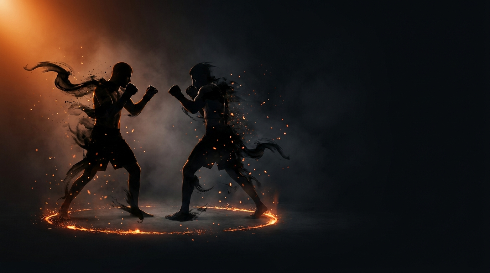

  
  
Progression · Mixed (Striking → Grappling)The Square — Close Defense to Takedown Progression

!!! warning "Provisional (WIP) — derived from class recording 2026-05-25"
    This game was captured live from a class and is **pending review on the platform**.
    Name and structure may change. Remove the WIP status once confirmed.

ProgressionMixed (Striking → Grappling)DefensiveIntermediateConfined Square

A single constraint set, layered live one variable at a time, that grows from close-range blocking defense into a full striking-to-takedown game. It is the in-class bridge between isolated striking defense and the clinch and takedown games — survival first, then the right to counter, clinch off-balance, and finish.

  
Start<b>Two fighters at close range, inside a marked perimeter with no exit.</b>

  
→

  
The Goal<b>The offense is trying to land significant strikes (and, later, takedowns); the defense is trying to survive — then counter, off-balance &amp; finish.</b>

  
→

  
Finish<b>Survive / counter / off-balance / finish → win · Leave the perimeter → loss.</b>

  
One game, layered live — survive first, then earn the right to finish.

  
It starts as block-only survival in the pocket and grows, one variable at a time, into a full striking-to-takedown game. <b>Counter, clinch off-balance, finish.</b>

What to Read

<b>What you attune to shifts as the game evolves.</b> Early, in the striking phases, read the <i>rate of expansion</i> (τ) of the incoming punch and the shoulder–hip motion at <b>center mass</b> — that specifies <i>when</i> and <i>where</i> the shot arrives. As the game opens into the clinch and becomes grappling, attune instead to the <b>felt resistance — the inertial array</b> of the opponent's weight and directional force through your hand controls. That felt push is no longer something to absorb; it is the information you redirect to off-balance and finish.

The Starting Position

  
PlayersTwo, neutral stance.

  
RangeClose quarters — no gap to retreat into.

  
BoundaryA marked perimeter — both stay inside; the edge is live.

  
RolesOne offense, one defense — switched on a win.

  
Start &amp; resetOffense initiates; reset after each exchange. Phases layer one variable at a time.

The Matchup

  

    
🥊

    
Offense

    
Trying to land significant strikes inside the perimeter — and, as phases unlock, leg attacks and takedowns to the ground.

    Boxing first — scaled combinations (≤3 punches, 1 significant shot to win), allowing the game to play. Later you may enter on the legs / double-under and must land two significant strikes. The offensive role layers up alongside the defense.
  

  
VS

  

    
🛡️

    
Defense

    
Trying to survive behind a tight shell — then, as the game opens, to counter, off-balance in the clinch, and finish.

    Starts as pure blocking — no parry, no head movement, no footwork escape. Then earns one counter strike, clinch off-balancing, body-kick counters, and finally a takedown finish. The defensive role grows phase by phase, layering on top of the survival base.
  

The Rules

  ⬛ Confined space — no escapePlay happens inside a marked perimeter — any shape (square, circle, taped lines). There is no footwork escape; both players stay inside and solve the problem in the pocket.
  🚫 Both feet out = lossIf both of a player's feet leave the perimeter, that player loses instantly — whoever they are. The boundary is live, like a cage edge.
  🤝 No tying upHand controls are legal to nullify the opponent, but break fast — boxing rules. No stalling tie-ups.
  ⚖️ Scale to the partnerStrikes scale to the partner; the offense must allow the game to play — no teeing off, no crowding out the defensive opportunity.
  ➕ One variable at a timeNew phases are added one constraint at a time. Earlier constraints persist unless explicitly lifted — resist enriching the game before the current constraint has done its work.

How to Win

  
Defense wins Survive, counter, off-balance, or finish → win.The phase-dependent defensive win — survival early, then counter (one strike, later a body kick), then clinch off-balancing, then a takedown / top neck strangle finish as the game layers up. Winning switches roles.

  
Offense wins Land the required strikes, or take it to the ground → win.Significant shots with front-two-knuckle contact (1 → 2 required); later, connect a leg attack / double-under and get the hips to the ground (hands down / feet up = on track), no scrambling once the hips land. A caught kick does not count as landed.

  
Loss Both feet leave the perimeter → loss.Crossing the marked perimeter loses instantly, regardless of the exchange — whoever you are. A caught kick used to push or take a player out leaves the kicker liable — training cage-edge awareness.

The Levels

  
1<b>Confined block + hand controls</b>Block-only survival in the pocket.Offense throws a ≤3-punch combination, landing 1 significant shot to win. Defense blocks only — no parry, no head movement, no footwork escape. Hand controls are legal to nullify; no tie-ups, break fast.

  
2<b>Counter + live boundary</b>Earn one strike back.Defense may counter with <strong>one</strong> strike — interrupt the rhythm, then keep defending. The perimeter goes live: both feet out of it = loss.

  
3<b>Clinch off-balancing</b>Redirect the felt force.Defense can win by off-balancing the opponent in the clinch — redirect the directional force rather than absorb it. Offense must now land <strong>two</strong> significant strikes, and may enter on the legs / double-under body lock.

  
4<b>Kick counters</b>Body kicks come online.Defense may counter with kicks above the waist — e.g., a body kick after a block. A caught kick is not a score and leaves the kicker liable. No kicks to head or legs — body only.

  
5<b>Single-leg takedown finish</b>Grappling to the ground.Start from a single-leg position — inside grip, alternating to outside. Offense gets the hips to the ground (hands down / feet up = on track); no scrambling once hips land. Defense separates and gets out, strikes at any level, redirects to top, or finishes with a neck strangle / guillotine. Back exposure = bonus.

Go Deeper

??? note "Task focus &amp; coaching cues"

    
Each role's job

    

      

🥊

Offense

Land significant strikes in scaled combinations (≤3, then a 2-significant requirement); land with the front two knuckles; in later phases mix striking with leg attacks / double-under entries to finish.

      

🛡️

Defense

Tight shell, absorb on arms/gloves; use hand controls to interrupt the boxing and redirect directional force; stay conscious of where your feet are relative to the boundary.

    

    
Coaching cues

    

      

👁️

See center mass

Don't go blind behind the gloves. Center mass keeps shoulder &amp; hip motion in view so you can read the incoming strike.

      

⚓

Base under fire

Base down — bend the knees, create suspension so strike force doesn't rob your counters or jostle you out of the square.

      

↪️

Redirect, don't absorb

When the offense bullies forward, that pressure is the opportunity — redirect the directional force to off-balance and win. Being pushed out is yours to solve, not a foul to call.

    

??? abstract "Constraints-Led analysis"

    
Constraints → Affordances

    

      
Confined square, no escape→Forces in-pocket solutions; removes the footwork-escape habit

      
Both feet out = loss→Converts the boundary into a live cage-edge constraint

      
Block-only start→Forces the shell / guard solution to develop first

      
Hand controls, no tie-ups→Invites redirecting directional force over absorbing it

      
One variable at a time→Each constraint does its work before the next layers on

    

    
Implements <b>Constrain to Afford</b> (Renshaw et al., 2019) — one constraint set scaled live so the same game grows from survival to finishing.

    
What the defender reads

    

      

👁️

Visual

Shoulder &amp; hip motion at center mass → when and where the strike arrives.

      

✋

Haptic

Felt resistance through hand controls → the inertial array to redirect in the clinch.

      

🧭

Proprioceptive

Base, balance &amp; feet relative to the boundary → staying structured and inside.

    

    
What we measure (order parameter)

    
Early, whether the defender's <b>block lands in time with the punch</b>; as the game opens, whether they can <b>redirect the felt directional force</b> to off-balance rather than absorb it. That shifting timing-then-force relationship is the order parameter; when it stabilizes through each phase, the skill has formed and the next variable can be added.

    
Representativeness

    
<b>Models:</b> surviving and recovering in a confined pocket, then converting pressure into clinch off-balancing and takedown finishes — the bridge from striking defense to grappling.

    
Confined squarelayered one variable at a timesurvival → finish

    
The live connective tissue between isolated close-range defense and the clinch/takedown games — feeds into <a href="../pressure-to-takedown/">Pressure to Takedown</a>.

    
Readiness to progress

    <ul class="emma-checklist">
      <li>Survives the pocket behind a tight shell</li>
      <li>Stays based and inside the boundary under fire</li>
      <li>Redirects directional force instead of just absorbing</li>
      <li>Half-enjoying / half-struggling — the desensitization is working</li>
    </ul>

    
Warning signs

    

      Offense crowds &amp; removes the defensive opportunity
      Tie-ups stall the action
      Caught-kick scrambles going wrong
    

??? note "Safety &amp; related games"

    

      🤝 Light-to-moderate contact — felt, not damaging
      🛑 Stop on lost control, boundary disputes, or hips hitting the ground
      🔁 Reset if the offense crowds out the defensive opportunity
    

    
Where it sits

    

      
Prerequisite→<a href="../tight-block/">Tight Block</a> · <a href="../close-range-defense/">Close-Range Defense</a>

      
Follow-on→<a href="../pressure-to-takedown/">Pressure to Takedown</a> · <a href="../wall-control/">Wall Control</a>

      
Related→<a href="../../concepts/defensive-solutions/">Defensive Solutions</a> · <a href="../../concepts/hand-controls/">Hand Controls</a>

    

