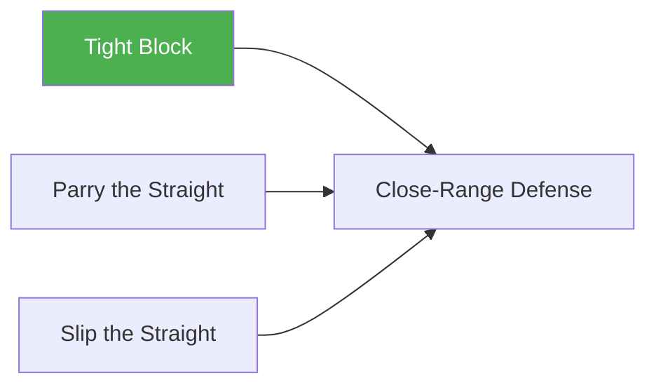

# Tight Block

!!! info "Game Identity"
    - **Problem:** Learning to absorb strikes using a tight guard/shell
    - **Environment:** Open Space
    - **Stage:** Access (Defensive Skill Isolation)

This is a **beginner skill isolation game** that teaches the blocking defensive solution. The defender can ONLY block using a tight shell, forcing them to develop this foundational skill.

---

## Goal

This is an **asymmetric game** with distinct roles.

| Role | Objective |
|------|-----------|
| **Attacker** | Land punches (straights and hooks) to defender's head or body |
| **Defender** | Block punches using tight guard (shell up, elbows in, hands protecting head) |

The objective is **skill development**, not competition.

---

## Entry Condition

- Both players start in neutral standing position
- Close quarters distance (striking range)
- Roles are assigned; defender earns role switch through successful defense
- Reset to neutral after each exchange

---

## Invariants

1. Attacker throws **straights and/or hooks** (scaled to level)
2. Defender can **ONLY block** — no parrying, dodging, or backing up continuously
3. Attacker allows reset between strikes (no continuous pressure at Level 1)

---

## Task Focus

### Attacker
- Land clean punches to head or body
- Vary targets and punch types to challenge defender
- Scale difficulty based on defender success

### Defender
- Maintain tight guard position (hands to face, elbows protecting body)
- Absorb strikes on arms and gloves, not on exposed targets
- Reset to good position after each defensive sequence

!!! question "Key Internal Questions"
    - "Is my guard tight enough to protect my head?"
    - "Are my elbows covering my body?"
    - "Am I absorbing on my arms or getting hit clean?"

---

## Key Logic: Why Isolate Blocking?

!!! note "Skill Isolation"
    Blocking is the most fundamental defensive solution. By constraining the defender to blocking only:

    - Develops the habit of shelling up under pressure
    - Learns to absorb on arms/gloves rather than exposed targets
    - Builds composure when taking fire

### Blocking Mechanics

- **Tight guard** = Hands to face, elbows to body, chin tucked
- Works for **both** straights and hooks (unlike parrying or slipping)
- Trade-off: Maximum protection, but no counter opportunity and hands are occupied

### Why Blocking Differs from Parrying

| Aspect | Blocking | Parrying |
|--------|----------|----------|
| Strike types | Straights AND hooks | Straights only |
| Movement | Static/absorbing | Active/redirecting |
| Energy | Absorbs impact | Deflects impact |
| Counter setup | Minimal | Creates opening |

---

## Win Conditions

| Role | Win Condition |
|------|---------------|
| **Defender** | Absorb the attack sequence on guard (no clean contact to exposed targets) |
| **Attacker** | Land a clean strike to head or body (not absorbed on arms/gloves) |

**On defender win:** Roles switch — defender becomes attacker.

**On attacker win:** Reset to neutral, same roles, attacker continues.

The defender must **earn** the offensive position by proving they can block effectively.

!!! tip "The Strategic Insight"
    You don't need to perfectly block every strike. You can take some contact while reading the attacker's rhythm and adjusting your guard. When you successfully absorb a complete attack sequence without getting hit clean — that's the skill demonstration.

    At higher levels (combinations), this means surviving the entire combination on your guard. One clean defensive success earns the role switch.

**Duration:** Play until natural stopping point or time limit. Role switches keep both players engaged.

---

## Levels

=== "Level 1 — Single Punches, Straights Only"
    - One straight punch at a time
    - 1-second reset between punches
    - Defender: tight block only

=== "Level 2 — Add Hooks"
    - Attacker can throw straights OR hooks
    - Defender adjusts guard for different angles
    - Focus: Covering multiple attack lines

=== "Level 3 — Variable Tempo"
    - Attacker varies timing between strikes
    - No fixed reset requirement
    - Defender must stay ready

=== "Level 4 — Combinations"
    - Attacker throws 2-4 punch combinations
    - Mix of straights and hooks
    - Defender absorbs full combinations on guard
    - Focus: Maintaining structure through sustained pressure

=== "Level 5 — Full MMA Expression"
    - Attacker throws combinations AND can shoot or establish clinch
    - Attacker wins by: landing clean strike OR establishing meaningful clinch/connection
    - Defender must block effectively AND deny grappling entry
    - Focus: Blocking while remaining aware of all threats
    - This is the MMA reality: shelling up without posture creates takedown opportunities

---

## Constraints Analysis

*How this game applies the [Constraints-Led Approach](../principles/cla/index.md)*

| Constraint Type | Constraint | Affordance Created |
|-----------------|------------|-------------------|
| **Task** | Attacker throws straights and hooks | Defender perceives multiple attack angles |
| **Task** | Defender can only block (no parry, dodge) | Forces exploration of shell/guard solutions |
| **Task** | Reset between exchanges (Level 1) | Time to reorganize guard structure |
| **Task** | Role switching on defensive success | Rewards effective blocking |
| **Individual** | Skill level matching | Appropriate challenge zone |
| **Environmental** | Close striking range | Blocking is viable and necessary |

!!! info "Theoretical Foundation"
    This game implements **Constrain to Afford** (Renshaw et al., 2019). By limiting defense to blocking only, the environment invites the defender to explore tight guard variations. Different body types will develop slightly different blocking structures based on arm length, shoulder width, and reaction time.

---

## Information Structure

*What athletes must perceive to succeed (perception-action coupling)*

### Defender Perceives

| Information Source | What to Read | Action It Supports |
|--------------------|--------------|-------------------|
| **Visual** | Punch type initiating (straight vs. hook) | Guard adjustment (high tight vs. elbow cover) |
| **Visual** | Target selection (head vs. body) | Vertical guard positioning |
| **Visual** | Attacker's rhythm and timing | Anticipating next strike |
| **Haptic** | Impact location on arms/gloves | Confirming successful absorption |
| **Haptic** | Impact force | Gauging if guard held structure |
| **Proprioceptive** | Guard position and tightness | Maintaining protective structure |

### Attacker Perceives

| Information Source | What to Read | Action It Supports |
|--------------------|--------------|-------------------|
| **Visual** | Gaps in defender's guard | Target selection |
| **Visual** | Guard breakdown under pressure | When to commit |
| **Haptic** | Contact quality (arm vs. clean) | Whether strike landed effectively |

!!! tip "Coaching Cue"
    Don't tell defenders where to put their hands. Ask: "Where did that land? Guard or clean?" This develops their awareness of what's working.

---

## Representativeness

*How this game models real MMA situations*

### Real MMA Situation

Shelling up under fire when overwhelmed, hurt, or when other options aren't available—absorbing damage while recovering composure.

### How This Game Represents It

| Element | Real MMA | This Game | Fidelity |
|---------|----------|-----------|----------|
| **Attack variety** | All strikes possible | Straights and hooks | Simplified |
| **Defense options** | All solutions available | Blocking only | Isolated |
| **Sustained pressure** | Continuous | Reset between exchanges (early levels) | Simplified |
| **Consequence** | Damage accumulation | Role switch | Reduced |

### Simplifications & Justification

| Simplification | Why Acceptable |
|----------------|----------------|
| No kicks initially | Focuses on hand defense fundamentals |
| Blocking only | Isolates this defensive solution before integration |
| Reset between strikes | Allows deliberate practice at coordination stage |

!!! note "Transfer Expectation"
    Athletes who develop blocking here transfer the skill to [Close-Range Defense](close-range-defense.md) where all defensive options combine. The composure under fire transfers directly to live sparring.

---

## Variability Guidelines

*Creating "repetition without repetition" (Bernstein, 1967)*

### Within-Level Variability

| Vary This | How | Maintains |
|-----------|-----|-----------|
| **Attacker** | Rotate training partners | Different power, speed, angles |
| **Punch selection** | Sessions emphasizing hooks, others straights | Full guard coverage |
| **Target emphasis** | Head-focused rounds, body-focused rounds | Complete defensive structure |
| **Intensity** | Light touch to moderate contact | Pressure calibration |
| **Duration** | Short bursts vs. sustained rounds | Fatigue management |

### What NOT to Vary

| Keep Constant | Why |
|---------------|-----|
| Defender can only block | Core constraint defining the game |
| Must absorb on guard | Success criteria stays clear |
| Close range | Maintains blocking necessity |

### Progressing Through Levels

| Signal to Progress | Meaning |
|--------------------|---------|
| Absorbs straights consistently | Ready for hooks |
| Handles hooks and straights | Ready for variable tempo |
| Maintains guard under combinations | Ready for MMA expression |

---

## Readiness Indicators

*When is the athlete ready to advance?*

### Ready for Next Level When

- [ ] Absorbs 70%+ of attacks on guard (not clean contact)
- [ ] Guard structure recovers quickly after absorbing
- [ ] Remains calm under sustained attack (no panic)
- [ ] Can describe where strikes are landing
- [ ] Adjusts guard based on attack type (tight for hooks, high for straights)

### Ready to Exit Game (Move to Close-Range Defense) When

- [ ] Level 4+ competence (absorbs combinations)
- [ ] Blocking is automatic, not deliberate
- [ ] Expresses desire to add movement/counters
- [ ] Blocking success maintains across varied attackers

### Warning Signs (Not Ready to Progress)

| Sign | Meaning | Response |
|------|---------|----------|
| Guard collapses under hooks | Structure incomplete | More hook-focused practice |
| Flinches/turns away | Composure not developed | Reduce intensity, rebuild confidence |
| Can't identify where hits land | Perception underdeveloped | Slower tempo, feedback after each exchange |
| Only effective vs. one attacker | Solution too narrow | More partner variety |

---

## Safety

- **Contact limits:** Light to moderate — punches should be felt but not damaging
- **Stop conditions:** Loss of composure, guard breakdown, excessive force
- **Coach intervention:** Reset if defender starts moving/dodging instead of blocking

---

## System Position

- **Prerequisite games:** None — this is foundational
- **Follow-on games:** Close-Range Defense
- **Related concepts:** Defensive Solutions in Striking (Blocking)

---

!!! abstract "System Evolution Notice"
    This game may be refined as defensive skill development patterns emerge.
