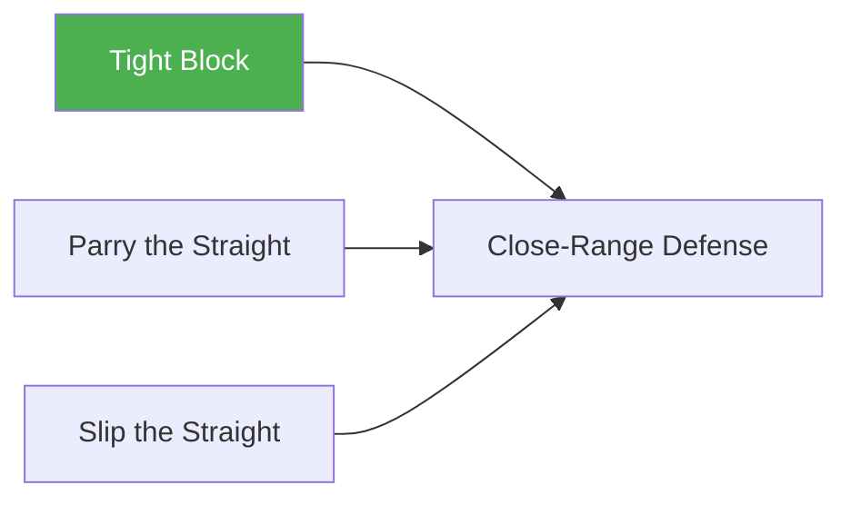

# Tight Block

!!! info "Game Identity"
    - **Problem:** Learning to absorb strikes using a tight guard/shell
    - **Environment:** Open Space
    - **Stage:** Access (Defensive Skill Isolation)

This is a **beginner skill isolation game** that teaches the blocking defensive solution. The defender can ONLY block using a tight shell, forcing them to develop this foundational skill.

---

## Goal

This is an **asymmetric game** with distinct roles.

| Role | Objective |
|------|-----------|
| **Attacker** | Land punches (straights and hooks) to defender's head or body |
| **Defender** | Block punches using tight guard (shell up, elbows in, hands protecting head) |

The objective is **skill development**, not competition.

---

## Entry Condition

- Both players start in neutral standing position
- Close quarters distance (striking range)
- Roles are assigned; switch after 4 minutes
- Reset to neutral after each exchange

---

## Invariants

1. Attacker throws **straights and/or hooks** (scaled to level)
2. Defender can **ONLY block** — no parrying, dodging, or backing up continuously
3. Attacker allows reset between strikes (no continuous pressure at Level 1)

---

## Task Focus

### Attacker
- Land clean punches to head or body
- Vary targets and punch types to challenge defender
- Scale difficulty based on defender success

### Defender
- Maintain tight guard position (hands to face, elbows protecting body)
- Absorb strikes on arms and gloves, not on exposed targets
- Reset to good position after each defensive sequence

!!! question "Key Internal Questions"
    - "Is my guard tight enough to protect my head?"
    - "Are my elbows covering my body?"
    - "Am I absorbing on my arms or getting hit clean?"

---

## Key Logic: Why Isolate Blocking?

!!! note "Skill Isolation"
    Blocking is the most fundamental defensive solution. By constraining the defender to blocking only:

    - Develops the habit of shelling up under pressure
    - Learns to absorb on arms/gloves rather than exposed targets
    - Builds composure when taking fire

### Blocking Mechanics

- **Tight guard** = Hands to face, elbows to body, chin tucked
- Works for **both** straights and hooks (unlike parrying or slipping)
- Trade-off: Maximum protection, but no counter opportunity and hands are occupied

### Why Blocking Differs from Parrying

| Aspect | Blocking | Parrying |
|--------|----------|----------|
| Strike types | Straights AND hooks | Straights only |
| Movement | Static/absorbing | Active/redirecting |
| Energy | Absorbs impact | Deflects impact |
| Counter setup | Minimal | Creates opening |

---

## Win Conditions

!!! warning "FLAGGED FOR REVIEW"
    Win conditions for blocking games require different logic than parrying/slipping games. Blocking is survival-oriented rather than opportunity-creating.

    **Possible approaches:**

    - Time-based: 4 minutes defensive, then switch roles (8 minute round)
    - Combination-based: Absorb X combinations without getting hit clean
    - Accumulation: First to land Y clean strikes wins

    Needs further development to determine best gamification approach.

**Current structure:** 4 minutes per role, then switch. Success evaluated by percentage of strikes absorbed on guard.

---

## Levels

=== "Level 1 — Single Punches, Straights Only"
    - One straight punch at a time
    - 1-second reset between punches
    - Defender: tight block only

=== "Level 2 — Add Hooks"
    - Attacker can throw straights OR hooks
    - Defender adjusts guard for different angles
    - Focus: Covering multiple attack lines

=== "Level 3 — Variable Tempo"
    - Attacker varies timing between strikes
    - No fixed reset requirement
    - Defender must stay ready

=== "Level 4 — Two-Punch Combinations"
    - Attacker throws 2-punch combos
    - Mix of straights and hooks
    - Defender absorbs combinations

=== "Level 5 — Longer Combinations"
    - Attacker throws 3-4 punch combinations
    - Defender maintains guard through extended pressure
    - Focus: Composure under sustained fire

---

## Safety

- **Contact limits:** Light to moderate — punches should be felt but not damaging
- **Stop conditions:** Loss of composure, guard breakdown, excessive force
- **Coach intervention:** Reset if defender starts moving/dodging instead of blocking

---

## System Position

- **Prerequisite games:** None — this is foundational
- **Follow-on games:** Close-Range Defense
- **Related concepts:** Defensive Solutions in Striking (Blocking)

---

!!! abstract "System Evolution Notice"
    This game may be refined as defensive skill development patterns emerge.
