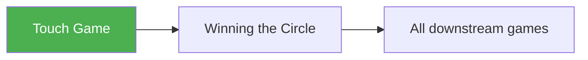

# Touch and Don't Get Touched

!!! info "Game Identity"
    - **Problem:** Range awareness, timing, and first-contact literacy
    - **Environment:** Open Space (no boundaries)
    - **Stage:** Access (Pre-Space, Pre-Pressure)

This is the **foundational engagement game** in the system. It exists before space control, pressure, or clinch logic.

---

## Goal

This is a **mirrored game**.

Each player aims to:

- Touch the opponent
- Avoid being touched
- Deny or negate the opponent's ability to respond

The objective is **initiative management**, not damage accumulation.

---

## Entry Condition

- Both players start in open space
- No wall, boundary, or circling requirement
- Neutral stance at a comfortable distance
- Reset to neutral distance after each resolved exchange

---

## Invariants

1. No sustained pressure
2. No forward crashing or collisions
3. No takedowns unless explicitly permitted by level
4. Each exchange resolves quickly and resets
5. The game remains exploratory, not competitive

---

## Task Focus

### Both Players

- Read distance honestly
- Coordinate eyes, feet, and hands
- Time entry and exit cleanly
- Maintain composure after contact
- Recover initiative immediately when touched

!!! question "Key Internal Questions"
    - "Am I actually in range?"
    - "Can I enter without being hit back?"
    - "If I get touched, can I respond immediately?"

---

## Legal Actions

- Light touches to head or torso
- Punches and kicks allowed
- Single strike or **maximum two-strike sequence**
- Probing jabs encouraged
- No flurries
- No prolonged clinch unless allowed by level

All contact is **touch/light only**.

---

## Counter-Touch Logic (Critical)

!!! warning "This is the core mechanic of the game"

If a player is touched:

- They are allowed **one immediate opportunity** to touch back
- The counter-touch must occur within the same exchange window
- No chasing once the moment has passed

**Exchange outcomes:**

| Outcome | Result |
|---------|--------|
| Clean touch without response | Advantage |
| Touch followed by immediate counter-touch | Neutral (1-for-1) |
| Getting touched without response | Lost exchange |

This logic rewards:

- Composure under contact
- Counter-striking awareness
- Recovery of initiative

---

## Win Conditions

This game is **diagnostic**, not score-driven.

Success is evaluated by:

- Frequency of clean touches
- Quality of counter-touches
- Reduced panic after contact
- Improved range accuracy and timing

---

## Levels

=== "Level 1 — Hands Only"
    - Punches only
    - Focus on jab range and hand timing

=== "Level 2 — Hands + Kicks"
    - Kicks introduced
    - Teaches layered range awareness

=== "Level 3 — Counter Emphasis"
    - Counter-touch strongly emphasized
    - Poor entries are punished immediately

=== "Level 4 — Hand Control as Denial"
    - Hand fighting and hand control allowed
    - Brief two-on-one control permitted
    - Goal remains: touch and deny response

=== "Level 5 — Clinch as Denial"
    - Clinch entry allowed **only as an immediate response to touch**
    - Hands-connected clinch, level change, or leg connection counts as denial
    - Once denial is achieved, the exchange ends

=== "Level 6 — Full MMA Expression"
    - Takedown entry allowed as denial response (level change, shot)
    - If clinch is established, brief continuation permitted
    - Full MMA denial options: counter-touch, clinch, or takedown threat
    - Focus: Complete denial toolkit under MMA reality
    - See: [Full MMA Expression](../concepts/full-mma-expression.md)

---

## Advanced Expressions (Coach Context)

As athletes advance, the meaning of "don't get touched" expands.

At higher skill levels, denying a response may include:

- Controlling or interfering with the opponent's hands
- Entering into clinch or level change
- Removing the opponent's ability to strike at all

These are treated as **solutions**, not objectives.

!!! note "Core Problem Never Changes"
    - Initiate contact
    - Deny effective response

    Clinching is not rewarded by default. It is rewarded **only insofar as it prevents a counter-touch**.

---

## Safety

- Touch contact only
- No forward collisions
- No chasing after missed strikes
- Coach may pause play if structure degrades

---

## System Position

This game precedes:

- Winning the Circle
- All pressure-based striking games
- All clinch recognition games

It builds the **perceptual and timing foundation** for the entire system.

---

!!! abstract "System Evolution Notice"
    This game reflects the current best understanding of engagement literacy. It may be revised as new insights or safety considerations emerge.
