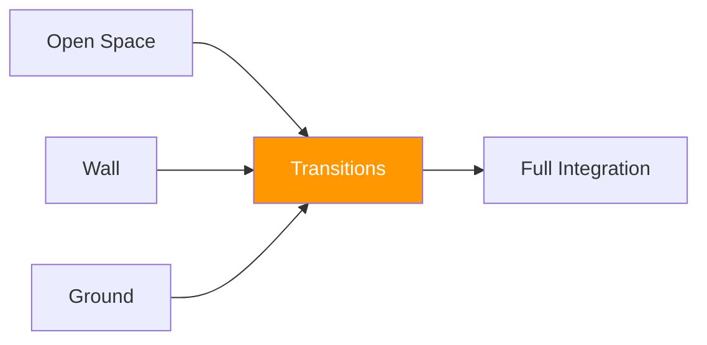

# Transition Games

!!! info "Coming Soon"
    This section will contain **transition games** — games focused on moving between environments (standing, wall, ground) smoothly and with purpose.

---

## Planned Development

Transition games will focus on:

- **Standing to clinch** (recognizing and executing clinch entries)
- **Clinch to wall** (using space denial to establish wall control)
- **Wall to ground** (controlled descents and scrambles)
- **Ground to standing** (technical stand-ups and wall-assisted recovery)
- **Full-cycle games** (games that flow through multiple environments)

---

## Why Transitions Matter

MMA fights don't stay in one environment. Athletes must:

| Transition | Key Skills |
|------------|------------|
| Striking → Clinch | Entry timing, head position, connection |
| Clinch → Wall | Space denial, pressure, positioning |
| Wall → Ground | Controlled descent, scramble management |
| Ground → Standing | Technical stand-up, wall use, timing |

---

## Transition Principles

1. **Control precedes transition** — don't force environment changes
2. **Recognize trigger moments** — certain positions favor certain transitions
3. **Maintain structure through transitions** — posture and balance matter most during change
4. **Expect scrambles** — transitions are high-variance moments

---

## System Position

Transition games connect all environment-specific games into a cohesive system.

---

!!! abstract "Development Notice"
    Games in this category are under development. Check back for updates.
