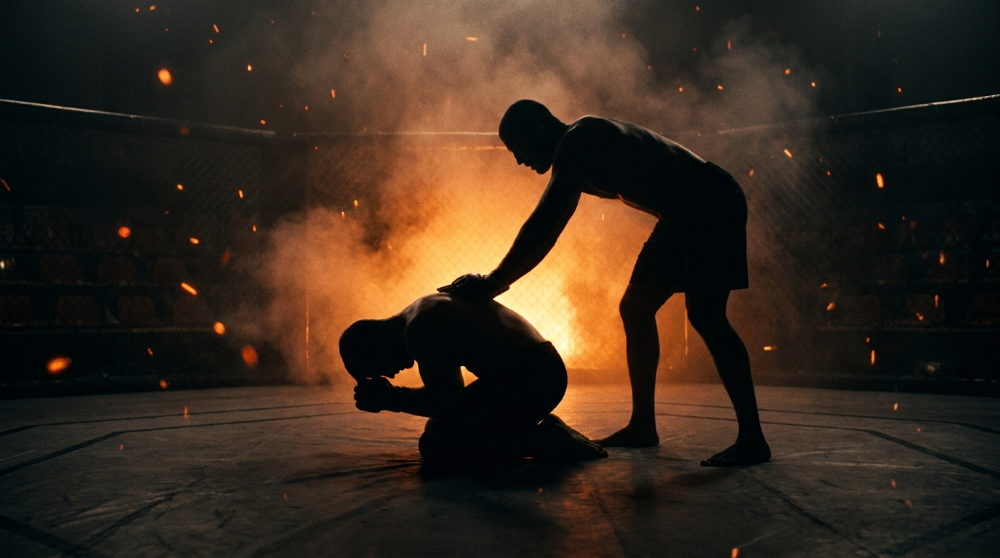

  
  
Ground · WrestlingTurtle Breakout

!!! warning "Provisional (WIP): derived from class recording 2026-06-06"
    Invented live in class and **pending review on the platform**.
    Name and structure may change. Remove the WIP status once confirmed.

GroundWrestlingDefensiveBeginnerGet-Up

A pure attachment race. The defender starts in turtle, the attacker starts standing with palms on the small of the back, arms fully extended. The defender says go: stand, turn, face. The attacker wins by one thing only, connecting the hands around the waist or a leg above the knee.

  
Start<b>Defender in turtle. Attacker standing behind, palms on the small of the back, arms fully extended.</b>

  
→

  
The Goal<b>Defender stands, turns, and faces. Attacker connects hands around waist or leg, above the knee.</b>

  
→

  
Finish<b>Hands connected → attacker wins · Clean separation, turned and facing → defender wins.</b>

  
Connection is the entire win,  nothing else matters.

  
No points for position, no credit for almost. <b>Hands locked, or turned and facing.</b>

What to Read

<b>Attune to</b> the <i>felt pressure through the contact</i>, the inertial array, not vision. The defender reads the attacker's weight and drive direction through the palms on their back: where the pressure commits specifies which way is free to stand. The attacker reads the defender's first motion through the same contact, the hitch before the explosion, and tracks <i>which limb is nearest to encircle</i> as the scramble opens. Lose the contact and you are guessing.

The Starting Position

  
PlayersTwo, one attacker, one defender.

  
DefenderTurtle. How you build it is yours: nobody said elbows on the ground.

  
AttackerStanding, freestyle/Greco posture, palms on the small of the back, arms fully extended, no bent-arm loading.

  
TriggerThe defender starts the interaction: they say go.

  
Start &amp; resetReset to the same start after every decision. Switch roles on attacker win.

The Matchup

  

    
🔗

    
Attacker

    
Trying to connect the hands around the waist, or around a leg above the knee, before the defender gets up and faces.

    Don't chase one grip. Re-orient the hand connections as the scramble moves, waist, single leg, both legs, whatever the get-up exposes, always collecting above the knee. Use your weight: a heavy chest buys time the hands can use.
  

  
VS

  

    
🛡️

    
Defender

    
Trying to stand, turn, face, and stay away. Separation ends it.

    Explode on your own go, you own the timing. Hand-fight the connection attempts, collect the wrists, and break free upward. Your back touching the mat is a loss, the only way out is up.
  

The Rules

  🗣️ Defender starts itThe defender says go. The asymmetric trigger gives the bottom player the timing advantage, the attacker must react to the explosion, not pre-load it.
  📏 Full extension at the startThe attacker's arms are fully extended, palms on the small of the back. No bent arms, no pre-wrapped grips. The gap is what makes the race fair.
  🔗 Connection wins, above the kneeHands locked around the waist, one leg, or two legs, all count, but a leg only counts collected above the knee. No diving for a low single: a grip below the knee is not a connection. It's all over if the attacker connects, nothing else matters.
  🎯 The redemption shotAs the defender escapes, the attacker gets one last connection attempt. Miss it and the defender wins. Punishes a lazy exit, rewards a committed one.
  🚫 No supine: back to the mat = lossIf the defender's back touches the mat, they lose the round. Turning to face from the bottom isn't an escape, it's a worse fight. The game wants the explosive get-up. (Locked after the first-run review, 2026-06-06.)

How to Win

  
Switch Hands connect on waist or leg (above the knee) → attacker wins, switch roles.The attachment is the whole game. A connection during the redemption shot counts the same as one in the opening scramble. Below the knee never counts.

  
Reset Defender stands, turns, faces, and stays away → defender wins.Separation must be clean: up, turned, facing, out of the redemption shot's reach. A scramble that ends face-down or backward isn't a win yet.

  
Loss Defender's back touches the mat → defender loses, switch roles.Supine is not an escape route. Going to the back to face from the bottom ends the round immediately, the only way out is up.

  
Diagnostic Is the first motion upward?The coach watches whether defenders explode up and break contact off the go, or brace in place and hand-fight from static turtle. The game wants the immediate get-up.

The Levels

  
1<b>Base game</b>No-supine rule live.Defender-triggered start, full-extension palms, connection (above the knee) wins, redemption shot live, back to the mat = loss. The no-supine rule was locked after the first run: the supine drift was a flaw, not an affordance.

  
2<b>Strikes on (proposed)</b>GnP pressure added.Per the system's GnP-first law for ground games: light strikes make hesitation in turtle expensive and reward the immediate explosion. Pending review.

Recall Check

  
Test yourself before moving on. Answer out loud, then reveal what good looks like.

  

    
Q What is the attacker's one and only win condition?

    
<b>Connecting the hands</b>, around the waist, one leg, or two legs, always <b>above the knee</b>. A grab below the knee is not a connection. Position, pressure, and near-misses count for nothing.

  

  

    
Q Who starts the interaction, and why does that matter?

    
The <b>defender says go</b>. They own the timing, so the attacker must perceive the explosion through the palm contact and react, not pre-load a grip.

  

  

    
Q What is the redemption shot?

    
As the defender escapes, the attacker gets <b>one final connection attempt</b>. Miss it and the defender wins. It keeps the exit honest to the last instant.

  

  

    
Q Did anyone say your elbows have to be on the ground?

    
<b>No.</b> The rule said turtle, nothing more. Build the strongest legal version of the position, the game rewards players who test the stated constraints instead of imagining extra ones.

  

Go Deeper

??? note "Task focus &amp; coaching cues"

    
Each role's job

    

      

🔗

Attacker

React off the contact; chase the connection, not a specific grip; re-orient the hands as the scramble moves; use body weight to slow the get-up.

      

🛡️

Defender

Explode upward on your own go; hand-fight the wrists; turn and face only once free; never settle under the weight.

    

    
Coaching cues

    

      

⏱️

30 seconds first

Before the first go: "What can you genuinely test to solve this problem?" Each player commits to a plan, then revises it from evidence.

      

⚖️

Where's your weight?

Ask attackers stuck hand-chasing: "Are you making them carry you?" Weight on the turtle slows the explosion for free.

      

⬆️

Up, not over

Remind defenders the back touching the mat ends the round. "Did you escape, or did you change which pin you're fighting?"

    

??? abstract "Constraints-Led analysis"

    
Constraints → Affordances

    

      
Defender-triggered start→Attacker trains reaction off felt contact, not anticipation

      
Full arm extension→A real gap to close, the race stays winnable for both

      
Connection is the only win→Kills point-chasing; trains finishing the attachment

      
Redemption shot→Escapes must be completed, not merely started

      
No supine (back = loss)→Forces the explosive get-up; closes the turn-to-guard exit

      
"Turtle" left undefined→Players explore the position's legal space (staggered base, high hips)

    

    
Develops the <b>attachment race</b> both ways: the wrestler's hand connection behind a standing opponent, and the bottom player's explosive get-up under threat, with perception anchored in the <b>inertial array</b> through the contact (Blau &amp; Wagman, 2022).

    
What the players read

    

      

✋

Haptic

Pressure through the palms / on the back → drive direction, the hitch before the explosion, which side is free.

      

👁️

Visual

Nearest encircleable limb in the scramble → waist vs single-leg connection choice; the redemption window.

      

🧭

Proprioceptive

Own base through the get-up → can I stand from here, or do I hand-fight first?

    

    
What we measure (order parameter)

    
Does the defender <b>get up and face before the connection closes</b>? Track connection rate by type (waist / single / double), get-up success, supine concessions, and redemption-shot wins. When defenders consistently break contact upward and attackers consistently re-orient hands instead of chasing one grip, the skill has formed.

    
Representativeness

    
<b>Models:</b> the freestyle/Greco par terre start, turtle breakdowns, and MMA's most common get-up problem, standing up while someone hunts the body lock.

    
First-run observations (2026-06-06)

    <ul class="emma-checklist">
      <li>Players drifted turtle → supine instead of exploding up; ruled a flaw, no-supine locked as a core rule (back to the mat = loss)</li>
      <li>Nobody used body weight on the turtle until coached; cue added above</li>
      <li>Player discovery: stop chasing the body lock, re-orient hand connections, pin the defender's hands to the mat first</li>
    </ul>

    
Readiness to progress

    <ul class="emma-checklist">
      <li>Defender explodes on the go instead of bracing in place</li>
      <li>Attacker re-orients connections through the scramble</li>
      <li>Escapes finish up-turned-facing, not face-down or supine</li>
      <li>Can articulate: "I felt the drive commit, so I stood through the other side"</li>
    </ul>

    
Warning signs

    

      Defender concedes to supine
      Attacker chases one grip
      No weight used on top
      Escapes left half-finished
    

??? note "Safety &amp; related games"

    

      🤝 Scramble intensity, controlled landings
      🛑 No slamming the turtle flat; weight is pressure, not impact
      🔁 Reset if the scramble leaves the mat space
    

    
Where it sits

    

      
Prerequisite→<a href="../ground-to-standing/">Ground to Standing</a>

      
Follow-on→<a href="../counter-wrestling/">Counter-Wrestling</a> · <a href="../takedown-defense/">Takedown Defense</a>

      
Related→<a href="../../concepts/hand-controls/">Hand Controls</a>

    

